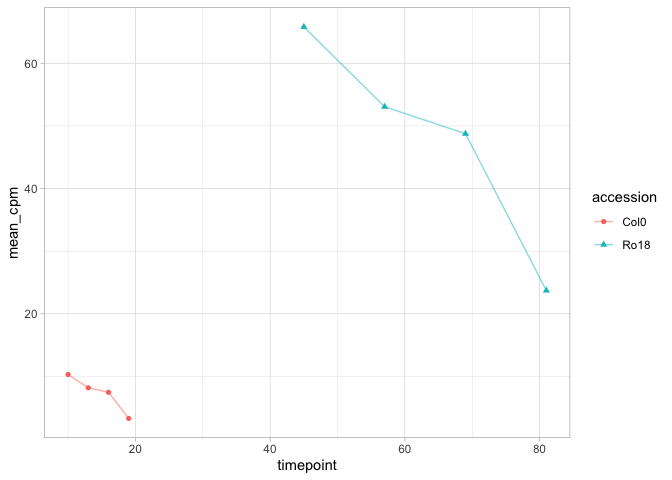
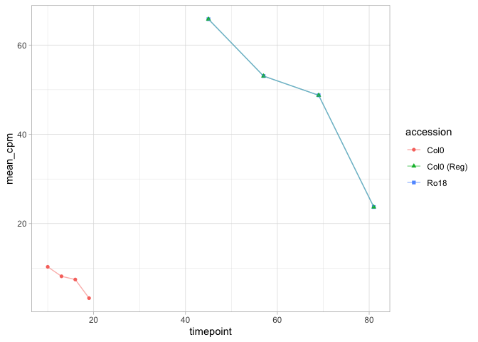
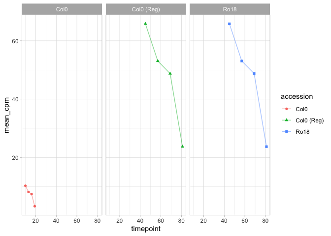
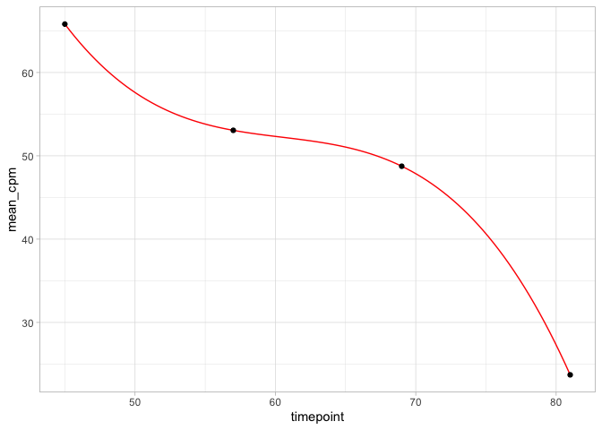
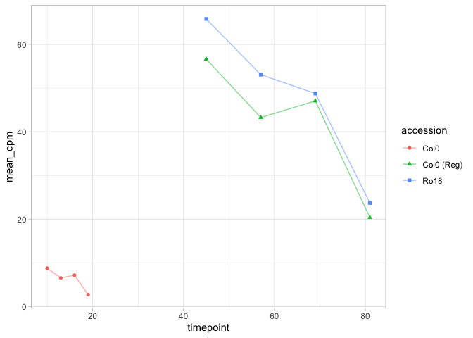
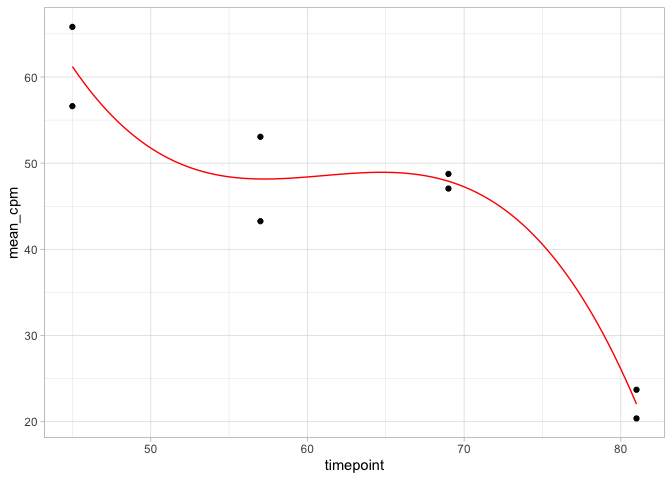

Notebook
================

### Define data

``` r
data <- data.frame(
  locus_name = c("A_1", "A_1", "A_1", "A_1", "A_1", "A_1", "A_1", "A_1"),
  accession = c("Col0", "Col0", "Col0", "Col0", "Ro18", "Ro18", "Ro18", "Ro18"),
  tissue = c("apex", "apex", "apex", "apex", "apex", "apex", "apex", "apex"),
  timepoint = c(10L, 13L, 16L, 19L, 45L, 57L, 69L, 81L),
  mean_cpm = c(
    10.3020734833646, 8.1765718166656, 7.45844623551049, 3.28459081620233, 
    65.8124409001875, 53.0594308999936, 48.7506774130629, 23.707544897214
  )
)

data %>% 
  knitr::kable()
```

| locus_name | accession | tissue | timepoint |  mean_cpm |
|:-----------|:----------|:-------|----------:|----------:|
| A_1        | Col0      | apex   |        10 | 10.302074 |
| A_1        | Col0      | apex   |        13 |  8.176572 |
| A_1        | Col0      | apex   |        16 |  7.458446 |
| A_1        | Col0      | apex   |        19 |  3.284591 |
| A_1        | Ro18      | apex   |        45 | 65.812441 |
| A_1        | Ro18      | apex   |        57 | 53.059431 |
| A_1        | Ro18      | apex   |        69 | 48.750677 |
| A_1        | Ro18      | apex   |        81 | 23.707545 |

``` r
data %>% 
  ggplot() +
  aes(
    x = timepoint,
    y = mean_cpm,
    color = accession,
    shape = accession
  ) +
  geom_point() +
  geom_line(alpha = 0.5)
```

<!-- -->

### Applying registration

``` r
time_stretch <- 4
time_shift <- 5
exp_stretch <- 6
exp_shift <- 4
```

``` r
gg <- data %>% 
  dplyr::bind_rows(
    data %>% 
  dplyr::filter(accession == "Col0") %>% 
  dplyr::mutate(
      timepoint = timepoint * time_stretch + time_shift,
      mean_cpm = mean_cpm * exp_stretch + exp_shift,
      accession = "Col0 (Reg)"
    )
  ) %>%
  ggplot() +
  aes(
    x = timepoint,
    y = mean_cpm,
    color = accession,
    shape = accession
  ) +
  geom_point() +
  geom_line(alpha = 0.5)
```

``` r
gg
```

<!-- -->

``` r
gg + facet_wrap(~accession)
```

<!-- -->

``` r
data_after_reg <- data %>% filter(accession == "Ro18")
```

``` r
# fit <- lm(formula = mean_cpm ~ splines::bs(timepoint, degree = 2, knot = c(62)), data = data_after_reg)
fit <- lm(formula = mean_cpm ~ splines::bs(timepoint, degree = 3, df = 3), data = data_after_reg)
summary(fit)
```

    ## 
    ## Call:
    ## lm(formula = mean_cpm ~ splines::bs(timepoint, degree = 3, df = 3), 
    ##     data = data_after_reg)
    ## 
    ## Residuals:
    ## ALL 4 residuals are 0: no residual degrees of freedom!
    ## 
    ## Coefficients:
    ##                                             Estimate Std. Error t value
    ## (Intercept)                                   65.812        NaN     NaN
    ## splines::bs(timepoint, degree = 3, df = 3)1  -26.701        NaN     NaN
    ## splines::bs(timepoint, degree = 3, df = 3)2    3.032        NaN     NaN
    ## splines::bs(timepoint, degree = 3, df = 3)3  -42.105        NaN     NaN
    ##                                             Pr(>|t|)
    ## (Intercept)                                      NaN
    ## splines::bs(timepoint, degree = 3, df = 3)1      NaN
    ## splines::bs(timepoint, degree = 3, df = 3)2      NaN
    ## splines::bs(timepoint, degree = 3, df = 3)3      NaN
    ## 
    ## Residual standard error: NaN on 0 degrees of freedom
    ## Multiple R-squared:      1,  Adjusted R-squared:    NaN 
    ## F-statistic:   NaN on 3 and 0 DF,  p-value: NA

``` r
x_pred <- seq(min(data_after_reg$timepoint), max(data_after_reg$timepoint), len = 100)
splines_df = data.frame(
  timepoint = x_pred,
  mean_cpm = predict(fit, data.frame(timepoint = x_pred))
)
 
data_after_reg %>% 
  ggplot() +
  aes(x = timepoint, y = mean_cpm) +
  geom_line(
    data = splines_df,
    color = "red"
  ) +
  geom_point()
```

<!-- -->

``` r
fit$residuals
```

    ## 1 2 3 4 
    ## 0 0 0 0

``` r
# LogLik

logLik(fit)
```

    ## 'log Lik.' Inf (df=5)

``` r
AIC(fit)
```

    ## [1] -Inf

### Data with noise

``` r
data
```

    ##   locus_name accession tissue timepoint  mean_cpm
    ## 1        A_1      Col0   apex        10 10.302073
    ## 2        A_1      Col0   apex        13  8.176572
    ## 3        A_1      Col0   apex        16  7.458446
    ## 4        A_1      Col0   apex        19  3.284591
    ## 5        A_1      Ro18   apex        45 65.812441
    ## 6        A_1      Ro18   apex        57 53.059431
    ## 7        A_1      Ro18   apex        69 48.750677
    ## 8        A_1      Ro18   apex        81 23.707545

``` r
set.seed(9)
data_with_noise <- data %>% 
  dplyr::mutate(mean_cpm = ifelse(accession == "Col0", mean_cpm + rnorm(4, sd = 2), mean_cpm))

data_with_noise %>% 
  ggplot() +
  aes(
    x = timepoint,
    y = mean_cpm,
    color = accession,
    shape = accession
  ) +
  geom_point() +
  geom_line(alpha = 0.5)
```

<!-- -->

``` r
gg <- data_with_noise %>% 
  dplyr::bind_rows(
    data_with_noise %>% 
  dplyr::filter(accession == "Col0") %>% 
  dplyr::mutate(
      timepoint = timepoint * time_stretch + time_shift,
      mean_cpm = mean_cpm * exp_stretch + exp_shift,
      accession = "Col0 (Reg)"
    )
  ) %>%
  ggplot() +
  aes(
    x = timepoint,
    y = mean_cpm,
    color = accession,
    shape = accession
  ) +
  geom_point() +
  geom_line(alpha = 0.5)

gg
```

<!-- -->

``` r
data_after_reg_with_noise <- data_with_noise %>%
  dplyr::filter(accession == "Ro18") %>%
  dplyr::bind_rows(
    data_with_noise %>%
      dplyr::filter(accession == "Col0") %>%
      dplyr::mutate(
        timepoint = timepoint * time_stretch + time_shift,
        mean_cpm = mean_cpm * exp_stretch + exp_shift,
        accession = "Col0 (Reg)"
      )
  )

# fit <- lm(formula = mean_cpm ~ splines::bs(timepoint, degree = 2, knot = c(62)), data = data_after_reg)
fit <- lm(formula = mean_cpm ~ splines::bs(timepoint, degree = 3, df = 3), data = data_after_reg_with_noise)
summary(fit)
```

    ## 
    ## Call:
    ## lm(formula = mean_cpm ~ splines::bs(timepoint, degree = 3, df = 3), 
    ##     data = data_after_reg_with_noise)
    ## 
    ## Residuals:
    ##       1       2       3       4       5       6       7       8 
    ##  4.6008  4.8988  0.8492  1.6656 -4.6008 -4.8988 -0.8492 -1.6656 
    ## 
    ## Coefficients:
    ##                                             Estimate Std. Error t value
    ## (Intercept)                                   61.212      3.488  17.550
    ## splines::bs(timepoint, degree = 3, df = 3)1  -32.244     13.383  -2.409
    ## splines::bs(timepoint, degree = 3, df = 3)2   12.287     12.276   1.001
    ## splines::bs(timepoint, degree = 3, df = 3)3  -39.170      4.933  -7.941
    ##                                             Pr(>|t|)    
    ## (Intercept)                                 6.19e-05 ***
    ## splines::bs(timepoint, degree = 3, df = 3)1  0.07360 .  
    ## splines::bs(timepoint, degree = 3, df = 3)2  0.37352    
    ## splines::bs(timepoint, degree = 3, df = 3)3  0.00136 ** 
    ## ---
    ## Signif. codes:  0 '***' 0.001 '**' 0.01 '*' 0.05 '.' 0.1 ' ' 1
    ## 
    ## Residual standard error: 4.933 on 4 degrees of freedom
    ## Multiple R-squared:  0.9432, Adjusted R-squared:  0.9006 
    ## F-statistic: 22.14 on 3 and 4 DF,  p-value: 0.005931

``` r
x_pred <- seq(min(data_after_reg_with_noise$timepoint), max(data_after_reg_with_noise$timepoint), len = 100)
splines_df = data.frame(
  timepoint = x_pred,
  mean_cpm = predict(fit, data.frame(timepoint = x_pred))
)
 
data_after_reg_with_noise %>% 
  ggplot() +
  aes(x = timepoint, y = mean_cpm) +
  geom_line(
    data = splines_df,
    color = "red"
  ) +
  geom_point()
```

<!-- -->

#### Calculate AIC and BIC for non-registered data

``` r
fit_Ro18_sep <- lm(
  formula = mean_cpm ~ splines::bs(timepoint, degree = 3, df = 3), 
  data = data_with_noise %>% filter(accession == "Ro18")
)

fit_Col0_sep <- lm(
  formula = mean_cpm ~ splines::bs(timepoint, degree = 3, df = 3), 
  data = data_with_noise %>% filter(accession == "Col0")
)

data.frame(
  acession = c("Ro18", "Col0"),
  logLik = list(fit_Ro18_sep, fit_Col0_sep) %>% purrr::map(logLik) %>% unlist(),
  AIC =    list(fit_Ro18_sep, fit_Col0_sep) %>% purrr::map(AIC) %>% unlist(),
  BIC =    list(fit_Ro18_sep, fit_Col0_sep) %>% purrr::map(BIC) %>% unlist()
) %>% 
  knitr::kable()
```

| acession | logLik |  AIC |  BIC |
|:---------|-------:|-----:|-----:|
| Ro18     |    Inf | -Inf | -Inf |
| Col0     |    Inf | -Inf | -Inf |
