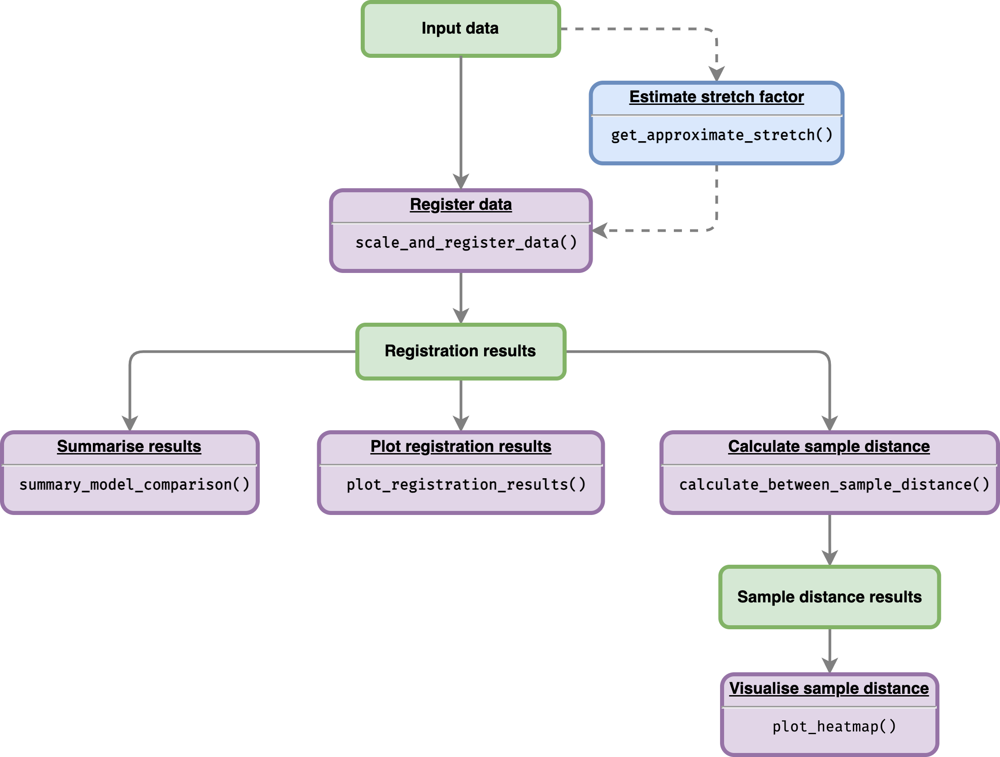

<!-- README.md is generated from README.Rmd. Please edit that file -->

```{r, include = FALSE}
knitr::opts_chunk$set(
  collapse = TRUE,
  comment = "#>",
  fig.path = "man/figures/README-",
  out.width = "100%"
)
```

# GREAT 

<!-- badges: start -->
`r badgecreatr::badge_lifecycle("experimental")`
[](https://codecov.io/gh/ruthkr/GREAT)
[](https://github.com/ruthkr/GREAT/actions/workflows/pkgdown.yaml)
[](https://github.com/ruthkr/GREAT/commits/master)
<!-- badges: end -->


The goal of GREAT (Gene Registration from Expression and Time-courses) to register (align) gene expression profiles between two species (reference data and data to transform). Non-reference gene expression profiles will be stretched and shifted. The optimality of registration parameters (shifts and stretches) will be estimated using least-squares criterion. This package is also designed to compare a registration model versus a non-registration model, as well as determine whether registration model performed better than non-registration transformation.

## Package workflow

Flowchart below illustrates the workflow of the package given an input data: 

```{r all-data-illustration, echo=FALSE, out.width='85%'}

```


More details on how to use this package are available on functions documentations and vignettes:

1. [Input requirements](https://ruthkr.github.io/GREAT/articles/prepare_data.html)
2. [Register data](https://ruthkr.github.io/GREAT/articles/register-data.html)
3. [Visualise registration results](https://ruthkr.github.io/GREAT/articles/visualise-results.html)

## Installation

<!--
You can install the released version of GREAT from [CRAN](https://CRAN.R-project.org) with:

``` r
install.packages("GREAT")
```
-->

And the development version of `GREAT` from [GitHub](https://github.com/) with:

``` r
# install.packages("devtools")
devtools::install_github("ruthkr/GREAT")
```

## Usage - quick start

This is a basic example which shows you how to register (align) gene expression profiles over time:

```{r example, message=FALSE}
# Load the package
library(GREAT)
```

```{r register-data, message=FALSE, warning=FALSE}
# Define the dataframe from the sample data
# Gene expression data with replicates
all_data_df <- system.file("extdata/brapa_arabidopsis_all_replicates.csv", package = "GREAT") %>%
  utils::read.csv()

# Running the registration
registration_results <- scale_and_register_data(
    input_df = all_data_df,
    stretches = c(3, 2.5, 2, 1.5, 1),
    shift_extreme = 4,
    num_shifts = 27,
    min_num_overlapping_points = 4,
    initial_rescale = FALSE,
    do_rescale = TRUE,
    accession_data_to_transform = "Col0",
    accession_data_ref = "Ro18",
    start_timepoint = "reference"
  )
#> 
#> ── Information before registration ─────────────────────────────────────────────
#> ℹ Max value of expression_value of all_data_df: 262.28
#> 
#> ── Analysing models for all stretch and shift factor ───────────────────────────
#> 
#> ── Analysing models for stretch factor = 3 ──
#> ✓ Calculating score for all shifts (10/10) [2s]
#> ✓ Normalising expression by mean and sd of compared values (10/10) [55ms]
#> ✓ Applying best shift (10/10) [50ms]
#> ✓ Calculating registration vs non-registration comparison AIC & BIC (10/10) [134ms]
#> ✓ Finished analysing models for stretch factor = 3
#> 
#> ── Analysing models for stretch factor = 2.5 ──
#> ✓ Calculating score for all shifts (10/10) [2.2s]
#> ✓ Normalising expression by mean and sd of compared values (10/10) [55ms]
#> ✓ Applying best shift (10/10) [52ms]
#> ✓ Calculating registration vs non-registration comparison AIC & BIC (10/10) [113ms]
#> ✓ Finished analysing models for stretch factor = 2.5
#> 
#> ── Analysing models for stretch factor = 2 ──
#> ✓ Calculating score for all shifts (10/10) [2.2s]
#> ✓ Normalising expression by mean and sd of compared values (10/10) [47ms]
#> ✓ Applying best shift (10/10) [50ms]
#> ✓ Calculating registration vs non-registration comparison AIC & BIC (10/10) [99ms]
#> ✓ Finished analysing models for stretch factor = 2
#> 
#> ── Analysing models for stretch factor = 1.5 ──
#> ✓ Calculating score for all shifts (10/10) [2s]
#> ✓ Normalising expression by mean and sd of compared values (10/10) [51ms]
#> ✓ Applying best shift (10/10) [52ms]
#> ✓ Calculating registration vs non-registration comparison AIC & BIC (10/10) [102ms]
#> 
#> ✓ Finished analysing models for stretch factor = 1.5
#> 
#> ── Analysing models for stretch factor = 1 ──
#> ✓ Calculating score for all shifts (10/10) [1.9s]
#> ✓ Normalising expression by mean and sd of compared values (10/10) [49ms]
#> ✓ Applying best shift (10/10) [49ms]
#> ✓ Calculating registration vs non-registration comparison AIC & BIC (10/10) [108ms]
#> ✓ Finished analysing models for stretch factor = 1
#> 
#> ── Model comparison results ────────────────────────────────────────────────────
#> ℹ BIC finds registration better than non-registration for: 10/10
#> 
#> ── Applying the best-shifts and stretches to gene expression ───────────────────
#> ✓ Normalising expression by mean and sd of compared values (10/10) [48ms]
#> ✓ Applying best shift (10/10) [52ms]
#> ℹ Max value of expression_value: 9.05
#> ✓ Imputing transformed expression values (10/10) [144ms]
#> 
```


## Reference

Calderwood, A., Hepworth, J., Woodhouse, ... Morris, R. (2021). Comparative transcriptomics reveals desynchronisation of gene expression during the floral transition between Arabidopsis and Brassica rapa cultivars. *Quantitative Plant Biology, 2*, E4. [doi:10.1017/qpb.2021.6](https://www.cambridge.org/core/journals/quantitative-plant-biology/article/comparative-transcriptomics-reveals-desynchronisation-of-gene-expression-during-the-floral-transition-between-arabidopsis-and-brassica-rapa-cultivars/811BFDFA14F4BCC9C7F0ECC7CE103BB6)


