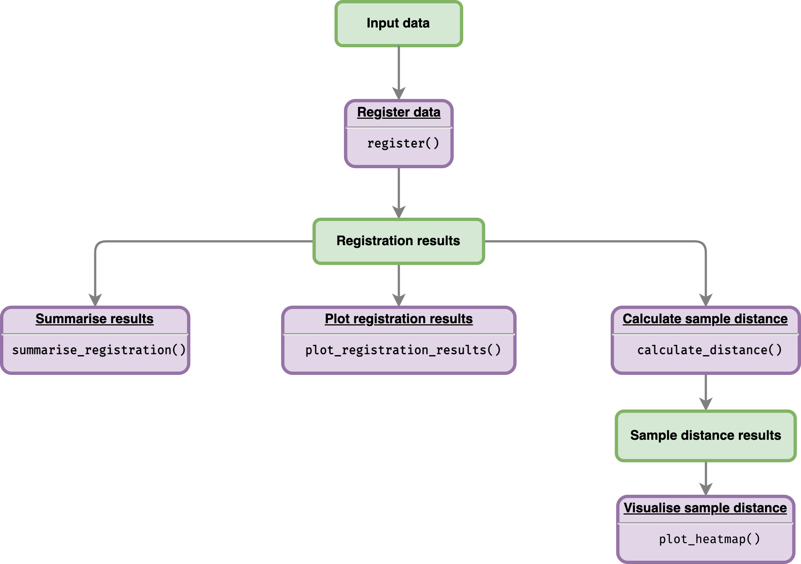

<!-- README.md is generated from README.Rmd. Please edit that file -->

# greatR 

<!-- badges: start -->

[](https://cran.r-project.org/package=greatR)
[](https://lifecycle.r-lib.org/articles/stages.html)
[](https://github.com/ruthkr/greatR/actions)
[](https://app.codecov.io/gh/ruthkr/greatR)
[](https://github.com/ruthkr/greatR/actions/workflows/pkgdown.yaml)
[](https://github.com/ruthkr/greatR/commits/master)
<!-- badges: end -->

The goal of `greatR` (**G**ene **R**egistration from **E**xpression
**a**nd **T**ime-courses in **R**) to register (align) gene expression
profiles between two species (reference data and data to transform).
Non-reference gene expression profiles will be stretched and shifted.
The optimality of registration parameters (shifts and stretches) will be
estimated using least-squares criterion. This package is also designed
to compare a registration model versus a non-registration model, as well
as determine whether registration model performed better than
non-registration transformation.

## Package workflow

Flowchart below illustrates the workflow of the package given an input
data:



More details on how to use this package are available on function
documentations and vignettes:

1.  [Input
    requirements](https://ruthkr.github.io/greatR/articles/prepare-data.html)
2.  [Register
    data](https://ruthkr.github.io/greatR/articles/register-data.html)
3.  [Visualise registration
    results](https://ruthkr.github.io/greatR/articles/visualise-results.html)
4.  [Register data with parameter
    optimisation](https://ruthkr.github.io/greatR/articles/optimise-parameters.html)

## Installation

You can install the released version of `greatR` from
[CRAN](https://CRAN.R-project.org) with:

``` r
install.packages("greatR")
```

And the development version of `greatR` from
[GitHub](https://github.com/) with:

``` r
# install.packages("devtools")
devtools::install_github("ruthkr/greatR")
```

## Usage - quick start

This is a basic example which shows you how to register (align) gene
expression profiles over time:

``` r
# Load the package
library(greatR)
```

``` r
# Load a data frame from the sample data
all_data_df <- system.file("extdata/brapa_arabidopsis_all_replicates.csv", package = "greatR") %>%
  utils::read.csv()

# Running the registration
registration_results <- scale_and_register_data(
  input_df = all_data_df,
  stretches = c(3, 2.5, 2, 1.5, 1),
  shifts = seq(-4, 4, length.out = 33),
  min_num_overlapping_points = 4,
  initial_rescale = FALSE,
  do_rescale = TRUE,
  accession_data_to_transform = "Col0",
  accession_data_ref = "Ro18",
  start_timepoint = "reference"
)
#> 
#> ── Information before registration ─────────────────────────────────────────────
#> ℹ Max value of expression_value of all_data_df: 262.28
#> 
#> ── Analysing models for all stretch and shift factor ───────────────────────────
#> 
#> ── Analysing models for stretch factor = 3 ──
#> ✓ Calculating score for all shifts (10/10) [2.6s]
#> ✓ Normalising expression by mean and sd of compared values (10/10) [85ms]
#> ✓ Applying best shift (10/10) [91ms]
#> ✓ Calculating registration vs non-registration comparison BIC (10/10) [140ms]
#> ✓ Finished analysing models for stretch factor = 3
#> 
#> ── Analysing models for stretch factor = 2.5 ──
#> ✓ Calculating score for all shifts (10/10) [2.8s]
#> ✓ Normalising expression by mean and sd of compared values (10/10) [81ms]
#> ✓ Applying best shift (10/10) [103ms]
#> ✓ Calculating registration vs non-registration comparison BIC (10/10) [160ms]
#> ✓ Finished analysing models for stretch factor = 2.5
#> 
#> ── Analysing models for stretch factor = 2 ──
#> ✓ Calculating score for all shifts (10/10) [2.9s]
#> ✓ Normalising expression by mean and sd of compared values (10/10) [95ms]
#> ✓ Applying best shift (10/10) [82ms]
#> ✓ Calculating registration vs non-registration comparison BIC (10/10) [164ms]
#> ✓ Finished analysing models for stretch factor = 2
#> 
#> ── Analysing models for stretch factor = 1.5 ──
#> ✓ Calculating score for all shifts (10/10) [3s]
#> ✓ Normalising expression by mean and sd of compared values (10/10) [107ms]
#> ✓ Applying best shift (10/10) [84ms]
#> ✓ Calculating registration vs non-registration comparison BIC (10/10) [171ms]
#> ✓ Finished analysing models for stretch factor = 1.5
#> 
#> ── Analysing models for stretch factor = 1 ──
#> ✓ Calculating score for all shifts (10/10) [2.7s]
#> ✓ Normalising expression by mean and sd of compared values (10/10) [85ms]
#> ✓ Applying best shift (10/10) [90ms]
#> ✓ Calculating registration vs non-registration comparison BIC (10/10) [154ms]
#> ✓ Finished analysing models for stretch factor = 1
#> 
#> ── Model comparison results ────────────────────────────────────────────────────
#> ℹ BIC finds registration better than non-registration for: 10/10
#> 
#> ── Applying the best-shifts and stretches to gene expression ───────────────────
#> ✓ Normalising expression by mean and sd of compared values (10/10) [85ms]
#> ✓ Applying best shift (10/10) [98ms]
#> ℹ Max value of expression_value: 9.05
#> ✓ Imputing transformed expression values (10/10) [209ms]
#> 
```

## Reference

Calderwood, A., Hepworth, J., Woodhouse, … Morris, R. (2021).
Comparative transcriptomics reveals desynchronisation of gene expression
during the floral transition between Arabidopsis and Brassica rapa
cultivars. *Quantitative Plant Biology, 2*, E4.
[doi:10.1017/qpb.2021.6](https://www.cambridge.org/core/journals/quantitative-plant-biology/article/comparative-transcriptomics-reveals-desynchronisation-of-gene-expression-during-the-floral-transition-between-arabidopsis-and-brassica-rapa-cultivars/811BFDFA14F4BCC9C7F0ECC7CE103BB6)
