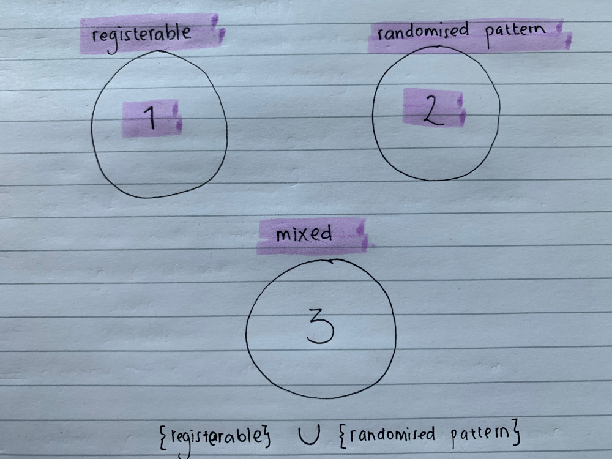

```{r setup}
knitr::opts_chunk$set()

devtools::load_all()
library(ggplot2)
library(data.table)
library(cowplot)
library(ggpubr)
```

## Run GREAT main function using subset of ALex's rapa data

```{r}
# Load data obtained from Ruth's refactored function
path_b_rapa <- "~/Downloads/test_data.RDS"

alex_data_mean <- readRDS(path_b_rapa)[[1]]
alex_data_all <- readRDS(path_b_rapa)[[2]]
```

### Plot data before registering

```{r, warning=FALSE, fig.width=10, fig.height=10}
ggplot() +
  aes(x = timepoint, y = mean_cpm, color = accession) +
  geom_line(data = alex_data_mean) +
  geom_point(data = alex_data_mean) +
  facet_wrap(~locus_name)
```

### Register data

```{r}
test_using_brapa_data <- GREAT::scale_and_register_data(
  alex_data_mean,
  alex_data_all,
  stretches =  c(2, 1.5, 1),
  shift_extreme = 4,
  num_shifts = 27,
  min_num_overlapping_points = 4,
  initial_rescale = FALSE,
  do_rescale = TRUE,
  testing = FALSE,
  accession_data_to_transform = "Col0",
  accession_data_fix = "Ro18",
  data_to_transform_time_added = 11,
  data_fix_time_added = 11
)
```

### Plot data after registration

```{r, warning=FALSE, fig.width=10, fig.height=10}
id_table_path <- system.file("extdata/sample_data/id_table_5genes.RDS", package = "GREAT")

ID_table <- readRDS(id_table_path)

test_mapped <- test_using_brapa_data[['imputed_mean_df']] %>%
  dplyr::left_join(ID_table %>% 
                     dplyr::mutate(CDS.model = toupper(CDS.model)), by = c("locus_name" = "CDS.model")) %>% 
  dplyr::select(-c(locus_name.y)) %>%
  dplyr::rename(locus_name = symbol, bra_gene = locus_name)

data_to_plot <- test_mapped %>% 
  dplyr::filter(dplyr::case_when(locus_name == "AGL24" ~ shifted_time >= 14 & shifted_time <= 35, 
                          locus_name == "AP1" ~  shifted_time >= 11 & shifted_time <= 25,
                          locus_name == "AP3" ~  shifted_time >= 11 & shifted_time <= 30,
                          locus_name == "LFY" ~ shifted_time >= 11 & shifted_time <= 26,
                          locus_name == "SOC1" ~ shifted_time >= 10 & shifted_time <= 31))

GREAT::plot_registered_GoIs_for_comparible_timepoints(data_to_plot)
```

## Running the package using simulated data

Several set of data to generate: 

```{r,fig.width=10, fig.height=10}

```


```{r}
#  Function to create data to register
simulate_data_to_reg <- function(gene_name, num_points) {
  
  df <- data.frame(
    locus_name = gene_name,
    accession = "data_to_reg",
    tissue = "apex", 
    timepoint = seq(10, 50, 3)[1:num_points],
    mean_cpm = abs(rnorm(num_points)) * 10
  )
  
  return(df)
}

# Function to create data fixed
simulate_data_fixed <- function(df_to_reg, 
                                time_stretch,
                                time_shift,
                                exp_stretch, 
                                exp_shift, 
                                num_points, 
                                exp_noise_sd) {
  
  df <- df_to_reg %>% 
    dplyr::mutate(
      accession = "data_fixed",
      timepoint = timepoint * time_stretch + time_shift,
      mean_cpm = mean_cpm * exp_stretch + exp_shift + rnorm(n = num_points, sd = exp_noise_sd)
    )
  
  return(df)
}
```

```{r}
num_points_list <- c(4, 5, 6, 7, 8, 9, 10)

# Gene name list
list_letter <- LETTERS[seq(from = 1, to = 6)]
list_num <- seq(1, 3, 1)
gene_name <- paste0(list_letter, "_", list_num)

results_list <- list()

for (num_points in num_points_list) {
  data_to_reg_points <- gene_name %>%
    purrr::map(simulate_data_to_reg, num_points = num_points) %>%
    purrr::reduce(rbind)

  data_fixed <- simulate_data_fixed(
    data_to_reg_points,
    num_points = num_points,
    time_stretch = 4,
    time_shift = 5,
    exp_stretch = 6,
    exp_shift = 4,
    exp_noise_sd = 10
  )

  simulated_data_pool1 <- rbind(data_to_reg_points, data_fixed) %>%
    dplyr::mutate(
      accession = dplyr::case_when(
        accession == "data_to_reg" ~ "Col0",
        accession == "data_fixed" ~ "Ro18"
      )
    ) %>%
    as.data.table()

  results_list[[paste0("data_with_num_point_", stringr::str_pad(num_points, width = 2, pad = "0"))]] <- simulated_data_pool1
}
```

### Data with 10 timepoints

```{r, fig.width=10, fig.height=10}
simulated_data_with_num_point_10 <- results_list[[7]]

simulated_data_with_num_point_10 %>% 
  ggplot() +
  aes(x = timepoint, y = mean_cpm, color = accession) +
  geom_line() +
  geom_point() +
  ggplot2::facet_wrap(vars(locus_name))
```
#### Register dan plot the registered data

```{r warning=FALSE, include=FALSE}
result_with_num_point_10 <- GREAT::scale_and_register_data(
  simulated_data_with_num_point_10,
  simulated_data_with_num_point_10,
  stretches = c(1, 2, 3, 4, 5, 6),
  shift_extreme = 5,
  num_shifts = 11,
  min_num_overlapping_points = 4,
  initial_rescale = FALSE,
  do_rescale = TRUE,
  testing = FALSE,
  # accession_data_to_transform = "data_to_reg",
  # accession_data_fix = "data_fixed",
  accession_data_to_transform = "Col0",
  accession_data_fix = "Ro18",
  data_to_transform_time_added = 40,
  data_fix_time_added = 40
)
```

```{r, warning=FALSE, fig.width=10, fig.height=10}
GREAT::plot_registered_GoIs_for_comparible_timepoints(result_with_num_point_10[["imputed_mean_df"]])
```


### Data with 9 timepoints

```{r, warning=FALSE, fig.width=10, fig.height=10}
simulated_data_with_num_point_9 <- results_list[[6]]

simulated_data_with_num_point_9 %>% 
  ggplot() +
  aes(x = timepoint, y = mean_cpm, color = accession) +
  geom_line() +
  geom_point() +
  ggplot2::facet_wrap(vars(locus_name))
```
#### Register dan plot the registered data

```{r warning = FALSE, include=FALSE}
result_with_num_point_9 <- GREAT::scale_and_register_data(
  simulated_data_with_num_point_9,
  simulated_data_with_num_point_9,
  stretches = c(1, 2, 3, 4, 5, 6, 7),
  shift_extreme = 5,
  num_shifts = 11,
  min_num_overlapping_points = 3,
  initial_rescale = FALSE,
  do_rescale = TRUE,
  testing = FALSE,
  # accession_data_to_transform = "data_to_reg",
  # accession_data_fix = "data_fixed",
  accession_data_to_transform = "Col0",
  accession_data_fix = "Ro18",
  data_to_transform_time_added = 40,
  data_fix_time_added = 40
)
```

```{r, warning=FALSE, fig.width=10, fig.height=10}
GREAT::plot_registered_GoIs_for_comparible_timepoints(result_with_num_point_9[["imputed_mean_df"]])
```


### Data with 8 timepoints

```{r, warning=FALSE, fig.width=10, fig.height=10}
simulated_data_with_num_point_8 <- results_list[[5]]

simulated_data_with_num_point_8 %>% 
  ggplot() +
  aes(x = timepoint, y = mean_cpm, color = accession) +
  geom_line() +
  geom_point() +
  ggplot2::facet_wrap(vars(locus_name))
```

#### Register dan plot the registered data

```{r warning = FALSE, include=FALSE}
result_with_num_point_8 <- GREAT::scale_and_register_data(
  simulated_data_with_num_point_8,
  simulated_data_with_num_point_8,
  stretches = c(1, 2, 3, 4, 5, 6),
  shift_extreme = 5,
  num_shifts = 11,
  min_num_overlapping_points = 3,
  initial_rescale = FALSE,
  do_rescale = TRUE,
  testing = FALSE,
  # accession_data_to_transform = "data_to_reg",
  # accession_data_fix = "data_fixed",
  accession_data_to_transform = "Col0",
  accession_data_fix = "Ro18",
  data_to_transform_time_added = 40,
  data_fix_time_added = 40
)
```

```{r, warning=FALSE, fig.width=10, fig.height=10}
GREAT::plot_registered_GoIs_for_comparible_timepoints(result_with_num_point_8[["imputed_mean_df"]])
```


### Data with 7 timepoints

```{r, warning=FALSE, fig.width=10, fig.height=10}
simulated_data_with_num_point_7 <- results_list[[4]]

simulated_data_with_num_point_7 %>% 
  ggplot() +
  aes(x = timepoint, y = mean_cpm, color = accession) +
  geom_line() +
  geom_point() +
  ggplot2::facet_wrap(vars(locus_name))
```

#### Register dan plot the registered data

```{r warning = FALSE, include=FALSE}
result_with_num_point_7 <- GREAT::scale_and_register_data(
  simulated_data_with_num_point_7,
  simulated_data_with_num_point_7,
  stretches = c(1, 2, 3, 4, 5, 6),
  shift_extreme = 5,
  num_shifts = 11,
  min_num_overlapping_points = 3,
  initial_rescale = FALSE,
  do_rescale = TRUE,
  testing = FALSE,
  # accession_data_to_transform = "data_to_reg",
  # accession_data_fix = "data_fixed",
  accession_data_to_transform = "Col0",
  accession_data_fix = "Ro18",
  data_to_transform_time_added = 40,
  data_fix_time_added = 40
)
```

```{r, warning=FALSE, fig.width=10, fig.height=10}
GREAT::plot_registered_GoIs_for_comparible_timepoints(result_with_num_point_7[["imputed_mean_df"]])
```

### Data with 6 timepoints

```{r, warning=FALSE, fig.width=10, fig.height=10}
simulated_data_with_num_point_6 <- results_list[[3]]

simulated_data_with_num_point_6 %>% 
  ggplot() +
  aes(x = timepoint, y = mean_cpm, color = accession) +
  geom_line() +
  geom_point() +
  ggplot2::facet_wrap(vars(locus_name))
```

#### Register dan plot the registered data

```{r warning = FALSE, include=FALSE}
result_with_num_point_6 <- GREAT::scale_and_register_data(
  simulated_data_with_num_point_6,
  simulated_data_with_num_point_6,
  stretches = c(1, 2, 3, 4, 5, 6),
  shift_extreme = 5,
  num_shifts = 11,
  min_num_overlapping_points = 3,
  initial_rescale = FALSE,
  do_rescale = TRUE,
  testing = FALSE,
  # accession_data_to_transform = "data_to_reg",
  # accession_data_fix = "data_fixed",
  accession_data_to_transform = "Col0",
  accession_data_fix = "Ro18",
  data_to_transform_time_added = 40,
  data_fix_time_added = 40
)
```

```{r, warning=FALSE, fig.width=10, fig.height=10}
GREAT::plot_registered_GoIs_for_comparible_timepoints(result_with_num_point_6[["imputed_mean_df"]])
```
