Running registration using real data with different timepoints
================

-   [Set-up and load libraries](#set-up-and-load-libraries)
-   [Run GREAT main function using subset of Alex’s rapa
    data](#run-great-main-function-using-subset-of-alexs-rapa-data)
    -   [Plot data before registering](#plot-data-before-registering)
    -   [Register data](#register-data)
    -   [Plot data after registration](#plot-data-after-registration)
-   [Slice the data functions](#slice-the-data-functions)
-   [Data with 10 points](#data-with-10-points)
    -   [Plot data before registering](#plot-data-before-registering-1)
    -   [Register data](#register-data-1)
-   [Data with 9 points](#data-with-9-points)
    -   [Plot data before registering](#plot-data-before-registering-2)
    -   [Register data](#register-data-2)
-   [Data with 8 points](#data-with-8-points)
    -   [Plot data before registering](#plot-data-before-registering-3)
    -   [Register data](#register-data-3)
-   [Data with 7 points](#data-with-7-points)
    -   [Plot data before registering](#plot-data-before-registering-4)
    -   [Register data](#register-data-4)
-   [Data with 6 points](#data-with-6-points)
    -   [Plot data before registering](#plot-data-before-registering-5)
    -   [Register data](#register-data-5)
-   [Data with 5 points](#data-with-5-points)
    -   [Plot data before registering](#plot-data-before-registering-6)
    -   [Register data](#register-data-6)
-   [Data with 4 points](#data-with-4-points)
    -   [Plot data before registering](#plot-data-before-registering-7)
    -   [Register data](#register-data-7)

## Set-up and load libraries

``` r
knitr::opts_chunk$set()

devtools::load_all()
```

    ## ℹ Loading GREAT

``` r
library(ggplot2)
library(data.table)
library(cowplot)
library(ggpubr)
```

    ## 
    ## Attaching package: 'ggpubr'

    ## The following object is masked from 'package:cowplot':
    ## 
    ##     get_legend

## Run GREAT main function using subset of Alex’s rapa data

``` r
# Load data obtained from Ruth's refactored function
path_b_rapa <- "~/Downloads/test_data.RDS"

alex_data_mean <- readRDS(path_b_rapa)[[1]]
alex_data_all <- readRDS(path_b_rapa)[[2]]
```

### Plot data before registering

``` r
ggplot() +
  aes(x = timepoint, y = mean_cpm, color = accession) +
  geom_line(data = alex_data_mean) +
  geom_point(data = alex_data_mean) +
  facet_wrap(~locus_name)
```

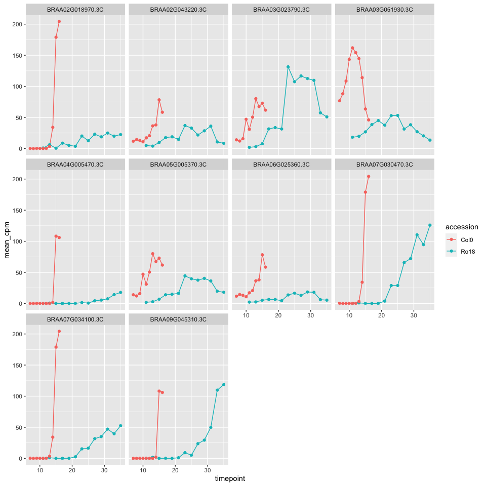<!-- -->

### Register data

``` r
test_using_brapa_data <- GREAT::scale_and_register_data(
  alex_data_mean,
  alex_data_all,
  stretches =  c(2, 1.5, 1),
  shift_extreme = 4,
  num_shifts = 27,
  min_num_overlapping_points = 4,
  initial_rescale = FALSE,
  do_rescale = TRUE,
  testing = FALSE,
  accession_data_to_transform = "Col0",
  accession_data_fix = "Ro18",
  data_to_transform_time_added = 11,
  data_fix_time_added = 11
)
```

    ## Max value of mean_cpm of all_data_df :262.275679930721

    ## testing models for stretch factor = 2

    ## [1] "0 / 10"

    ## Normalising expression by mean and sd of compared values...

    ## 0 / 10

    ## Done!

    ## Applying best shift...

    ## Done!

    ## Calculating registration vs different expression comparison AIC & BIC...

    ## finished testing models for stretch factor = 2

    ## testing models for stretch factor = 1.5

    ## [1] "0 / 10"

    ## Normalising expression by mean and sd of compared values...

    ## 0 / 10

    ## Done!

    ## Applying best shift...

    ## Done!

    ## Calculating registration vs different expression comparison AIC & BIC...

    ## finished testing models for stretch factor = 1.5

    ## testing models for stretch factor = 1

    ## [1] "0 / 10"

    ## Normalising expression by mean and sd of compared values...

    ## 0 / 10

    ## Done!

    ## Applying best shift...

    ## Done!

    ## Calculating registration vs different expression comparison AIC & BIC...

    ## finished testing models for stretch factor = 1

    ## [1] "################## Model comparison results #######################"
    ## [1] "AIC finds registration better than separate for :7 / 10"
    ## [1] "BIC finds registration better than separate for :10 / 10"
    ## [1] "AIC & BIC finds registration better than separate for :7 / 10"
    ## [1] "###################################################################"

    ## Normalising expression by mean and sd of compared values...

    ## 0 / 10

    ## Done!

    ## Applying best shift...

    ## Done!

    ## Warning in min(timepoint): no non-missing arguments to min; returning Inf

    ## Max value of mean_cpm :10.3830892221948

    ## 0 / 10

### Plot data after registration

``` r
id_table_path <- system.file("extdata/sample_data/id_table_5genes.RDS", package = "GREAT")

ID_table <- readRDS(id_table_path)

test_mapped <- test_using_brapa_data[['imputed_mean_df']] %>%
  dplyr::left_join(ID_table %>% 
                     dplyr::mutate(CDS.model = toupper(CDS.model)), by = c("locus_name" = "CDS.model")) %>% 
  dplyr::select(-c(locus_name.y)) %>%
  dplyr::rename(locus_name = symbol, bra_gene = locus_name)

data_to_plot <- test_mapped %>% 
  dplyr::filter(dplyr::case_when(locus_name == "AGL24" ~ shifted_time >= 14 & shifted_time <= 35, 
                          locus_name == "AP1" ~  shifted_time >= 11 & shifted_time <= 25,
                          locus_name == "AP3" ~  shifted_time >= 11 & shifted_time <= 30,
                          locus_name == "LFY" ~ shifted_time >= 11 & shifted_time <= 26,
                          locus_name == "SOC1" ~ shifted_time >= 10 & shifted_time <= 31))


# Function to map ara and bra genes
map_bra_with_ara_genes <- function(bra_data, ara_table){
  
  mapped_data <- bra_data %>% 
    dplyr::left_join(ara_table %>% 
                     dplyr::mutate(CDS.model = toupper(CDS.model)), by = c("locus_name" = "CDS.model")) %>% 
  dplyr::select(-c(locus_name.y)) %>%
  dplyr::rename(locus_name = symbol, bra_gene = locus_name)
  
  return(mapped_data)

}

GREAT::plot_registered_GoIs_for_comparible_timepoints(data_to_plot)
```

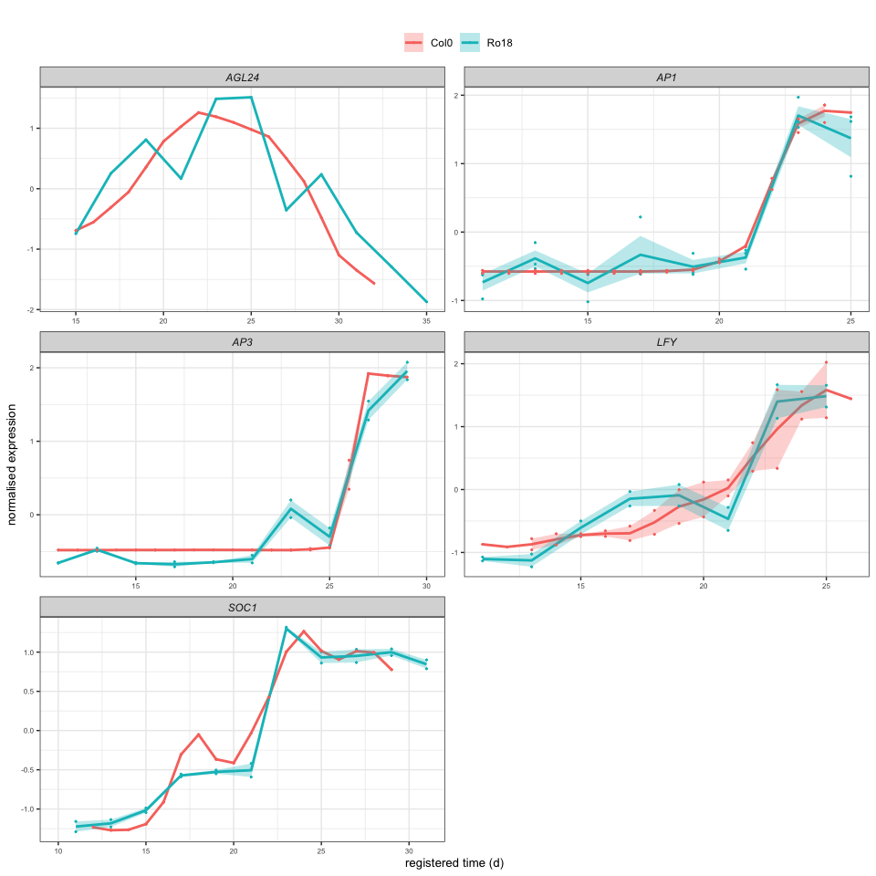<!-- -->

## Slice the data functions

``` r
list_genes <- alex_data_mean %>% 
  dplyr::pull(locus_name) %>% 
  unique()

list_genes
```

    ##  [1] "BRAA02G018970.3C" "BRAA02G043220.3C" "BRAA03G023790.3C" "BRAA03G051930.3C"
    ##  [5] "BRAA04G005470.3C" "BRAA05G005370.3C" "BRAA06G025360.3C" "BRAA07G030470.3C"
    ##  [9] "BRAA07G034100.3C" "BRAA09G045310.3C"

``` r
slice_data_timepoints <- function(data, gene_accession, num_timepoints){
  
  sliced_data <- data %>% 
    dplyr::filter(locus_name == gene_accession & accession == "Ro18") %>% 
    dplyr::arrange(timepoint) %>% 
    dplyr::slice(1:num_timepoints) %>% 
    dplyr::bind_rows(
      data %>% 
      dplyr::filter(locus_name == gene_accession & accession == "Col0") %>% 
      dplyr::arrange(timepoint) %>% 
      dplyr::slice(1:num_timepoints)
    )
  
  return(sliced_data)
}

alex_data_mean %>% 
    dplyr::filter(locus_name == "BRAA02G018970.3C" & accession == "Ro18") %>% 
    dplyr::arrange(timepoint) %>% 
    dplyr::slice(1:10)
```

    ##           locus_name accession tissue timepoint   mean_cpm
    ##  1: BRAA02G018970.3C      Ro18   apex        11  0.8513476
    ##  2: BRAA02G018970.3C      Ro18   apex        13  6.2459792
    ##  3: BRAA02G018970.3C      Ro18   apex        15  0.5816644
    ##  4: BRAA02G018970.3C      Ro18   apex        17  8.6896240
    ##  5: BRAA02G018970.3C      Ro18   apex        19  5.2225576
    ##  6: BRAA02G018970.3C      Ro18   apex        21  3.7067651
    ##  7: BRAA02G018970.3C      Ro18   apex        23 20.1524236
    ##  8: BRAA02G018970.3C      Ro18   apex        25 12.5893656
    ##  9: BRAA02G018970.3C      Ro18   apex        27 23.1077317
    ## 10: BRAA02G018970.3C      Ro18   apex        29 18.8456804

``` r
slice_data_timepoints(alex_data_mean, "BRAA02G018970.3C", 10)
```

    ##           locus_name accession tissue timepoint     mean_cpm
    ##  1: BRAA02G018970.3C      Ro18   apex        11   0.85134762
    ##  2: BRAA02G018970.3C      Ro18   apex        13   6.24597918
    ##  3: BRAA02G018970.3C      Ro18   apex        15   0.58166440
    ##  4: BRAA02G018970.3C      Ro18   apex        17   8.68962397
    ##  5: BRAA02G018970.3C      Ro18   apex        19   5.22255763
    ##  6: BRAA02G018970.3C      Ro18   apex        21   3.70676507
    ##  7: BRAA02G018970.3C      Ro18   apex        23  20.15242355
    ##  8: BRAA02G018970.3C      Ro18   apex        25  12.58936556
    ##  9: BRAA02G018970.3C      Ro18   apex        27  23.10773172
    ## 10: BRAA02G018970.3C      Ro18   apex        29  18.84568044
    ## 11: BRAA02G018970.3C      Col0   apex         7   0.27048780
    ## 12: BRAA02G018970.3C      Col0   apex         8   0.00000000
    ## 13: BRAA02G018970.3C      Col0   apex         9   0.22900605
    ## 14: BRAA02G018970.3C      Col0   apex        10   0.17261724
    ## 15: BRAA02G018970.3C      Col0   apex        11   0.07015341
    ## 16: BRAA02G018970.3C      Col0   apex        12   0.19187316
    ## 17: BRAA02G018970.3C      Col0   apex        13   3.37435946
    ## 18: BRAA02G018970.3C      Col0   apex        14  34.11532817
    ## 19: BRAA02G018970.3C      Col0   apex        15 178.93681231
    ## 20: BRAA02G018970.3C      Col0   apex        16 204.27987138

## Data with 10 points

### Plot data before registering

``` r
data_with_10_timepoints_mean <- list_genes %>% 
  purrr::map(~ slice_data_timepoints(alex_data_mean, .x, 10)) %>% 
  purrr::reduce(dplyr::bind_rows)

# data_with_10_timepoints_mean

data_with_10_timepoints_mean %>% 
ggplot() +
  aes(x = timepoint, y = mean_cpm, color = accession) +
  geom_line(data = data_with_10_timepoints_mean) +
  geom_point(data = data_with_10_timepoints_mean) +
  facet_wrap(~locus_name)
```

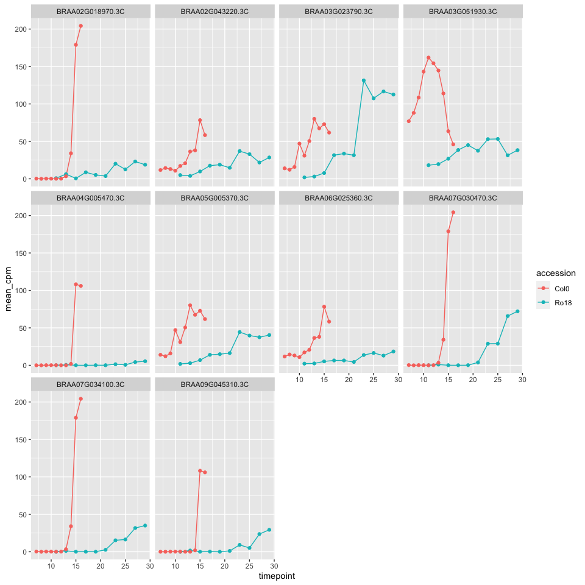<!-- -->

``` r
get_bra_timepoint <- function(data){
  list <- data %>% 
  dplyr::filter(accession == "Ro18") %>% 
  dplyr::pull(timepoint) %>% 
  unique()
  
  return(list)
}

get_ara_timepoint <- function(data){
  list <- data %>% 
  dplyr::filter(accession == "Col0") %>% 
  dplyr::pull(timepoint) %>% 
  unique()
  
  return(list)
}

data_with_10_timepoints_all <- dplyr::bind_rows(alex_data_all %>% 
  dplyr::filter(accession == "Ro18" & timepoint %in% get_bra_timepoint(data_with_10_timepoints_mean)),
  alex_data_all %>% 
  dplyr::filter(accession == "Col0" & timepoint %in% get_ara_timepoint(data_with_10_timepoints_mean))
  )

data_with_10_timepoints_all
```

    ##            locus_name accession tissue timepoint   mean_cpm     group
    ##   1: BRAA02G018970.3C      Ro18   apex        11  0.3968734 Ro18-11-a
    ##   2: BRAA02G018970.3C      Ro18   apex        11  1.4147711 Ro18-11-b
    ##   3: BRAA02G018970.3C      Ro18   apex        11  0.7423984 Ro18-11-c
    ##   4: BRAA02G018970.3C      Ro18   apex        29 11.3007002 Ro18-29-a
    ##   5: BRAA02G018970.3C      Ro18   apex        29 23.2055664 Ro18-29-b
    ##  ---                                                                 
    ## 596: BRAA06G025360.3C      Col0   apex        13 42.9752377 Col0-13-d
    ## 597: BRAA06G025360.3C      Col0   apex         9  7.2502672 Col0-09-c
    ## 598: BRAA06G025360.3C      Col0   apex         9  5.1475432 Col0-09-d
    ## 599: BRAA06G025360.3C      Col0   apex        12 22.2130362 Col0-12-c
    ## 600: BRAA06G025360.3C      Col0   apex        12 19.1034466 Col0-12-d

### Register data

``` r
reg_data_with_10_timepoints <- GREAT::scale_and_register_data(
  data_with_10_timepoints_mean,
  data_with_10_timepoints_all,
  stretches =  c(2, 1.5, 1),
  shift_extreme = 4,
  num_shifts = 27,
  min_num_overlapping_points = 4,
  initial_rescale = FALSE,
  do_rescale = TRUE,
  testing = FALSE,
  accession_data_to_transform = "Col0",
  accession_data_fix = "Ro18",
  data_to_transform_time_added = 11,
  data_fix_time_added = 11
)
```

    ## [1] "0 / 10"
    ## [1] "0 / 10"
    ## [1] "0 / 10"
    ## [1] "################## Model comparison results #######################"
    ## [1] "AIC finds registration better than separate for :6 / 10"
    ## [1] "BIC finds registration better than separate for :10 / 10"
    ## [1] "AIC & BIC finds registration better than separate for :6 / 10"
    ## [1] "###################################################################"

    ## Warning in min(timepoint): no non-missing arguments to min; returning Inf

``` r
GREAT::plot_registered_GoIs_for_comparible_timepoints(reg_data_with_10_timepoints[['imputed_mean_df']])
```

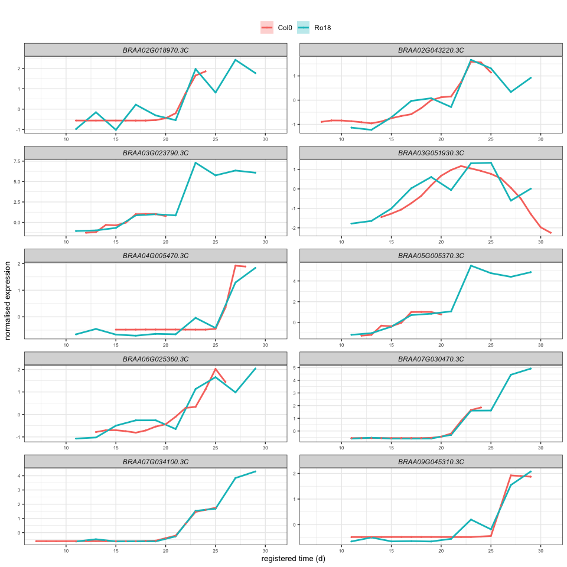<!-- -->

## Data with 9 points

### Plot data before registering

``` r
data_with_9_timepoints_mean <- list_genes %>% 
  purrr::map(~ slice_data_timepoints(alex_data_mean, .x, 9)) %>% 
  purrr::reduce(dplyr::bind_rows)


ggplot() +
  aes(x = timepoint, y = mean_cpm, color = accession) +
  geom_line(data = data_with_9_timepoints_mean) +
  geom_point(data = data_with_9_timepoints_mean) +
  facet_wrap(~locus_name)
```

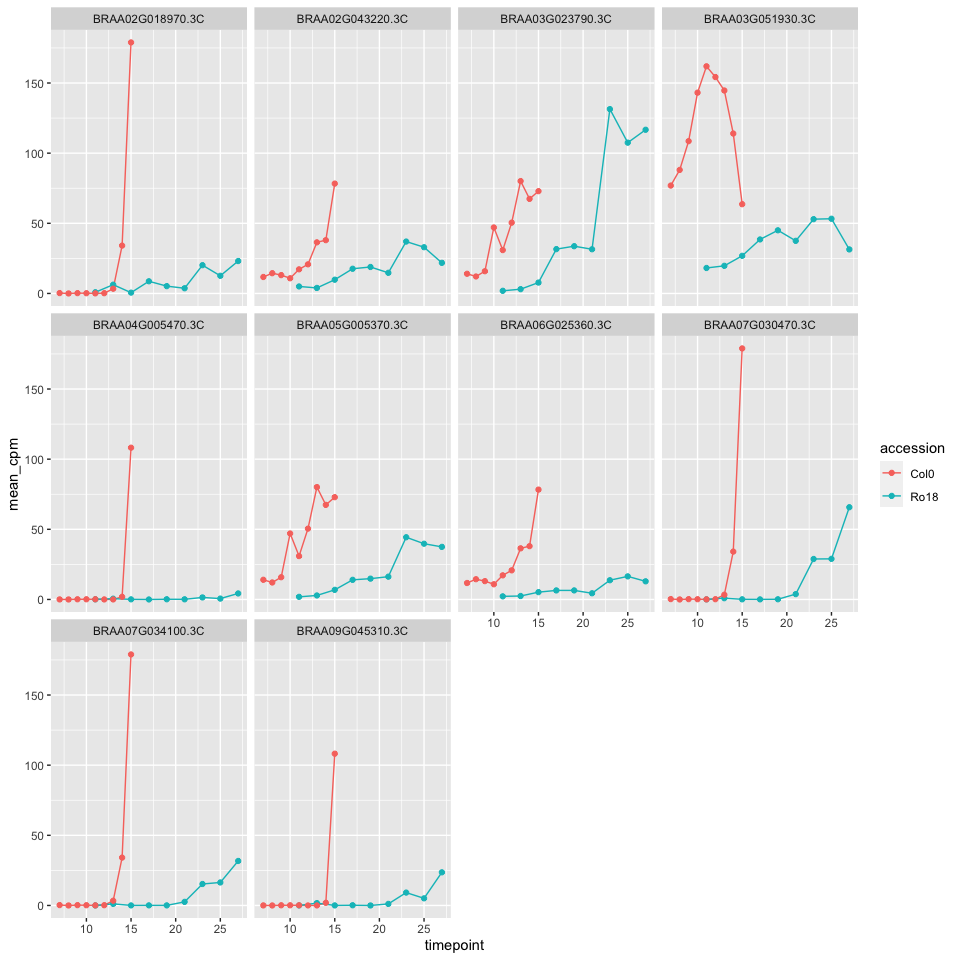<!-- -->

``` r
data_with_9_timepoints_all <- dplyr::bind_rows(alex_data_all %>% 
  dplyr::filter(accession == "Ro18" & timepoint %in% get_bra_timepoint(data_with_9_timepoints_mean)),
  alex_data_all %>% 
  dplyr::filter(accession == "Col0" & timepoint %in% get_ara_timepoint(data_with_9_timepoints_mean))
  )

data_with_9_timepoints_all
```

    ##            locus_name accession tissue timepoint   mean_cpm     group
    ##   1: BRAA02G018970.3C      Ro18   apex        11  0.3968734 Ro18-11-a
    ##   2: BRAA02G018970.3C      Ro18   apex        11  1.4147711 Ro18-11-b
    ##   3: BRAA02G018970.3C      Ro18   apex        11  0.7423984 Ro18-11-c
    ##   4: BRAA02G018970.3C      Ro18   apex        13  6.0144938 Ro18-13-a
    ##   5: BRAA02G018970.3C      Ro18   apex        13  6.2901973 Ro18-13-b
    ##  ---                                                                 
    ## 546: BRAA06G025360.3C      Col0   apex        13 42.9752377 Col0-13-d
    ## 547: BRAA06G025360.3C      Col0   apex         9  7.2502672 Col0-09-c
    ## 548: BRAA06G025360.3C      Col0   apex         9  5.1475432 Col0-09-d
    ## 549: BRAA06G025360.3C      Col0   apex        12 22.2130362 Col0-12-c
    ## 550: BRAA06G025360.3C      Col0   apex        12 19.1034466 Col0-12-d

``` r
 get_bra_timepoint(data_with_9_timepoints_mean)
```

    ## [1] 11 13 15 17 19 21 23 25 27

### Register data

``` r
reg_data_with_9_timepoints <- GREAT::scale_and_register_data(
  data_with_9_timepoints_mean,
  data_with_9_timepoints_all,
  stretches =  c(2, 1.5, 1),
  shift_extreme = 4,
  num_shifts = 27,
  min_num_overlapping_points = 4,
  initial_rescale = FALSE,
  do_rescale = TRUE,
  testing = FALSE,
  accession_data_to_transform = "Col0",
  accession_data_fix = "Ro18",
  data_to_transform_time_added = 11,
  data_fix_time_added = 11
)
```

    ## [1] "0 / 10"
    ## [1] "0 / 10"
    ## [1] "0 / 10"
    ## [1] "################## Model comparison results #######################"
    ## [1] "AIC finds registration better than separate for :4 / 10"
    ## [1] "BIC finds registration better than separate for :7 / 10"
    ## [1] "AIC & BIC finds registration better than separate for :4 / 10"
    ## [1] "###################################################################"

``` r
GREAT::plot_registered_GoIs_for_comparible_timepoints(reg_data_with_9_timepoints[['imputed_mean_df']])
```

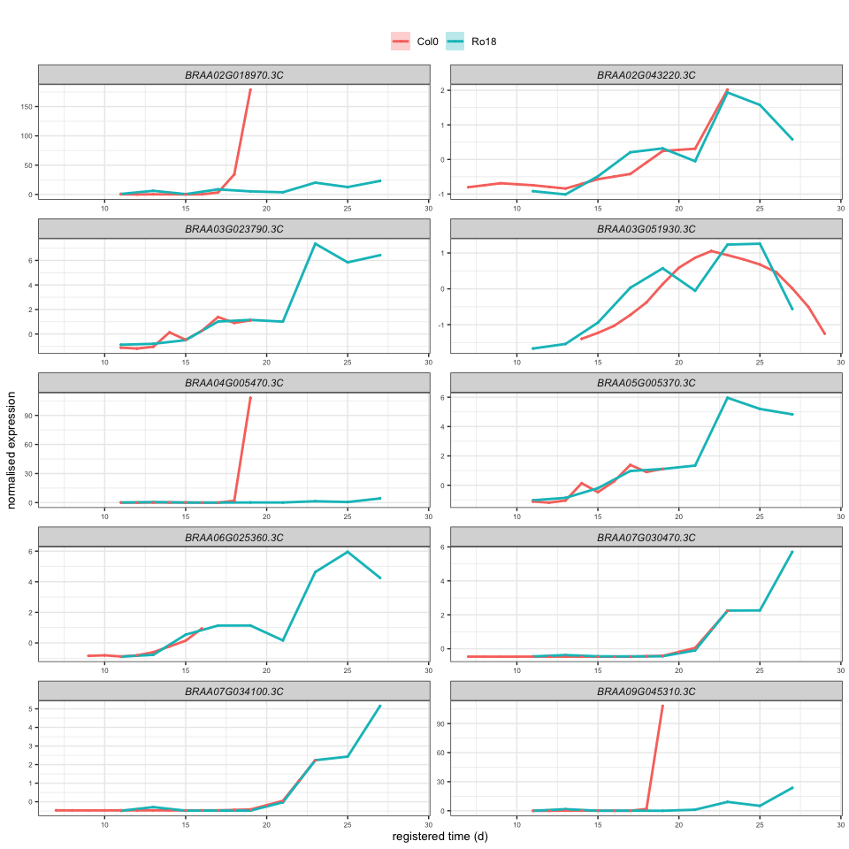<!-- -->

## Data with 8 points

### Plot data before registering

``` r
data_with_8_timepoints_mean <- list_genes %>% 
  purrr::map(~ slice_data_timepoints(alex_data_mean, .x, 8)) %>% 
  purrr::reduce(dplyr::bind_rows)

ggplot() +
  aes(x = timepoint, y = mean_cpm, color = accession) +
  geom_line(data = data_with_8_timepoints_mean) +
  geom_point(data = data_with_8_timepoints_mean) +
  facet_wrap(~locus_name)
```

<!-- -->

``` r
data_with_8_timepoints_all <- dplyr::bind_rows(alex_data_all %>% 
  dplyr::filter(accession == "Ro18" & timepoint %in% get_bra_timepoint(data_with_8_timepoints_mean)),
  alex_data_all %>% 
  dplyr::filter(accession == "Col0" & timepoint %in% get_ara_timepoint(data_with_8_timepoints_mean))
  )
get_bra_timepoint(data_with_8_timepoints_mean)
```

    ## [1] 11 13 15 17 19 21 23 25

### Register data

``` r
reg_data_with_8_timepoints <- GREAT::scale_and_register_data(
  data_with_8_timepoints_mean,
  data_with_8_timepoints_all,
  stretches =  c(2, 1.5, 1),
  shift_extreme = 4,
  num_shifts = 27,
  min_num_overlapping_points = 4,
  initial_rescale = FALSE,
  do_rescale = TRUE,
  testing = FALSE,
  accession_data_to_transform = "Col0",
  accession_data_fix = "Ro18",
  data_to_transform_time_added = 11,
  data_fix_time_added = 11
)
```

    ## [1] "0 / 10"
    ## [1] "0 / 10"
    ## [1] "0 / 10"
    ## [1] "################## Model comparison results #######################"
    ## [1] "AIC finds registration better than separate for :3 / 10"
    ## [1] "BIC finds registration better than separate for :7 / 10"
    ## [1] "AIC & BIC finds registration better than separate for :3 / 10"
    ## [1] "###################################################################"

``` r
GREAT::plot_registered_GoIs_for_comparible_timepoints(reg_data_with_8_timepoints[['imputed_mean_df']])
```

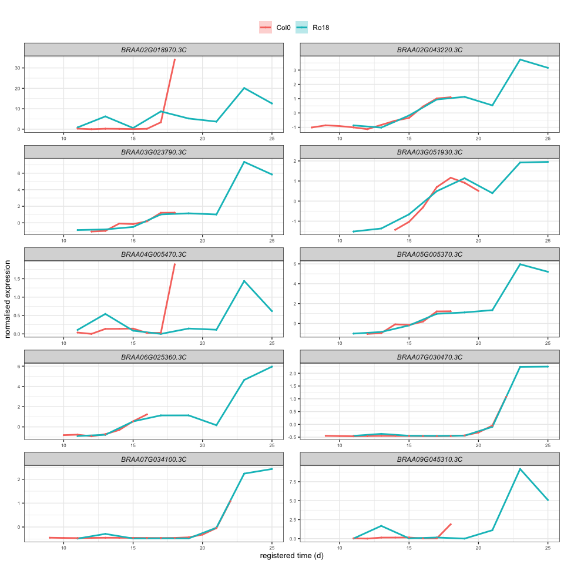<!-- -->

## Data with 7 points

### Plot data before registering

``` r
data_with_7_timepoints_mean <- list_genes %>% 
  purrr::map(~ slice_data_timepoints(alex_data_mean, .x, 7)) %>% 
  purrr::reduce(dplyr::bind_rows)

ggplot() +
  aes(x = timepoint, y = mean_cpm, color = accession) +
  geom_line(data = data_with_7_timepoints_mean) +
  geom_point(data = data_with_7_timepoints_mean) +
  facet_wrap(~locus_name)
```

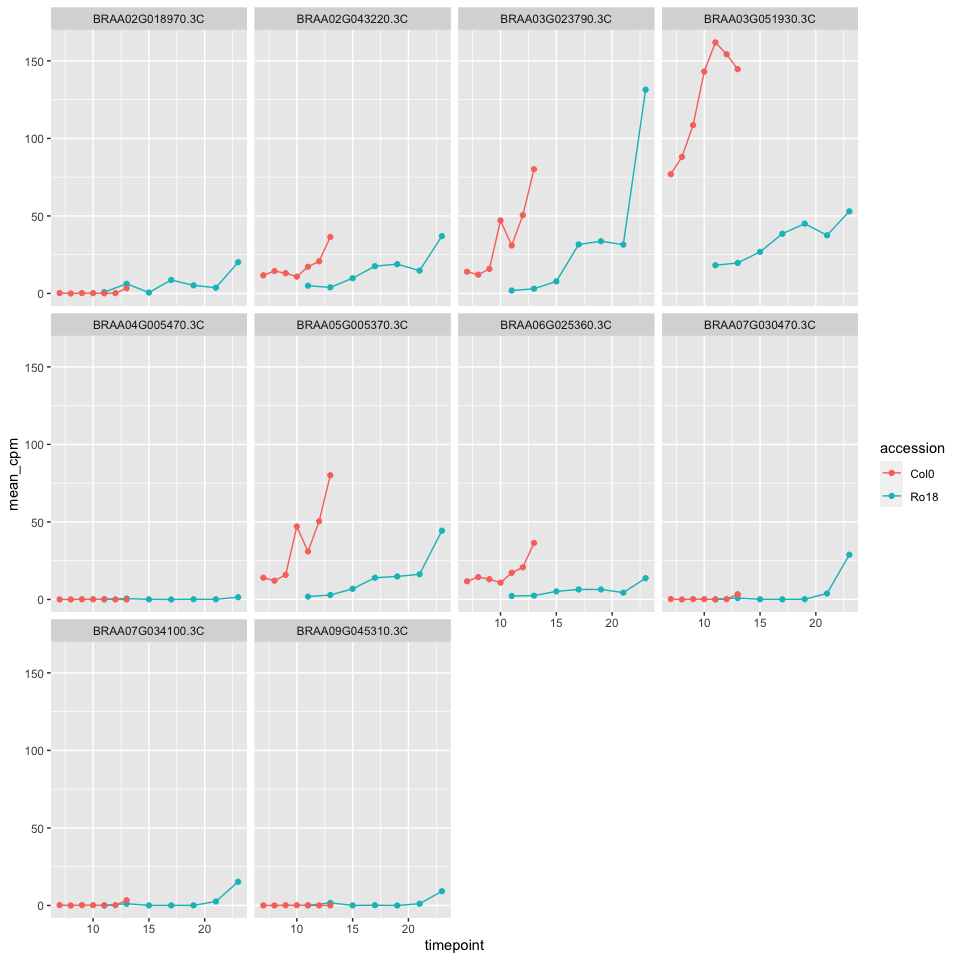<!-- -->

``` r
data_with_7_timepoints_all <- dplyr::bind_rows(alex_data_all %>% 
  dplyr::filter(accession == "Ro18" & timepoint %in% get_bra_timepoint(data_with_7_timepoints_mean)),
  alex_data_all %>% 
  dplyr::filter(accession == "Col0" & timepoint %in% get_ara_timepoint(data_with_7_timepoints_mean))
  )
get_bra_timepoint(data_with_7_timepoints_mean)
```

    ## [1] 11 13 15 17 19 21 23

### Register data

``` r
reg_data_with_7_timepoints <- GREAT::scale_and_register_data(
  data_with_7_timepoints_mean,
  data_with_7_timepoints_all,
  stretches =  c(2, 1.5, 1),
  shift_extreme = 4,
  num_shifts = 27,
  min_num_overlapping_points = 2,
  initial_rescale = FALSE,
  do_rescale = TRUE,
  testing = FALSE,
  accession_data_to_transform = "Col0",
  accession_data_fix = "Ro18",
  data_to_transform_time_added = 11,
  data_fix_time_added = 11
)
```

    ## [1] "0 / 10"
    ## [1] "0 / 10"
    ## [1] "0 / 10"
    ## [1] "################## Model comparison results #######################"
    ## [1] "AIC finds registration better than separate for :9 / 10"
    ## [1] "BIC finds registration better than separate for :9 / 10"
    ## [1] "AIC & BIC finds registration better than separate for :9 / 10"
    ## [1] "###################################################################"

``` r
GREAT::plot_registered_GoIs_for_comparible_timepoints(reg_data_with_7_timepoints[['imputed_mean_df']])
```

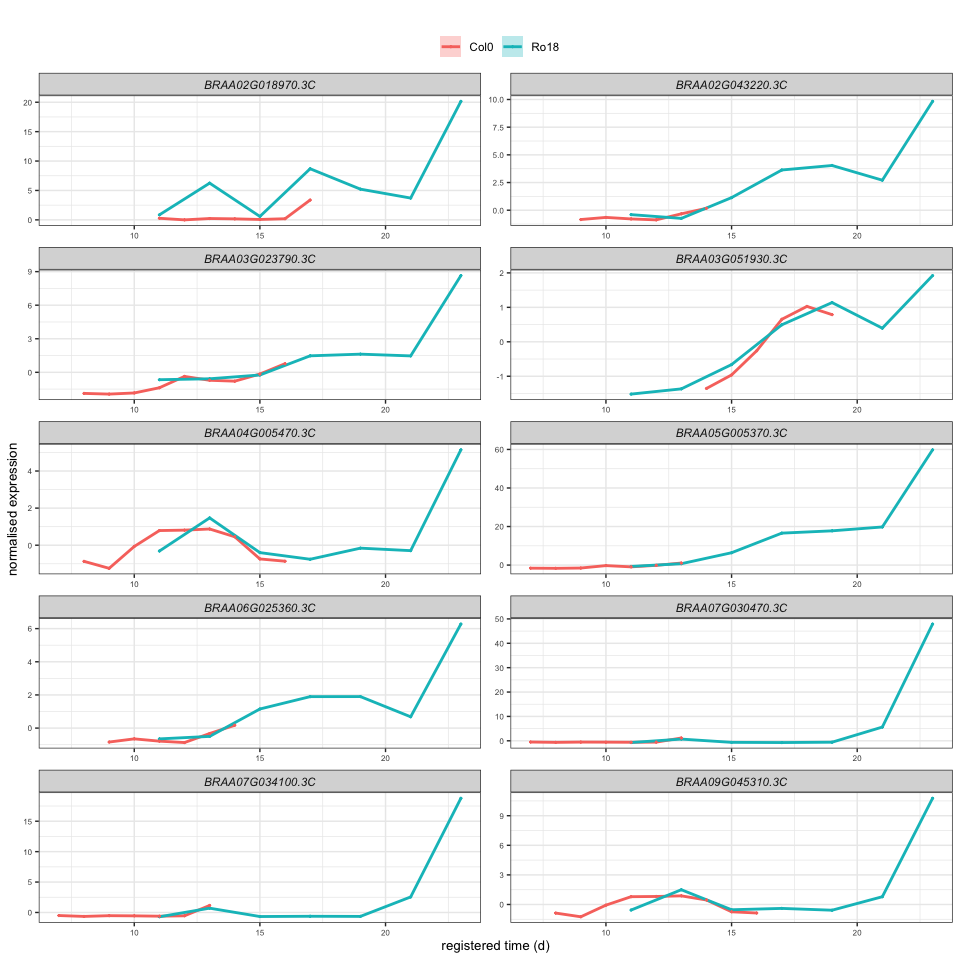<!-- -->

## Data with 6 points

### Plot data before registering

``` r
data_with_6_timepoints_mean <- list_genes %>% 
  purrr::map(~ slice_data_timepoints(alex_data_mean, .x, 6)) %>% 
  purrr::reduce(dplyr::bind_rows)

ggplot() +
  aes(x = timepoint, y = mean_cpm, color = accession) +
  geom_line(data = data_with_6_timepoints_mean) +
  geom_point(data = data_with_6_timepoints_mean) +
  facet_wrap(~locus_name, scales = "free_y")
```

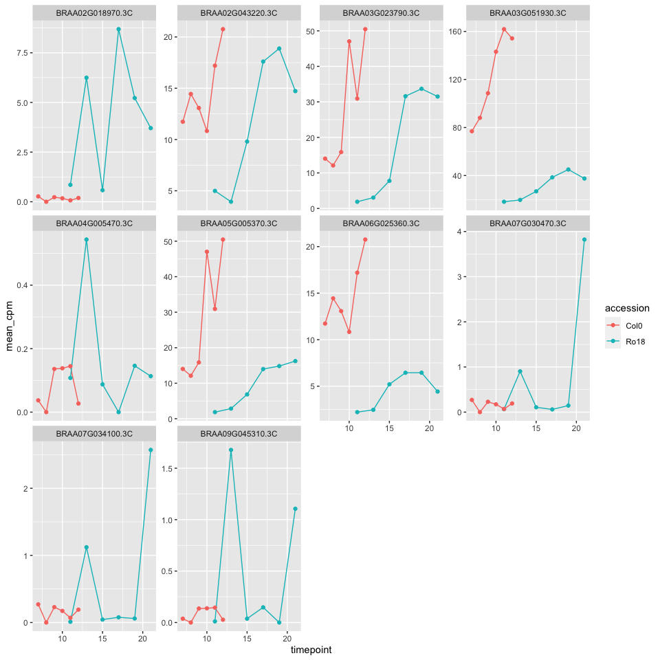<!-- -->

``` r
data_with_6_timepoints_all <- dplyr::bind_rows(alex_data_all %>% 
  dplyr::filter(accession == "Ro18" & timepoint %in% get_bra_timepoint(data_with_6_timepoints_mean)),
  alex_data_all %>% 
  dplyr::filter(accession == "Col0" & timepoint %in% get_ara_timepoint(data_with_6_timepoints_mean))
  )
```

### Register data

``` r
reg_data_with_6_timepoints <- GREAT::scale_and_register_data(
  data_with_6_timepoints_mean,
  data_with_6_timepoints_all,
  stretches =  c(2, 1.5, 1),
  shift_extreme = 4,
  num_shifts = 27,
  min_num_overlapping_points = 4,
  initial_rescale = FALSE,
  do_rescale = TRUE,
  testing = FALSE,
  accession_data_to_transform = "Col0",
  accession_data_fix = "Ro18",
  data_to_transform_time_added = 11,
  data_fix_time_added = 11
)
```

    ## [1] "0 / 10"
    ## [1] "0 / 10"
    ## [1] "0 / 10"
    ## [1] "################## Model comparison results #######################"
    ## [1] "AIC finds registration better than separate for :5 / 10"
    ## [1] "BIC finds registration better than separate for :10 / 10"
    ## [1] "AIC & BIC finds registration better than separate for :5 / 10"
    ## [1] "###################################################################"

    ## Warning in min(timepoint): no non-missing arguments to min; returning Inf

``` r
GREAT::plot_registered_GoIs_for_comparible_timepoints(reg_data_with_6_timepoints[['imputed_mean_df']])
```

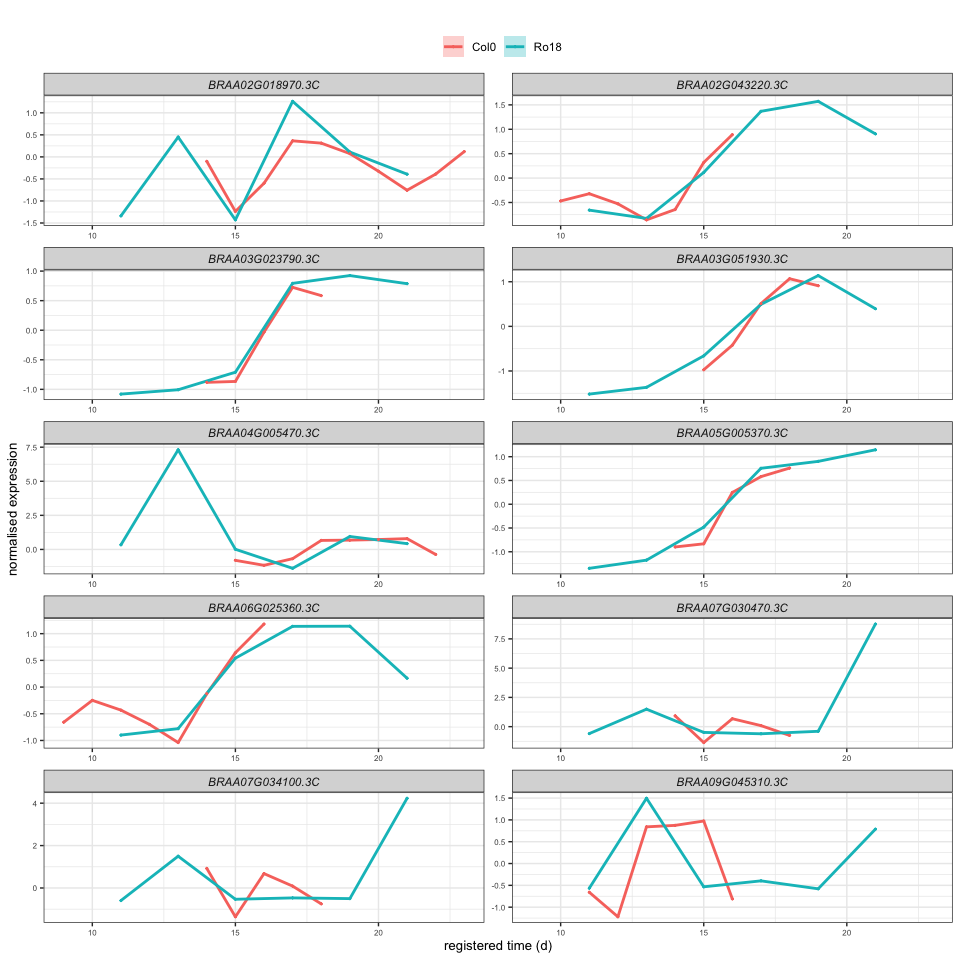<!-- -->

## Data with 5 points

### Plot data before registering

``` r
data_with_5_timepoints_mean <- list_genes %>% 
  purrr::map(~ slice_data_timepoints(alex_data_mean, .x, 5)) %>% 
  purrr::reduce(dplyr::bind_rows)

ggplot() +
  aes(x = timepoint, y = mean_cpm, color = accession) +
  geom_line(data = data_with_5_timepoints_mean) +
  geom_point(data = data_with_5_timepoints_mean) +
  facet_wrap(~locus_name)
```

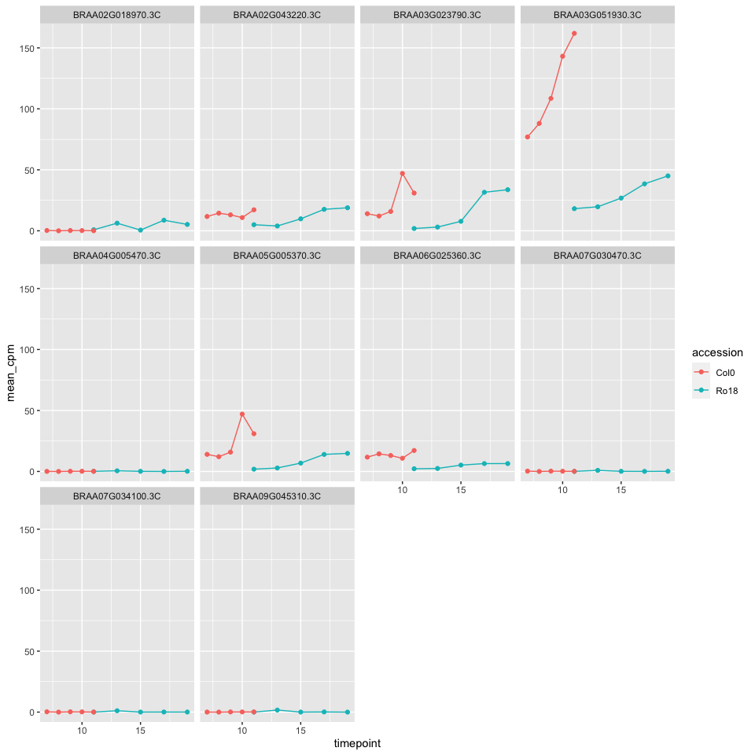<!-- -->

``` r
data_with_5_timepoints_all <- dplyr::bind_rows(alex_data_all %>% 
  dplyr::filter(accession == "Ro18" & timepoint %in% get_bra_timepoint(data_with_5_timepoints_mean)),
  alex_data_all %>% 
  dplyr::filter(accession == "Col0" & timepoint %in% get_ara_timepoint(data_with_5_timepoints_mean))
  )

get_bra_timepoint(data_with_5_timepoints_mean)
```

    ## [1] 11 13 15 17 19

### Register data

``` r
reg_data_with_5_timepoints <- GREAT::scale_and_register_data(
  data_with_5_timepoints_mean,
  data_with_5_timepoints_all,
  stretches =  c(2, 1.5, 1),
  shift_extreme = 4,
  num_shifts = 27,
  min_num_overlapping_points = 2,
  initial_rescale = FALSE,
  do_rescale = TRUE,
  testing = FALSE,
  accession_data_to_transform = "Col0",
  accession_data_fix = "Ro18",
  data_to_transform_time_added = 11,
  data_fix_time_added = 11
)
```

    ## [1] "0 / 10"
    ## [1] "0 / 10"
    ## [1] "0 / 10"
    ## [1] "found 1 tied optimal registrations. Removing duplicates"
    ## [1] "################## Model comparison results #######################"
    ## [1] "AIC finds registration better than separate for :7 / 10"
    ## [1] "BIC finds registration better than separate for :8 / 10"
    ## [1] "AIC & BIC finds registration better than separate for :7 / 10"
    ## [1] "###################################################################"

``` r
GREAT::plot_registered_GoIs_for_comparible_timepoints(reg_data_with_5_timepoints[['imputed_mean_df']])
```

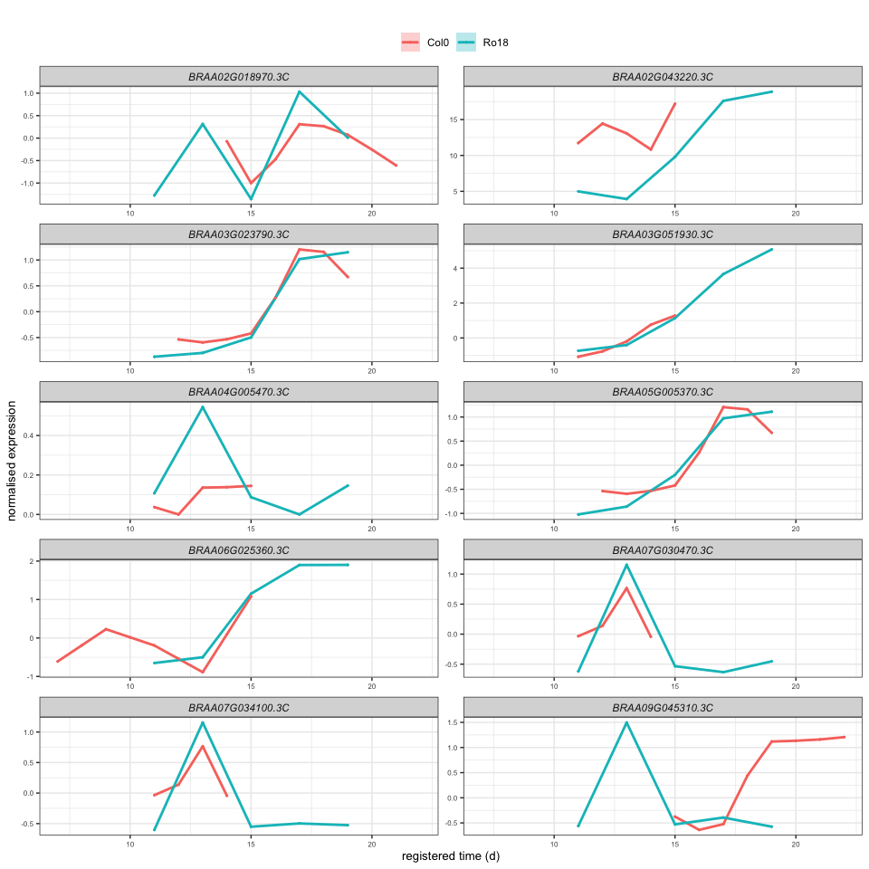<!-- -->

## Data with 4 points

### Plot data before registering

``` r
data_with_4_timepoints_mean <- list_genes %>% 
  purrr::map(~ slice_data_timepoints(alex_data_mean, .x, 4)) %>% 
  purrr::reduce(dplyr::bind_rows)

ggplot() +
  aes(x = timepoint, y = mean_cpm, color = accession) +
  geom_line(data = data_with_4_timepoints_mean) +
  geom_point(data = data_with_4_timepoints_mean) +
  facet_wrap(~locus_name)
```

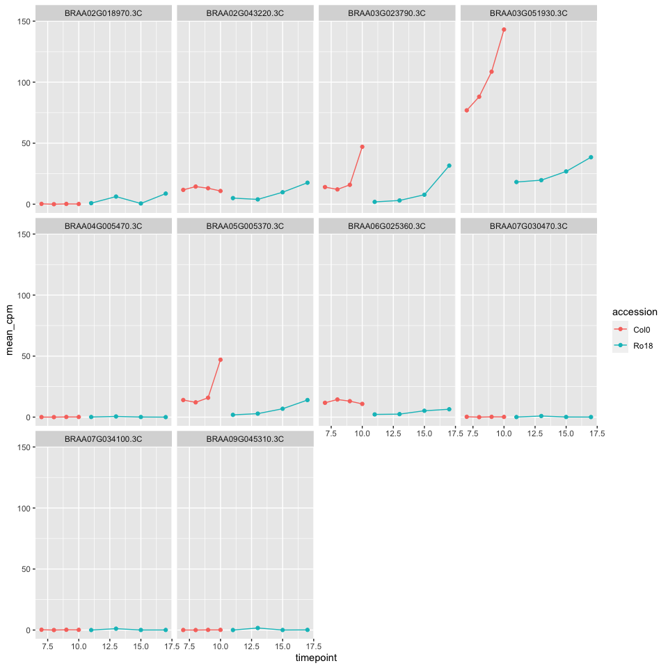<!-- -->

``` r
data_with_4_timepoints_all <- dplyr::bind_rows(alex_data_all %>% 
  dplyr::filter(accession == "Ro18" & timepoint %in% get_bra_timepoint(data_with_4_timepoints_mean)),
  alex_data_all %>% 
  dplyr::filter(accession == "Col0" & timepoint %in% get_ara_timepoint(data_with_4_timepoints_mean))
  )

get_bra_timepoint(data_with_4_timepoints_mean)
```

    ## [1] 11 13 15 17

### Register data

``` r
reg_data_with_4_timepoints <- GREAT::scale_and_register_data(
  data_with_4_timepoints_mean,
  data_with_4_timepoints_all,
  stretches =  c(2, 1.5, 1),
  shift_extreme = 4,
  num_shifts = 27,
  min_num_overlapping_points = 2,
  initial_rescale = FALSE,
  do_rescale = TRUE,
  testing = FALSE,
  accession_data_to_transform = "Col0",
  accession_data_fix = "Ro18",
  data_to_transform_time_added = 11,
  data_fix_time_added = 11
)
```

    ## [1] "0 / 10"
    ## [1] "0 / 10"
    ## [1] "0 / 10"
    ## [1] "found 8 tied optimal registrations. Removing duplicates"
    ## [1] "################## Model comparison results #######################"
    ## [1] "AIC finds registration better than separate for :8 / 10"
    ## [1] "BIC finds registration better than separate for :8 / 10"
    ## [1] "AIC & BIC finds registration better than separate for :8 / 10"
    ## [1] "###################################################################"

``` r
GREAT::plot_registered_GoIs_for_comparible_timepoints(reg_data_with_4_timepoints[['imputed_mean_df']])
```

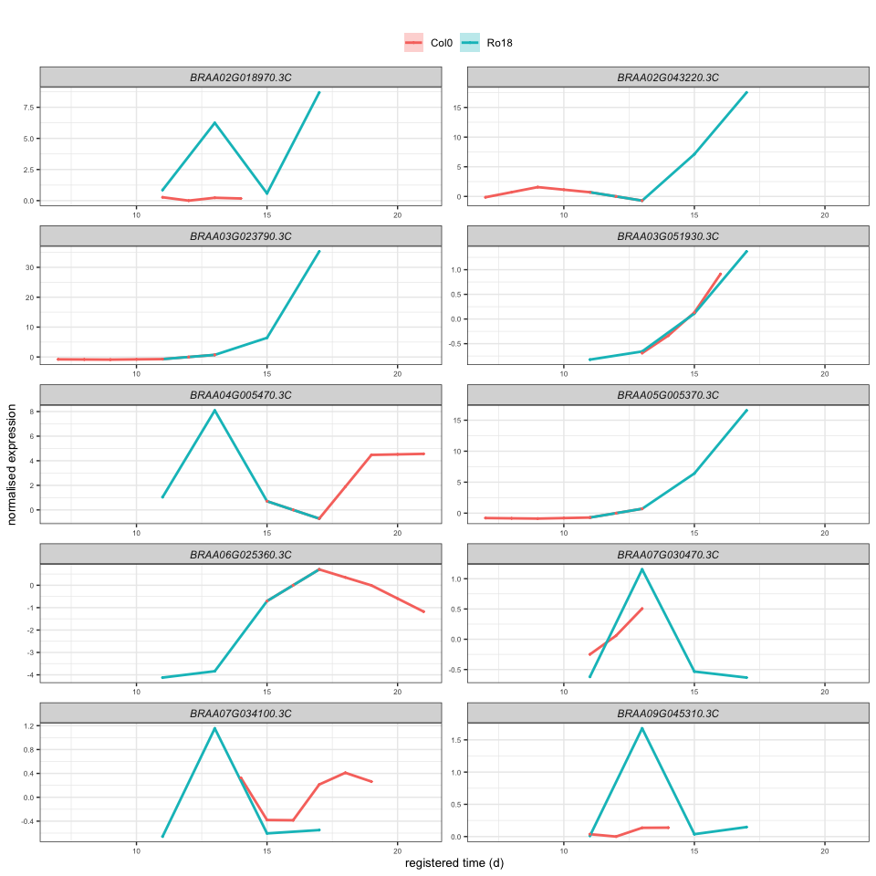<!-- -->
