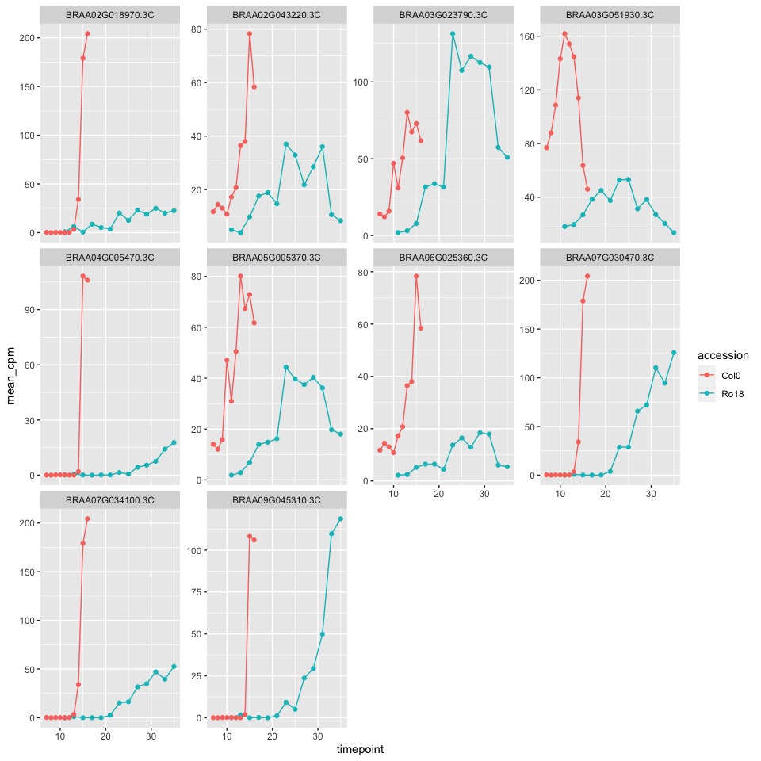
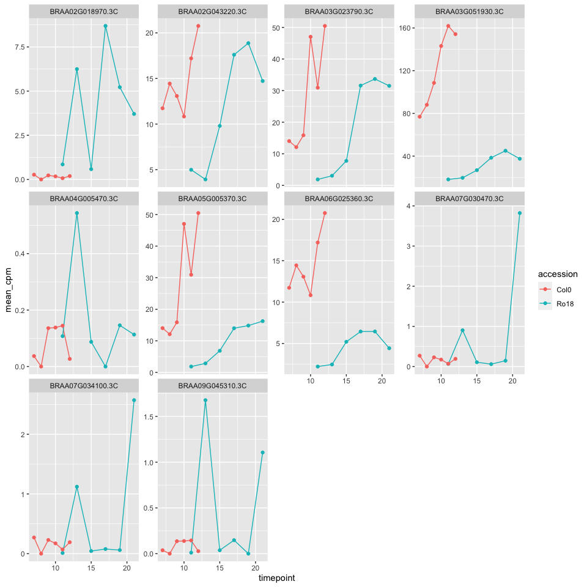
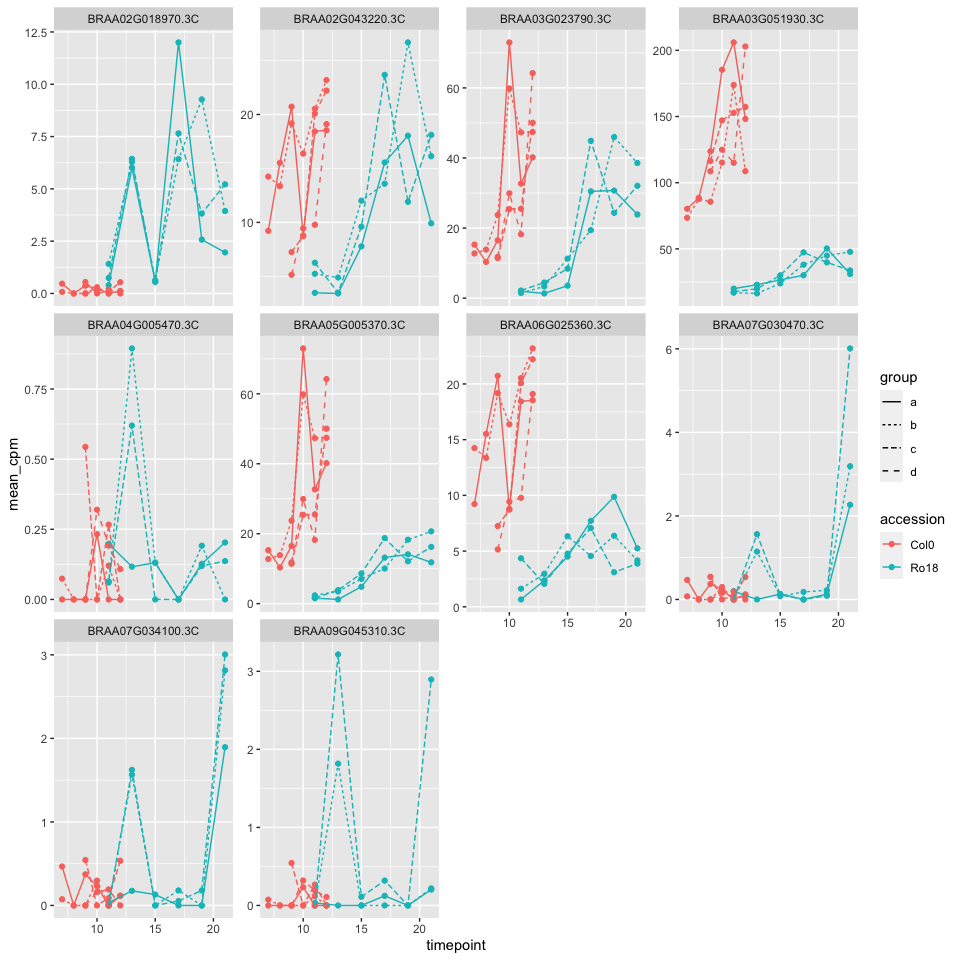
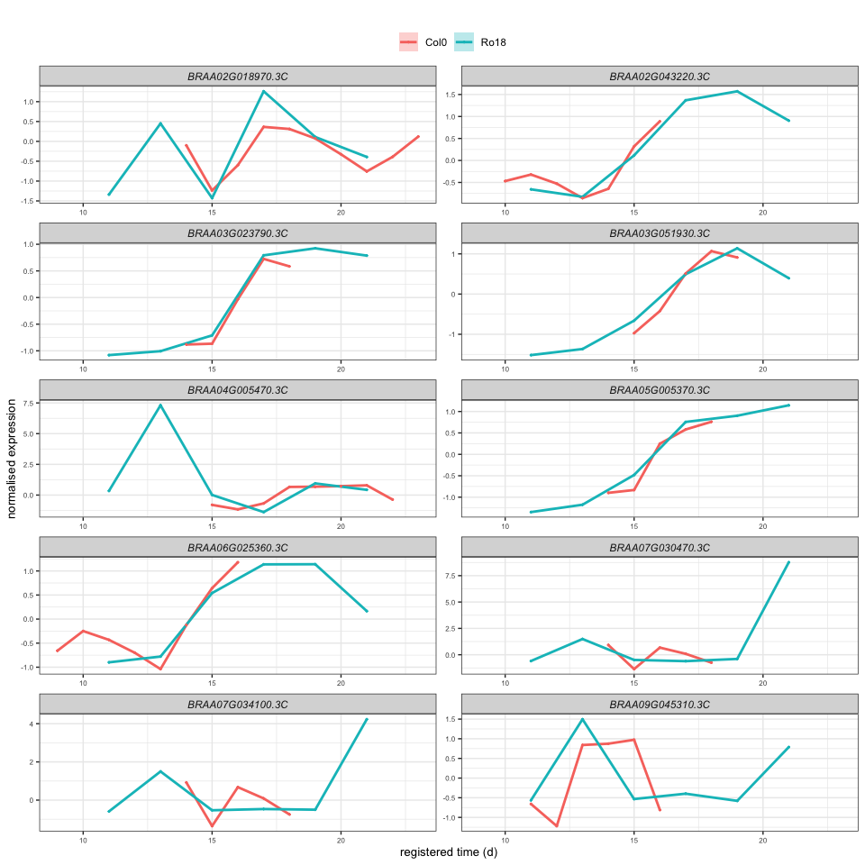
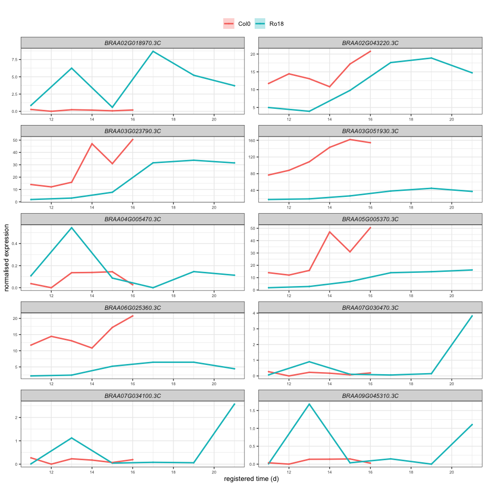
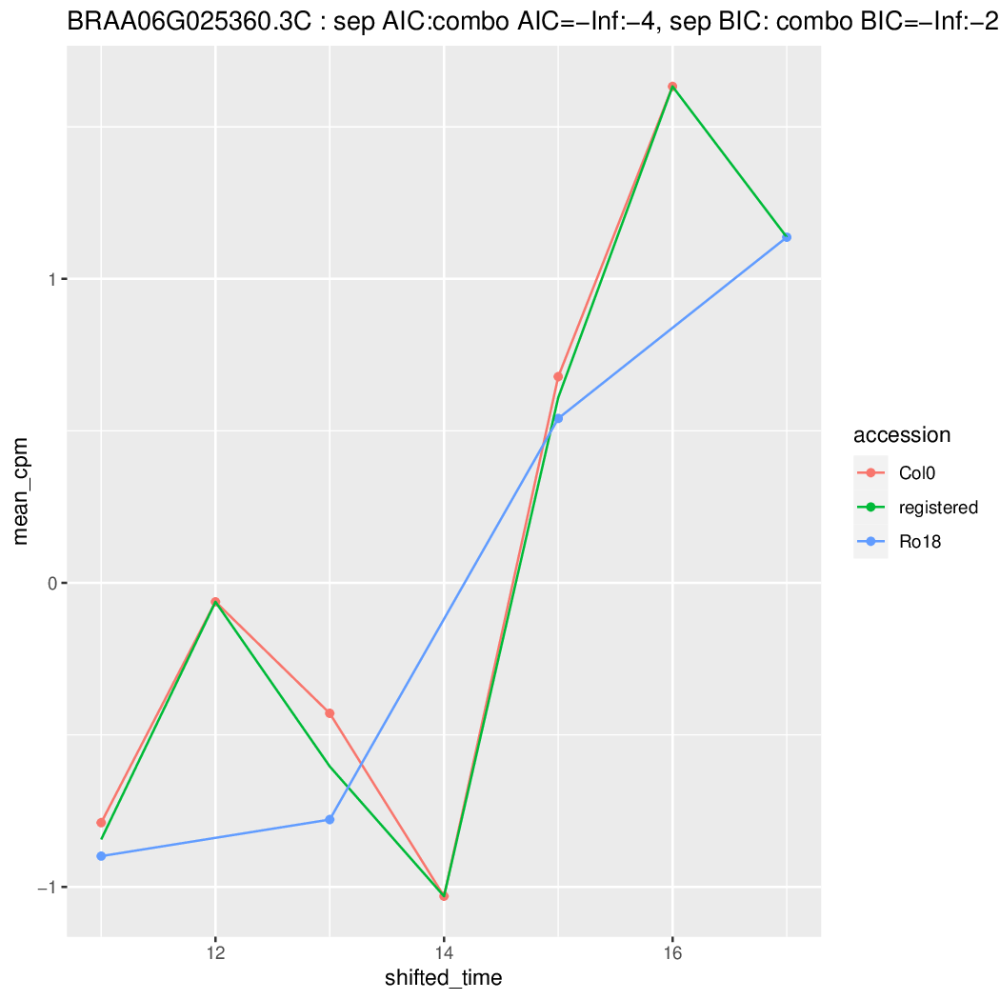
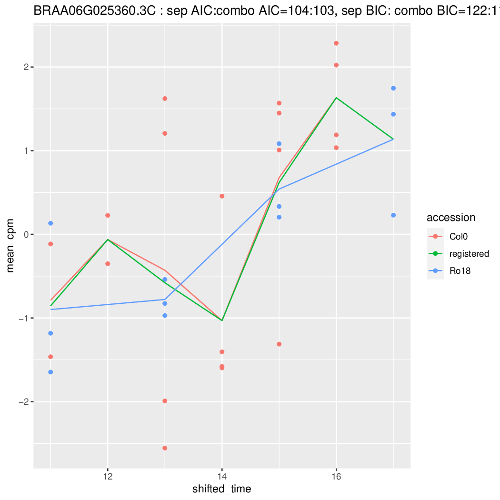

Running registration using real data with different timepoints
================

-   [Setup and running functions](#setup-and-running-functions)
-   [Run GREAT main function using subset of Alex’s rapa
    data](#run-great-main-function-using-subset-of-alexs-rapa-data)
    -   [Plot original mean data](#plot-original-mean-data)
-   [Case studies for data n = 6](#case-studies-for-data-n--6)
    -   [Plot mean data before
        registering](#plot-mean-data-before-registering)
    -   [Plot all data before
        registering](#plot-all-data-before-registering)
    -   [Register data using mean and all
        data](#register-data-using-mean-and-all-data)
    -   [Register data using only mean
        data](#register-data-using-only-mean-data)

## Setup and running functions

``` r
knitr::opts_chunk$set()

devtools::load_all()
```

    ## ℹ Loading GREAT

``` r
library(ggplot2)
library(data.table)
library(cowplot)
library(ggpubr)
```

    ## 
    ## Attaching package: 'ggpubr'

    ## The following object is masked from 'package:cowplot':
    ## 
    ##     get_legend

``` r
id_table_path <- system.file("extdata/sample_data/id_table_5genes.RDS", package = "GREAT")

ID_table <- readRDS(id_table_path)

# Function to map ara and bra genes
map_bra_with_ara_genes <- function(bra_data, ara_table){
  
  mapped_data <- bra_data %>% 
    dplyr::left_join(ara_table %>% 
                     dplyr::mutate(CDS.model = toupper(CDS.model)), by = c("locus_name" = "CDS.model")) %>% 
  dplyr::select(-c(locus_name.y)) %>%
  dplyr::rename(locus_name = symbol, bra_gene = locus_name)
  
  return(mapped_data)

}

# Functions to slice data
slice_data_timepoints <- function(data, gene_accession, num_timepoints){
  
  sliced_data <- data %>% 
    dplyr::filter(locus_name == gene_accession & accession == "Ro18") %>% 
    dplyr::arrange(timepoint) %>% 
    dplyr::slice(1:num_timepoints) %>% 
    dplyr::bind_rows(
      data %>% 
      dplyr::filter(locus_name == gene_accession & accession == "Col0") %>% 
      dplyr::arrange(timepoint) %>% 
      dplyr::slice(1:num_timepoints)
    )
  
  return(sliced_data)
}

get_bra_timepoint <- function(data){
  list <- data %>% 
  dplyr::filter(accession == "Ro18") %>% 
  dplyr::pull(timepoint) %>% 
  unique()
  
  return(list)
}

get_ara_timepoint <- function(data){
  list <- data %>% 
  dplyr::filter(accession == "Col0") %>% 
  dplyr::pull(timepoint) %>% 
  unique()
  
  return(list)
}
```

## Run GREAT main function using subset of Alex’s rapa data

``` r
# Load data obtained from Ruth's refactored function
path_b_rapa <- "~/Downloads/test_data.RDS"

alex_data_mean <- readRDS(path_b_rapa)[[1]]
alex_data_all <- readRDS(path_b_rapa)[[2]]

list_genes <- alex_data_mean %>% 
  dplyr::pull(locus_name) %>% 
  unique()

list_genes
```

    ##  [1] "BRAA02G018970.3C" "BRAA02G043220.3C" "BRAA03G023790.3C" "BRAA03G051930.3C"
    ##  [5] "BRAA04G005470.3C" "BRAA05G005370.3C" "BRAA06G025360.3C" "BRAA07G030470.3C"
    ##  [9] "BRAA07G034100.3C" "BRAA09G045310.3C"

### Plot original mean data

``` r
ggplot() +
  aes(x = timepoint, y = mean_cpm, color = accession) +
  geom_line(data = alex_data_mean) +
  geom_point(data = alex_data_mean) +
  facet_wrap(~locus_name, scales = "free_y")
```

<!-- -->

## Case studies for data n = 6

### Plot mean data before registering

``` r
# Get data with timepoint n = 6
data_with_6_timepoints_mean <- list_genes %>% 
  purrr::map(~ slice_data_timepoints(alex_data_mean, .x, 6)) %>% 
  purrr::reduce(dplyr::bind_rows)

ggplot() +
  aes(x = timepoint, y = mean_cpm, color = accession) +
  geom_line(data = data_with_6_timepoints_mean) +
  geom_point(data = data_with_6_timepoints_mean) +
  facet_wrap(~locus_name, scales = "free_y")
```

<!-- -->

### Plot all data before registering

``` r
data_with_6_timepoints_all <- dplyr::bind_rows(alex_data_all %>% 
  dplyr::filter(accession == "Ro18" & timepoint %in% get_bra_timepoint(data_with_6_timepoints_mean)),
  alex_data_all %>% 
  dplyr::filter(accession == "Col0" & timepoint %in% get_ara_timepoint(data_with_6_timepoints_mean))
  )

data_with_6_timepoints_all %>% 
  dplyr::rowwise() %>% 
  dplyr::mutate(group = stringr::str_sub(group, -1, -1)) %>%
  ggplot() + 
  aes(x = timepoint, y = mean_cpm, color = accession, group = interaction(accession, group), linetype = group) +
  geom_point() +
  geom_line() +
  facet_wrap(~locus_name, scales = "free_y")
```

<!-- -->

### Register data using mean and all data

``` r
reg_data_with_6_timepoints_mixed <- GREAT::scale_and_register_data(
  data_with_6_timepoints_mean,
  data_with_6_timepoints_all,
  stretches =  c(2, 1.5, 1),
  shift_extreme = 4,
  num_shifts = 27,
  min_num_overlapping_points = 4,
  initial_rescale = FALSE,
  do_rescale = TRUE,
  testing = FALSE,
  accession_data_to_transform = "Col0",
  accession_data_fix = "Ro18",
  data_to_transform_time_added = 11,
  data_fix_time_added = 11
)
```

    ## Max value of mean_cpm of all_data_df :205.981195683589

    ## testing models for stretch factor = 2

    ## [1] "0 / 10"

    ## Normalising expression by mean and sd of compared values...

    ## 0 / 10

    ## Done!

    ## Applying best shift...

    ## Done!

    ## Calculating registration vs different expression comparison AIC & BIC...

    ## finished testing models for stretch factor = 2

    ## testing models for stretch factor = 1.5

    ## [1] "0 / 10"

    ## Normalising expression by mean and sd of compared values...

    ## 0 / 10

    ## Done!

    ## Applying best shift...

    ## Done!

    ## Calculating registration vs different expression comparison AIC & BIC...

    ## finished testing models for stretch factor = 1.5

    ## testing models for stretch factor = 1

    ## [1] "0 / 10"

    ## Normalising expression by mean and sd of compared values...

    ## 0 / 10

    ## Done!

    ## Applying best shift...

    ## Done!

    ## Calculating registration vs different expression comparison AIC & BIC...

    ## finished testing models for stretch factor = 1

    ## [1] "################## Model comparison results #######################"
    ## [1] "AIC finds registration better than separate for :5 / 10"
    ## [1] "BIC finds registration better than separate for :10 / 10"
    ## [1] "AIC & BIC finds registration better than separate for :5 / 10"
    ## [1] "###################################################################"

    ## Normalising expression by mean and sd of compared values...

    ## 0 / 10

    ## Done!

    ## Applying best shift...

    ## Done!

    ## Warning in min(timepoint): no non-missing arguments to min; returning Inf

    ## Max value of mean_cpm :8.76966445088661

    ## 0 / 10

``` r
GREAT::plot_registered_GoIs_for_comparible_timepoints(reg_data_with_6_timepoints_mixed[['imputed_mean_df']])
```

<!-- -->

``` r
reg_data_with_6_timepoints_mixed[['model_comparison_dt']] %>% 
  dplyr::select(gene, BIC_registered_is_better, ABIC_registered_is_better) %>% 
  knitr::kable()
```

| gene             | BIC_registered_is_better | ABIC_registered_is_better |
|:-----------------|:-------------------------|:--------------------------|
| BRAA02G018970.3C | TRUE                     | FALSE                     |
| BRAA02G043220.3C | TRUE                     | FALSE                     |
| BRAA04G005470.3C | TRUE                     | FALSE                     |
| BRAA06G025360.3C | TRUE                     | TRUE                      |
| BRAA03G023790.3C | TRUE                     | TRUE                      |
| BRAA03G051930.3C | TRUE                     | TRUE                      |
| BRAA05G005370.3C | TRUE                     | TRUE                      |
| BRAA07G030470.3C | TRUE                     | TRUE                      |
| BRAA07G034100.3C | TRUE                     | FALSE                     |
| BRAA09G045310.3C | TRUE                     | FALSE                     |

### Register data using only mean data

``` r
reg_data_with_6_timepoints_mean <- GREAT::scale_and_register_data(
  data_with_6_timepoints_mean,
  data_with_6_timepoints_mean,
  stretches =  c(2, 1.5, 1),
  shift_extreme = 4,
  num_shifts = 27,
  min_num_overlapping_points = 4,
  initial_rescale = FALSE,
  do_rescale = TRUE,
  testing = FALSE,
  accession_data_to_transform = "Col0",
  accession_data_fix = "Ro18",
  data_to_transform_time_added = 11,
  data_fix_time_added = 11
)
```

    ## Max value of mean_cpm of all_data_df :161.911857117534

    ## testing models for stretch factor = 2

    ## [1] "0 / 10"

    ## Normalising expression by mean and sd of compared values...

    ## 0 / 10

    ## Done!

    ## Applying best shift...

    ## Done!

    ## Calculating registration vs different expression comparison AIC & BIC...

    ## finished testing models for stretch factor = 2

    ## testing models for stretch factor = 1.5

    ## [1] "0 / 10"

    ## Normalising expression by mean and sd of compared values...

    ## 0 / 10

    ## Done!

    ## Applying best shift...

    ## Done!

    ## Calculating registration vs different expression comparison AIC & BIC...

    ## finished testing models for stretch factor = 1.5

    ## testing models for stretch factor = 1

    ## [1] "0 / 10"

    ## Normalising expression by mean and sd of compared values...

    ## 0 / 10

    ## Done!

    ## Applying best shift...

    ## Done!

    ## Calculating registration vs different expression comparison AIC & BIC...

    ## finished testing models for stretch factor = 1

    ## [1] "found 20 tied optimal registrations. Removing duplicates"
    ## [1] "################## Model comparison results #######################"
    ## [1] "AIC finds registration better than separate for :0 / 10"
    ## [1] "BIC finds registration better than separate for :0 / 10"
    ## [1] "AIC & BIC finds registration better than separate for :0 / 10"
    ## [1] "###################################################################"

    ## Max value of mean_cpm :161.911857117534

    ## 0 / 10

``` r
GREAT::plot_registered_GoIs_for_comparible_timepoints(reg_data_with_6_timepoints_mean[['imputed_mean_df']])
```

<!-- -->

``` r
reg_data_with_6_timepoints_mean[['model_comparison_dt']] %>% 
  dplyr::select(gene, BIC_registered_is_better, ABIC_registered_is_better) %>% 
  knitr::kable()
```

| gene             | BIC_registered_is_better | ABIC_registered_is_better |
|:-----------------|:-------------------------|:--------------------------|
| BRAA02G018970.3C | FALSE                    | FALSE                     |
| BRAA02G043220.3C | FALSE                    | FALSE                     |
| BRAA03G023790.3C | FALSE                    | FALSE                     |
| BRAA03G051930.3C | FALSE                    | FALSE                     |
| BRAA04G005470.3C | FALSE                    | FALSE                     |
| BRAA05G005370.3C | FALSE                    | FALSE                     |
| BRAA06G025360.3C | FALSE                    | FALSE                     |
| BRAA07G030470.3C | FALSE                    | FALSE                     |
| BRAA07G034100.3C | FALSE                    | FALSE                     |
| BRAA09G045310.3C | FALSE                    | FALSE                     |





#### Aux codes

``` r
# Filter Alex's rapa data with 6 timepoints containing all biological reps

data_with_6_timepoints_all %>% 
  dplyr::filter(locus_name == "BRAA06G025360.3C") %>% 
  dplyr::rowwise() %>% 
  dplyr::mutate(group = stringr::str_sub(group, -1, -1)) %>% 
  ggplot() + 
  aes(x = timepoint, y = mean_cpm, color = group) +
  geom_point() +
  geom_line() +
  facet_wrap(~ accession)
```

``` r
data_with_6_timepoints_all %>% 
  dplyr::filter(locus_name == "BRAA06G025360.3C" & accession == "Col0") %>% 
  dplyr::arrange(timepoint) %>% 
  knitr::kable()
```

``` r
shifted_data <- apply_best_shift(data = data_with_6_timepoints_all %>% 
  dplyr::filter(locus_name == "BRAA06G025360.3C"),
                                          reg_data_with_6_timepoints[['model_comparison_dt']],
                                          accession_data_to_transform = "Col0",
                                          accession_data_fix = "Ro18",
                                          data_to_transform_time_added = 11,
                                          data_fix_time_added = 11)

data_ara_after_before_reg <- apply_best_shift(data = data_with_6_timepoints_all %>% 
  dplyr::filter(locus_name == "BRAA06G025360.3C"),
                                          reg_data_with_6_timepoints[['model_comparison_dt']],
                                          accession_data_to_transform = "Col0",
                                          accession_data_fix = "Ro18",
                                          data_to_transform_time_added = 11,
                                          data_fix_time_added = 11) %>% 
  dplyr::filter(accession == "Col0") %>% 
  dplyr::select(mean_cpm, original_time = timepoint, shifted_time, group) %>% 
  dplyr::rowwise() %>% 
  dplyr::mutate(group = stringr::str_sub(group, -1, -1)) %>% 
  tidyr::pivot_longer(!c(mean_cpm, group), names_to = "group_timepoint", values_to = "timepoint")

data_ara_after_before_reg %>% 
  ggplot() + 
  aes(x = timepoint, y = mean_cpm, color = group_timepoint) +
  geom_point() +
  geom_line() +
  facet_wrap(~ group)
```

``` r
get_compared_timepoints(data = shifted_data,
                                    accession_data_to_transform = "Col0",
                                    accession_data_fix = "Ro18")


compare_registered_to_unregistered_model("BRAA06G025360.3C",
  shifted_data,
  is_testing = TRUE,
  accession_data_to_transform = "Col0",
  accession_data_fix = "Ro18"
)
```

``` r
calculate_all_model_comparison_stats(all_data_df = data_with_6_timepoints_all %>% 
  dplyr::filter(locus_name == "BRAA06G025360.3C"),
                                          reg_data_with_6_timepoints[['model_comparison_dt']],
                                          accession_data_to_transform = "Col0",
                                          accession_data_fix = "Ro18",
                                          data_to_transform_time_added = 11,
                                          data_fix_time_added = 11)


data_with_6_timepoints_all %>% 
  dplyr::filter(locus_name == "BRAA06G025360.3C")
```
