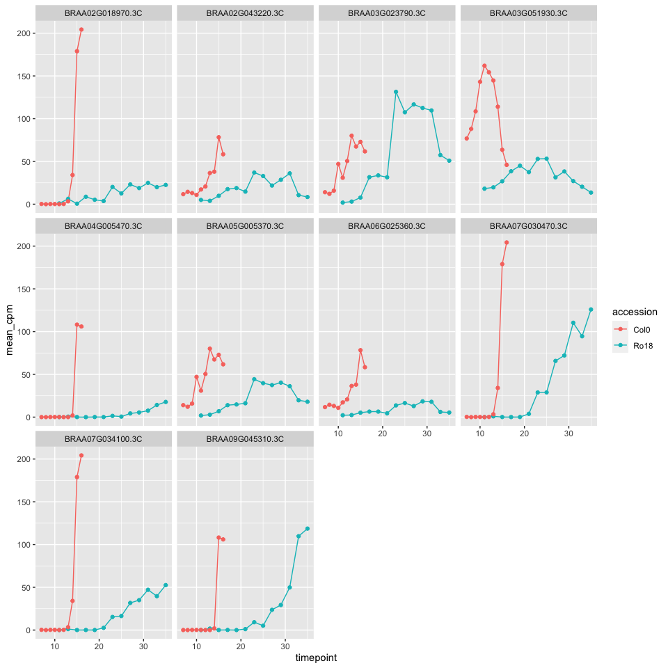
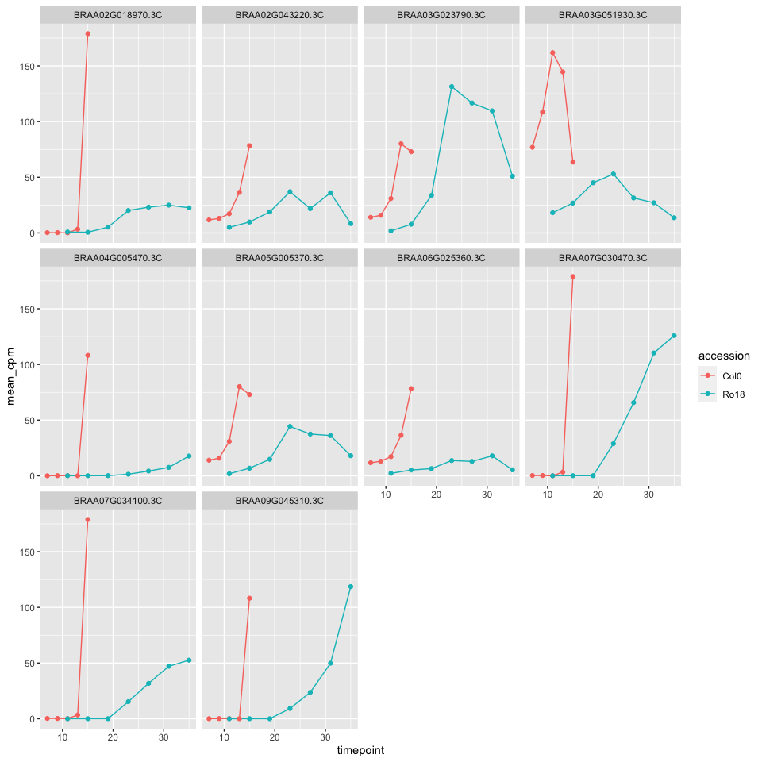
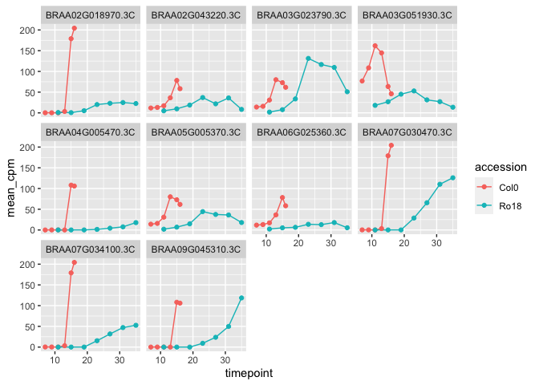

Running registration using real data with missing timepoints
================

-   [Set-up and load libraries](#set-up-and-load-libraries)
-   [Run GREAT main function using subset of Alex’s rapa
    data](#run-great-main-function-using-subset-of-alexs-rapa-data)
    -   [Plot data before registering](#plot-data-before-registering)
    -   [Register data](#register-data)
    -   [Plot data after registration](#plot-data-after-registration)
-   [Slice the data functions](#slice-the-data-functions)
-   [Skip every one timepoint](#skip-every-one-timepoint)
    -   [Plot data before registering](#plot-data-before-registering-1)
    -   [Register data](#register-data-1)
-   [Skip every two timepoints](#skip-every-two-timepoints)
    -   [Plot data before registering](#plot-data-before-registering-2)
    -   [Register data](#register-data-2)

## Set-up and load libraries

``` r
knitr::opts_chunk$set()

devtools::load_all()
```

    ## ℹ Loading GREAT

``` r
library(ggplot2)
library(data.table)
library(cowplot)
library(ggpubr)
```

    ## 
    ## Attaching package: 'ggpubr'

    ## The following object is masked from 'package:cowplot':
    ## 
    ##     get_legend

## Run GREAT main function using subset of Alex’s rapa data

``` r
# Load data obtained from Ruth's refactored function
path_b_rapa <- "~/Downloads/test_data.RDS"

alex_data_mean <- readRDS(path_b_rapa)[[1]]
alex_data_all <- readRDS(path_b_rapa)[[2]]
```

### Plot data before registering

``` r
ggplot() +
  aes(x = timepoint, y = mean_cpm, color = accession) +
  geom_line(data = alex_data_mean) +
  geom_point(data = alex_data_mean) +
  facet_wrap(~locus_name)
```

<!-- -->

### Register data

``` r
test_using_brapa_data <- GREAT::scale_and_register_data(
  alex_data_mean,
  alex_data_all,
  stretches =  c(2, 1.5, 1),
  shift_extreme = 4,
  num_shifts = 27,
  min_num_overlapping_points = 4,
  initial_rescale = FALSE,
  do_rescale = TRUE,
  testing = FALSE,
  accession_data_to_transform = "Col0",
  accession_data_fix = "Ro18",
  data_to_transform_time_added = 11,
  data_fix_time_added = 11
)
```

    ## Max value of mean_cpm of all_data_df :262.275679930721

    ## testing models for stretch factor = 2

    ## [1] "0 / 10"

    ## Normalising expression by mean and sd of compared values...

    ## 0 / 10

    ## Done!

    ## Applying best shift...

    ## Done!

    ## Calculating registration vs different expression comparison AIC & BIC...

    ## finished testing models for stretch factor = 2

    ## testing models for stretch factor = 1.5

    ## [1] "0 / 10"

    ## Normalising expression by mean and sd of compared values...

    ## 0 / 10

    ## Done!

    ## Applying best shift...

    ## Done!

    ## Calculating registration vs different expression comparison AIC & BIC...

    ## finished testing models for stretch factor = 1.5

    ## testing models for stretch factor = 1

    ## [1] "0 / 10"

    ## Normalising expression by mean and sd of compared values...

    ## 0 / 10

    ## Done!

    ## Applying best shift...

    ## Done!

    ## Calculating registration vs different expression comparison AIC & BIC...

    ## finished testing models for stretch factor = 1

    ## [1] "################## Model comparison results #######################"
    ## [1] "AIC finds registration better than separate for :7 / 10"
    ## [1] "BIC finds registration better than separate for :10 / 10"
    ## [1] "AIC & BIC finds registration better than separate for :7 / 10"
    ## [1] "###################################################################"

    ## Normalising expression by mean and sd of compared values...

    ## 0 / 10

    ## Done!

    ## Applying best shift...

    ## Done!

    ## Warning in min(timepoint): no non-missing arguments to min; returning Inf

    ## Max value of mean_cpm :10.3830892221948

    ## 0 / 10

### Plot data after registration

``` r
id_table_path <- system.file("extdata/sample_data/id_table_5genes.RDS", package = "GREAT")

ID_table <- readRDS(id_table_path)

test_mapped <- test_using_brapa_data[['imputed_mean_df']] %>%
  dplyr::left_join(ID_table %>% 
                     dplyr::mutate(CDS.model = toupper(CDS.model)), by = c("locus_name" = "CDS.model")) %>% 
  dplyr::select(-c(locus_name.y)) %>%
  dplyr::rename(locus_name = symbol, bra_gene = locus_name)

data_to_plot <- test_mapped %>% 
  dplyr::filter(dplyr::case_when(locus_name == "AGL24" ~ shifted_time >= 14 & shifted_time <= 35, 
                          locus_name == "AP1" ~  shifted_time >= 11 & shifted_time <= 25,
                          locus_name == "AP3" ~  shifted_time >= 11 & shifted_time <= 30,
                          locus_name == "LFY" ~ shifted_time >= 11 & shifted_time <= 26,
                          locus_name == "SOC1" ~ shifted_time >= 10 & shifted_time <= 31))


# Function to map ara and bra genes
map_bra_with_ara_genes <- function(bra_data, ara_table){
  
  mapped_data <- bra_data %>% 
    dplyr::left_join(ara_table %>% 
                     dplyr::mutate(CDS.model = toupper(CDS.model)), by = c("locus_name" = "CDS.model")) %>% 
  dplyr::select(-c(locus_name.y)) %>%
  dplyr::rename(locus_name = symbol, bra_gene = locus_name)
  
  return(mapped_data)

}

GREAT::plot_registered_GoIs_for_comparible_timepoints(data_to_plot)
```

<!-- -->

## Slice the data functions

``` r
undersample_data_timepoints_skip <- function(data, skip_timepoints_pattern = c(TRUE)) {
  sliced_data <- data %>%
    dplyr::group_by(locus_name, accession) %>%
    dplyr::arrange(timepoint) %>%
    dplyr::slice(seq(1, dplyr::n(), 1)[skip_timepoints_pattern]) %>% 
    dplyr::ungroup()

  return(sliced_data)
}
```

``` r
undersample_data_timepoints_random <- function(data, num_timepoints, keep_first_timepoint = TRUE) {
  if (keep_first_timepoint) {
  sliced_data <- data %>%
    dplyr::group_by(locus_name, accession) %>%
    dplyr::arrange(timepoint) %>%
    dplyr::slice(c(1, sample(seq(2, dplyr::n(), 1), num_timepoints - 1))) %>% 
    dplyr::ungroup() %>% 
    dplyr::arrange(locus_name, accession, timepoint)
  } else {
    sliced_data <- data %>%
    dplyr::group_by(locus_name, accession) %>%
    dplyr::arrange(timepoint) %>%
    dplyr::slice(sample(seq(1, dplyr::n(), 1), num_timepoints)) %>% 
    dplyr::ungroup() %>% 
    dplyr::arrange(locus_name, accession, timepoint)
  }

  return(sliced_data)
}
```

``` r
knitr::include_graphics("figure/uneven_sampled_illustration.png")
```

<!-- -->

``` r
alex_data_mean %>% 
  undersample_data_timepoints_random(num_timepoints = 5)
```

    ## # A tibble: 100 × 5
    ##    locus_name       accession tissue timepoint mean_cpm
    ##    <chr>            <fct>     <fct>      <int>    <dbl>
    ##  1 BRAA02G018970.3C Col0      apex           7   0.270 
    ##  2 BRAA02G018970.3C Col0      apex           8   0     
    ##  3 BRAA02G018970.3C Col0      apex          11   0.0702
    ##  4 BRAA02G018970.3C Col0      apex          12   0.192 
    ##  5 BRAA02G018970.3C Col0      apex          16 204.    
    ##  6 BRAA02G018970.3C Ro18      apex          11   0.851 
    ##  7 BRAA02G018970.3C Ro18      apex          15   0.582 
    ##  8 BRAA02G018970.3C Ro18      apex          25  12.6   
    ##  9 BRAA02G018970.3C Ro18      apex          27  23.1   
    ## 10 BRAA02G018970.3C Ro18      apex          33  19.9   
    ## # … with 90 more rows

## Skip every one timepoint

### Plot data before registering

``` r
skipped_every_one_timepoint_mean <- alex_data_mean %>% 
  undersample_data_timepoints_skip(skip_timepoints_pattern = c(TRUE, FALSE))


skipped_every_one_timepoint_mean %>% 
ggplot() +
  aes(x = timepoint, y = mean_cpm, color = accession) +
  geom_line() +
  geom_point() +
  facet_wrap(~locus_name)
```

<!-- -->

``` r
uniq_skipped_every_one_timepoint <- skipped_every_one_timepoint_mean %>% dplyr::pull(timepoint) %>% unique()

uniq_skipped_every_one_timepoint
```

    ##  [1]  7  9 11 13 15 19 23 27 31 35

``` r
skipped_every_one_timepoint_all <- alex_data_all %>% 
  dplyr::filter(timepoint %in% uniq_skipped_every_one_timepoint)

skipped_every_one_timepoint_all %>% dplyr::pull(timepoint) %>% unique()
```

    ##  [1] 11 31 35 13 15 19 23 27  7  9

### Register data

``` r
reg_data_skipped_every_one_timepoint <- GREAT::scale_and_register_data(
  skipped_every_one_timepoint_mean,
  skipped_every_one_timepoint_all,
  stretches =  c(2, 1.5, 1),
  shift_extreme = 4,
  num_shifts = 27,
  min_num_overlapping_points = 2,
  initial_rescale = FALSE,
  do_rescale = TRUE,
  testing = FALSE,
  accession_data_to_transform = "Col0",
  accession_data_fix = "Ro18",
  data_to_transform_time_added = 11,
  data_fix_time_added = 11
)
```

    ## Error in `:=`(sc.mean_cpm, scale(mean_cpm, scale = TRUE, center = TRUE)): Check that is.data.table(DT) == TRUE. Otherwise, := and `:=`(...) are defined for use in j, once only and in particular ways. See help(":=").

## Skip every two timepoints

### Plot data before registering

``` r
skipped_every_two_timepoint_mean <- alex_data_mean %>% 
  undersample_data_timepoints_skip(skip_timepoints_pattern = c(TRUE, FALSE, FALSE))


skipped_every_two_timepoint_mean %>% 
ggplot() +
  aes(x = timepoint, y = mean_cpm, color = accession) +
  geom_line() +
  geom_point() +
  facet_wrap(~locus_name)
```

<!-- -->

``` r
uniq_skipped_every_two_timepoint_mean <- skipped_every_two_timepoint_mean %>% dplyr::pull(timepoint) %>% unique()

uniq_skipped_every_two_timepoint_mean
```

    ## [1]  7 10 13 16 11 17 23 29 35

``` r
skipped_every_two_timepoint_all <- alex_data_all %>% 
  dplyr::filter(timepoint %in% uniq_skipped_every_two_timepoint_mean)

skipped_every_two_timepoint_all  %>% dplyr::pull(timepoint) %>% unique()
```

    ## [1] 11 29 35 13 17 23  7 10 16

``` r
skipped_every_two_timepoint_all  %>% class()
```

    ## [1] "data.table" "data.frame"

``` r
is.data.table(skipped_every_two_timepoint_all)
```

    ## [1] TRUE

### Register data

``` r
reg_data_skipped_every_one_timepoint <- GREAT::scale_and_register_data(
  skipped_every_two_timepoint_mean,
  skipped_every_two_timepoint_all,
  stretches =  c(2, 1.5, 1),
  shift_extreme = 4,
  num_shifts = 27,
  min_num_overlapping_points = 2,
  initial_rescale = FALSE,
  do_rescale = TRUE,
  testing = FALSE,
  accession_data_to_transform = "Col0",
  accession_data_fix = "Ro18",
  data_to_transform_time_added = 11,
  data_fix_time_added = 11
)
```

    ## Error in `:=`(sc.mean_cpm, scale(mean_cpm, scale = TRUE, center = TRUE)): Check that is.data.table(DT) == TRUE. Otherwise, := and `:=`(...) are defined for use in j, once only and in particular ways. See help(":=").
