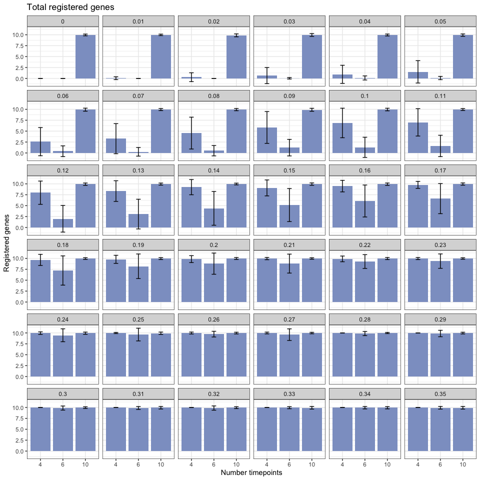
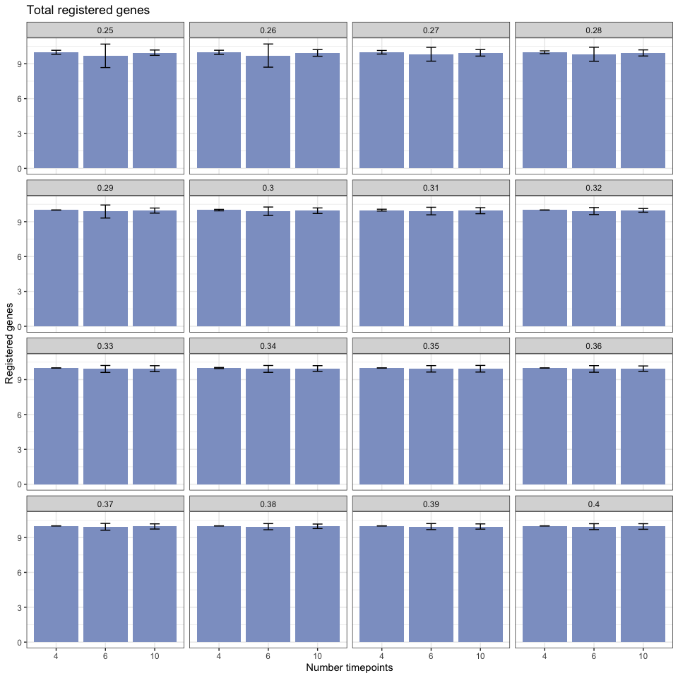
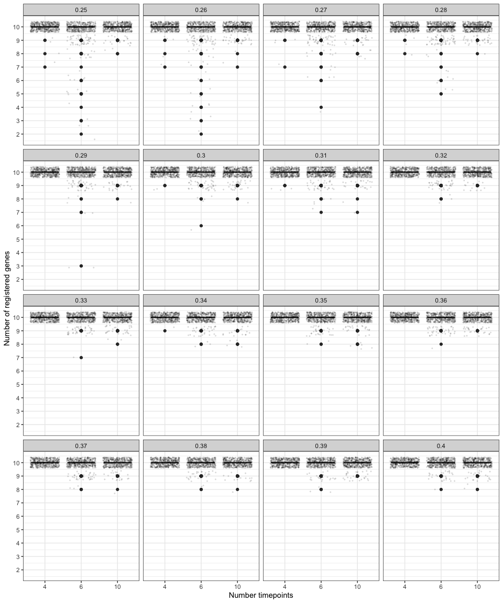
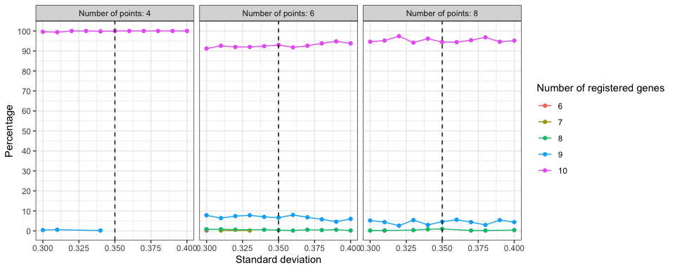

Running registration using simulated data with repetition
================

-   [Set-up and load libraries](#set-up-and-load-libraries)
-   [Function to simulate data](#function-to-simulate-data)
    -   [Test functions](#test-functions)
-   [Running simulations](#running-simulations)
    -   [Analysing data](#analysing-data)
-   [Barplot with standard error of simulated data for
    n=100](#barplot-with-standard-error-of-simulated-data-for-n100)
-   [Barplot with standard error of simulated data for
    n=500](#barplot-with-standard-error-of-simulated-data-for-n500)
-   [Boxplot of simulated data](#boxplot-of-simulated-data)
-   [ANOVA (ANalysis Of VAriance)
    test](#anova-analysis-of-variance-test)

This is a small experiment to test the standard deviation threshold for
the simulated data with different number of timepoints.

## Set-up and load libraries

``` r
knitr::opts_chunk$set()

devtools::load_all()
library(dplyr)
library(data.table)
library(ggplot2)
library(cowplot)
library(ggpubr)
library(viridis)
library(ggridges)

theme_set(theme_bw())
```

``` r
library(future)
future::plan(future::multisession, workers = 15)
```

## Function to simulate data

``` r
#  Function to create data to register
simulate_data_to_reg <- function(gene_name, num_points, replicates = 1, replicate_sd = 1, method = c("theory", "fixed_var")) {
  method <- match.arg(method)

  timepoints_list <- seq(from = 10, by = 3, length.out = num_points)

  simulate_replicates_theory <- function(timepoint, gene_name, replicates, replicate_sd) {
    df <- data.frame(
      locus_name = gene_name,
      accession = "data_to_reg",
      timepoint = timepoint,
      mean_cpm = abs(rnorm(n = 1, sd = 10)) %>%
        purrr::map(
          ~ rnorm(mean = .x, n = replicates, sd = replicate_sd)
        ) %>%
        unlist(),
      group = as.factor(1:replicates)
    )

    return(df)
  }

  simulate_replicates_fixed_var <- function(timepoint, gene_name, replicates, replicate_sd) {
    df <- data.frame(
      locus_name = gene_name,
      accession = "data_to_reg",
      timepoint = timepoint,
      mean_cpm = abs(rnorm(n = 1, sd = 10)) %>%
        `+`(c(-replicate_sd, 0, replicate_sd)) %>%
        sample(replicates),
      group = as.factor(1:replicates)
    )

    return(df)
  }

  if (method == "theory") {
    df <- timepoints_list %>%
      purrr::map(
        ~ simulate_replicates_theory(.x, gene_name, replicates, replicate_sd)
      )
  } else if (method == "fixed_var") {
    if (replicates != 3) {
      stop("Replicates can only by 3 for this method.")
    }

    df <- timepoints_list %>%
      purrr::map(
        ~ simulate_replicates_fixed_var(.x, gene_name, replicates, replicate_sd)
      )
  }

  df <- df %>%
    purrr::reduce(dplyr::bind_rows)

  return(df)
}

# Function to create data fixed
simulate_data_fixed <- function(df_to_reg, time_stretch, time_shift, exp_stretch, exp_shift, num_points, exp_noise_sd) {
  df <- df_to_reg %>%
    dplyr::mutate(
      accession = "data_fixed",
      timepoint = timepoint * time_stretch + time_shift,
      mean_cpm = mean_cpm * exp_stretch + exp_shift + rnorm(n = num_points, sd = exp_noise_sd)
    )

  return(df)
}
```

``` r
undersample_data_timepoints_skip <- function(data, keep_first_last_timepoint = TRUE, skip_timepoints_pattern = c(TRUE), columns_to_group = c("locus_name", "accession")) {
  if (keep_first_last_timepoint) {
    sliced_data <- data %>%
      dplyr::group_by(dplyr::across(columns_to_group)) %>%
      dplyr::arrange(timepoint) %>%
      dplyr::slice(c(1, seq(2, dplyr::n() - 1, 1)[skip_timepoints_pattern], dplyr::n())) %>%
      dplyr::ungroup()
  } else {
    sliced_data <- data %>%
      dplyr::group_by(dplyr::across(columns_to_group)) %>%
      dplyr::arrange(timepoint) %>%
      dplyr::slice(seq(1, dplyr::n(), 1)[skip_timepoints_pattern]) %>%
      dplyr::ungroup()
  }

  return(as.data.table(sliced_data))
}
```

### Test functions

``` r
# Gene name list
list_letter <- LETTERS[seq(from = 1, to = 2)]
list_num <- seq(1, 3, 1)
gene_name <- paste0(list_letter, "_", list_num)

# Simulate registered data
data_to_reg_points <- gene_name %>%
  purrr::map(simulate_data_to_reg, num_points = 25, replicates = 3, replicate_sd = 4, method = "fixed_var") %>%
  purrr::reduce(rbind)
```

``` r
data_to_reg_points %>%
  group_by(locus_name, accession, timepoint) %>%
  summarise(sd = sd(mean_cpm))

data_to_reg_points %>%
  ggplot() +
  aes(x = timepoint, y = mean_cpm, colour = group) +
  geom_point() +
  geom_line() +
  facet_wrap(accession ~ locus_name)
```

``` r
data_fixed <- simulate_data_fixed(
  data_to_reg_points,
  num_points = 25,
  time_stretch = 4,
  time_shift = 5,
  exp_stretch = 4,
  exp_shift = 5,
  exp_noise_sd = 2
)

simulated_data <- rbind(data_to_reg_points, data_fixed) %>%
  dplyr::mutate(
    accession = dplyr::case_when(
      accession == "data_to_reg" ~ "Col0",
      accession == "data_fixed" ~ "Ro18"
    )
  ) %>%
  as.data.table()

simulated_data %>% head()
```

``` r
simulated_data %>%
  ggplot() +
  aes(x = timepoint, y = mean_cpm, colour = group) +
  geom_point() +
  geom_line() +
  facet_wrap(accession ~ locus_name)

simulated_data %>%
  ggplot() +
  aes(x = timepoint, y = mean_cpm, colour = accession) +
  geom_point() +
  geom_line() +
  facet_wrap(group ~ locus_name, scales = "free_y")
```

``` r
# simulated_data_mean <- simulated_data %>%
#   dplyr::group_by(locus_name, accession, timepoint) %>%
#   # dplyr::summarise(mean_cpm = mean(mean_cpm), n = n(), .groups = "drop") %>%
#   dplyr::summarise(mean_cpm = mean(mean_cpm), .groups = "drop") %>%
#   as.data.table()
#
# simulated_data_mean %>% head()
```

## Running simulations

``` r
# Simulation parameters
num_simulation <- 1:500
replicate_sd_list <- seq(0.25, 0.4, length.out = 16)
num_timepoints <- 10

# Simulated gene names
num_genes <- 10
list_letter <- LETTERS[1:2]
list_num <- 1:num_genes
gene_name <- paste0(list_letter, "_", list_num)
```

``` r
results_list <- list()

for (simul in num_simulation) {
  for (rep_sd in replicate_sd_list) {
    data_to_reg_points <- gene_name %>%
      furrr::future_map(simulate_data_to_reg, num_points = num_timepoints, replicates = 3, replicate_sd = rep_sd, method = c("fixed_var")) %>%
      purrr::reduce(rbind)

    data_fixed <- simulate_data_fixed(
      data_to_reg_points,
      num_points = num_timepoints,
      time_stretch = 4,
      time_shift = 5,
      exp_stretch = 6,
      exp_shift = 4,
      exp_noise_sd = 2
    )

    simulated_data <- rbind(data_to_reg_points, data_fixed) %>%
      dplyr::mutate(
        accession = dplyr::case_when(
          accession == "data_to_reg" ~ "Col0",
          accession == "data_fixed" ~ "Ro18"
        )
      ) %>%
      as.data.table()

    simulated_data_mean <- simulated_data %>%
      dplyr::group_by(locus_name, accession, timepoint) %>%
      dplyr::summarise(mean_cpm = mean(mean_cpm), .groups = "drop") %>%
      as.data.table()

    # From the data, skip one timepoint
    skip_1_timepoint_all <- undersample_data_timepoints_skip(simulated_data, keep_first_last_timepoint = TRUE, skip_timepoints_pattern = c(FALSE, TRUE), columns_to_group = c("locus_name", "accession", "group"))
    skip_1_timepoint_mean <- undersample_data_timepoints_skip(simulated_data_mean, keep_first_last_timepoint = TRUE, skip_timepoints_pattern = c(FALSE, TRUE))

    # From the data, skip two timepoint
    skip_2_timepoint_all <- undersample_data_timepoints_skip(simulated_data, keep_first_last_timepoint = TRUE, skip_timepoints_pattern = c(FALSE, FALSE, TRUE), columns_to_group = c("locus_name", "accession", "group"))
    skip_2_timepoint_mean <- undersample_data_timepoints_skip(simulated_data_mean, keep_first_last_timepoint = TRUE, skip_timepoints_pattern = c(FALSE, FALSE, TRUE))

    # Save results
    sim_str <- paste0("sim_", stringr::str_pad(simul, width = 3, pad = "0"))
    rep_sd_str <- stringr::str_pad(rep_sd, width = 2, pad = "0")

    results_list[[paste(sim_str, "data_full_sd", rep_sd_str, sep = "_")]] <- list(
      all_data = simulated_data,
      mean_data = simulated_data_mean,
      sd = rep_sd,
      num_points = simulated_data_mean %>%
        dplyr::filter(accession == simulated_data_mean$accession[1]) %>%
        dplyr::pull(timepoint) %>% unique() %>% length(),
      num_simul = simul
    )

    results_list[[paste(sim_str, "data_skip1_sd", rep_sd_str, sep = "_")]] <- list(
      all_data = skip_1_timepoint_all,
      mean_data = skip_1_timepoint_mean,
      sd = rep_sd,
      num_points = skip_1_timepoint_mean %>%
        dplyr::filter(accession == simulated_data_mean$accession[1]) %>%
        dplyr::pull(timepoint) %>% unique() %>% length(),
      num_simul = simul
    )

    results_list[[paste(sim_str, "data_skip2_sd", rep_sd_str, sep = "_")]] <- list(
      all_data = skip_2_timepoint_all,
      mean_data = skip_2_timepoint_mean,
      sd = rep_sd,
      num_points = skip_2_timepoint_mean %>%
        dplyr::filter(accession == simulated_data_mean$accession[1]) %>%
        dplyr::pull(timepoint) %>% unique() %>% length(),
      num_simul = simul
    )
  }
}
```

``` r
total_sims <- length(num_simulation)
sim_count <- numeric(length = total_sims)

reg_with_full_simulated_data <- results_list %>%
  furrr::future_map(
    function(x) {
      # Check simulation processing progress
      num_simul <- x$num_simul
      if (!(num_simul %in% sim_count)) {
        sim_count[num_simul] <<- num_simul
        message("[", Sys.time(), "] ", "Processing simulation ", num_simul, "/", total_sims, "...")
      }

      # Register data
      if (x$num_points == 10) {
        results <- GREAT::scale_and_register_data(
          x$mean_data %>% dplyr::mutate(tissue = "apex"),
          x$all_data %>% dplyr::mutate(tissue = "apex"),
          stretches =  c(4, 3, 2, 1),
          shift_extreme = 5,
          num_shifts = 21,
          min_num_overlapping_points = 4,
          initial_rescale = FALSE,
          do_rescale = TRUE,
          testing = FALSE,
          accession_data_to_transform = "Col0",
          accession_data_fix = "Ro18",
          data_to_transform_time_added = 40,
          data_fix_time_added = 40
        ) %>%
          suppressMessages()
      } else {
        results <- GREAT::scale_and_register_data(
          x$mean_data %>% dplyr::mutate(tissue = "apex"),
          x$all_data %>% dplyr::mutate(tissue = "apex"),
          stretches =  c(4, 3, 2, 1),
          shift_extreme = 5,
          num_shifts = 21,
          min_num_overlapping_points = 2,
          initial_rescale = FALSE,
          do_rescale = TRUE,
          testing = FALSE,
          accession_data_to_transform = "Col0",
          accession_data_fix = "Ro18",
          data_to_transform_time_added = 40,
          data_fix_time_added = 40
        ) %>%
          suppressMessages()
      }

      results[["simul"]] <- x$num_simul
      results[["sd"]] <- x$sd
      results[["num_points"]] <- x$num_points

      return(results)
    }
  )
```

### Analysing data

``` r
table <- reg_with_full_simulated_data %>%
  purrr::map(
    ~ data.frame(
      num_simul = .x$simul,
      SD = .x$sd,
      num_timepoints = .x$num_points,
      `registered_genes_total10` = .x$model_comparison_dt %>%
        dplyr::filter(BIC_registered_is_better == TRUE) %>%
        dplyr::nrow()
    )
  ) %>%
  purrr::reduce(dplyr::bind_rows) %>%
  dplyr::mutate(
    num_timepoints = as.factor(num_timepoints),
    SD = as.factor(SD)
  )


table_100simul <- reg_with_full_simulated_data_100_simulation %>%
  purrr::map(
    ~ data.frame(
      num_simul = .x$simul,
      SD = .x$sd,
      num_timepoints = .x$num_points,
      `registered_genes_total10` = .x$model_comparison_dt %>%
        dplyr::filter(BIC_registered_is_better == TRUE) %>%
        nrow()
    )
  ) %>%
  purrr::reduce(dplyr::bind_rows) %>%
  dplyr::mutate(
    num_timepoints = as.factor(num_timepoints),
    SD = as.factor(SD)
  )
```

``` r
get_bar_plot <- function(data) {
  plot <- data %>%
    dplyr::group_by(SD, num_timepoints) %>%
    dplyr::summarise(
      dplyr::across(
        .cols = registered_genes_total10,
        list(mean = mean, sd = sd)
      ),
      .groups = "drop"
    ) %>%
    dplyr::rename(mean_length = registered_genes_total10_mean, sd_length = registered_genes_total10_sd) %>%
    # Plot
    ggplot() +
    aes(y = mean_length, x = as.factor(num_timepoints)) +
    geom_bar(
      stat = "identity",
      fill = "#8da0cb",
      position = position_dodge()
    ) +
    geom_errorbar(
      aes(
        ymin = mean_length - sd_length,
        ymax = mean_length + sd_length
      ),
      width = .2,
      position = position_dodge(.9)
    ) +
    labs(
      x = "Number timepoints",
      y = "Registered genes",
      title = "Total registered genes"
    ) +
    facet_wrap(~SD)

  return(plot)
}
```

## Barplot with standard error of simulated data for n=100

``` r
table_100simul %>%
  get_bar_plot()
```

<!-- -->

## Barplot with standard error of simulated data for n=500

``` r
table %>%
  get_bar_plot()
```

<!-- -->

## Boxplot of simulated data

``` r
table %>%
  ggplot(aes(y = registered_genes_total10, x = num_timepoints, fill = num_timepoints)) +
  geom_boxplot() +
  scale_fill_viridis(discrete = TRUE, alpha = 0.6) +
  geom_jitter(color = "black", size = 0.4, alpha = 0.1) +
  theme(
    legend.position = "none",
    plot.title = element_text(size = 11)
  ) +
  scale_y_continuous(breaks = seq(1, 10, by = 1)) +
  labs(x = "Number timepoints", y = "Number of registered genes") +
  facet_wrap(~SD, ncol = 4)
```

<!-- -->

``` r
table %>%
  dplyr::mutate(
    registered_genes_total10 = as.factor(registered_genes_total10),
    SD = as.numeric(as.character(SD))
  ) %>%
  dplyr::filter(
    SD >= 0.3,
    SD <= 0.4
  ) %>%
  dplyr::group_by(SD, num_timepoints, registered_genes_total10) %>%
  dplyr::summarise(
    count = n(),
    percentage = n() / 500 * 100,
    .groups = "drop"
  ) %>%
  ggplot() +
  aes(x = SD, y = percentage, group = registered_genes_total10, color = registered_genes_total10) +
  geom_point() +
  geom_line() +
  geom_vline(xintercept = 0.35, linetype = "dashed") +
  scale_y_continuous(breaks = seq(0, 100, by = 10)) +
  labs(
    x = "Standard deviation",
    y = "Percentage",
    color = "Number of registered genes"
  ) +
  facet_wrap(
    ~num_timepoints,
    labeller = labeller(
      num_timepoints =
        c(
          "4" = "Number of points: 4",
          "6" = "Number of points: 6",
          "10" = "Number of points: 8"
        )
    )
  )
```

<!-- -->

## ANOVA (ANalysis Of VAriance) test

-   Null hypothesis (*H*<sub>0</sub>):
    *μ*<sub>*σ*<sub>*i*</sub>, ∀*n*</sub> = *μ*<sub>*σ*<sub>*i*</sub>, *n* = 6</sub> = … = *μ*<sub>*σ*<sub>*i*</sub>, *n* = 4</sub>.

That is, for *σ*<sub>*i*</sub> all groups with different time points
(*n*) have same mean of number registered genes.

-   Alternative hypothesis (*H*<sub>1</sub>): not all samples have the
    same mean of number registered genes.

The null hypothesis is tested by comparing variances.

``` r
aov_results <- aov(
  formula = registered_genes_total10 ~ num_timepoints,
  data = table %>%
    dplyr::filter(
      SD == 0.35
    )
)
```

``` r
summary(aov_results)
```

    ##                  Df Sum Sq Mean Sq F value   Pr(>F)    
    ## num_timepoints    2   1.65  0.8247   15.61 1.95e-07 ***
    ## Residuals      1497  79.08  0.0528                     
    ## ---
    ## Signif. codes:  0 '***' 0.001 '**' 0.01 '*' 0.05 '.' 0.1 ' ' 1

The p-value is far below 0.05, so the null is rejected, and it can be
concluded there are differences between number of registered genes
between different time point groups with SD = 0.35.

``` r
TukeyHSD(aov_results)
```

    ##   Tukey multiple comparisons of means
    ##     95% family-wise confidence level
    ## 
    ## Fit: aov(formula = registered_genes_total10 ~ num_timepoints, data = table %>% dplyr::filter(SD == 0.35))
    ## 
    ## $num_timepoints
    ##        diff         lwr         upr     p adj
    ## 6-4  -0.074 -0.10810347 -0.03989653 0.0000012
    ## 10-4 -0.066 -0.10010347 -0.03189653 0.0000181
    ## 10-6  0.008 -0.02610347  0.04210347 0.8463227
