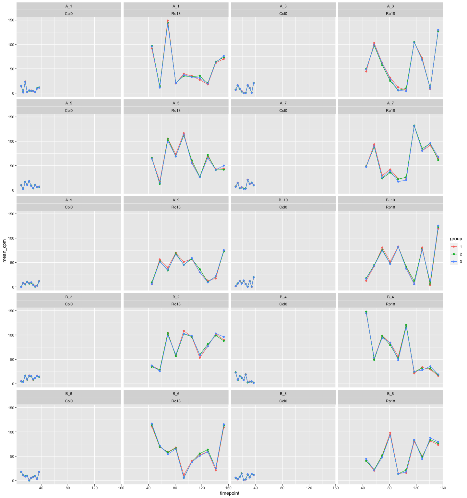

-   [Running registration using simulated data with
    repetition](#running-registration-using-simulated-data-with-repetition)
    -   [Set-up and load libraries](#set-up-and-load-libraries)
    -   [Function to simulate data](#function-to-simulate-data)
        -   [Test functions](#test-functions)
    -   [Running simulations](#running-simulations)

# Running registration using simulated data with repetition

This is a small experiment to test the standard deviation threshold for
the simulated data with different number of timepoints.

## Set-up and load libraries

``` r
knitr::opts_chunk$set()

devtools::load_all()
```

    ## ℹ Loading GREAT

``` r
library(ggplot2)
library(data.table)
library(cowplot)
library(ggpubr)
```

    ## 
    ## Attaching package: 'ggpubr'

    ## The following object is masked from 'package:cowplot':
    ## 
    ##     get_legend

``` r
library(dplyr)
```

    ## 
    ## Attaching package: 'dplyr'

    ## The following objects are masked from 'package:data.table':
    ## 
    ##     between, first, last

    ## The following objects are masked from 'package:GREAT':
    ## 
    ##     between, first, last

    ## The following object is masked from 'package:testthat':
    ## 
    ##     matches

    ## The following objects are masked from 'package:stats':
    ## 
    ##     filter, lag

    ## The following objects are masked from 'package:base':
    ## 
    ##     intersect, setdiff, setequal, union

## Function to simulate data

``` r
#  Function to create data to register
simulate_data_to_reg <- function(gene_name, num_points, replicates = 1, replicate_sd = 1, method = c("theory", "fixed_var")) {
  method <- match.arg(method)

  timepoints_list <- seq(from = 10, by = 3, length.out = num_points)

  simulate_replicates_theory <- function(timepoint, gene_name, replicates, replicate_sd) {
    df <- data.frame(
      locus_name = gene_name,
      accession = "data_to_reg",
      timepoint = timepoint,
      mean_cpm = abs(rnorm(n = 1, sd = 10)) %>%
        purrr::map(
          ~ rnorm(mean = .x, n = replicates, sd = replicate_sd)
        ) %>%
        unlist(),
      group = as.factor(1:replicates)
    )

    return(df)
  }
  
  simulate_replicates_fixed_var <- function(timepoint, gene_name, replicates, replicate_sd) {
    df <- data.frame(
      locus_name = gene_name,
      accession = "data_to_reg",
      timepoint = timepoint,
      mean_cpm = abs(rnorm(n = 1, sd = 10)) %>%
        `+`(c(-replicate_sd, 0, replicate_sd)) %>% 
        sample(replicates),
      group = as.factor(1:replicates)
    )

    return(df)
  }

  if (method == "theory") {
    df <- timepoints_list %>%
      purrr::map(
        ~ simulate_replicates_theory(.x, gene_name, replicates, replicate_sd)
      )
  } else if (method == "fixed_var") {
    if (replicates != 3) {
      stop("Replicates can only by 3 for this method.")
    }
    
    df <- timepoints_list %>%
      purrr::map(
        ~ simulate_replicates_fixed_var(.x, gene_name, replicates, replicate_sd)
      )
  }

  df <- df %>%
    purrr::reduce(dplyr::bind_rows)

  return(df)
}

# Function to create data fixed
simulate_data_fixed <- function(df_to_reg, 
                                time_stretch,
                                time_shift,
                                exp_stretch, 
                                exp_shift, 
                                num_points, 
                                exp_noise_sd) {
  
  df <- df_to_reg %>% 
    dplyr::mutate(
      accession = "data_fixed",
      timepoint = timepoint * time_stretch + time_shift,
      mean_cpm = mean_cpm * exp_stretch + exp_shift + rnorm(n = num_points, sd = exp_noise_sd)
    )
  
  return(df)
}
```

``` r
undersample_data_timepoints_skip <- function(data, keep_first_last_timepoint = TRUE, skip_timepoints_pattern = c(TRUE), columns_to_group = c("locus_name", "accession")) {
  if (keep_first_last_timepoint) {
  sliced_data <- data %>%
    dplyr::group_by(dplyr::across(columns_to_group)) %>%
    dplyr::arrange(timepoint) %>%
    dplyr::slice(c(1, seq(2, dplyr::n() - 1, 1)[skip_timepoints_pattern], dplyr::n())) %>% 
    dplyr::ungroup()
  } else
  sliced_data <- data %>%
    dplyr::group_by(dplyr::across(columns_to_group)) %>%
    dplyr::arrange(timepoint) %>%
    dplyr::slice(seq(1, dplyr::n(), 1)[skip_timepoints_pattern]) %>% 
    dplyr::ungroup()

  return(as.data.table(sliced_data))
}
```

### Test functions

``` r
# Gene name list
list_letter <- LETTERS[seq(from = 1, to = 2)]
list_num <- seq(1, 3, 1)
gene_name <- paste0(list_letter, "_", list_num)

# Simulate registered data
data_to_reg_points <- gene_name %>%
    purrr::map(simulate_data_to_reg, num_points = 25, replicates = 3, replicate_sd = 4, method = "fixed_var") %>%
    purrr::reduce(rbind)
```

``` r
data_to_reg_points %>% 
  group_by(locus_name, accession, timepoint) %>% 
  summarise(sd = sd(mean_cpm))

data_to_reg_points %>% 
  ggplot() +
  aes(x = timepoint, y = mean_cpm, colour = group) +
  geom_point() +
  geom_line() +
  facet_wrap(accession ~ locus_name)
```

``` r
data_fixed <- simulate_data_fixed(
  data_to_reg_points,
  num_points = 25,
  time_stretch = 4,
  time_shift = 5,
  exp_stretch = 4,
  exp_shift = 5,
  exp_noise_sd = 2
)

simulated_data <- rbind(data_to_reg_points, data_fixed) %>%
  dplyr::mutate(
    accession = dplyr::case_when(
      accession == "data_to_reg" ~ "Col0",
      accession == "data_fixed" ~ "Ro18"
    )
  ) %>%
  as.data.table()

simulated_data %>% head()
```

``` r
simulated_data %>%
  ggplot() +
  aes(x = timepoint, y = mean_cpm, colour = group) +
  geom_point() +
  geom_line() +
  facet_wrap(accession ~ locus_name)

simulated_data %>%
  ggplot() +
  aes(x = timepoint, y = mean_cpm, colour = accession) +
  geom_point() +
  geom_line() +
  facet_wrap(group ~ locus_name, scales = "free_y")
```

``` r
# simulated_data_mean <- simulated_data %>% 
#   dplyr::group_by(locus_name, accession, timepoint) %>% 
#   # dplyr::summarise(mean_cpm = mean(mean_cpm), n = n(), .groups = "drop") %>% 
#   dplyr::summarise(mean_cpm = mean(mean_cpm), .groups = "drop") %>% 
#   as.data.table()
# 
# simulated_data_mean %>% head()
```

## Running simulations

``` r
# Define parameters
list_letter <- LETTERS[seq(from = 1, to = 2)]
list_num <- seq(1, 10, 1)
gene_name <- paste0(list_letter, "_", list_num)

replicate_sd_list <- seq(0, 0.30, length.out = 31)
# replicate_sd_list <- c(0, 0.05)
num_timepoints <- 10

results_list <- list()

for (rep_sd in replicate_sd_list) {
  data_to_reg_points <- gene_name %>%
    purrr::map(simulate_data_to_reg, num_points = num_timepoints, replicates = 3, replicate_sd = rep_sd, method = c("fixed_var")) %>%
    purrr::reduce(rbind)

  data_fixed <- simulate_data_fixed(
    data_to_reg_points,
    num_points = num_timepoints,
    time_stretch = 4,
    time_shift = 5,
    exp_stretch = 6,
    exp_shift = 4,
    exp_noise_sd = 2
  )

  simulated_data <- rbind(data_to_reg_points, data_fixed) %>%
    dplyr::mutate(
      accession = dplyr::case_when(
        accession == "data_to_reg" ~ "Col0",
        accession == "data_fixed" ~ "Ro18"
      )
    ) %>%
    as.data.table()

  simulated_data_mean <- simulated_data %>%
    dplyr::group_by(locus_name, accession, timepoint) %>%
    dplyr::summarise(mean_cpm = mean(mean_cpm), .groups = "drop") %>%
    as.data.table()
  
  # From the data, skip one timepoint
  skip_1_timepoint_all <- undersample_data_timepoints_skip(simulated_data, keep_first_last_timepoint = TRUE, skip_timepoints_pattern = c(FALSE, TRUE), columns_to_group = c("locus_name", "accession", "group"))
  skip_1_timepoint_mean <- undersample_data_timepoints_skip(simulated_data_mean, keep_first_last_timepoint = TRUE, skip_timepoints_pattern = c(FALSE, TRUE))

  # From the data, skip two timepoint
  skip_2_timepoint_all <- undersample_data_timepoints_skip(simulated_data, keep_first_last_timepoint = TRUE, skip_timepoints_pattern = c(FALSE, FALSE, TRUE), columns_to_group = c("locus_name", "accession", "group"))
  skip_2_timepoint_mean <- undersample_data_timepoints_skip(simulated_data_mean, keep_first_last_timepoint = TRUE, skip_timepoints_pattern = c(FALSE, FALSE, TRUE))
  
  results_list[[paste0("data_sd_", stringr::str_pad(rep_sd, width = 2, pad = "0"))]] <- list(
    all_data = simulated_data,
    mean_data = simulated_data_mean,
    sd = rep_sd, 
    num_points = simulated_data_mean %>% 
      dplyr::filter(accession == simulated_data_mean$accession[1]) %>% 
      dplyr::pull(timepoint) %>% unique() %>% length()
  )
  
  results_list[[paste0("data_sd_skip1_", stringr::str_pad(rep_sd, width = 2, pad = "0"))]] <- list(
    all_data = skip_1_timepoint_all,
    mean_data = skip_1_timepoint_mean,
    sd = rep_sd, 
    num_points = skip_1_timepoint_mean %>% 
      dplyr::filter(accession == simulated_data_mean$accession[1]) %>% 
      dplyr::pull(timepoint) %>% unique() %>% length()
  )
  
  results_list[[paste0("data_sd_skip2_", stringr::str_pad(rep_sd, width = 2, pad = "0"))]] <- list(
    all_data = skip_2_timepoint_all,
    mean_data = skip_2_timepoint_mean,
    sd = rep_sd, 
    num_points = skip_2_timepoint_mean %>% 
      dplyr::filter(accession == simulated_data_mean$accession[1]) %>% 
      dplyr::pull(timepoint) %>% unique() %>% length()
  )
  
}


reg_with_full_simulated_data <- results_list %>%
  purrr::map(
    function(x) {
      if (x$num_points == 10){
      results <- GREAT::scale_and_register_data(
        x$mean_data %>% dplyr::mutate(tissue = "apex"),
        x$all_data %>% dplyr::mutate(tissue = "apex"),
        stretches =  c(4, 3, 2, 1),
        shift_extreme = 5,
        num_shifts = 21,
        min_num_overlapping_points = 4,
        initial_rescale = FALSE,
        do_rescale = TRUE,
        testing = FALSE,
        accession_data_to_transform = "Col0",
        accession_data_fix = "Ro18",
        data_to_transform_time_added = 40,
        data_fix_time_added = 40
      )
      } else 
        results <- GREAT::scale_and_register_data(
        x$mean_data %>% dplyr::mutate(tissue = "apex"),
        x$all_data %>% dplyr::mutate(tissue = "apex"),
        stretches =  c(4, 3, 2, 1),
        shift_extreme = 5,
        num_shifts = 21,
        min_num_overlapping_points = 2,
        initial_rescale = FALSE,
        do_rescale = TRUE,
        testing = FALSE,
        accession_data_to_transform = "Col0",
        accession_data_fix = "Ro18",
        data_to_transform_time_added = 40,
        data_fix_time_added = 40
        )
      
      results[["sd"]] <- x$sd
      results[["num_points"]] <- x$num_points
      
      return(results)
    }
  )
```

``` r
table <- reg_with_full_simulated_data %>% 
  purrr::map(
    ~ data.frame(
      SD = .x$sd,
      num_timepoints = .x$num_points,
      `registered_genes_total10` = .x$model_comparison_dt %>% 
  dplyr::filter(BIC_registered_is_better == TRUE) %>% 
    nrow()
    )
  ) %>% 
    purrr::reduce(dplyr::bind_rows)


# Not all time points are registered 
table %>% 
  dplyr::group_by(SD) %>% 
  dplyr::filter(
    sum(ifelse(`registered_genes_total10` == 10, 1, 0)) < dplyr::n()
  ) %>% 
  knitr::kable()
```

|   SD | num_timepoints | registered_genes_total10 |
|-----:|---------------:|-------------------------:|
| 0.00 |             10 |                       10 |
| 0.00 |              6 |                        0 |
| 0.00 |              4 |                        0 |
| 0.01 |             10 |                       10 |
| 0.01 |              6 |                        0 |
| 0.01 |              4 |                        0 |
| 0.02 |             10 |                       10 |
| 0.02 |              6 |                        0 |
| 0.02 |              4 |                        0 |
| 0.03 |             10 |                       10 |
| 0.03 |              6 |                        0 |
| 0.03 |              4 |                        0 |
| 0.04 |             10 |                       10 |
| 0.04 |              6 |                        2 |
| 0.04 |              4 |                        4 |
| 0.05 |             10 |                       10 |
| 0.05 |              6 |                        0 |
| 0.05 |              4 |                        5 |
| 0.06 |             10 |                       10 |
| 0.06 |              6 |                        0 |
| 0.06 |              4 |                        2 |
| 0.07 |             10 |                       10 |
| 0.07 |              6 |                        0 |
| 0.07 |              4 |                        5 |
| 0.08 |             10 |                        9 |
| 0.08 |              6 |                        1 |
| 0.08 |              4 |                        2 |
| 0.09 |             10 |                        9 |
| 0.09 |              6 |                        1 |
| 0.09 |              4 |                       10 |
| 0.10 |             10 |                       10 |
| 0.10 |              6 |                        0 |
| 0.10 |              4 |                        0 |
| 0.11 |             10 |                       10 |
| 0.11 |              6 |                        0 |
| 0.11 |              4 |                        0 |
| 0.12 |             10 |                       10 |
| 0.12 |              6 |                        3 |
| 0.12 |              4 |                        8 |
| 0.13 |             10 |                       10 |
| 0.13 |              6 |                        9 |
| 0.13 |              4 |                       10 |
| 0.14 |             10 |                       10 |
| 0.14 |              6 |                        8 |
| 0.14 |              4 |                       10 |
| 0.15 |             10 |                       10 |
| 0.15 |              6 |                        5 |
| 0.15 |              4 |                        5 |
| 0.16 |             10 |                       10 |
| 0.16 |              6 |                        1 |
| 0.16 |              4 |                        9 |
| 0.17 |             10 |                        9 |
| 0.17 |              6 |                        0 |
| 0.17 |              4 |                        6 |
| 0.20 |             10 |                       10 |
| 0.20 |              6 |                        8 |
| 0.20 |              4 |                        9 |
| 0.24 |             10 |                        9 |
| 0.24 |              6 |                       10 |
| 0.24 |              4 |                       10 |
| 0.27 |             10 |                        9 |
| 0.27 |              6 |                       10 |
| 0.27 |              4 |                       10 |
| 0.28 |             10 |                       10 |
| 0.28 |              6 |                        7 |
| 0.28 |              4 |                       10 |

``` r
# All timepoints are registered
table %>% 
  dplyr::group_by(SD) %>% 
  dplyr::filter(
    sum(ifelse(`registered_genes_total10` == 10, 1, 0)) == dplyr::n()
  ) %>% 
  knitr::kable()
```

|   SD | num_timepoints | registered_genes_total10 |
|-----:|---------------:|-------------------------:|
| 0.18 |             10 |                       10 |
| 0.18 |              6 |                       10 |
| 0.18 |              4 |                       10 |
| 0.19 |             10 |                       10 |
| 0.19 |              6 |                       10 |
| 0.19 |              4 |                       10 |
| 0.21 |             10 |                       10 |
| 0.21 |              6 |                       10 |
| 0.21 |              4 |                       10 |
| 0.22 |             10 |                       10 |
| 0.22 |              6 |                       10 |
| 0.22 |              4 |                       10 |
| 0.23 |             10 |                       10 |
| 0.23 |              6 |                       10 |
| 0.23 |              4 |                       10 |
| 0.25 |             10 |                       10 |
| 0.25 |              6 |                       10 |
| 0.25 |              4 |                       10 |
| 0.26 |             10 |                       10 |
| 0.26 |              6 |                       10 |
| 0.26 |              4 |                       10 |
| 0.29 |             10 |                       10 |
| 0.29 |              6 |                       10 |
| 0.29 |              4 |                       10 |
| 0.30 |             10 |                       10 |
| 0.30 |              6 |                       10 |
| 0.30 |              4 |                       10 |

``` r
results_list$data_sd_0.3$all_data %>% 
  ggplot() +
  aes(x = timepoint, y = mean_cpm, colour = group) +
  geom_point() +
  geom_line() +
  facet_wrap(locus_name ~ accession, ncol = 4)
```

<!-- -->
