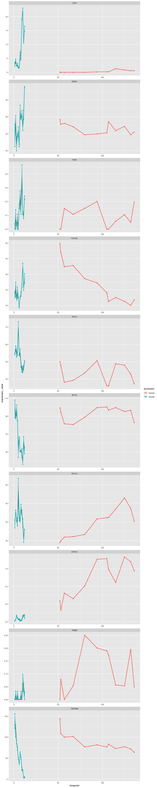
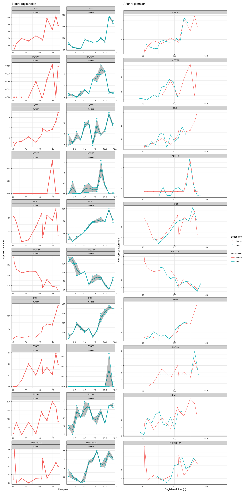

Using GREAT to align human and mouse fetal retina transcriptomic data
================

-   [Introduction](#introduction)
-   [Understand the data](#understand-the-data)
    -   [Taking the first 10 same gene between mouse and human retinal
        data](#taking-the-first-10-same-gene-between-mouse-and-human-retinal-data)
    -   [Combine both data and plot](#combine-both-data-and-plot)
-   [Register data](#register-data)
    -   [Get the summary results](#get-the-summary-results)
    -   [Plot data](#plot-data)
    -   [Plot registered genes](#plot-registered-genes)

## Introduction

Using the human and mouse transcriptomic data from [Hoshino et.
al](https://www.sciencedirect.com/science/article/pii/S1534580717308730#!)
to test GREAT package.

## Understand the data

``` r
human_data <- data.table::fread("~/PhD/main_phd/genalignR_development/data_hoshino_et_al_2017_human_retina/GSE104827_Normalized_Gene_CPM.txt")

# Total number of genes
human_data %>% 
  dplyr::pull(Gene_name) %>% 
  unique() %>% 
  length()
```

    ## [1] 58726

``` r
mouse_data <- data.table::fread("~/PhD/main_phd/genalignR_development/data_hoshino_et_al_2017_human_retina/GSE101986_Gene_Normalized-CPM.txt") %>% 
  mutate(Gene_name = toupper(external_gene_name))

# Total number of genes
mouse_data %>% 
  dplyr::pull(Gene_name) %>% 
  unique() %>% 
  length()
```

    ## [1] 45318

### Taking the first 10 same gene between mouse and human retinal data

``` r
# Randomly select genes
list_gene <- intersect(human_data$Gene_name, mouse_data$Gene_name) %>% head(400) 

key_genes <- c("PROX1", "TFAP2A", "ONECUT2", "GAD1", "ELAVL4", "PARVA", "GAD2", "CALB2", "CALB1", "ONECUT1", "CHAT")
photoreceptor_genes <- c("OTX2", "RCVRN", "AIPL1", "NRL", "CRX", "PDE6B", "NR2E3", "ROM1", "GNGT2", "GNAT1", "PDE6H", "CNGB1", "OPN1SW", 
                         "GUCA1A", "GNAT2", "CNGA1", "RHO", "OPN1MW")
```

#### Tidying up mouse-data

``` r
# Wanted dev stage
mouse_dev_stage <- c("E11", "E12", "E14", "E16", "P0", "P2", "P4", "P6", "P10", "P14", "P21", "P28")

# Dictionary dev stage to time points
mouse_dic_replace <- c(
  "^E11$" = "1",
  "^E12$" = "2",
  "^E14$" = "3",
  "^E16$" = "4",
  "^P0$" =  "5",
  "^P2$" =  "6",
  "^P4$" =  "7",
  "^P6$" =  "8",
  "^P10$" = "9",
  "^P14$" = "10",
  "^P21$" = "11",
  "^P28$" = "12"
)

# Select only Gene_name and expression_value, change the data frame format
mouse_data <- mouse_data %>% filter(Gene_name %in% list_gene) %>%
# mouse_data <- mouse_data %>% filter(Gene_name %in% photoreceptor_genes) %>% 
  select(-c("V1", "chromosome_name", "strand", 
            "start_position", "end_position", "external_gene_name", 
            "description", "transcript_count", "gene_biotype", 
            "source", "status")) %>% 
  select(c("Gene_name", everything())) %>% 
  tidyr::pivot_longer(!Gene_name, names_to = "dev_stage", values_to = "exp_value") %>% 
  tidyr::separate(
    col = dev_stage,
    into = c("dev_stage", "replicate"),
    sep = "\\."
  ) 

# Select relevant developmental stage to compare, change dev_stage to numerical timepoints
mouse_filtered_stages <- mouse_data %>%
  # group_by(Gene_name, dev_stage, .drop = TRUE) %>%
  # summarise(mean = mean(exp_value)) %>%
  rename(expression_value = exp_value) %>%
  filter(dev_stage %in% mouse_dev_stage) 


mouse_final <- mouse_filtered_stages %>%
  rowwise() %>%
  rename(locus_name = Gene_name) %>% 
  mutate(
    accession = "mouse",
    tissue = "retina", 
    timepoint = as.numeric(stringr::str_replace_all(
      string = dev_stage,
      pattern = mouse_dic_replace
    ))
  ) %>% 
  select(-c(dev_stage))
```

#### Tidying up human-data

``` r
human_dev_stage <- c("D52.54", "D53", "D57", "D67", "D80", "D94", "D105", "D107", "D115", "D125", "D132", "D136")

# Select only Gene_name and expression_value, change the data frame format
human_data <- human_data %>% 
  filter(Gene_name %in% list_gene) %>%
  # filter(Gene_name %in% photoreceptor_genes) %>%
  select(-c("V1", "Chr", "Strand", "Start", 
            "End", "Description", "TransCount", 
            "Gene_type", "Source", "Status", "D94.2")) %>% 
  tidyr::pivot_longer(!Gene_name, 
                      names_to = "dev_stage", 
                      values_to = "expression_value")

# https://stackoverflow.com/questions/41191653/how-do-you-extract-values-between-two-characters-in-r
human_final <- human_data %>% 
  dplyr::filter(dev_stage %in% human_dev_stage) %>% 
  dplyr::rename(locus_name = Gene_name) %>% 
  dplyr::mutate(accession = "human", 
                replicate = 1, 
                tissue = "retina", 
                timepoint = as.numeric(stringr::str_extract(dev_stage, "(?<=D)[^.]+"))) %>% 
  dplyr::select(-c(dev_stage))
```

### Combine both data and plot

``` r
all_data <- human_final%>% 
  rbind(mouse_final) %>% 
  dplyr::rename(group = replicate)

all_data %>%
  dplyr::filter(locus_name %in% head(list_gene, 10)) %>% 
  ggplot2::ggplot() +
  ggplot2::aes(y = expression_value, x = timepoint, group = accession, color = accession) +
  ggplot2::stat_summary(fun = mean, geom = "line", size = 1) +
  ggplot2::stat_summary(
        fun.data = ggplot2::mean_se,
        fun.args = list(mult = 1),
        geom = "ribbon",
        color = NA,
        alpha = 0.3
      ) +
  ggplot2::geom_point() +
  ggplot2::geom_line() +
  ggplot2::facet_wrap(~locus_name, scales = "free", ncol = 1)
```

<!-- -->

## Register data

Before registering data, we can use function get_approximate_stretch()
to help us finding the approximation of strect factor.

``` r
# Find approximation of strect factor
GREAT::get_approximate_stretch(all_data, accession_data_to_transform = "mouse", accession_data_ref = "human")
```

    ## [1] 7.636364

``` r
# Register gene
registration_results <- scale_and_register_data(
  input_df = all_data,
  stretches = c(9, 8.5, 8, 7.5, 7, 6),
  shift_extreme = 25,
  num_shifts = 51,
  min_num_overlapping_points = 4,
  initial_rescale = TRUE,
  do_rescale = TRUE,
  accession_data_to_transform = "mouse",
  accession_data_ref = "human",
  start_timepoint = "reference", 
  expression_value_threshold = NULL
)

saveRDS(registration_results, file = "registration_results_human_fetal_retina.rds")
```

### Get the summary results

Using function summary_model_comparison() we can get the df summary of
registration results, also the list of gene that are or are not
registered.

``` r
summary_result <- GREAT::summary_model_comparison(registration_results[["model_comparison_dt"]]) 

summary_result$df_summary %>% 
  knitr::kable()
```

| Result               | Value                |
|:---------------------|:---------------------|
| Total genes          | 391                  |
| Registered genes     | 146                  |
| Non-registered genes | 245                  |
| Stretch              | 6, 7, 7.5, 8, 8.5, 9 |
| Shift                | \[-25, 25\]          |

### Plot data

First, we can get the first 20 successfully registered genes:

``` r
subset_registered_genes <- summary_result$registered_genes %>% tail(10)
subset_nonregistered_genes <- summary_result$non_registered_genes %>% tail(10)

subset_registered_genes
```

    ##  [1] "LAS1L"     "MEOX1"     "MVP"       "MYH13"     "NUB1"      "PIK3C2A"  
    ##  [7] "PKD1"      "PRSS3"     "SNX11"     "TNFRSF12A"

### Plot registered genes

``` r
subset_registered_results <- registration_results[["imputed_mean_df"]] %>% 
                                   dplyr::filter(locus_name %in% subset_registered_genes)

plot_before <- all_data %>%
  dplyr::filter(locus_name %in% subset_registered_genes) %>% 
  ggplot2::ggplot() +
  ggplot2::aes(y = expression_value, x = timepoint, group = accession, color = accession) +
  ggplot2::stat_summary(fun = mean, geom = "line", size = 1) +
  ggplot2::stat_summary(
        fun.data = ggplot2::mean_se,
        fun.args = list(mult = 1),
        geom = "ribbon",
        color = NA,
        alpha = 0.3
      ) +
  ggplot2::geom_point() +
  ggplot2::geom_line() +
  ggplot2::facet_wrap(locus_name ~ accession, scales = "free", ncol = 2) +
  ggplot2::theme(legend.position="none") +
  ggplot2::theme_bw() +
  ggplot2::ggtitle("Before registration")
  
plot_after <- plot_registered_gene_of_interest(subset_registered_results, ncol = 1) +
  ggplot2::ggtitle("After registration")

list(plot_before, plot_after) %>% 
  patchwork::wrap_plots(guides = "collect")
```

<!-- -->

``` r
subset_non_registered_results <- registration_results[["imputed_mean_df"]] %>% 
                                   dplyr::filter(locus_name %in% subset_nonregistered_genes)

plot_non_registered_results_before <- all_data %>%
  dplyr::filter(locus_name %in% subset_nonregistered_genes) %>% 
  ggplot2::ggplot() +
  ggplot2::aes(y = expression_value, x = timepoint, group = accession, color = accession) +
  ggplot2::stat_summary(fun = mean, geom = "line", size = 1) +
  ggplot2::stat_summary(
        fun.data = ggplot2::mean_se,
        fun.args = list(mult = 1),
        geom = "ribbon",
        color = NA,
        alpha = 0.3
      ) +
  ggplot2::geom_point() +
  ggplot2::geom_line() +
  ggplot2::facet_wrap(locus_name ~ accession, scales = "free", ncol = 2) +
  ggplot2::theme(legend.position="none") +
  ggplot2::theme_bw() +
  ggplot2::ggtitle("Before registration")
  
plot_non_registered_results_after <- plot_registered_gene_of_interest(subset_non_registered_results, ncol = 1) +
  ggplot2::ggtitle("After registration")

list(plot_non_registered_results_before, plot_non_registered_results_after) %>% 
  patchwork::wrap_plots(guides = "collect")
```

<!-- -->
