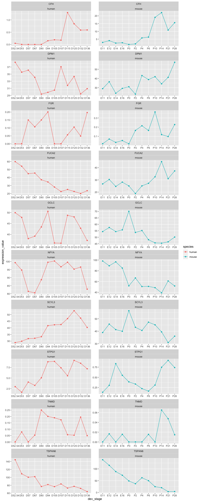

Using GREAT using human and mouse fetal retina transcriptomic data
================

-   [Introduction](#introduction)
-   [Understand the data](#understand-the-data)
-   [Visualising the data](#visualising-the-data)

## Introduction

Using the human and mouse transcriptomic data from [Hoshino et.
al](https://www.sciencedirect.com/science/article/pii/S1534580717308730#!)
to test GREAT package.

## Understand the data

``` r
human_data <- data.table::fread("~/PhD/main_phd/genalignR_development/data_hoshino_et_al_2017_human_retina/GSE104827_Normalized_Gene_CPM.txt")

human_data
```

    ##                     V1 Chr Strand     Start       End     Gene_name
    ##     1: ENSG00000000003   X     -1 100627109 100639991        TSPAN6
    ##     2: ENSG00000000005   X      1 100584802 100599885          TNMD
    ##     3: ENSG00000000419  20     -1  50934867  50958555          DPM1
    ##     4: ENSG00000000457   1     -1 169849631 169894267         SCYL3
    ##     5: ENSG00000000460   1      1 169662007 169854080      C1orf112
    ##    ---                                                             
    ## 60615: ENSG00000282798  19      1     69167     69972 LLNLR-222A1.1
    ## 60616: ENSG00000282804   6     -1  24797373  24809798  RP3-369A17.6
    ## 60617: ENSG00000282807  19      1     71778     72718    AC008993.3
    ## 60618: ENSG00000282815   X      1 125320120 125325214 RP13-147D17.3
    ## 60619: ENSG00000282816  22     -1  29480220  29481113    AC000035.3
    ##                                                                                                       Description
    ##     1:                                                          tetraspanin 6 [Source:HGNC Symbol;Acc:HGNC:11858]
    ##     2:                                                            tenomodulin [Source:HGNC Symbol;Acc:HGNC:17757]
    ##     3: dolichyl-phosphate mannosyltransferase polypeptide 1, catalytic subunit [Source:HGNC Symbol;Acc:HGNC:3005]
    ##     4:                                               SCY1-like, kinase-like 3 [Source:HGNC Symbol;Acc:HGNC:19285]
    ##     5:                                    chromosome 1 open reading frame 112 [Source:HGNC Symbol;Acc:HGNC:25565]
    ##    ---                                                                                                           
    ## 60615:                                                                                                           
    ## 60616:                                                       Protein FAM65B  [Source:UniProtKB/TrEMBL;Acc:H3BP45]
    ## 60617:                                                                                                           
    ## 60618:                                                                                                           
    ## 60619:                                                                                                           
    ##        TransCount      Gene_type         Source Status       D52.54
    ##     1:          5 protein_coding ensembl_havana  KNOWN 144.24546078
    ##     2:          2 protein_coding ensembl_havana  KNOWN   0.00000000
    ##     3:          6 protein_coding ensembl_havana  KNOWN  38.34662281
    ##     4:          5 protein_coding ensembl_havana  KNOWN  28.88565628
    ##     5:          9 protein_coding ensembl_havana  KNOWN  37.47822492
    ##    ---                                                             
    ## 60615:          1            TEC         havana  KNOWN   0.00000000
    ## 60616:          1 protein_coding         havana  KNOWN   0.00000000
    ## 60617:          1        lincRNA         havana  KNOWN   0.41683099
    ## 60618:          1 protein_coding ensembl_havana  KNOWN   0.04570515
    ## 60619:          1      antisense         havana  KNOWN   0.00000000
    ##                 D53         D57          D67        D80        D94      D94.2
    ##     1: 108.82418021 100.1607675 101.59243168 76.7823900 81.6969033 84.5714800
    ##     2:   0.07846012   0.0000000   0.05344157  0.2504318  0.2007295  0.2666188
    ##     3:  35.54243233  36.1178229  34.09572404 29.3506070 29.8585119 35.7802415
    ##     4:  29.89330401  31.8716058  32.11838582 33.3074295 41.6513696 40.7926748
    ##     5:  31.07020574  36.9171108  32.86656785 35.8117475 44.2106706 44.8986041
    ##    ---                                                                       
    ## 60615:   0.00000000   0.0000000   0.00000000  0.0000000  0.0000000  0.0000000
    ## 60616:   0.00000000   0.1074043   0.00000000  0.1392401  0.0000000  0.0000000
    ## 60617:   0.19144268   0.3831586   0.38852024  1.0463041  1.0076621  1.1086009
    ## 60618:   0.00000000   0.0499555   0.16032472  0.0000000  0.0000000  0.1066475
    ## 60619:   0.00000000   0.0000000   0.00000000  0.0000000  0.0000000  0.0000000
    ##             D105        D107        D115        D125       D132        D136
    ##     1: 76.509127 83.24434378 72.80804065 77.19902098 72.0357273 63.89722889
    ##     2:  0.189849  0.17354623  0.05648413  0.05265963  0.1950866  0.04918955
    ##     3: 30.470757 37.08104542 31.80056391 34.33408027 29.4093051 30.89103906
    ##     4: 42.288854 42.46097869 46.93831015 52.92293048 47.3085007 40.28624362
    ##     5: 36.071301 40.49412136 46.59940538 41.96972696 52.8684688 40.33543317
    ##    ---                                                                     
    ## 60615:  0.000000  0.00000000  0.00000000  0.00000000  0.0000000  0.00000000
    ## 60616:  0.000000  0.00000000  0.00000000  0.00000000  0.0000000  0.10133048
    ## 60617:  1.537302  0.68030124  0.44170588  0.21063853  0.6867048  0.86721181
    ## 60618:  0.189849  0.05784874  0.11296826  0.00000000  0.0975433  0.14756866
    ## 60619:  0.000000  0.00000000  0.00000000  0.00000000  0.0000000  0.00000000
    ##              D59P      D59P.2       D73P        D96P       D132P       D59C
    ##     1: 90.3823189 85.42763479 69.9661505 73.12669305 79.94912588 81.4085113
    ##     2:  0.0000000  0.05247398  0.0000000  0.00000000  0.05102050  0.0000000
    ##     3: 29.8890896 28.54584357 24.3045756 30.85496567 33.01026448 32.1948440
    ##     4: 25.8371397 28.33594766 25.2353891 34.29272663 43.31640579 23.9564328
    ##     5: 27.9822896 34.84272083 21.6155587 33.31657228 35.51026906 20.8670285
    ##    ---                                                                     
    ## 60615:  0.0000000  0.00000000  0.0000000  0.00000000  0.00000000  0.0000000
    ## 60616:  0.0000000  0.00000000  0.0000000  0.04711006  0.05459194  0.0000000
    ## 60617:  0.1677984  0.25082561  0.3169937  0.55937888  0.81224638  0.1382102
    ## 60618:  0.0000000  0.00000000  0.2068475  0.00000000  0.05102050  0.0000000
    ## 60619:  0.0000000  0.00000000  0.0000000  0.00000000  0.00000000  0.0000000
    ##             D59C.2       D96NC      D132NC        D73M        D96M       D132M
    ##     1: 68.72984503 82.19546217 85.18068940 56.43742814 66.82049511 53.02557692
    ##     2:  0.00000000  0.00000000  0.09757238  0.04886357  0.13302023  0.50326259
    ##     3: 24.09293477 39.45005572 40.34617992 21.40224548 28.11160843 26.76441976
    ##     4: 26.94209925 44.91092263 50.20099049 25.50678570 36.49188287 26.30690831
    ##     5: 30.74098523 42.46294781 36.05299511 21.74429049 30.81635309 20.49651291
    ##    ---                                                                        
    ## 60615:  0.00000000  0.00000000  0.00000000  0.00000000  0.04434008  0.00000000
    ## 60616:  0.05548373  0.04943026  0.00000000  0.00000000  0.04700048  0.09927998
    ## 60617:  0.40688068  0.00000000  0.25905467  0.59906742  0.45714619  0.21137029
    ## 60618:  0.09997068  0.04707644  0.14635857  0.14659072  0.04434008  0.00000000
    ## 60619:  0.00000000  0.00000000  0.00000000  0.00000000  0.00000000  0.00000000

``` r
mouse_data <- data.table::fread("~/PhD/main_phd/genalignR_development/data_hoshino_et_al_2017_human_retina/GSE101986_Gene_Normalized-CPM.txt") %>% 
  mutate(Gene_name = toupper(external_gene_name))

mouse_data
```

    ##                        V1 chromosome_name strand start_position end_position
    ##     1: ENSMUSG00000000001               3     -1      108107280    108146146
    ##     2: ENSMUSG00000000003               X     -1       77837901     77853623
    ##     3: ENSMUSG00000000028              16     -1       18780447     18811987
    ##     4: ENSMUSG00000000031               7     -1      142575529    142578143
    ##     5: ENSMUSG00000000037               X      1      161117193    161258213
    ##    ---                                                                      
    ## 45590: ENSMUSG00000109571               7     -1       18689760     18691152
    ## 45591: ENSMUSG00000109572               5      1       34288600     34327327
    ## 45592: ENSMUSG00000109573              19     -1       13462678     13463635
    ## 45593: ENSMUSG00000109577               7      1        5414736      5415131
    ## 45594: ENSMUSG00000109578               7      1      120553156    120556999
    ##        external_gene_name
    ##     1:              Gnai3
    ##     2:               Pbsn
    ##     3:              Cdc45
    ##     4:                H19
    ##     5:              Scml2
    ##    ---                   
    ## 45590:     RP23-229E19.11
    ## 45591:             Cfap99
    ## 45592:       Olfr1473-ps1
    ## 45593:      RP23-371K18.1
    ## 45594:       RP23-17C12.2
    ##                                                                                                 description
    ##     1: guanine nucleotide binding protein (G protein), alpha inhibiting 3 [Source:MGI Symbol;Acc:MGI:95773]
    ##     2:                                                         probasin [Source:MGI Symbol;Acc:MGI:1860484]
    ##     3:                                           cell division cycle 45 [Source:MGI Symbol;Acc:MGI:1338073]
    ##     4:                     H19, imprinted maternally expressed transcript [Source:MGI Symbol;Acc:MGI:95891]
    ##     5:                           sex comb on midleg-like 2 (Drosophila) [Source:MGI Symbol;Acc:MGI:1340042]
    ##    ---                                                                                                     
    ## 45590:                                                                                                     
    ## 45591:                         cilia and flagella associated protein 99 [Source:MGI Symbol;Acc:MGI:5434801]
    ## 45592:                            olfactory receptor 1473, pseudogene 1 [Source:MGI Symbol;Acc:MGI:3031307]
    ## 45593:                                                                                                     
    ## 45594:                                                                                                     
    ##        transcript_count                       gene_biotype         source
    ##     1:                1                     protein_coding ensembl_havana
    ##     2:                2                     protein_coding ensembl_havana
    ##     3:                3                     protein_coding ensembl_havana
    ##     4:                5                            lincRNA ensembl_havana
    ##     5:                7                     protein_coding ensembl_havana
    ##    ---                                                                   
    ## 45590:                1             unprocessed_pseudogene         havana
    ## 45591:                1                     protein_coding         havana
    ## 45592:                1             unprocessed_pseudogene         havana
    ## 45593:                1               processed_pseudogene         havana
    ## 45594:                2 transcribed_unprocessed_pseudogene         havana
    ##        status        E11.1        E11.2     E12.1        E12.2        E14.1
    ##     1:  KNOWN 3.386754e+02 3.332853e+02 291.28369 298.21946680 298.30229056
    ##     2:  KNOWN 0.000000e+00 0.000000e+00   0.00000   0.00000000   0.00000000
    ##     3:  KNOWN 5.585675e+01 7.307896e+01  51.46727  55.43453506  55.83903181
    ##     4:  KNOWN 1.349490e+03 1.452181e+03 611.01150 964.20846190 182.29049790
    ##     5:  KNOWN 1.484037e+01 1.597797e+01  16.96852  18.14978813  17.27460524
    ##    ---                                                                     
    ## 45590:  KNOWN 0.000000e+00 0.000000e+00   0.00000   0.00000000   0.00000000
    ## 45591:  KNOWN 3.275844e-02 3.403438e-02   0.00000   0.03224448   0.03202178
    ## 45592:  KNOWN 0.000000e+00 0.000000e+00   0.00000   0.00000000   0.00000000
    ## 45593:  KNOWN 0.000000e+00 0.000000e+00   0.00000   0.00000000   0.00000000
    ## 45594:  KNOWN 0.000000e+00 0.000000e+00   0.00000   0.00000000   0.00000000
    ##            E14.2      E16.1       E16.2         P0.1      P0.2         P2.1
    ##     1: 260.83591 230.162611 274.4705009 176.73318150 212.13871 137.65629605
    ##     2:   0.00000   0.000000   0.0000000   0.00000000   0.00000   0.00000000
    ##     3:  52.91405  43.126025  48.6604895  31.95338781  41.61026  29.07201823
    ##     4: 257.12149 144.192958 154.2698518 179.91313002 195.26647 247.85815196
    ##     5:  11.89699  14.240153  13.5137122  15.87229331  22.11609   6.20715991
    ##    ---                                                                     
    ## 45590:   0.00000   0.000000   0.0000000   0.00000000   0.00000   0.00000000
    ## 45591:   0.00000   0.030626   0.0314651   0.06207077   0.00000   0.03817915
    ## 45592:   0.00000   0.000000   0.0000000   0.00000000   0.00000   0.00000000
    ## 45593:   0.00000   0.000000   0.0000000   0.00000000   0.00000   0.00000000
    ## 45594:   0.00000   0.000000   0.0000000   0.00000000   0.00000   0.00000000
    ##               P2.2        P4.1      P4.2        P6.1         P6.2      P10.1
    ##     1: 136.9964373 175.7358482 166.59574 121.8772529 135.79697490 72.5136839
    ##     2:   0.0000000   0.0000000   0.00000   0.0000000   0.00000000  0.0000000
    ##     3:  24.8314857  14.2121544  14.13196   6.2178468   4.82290512  3.6449646
    ##     4: 212.8168777 147.0892254 142.58988  49.9570595  70.41435097 15.5364456
    ##     5:  11.8471192  10.8992685  11.43918   6.3029357   6.76261833  7.9208280
    ##    ---                                                                      
    ## 45590:   0.0000000   0.0000000   0.00000   0.0000000   0.00000000  0.0000000
    ## 45591:   0.0951862   0.1023692   0.00000   0.0966391   0.06354532  0.3584002
    ## 45592:   0.0000000   0.0000000   0.00000   0.0000000   0.00000000  0.0000000
    ## 45593:   0.0000000   0.0000000   0.00000   0.0000000   0.00000000  0.0000000
    ## 45594:   0.0000000   0.0000000   0.00000   0.0000000   0.00000000  0.0000000
    ##             P10.2      P14.1      P14.2      P21.1     P21.2      P28.1
    ##     1: 72.8465187 62.9342571 69.3097291 38.5671803 37.814531 43.0192156
    ##     2:  0.0000000  0.0000000  0.0000000  0.0000000  0.000000  0.0000000
    ##     3:  5.0013637  3.4217399  3.0603093  4.9551174  5.178308  3.9087705
    ##     4: 20.9983502  5.9579951  2.3527295  0.1901809  0.561444  0.1791954
    ##     5:  4.0143902  5.1026834  4.3225074  3.0106807  4.627835  3.0649616
    ##    ---                                                                 
    ## 45590:  0.0000000  0.0000000  0.0000000  0.0000000  0.000000  0.0000000
    ## 45591:  0.3701638  0.4741009  0.6033072  1.9676830  2.196217  1.9774495
    ## 45592:  0.0000000  0.0000000  0.0000000  0.0000000  0.000000  0.0000000
    ## 45593:  0.0000000  0.0000000  0.0000000  0.0000000  0.000000  0.0000000
    ## 45594:  0.0000000  0.0000000  0.0000000  0.0000000  0.000000  0.0000000
    ##             P28.2      Gene_name
    ##     1: 43.2907068          GNAI3
    ##     2:  0.0000000           PBSN
    ##     3:  3.8083312          CDC45
    ##     4:  0.9646366            H19
    ##     5:  4.2000468          SCML2
    ##    ---                          
    ## 45590:  0.0000000 RP23-229E19.11
    ## 45591:  1.7897408         CFAP99
    ## 45592:  0.0000000   OLFR1473-PS1
    ## 45593:  0.0000000  RP23-371K18.1
    ## 45594:  0.0000000   RP23-17C12.2

## Visualising the data

``` r
list_gene <- intersect(human_data$Gene_name, mouse_data$Gene_name) %>% head(10) 

mouse_data <- mouse_data %>% filter(Gene_name %in% list_gene) %>% 
  select(-c("V1", "chromosome_name", "strand", 
            "start_position", "end_position", "external_gene_name", 
            "description", "transcript_count", "gene_biotype", 
            "source", "status")) %>% 
  select(c("Gene_name", everything())) %>% 
  tidyr::pivot_longer(!Gene_name, names_to = "dev_stage", values_to = "exp_value") %>% 
  tidyr::separate(
    col = dev_stage,
    into = c("dev_stage", "replicate"),
    sep = "\\."
  ) 

mouse_dev_stage <- c("E11", "E12", "E14", "E16", "P0", "P2", "P4", "P6", "P10", "P14", "P21", "P28")

mouse_data  <- mouse_data  %>% 
  group_by(Gene_name, dev_stage, .drop = TRUE) %>% 
  summarise(mean = mean(exp_value)) %>% 
  rename(expression_value = mean) %>% 
  filter(dev_stage %in% mouse_dev_stage) %>% 
  mutate(species = "mouse")
```

    ## `summarise()` has grouped output by 'Gene_name'. You can override using the `.groups` argument.

``` r
human_dev_stage <- c("D52.54", "D53", "D57", "D67", "D80", "D94", "D105", "D107", "D115", "D125", "D132", "D136")

human_data <- human_data %>% 
  filter(Gene_name %in% list_gene) %>% 
  select(-c("V1", "Chr", "Strand", "Start", "End", "Description", "TransCount", "Gene_type", 
            "Source", "Status", "D94.2")) %>% 
  tidyr::pivot_longer(!Gene_name, names_to = "dev_stage", values_to = "expression_value")  

human_data <- human_data %>% 
  dplyr::filter(dev_stage %in% human_dev_stage) %>% 
  dplyr::mutate(species = "human")

human_data
```

    ## # A tibble: 120 × 4
    ##    Gene_name dev_stage expression_value species
    ##    <chr>     <chr>                <dbl> <chr>  
    ##  1 TSPAN6    D52.54               144.  human  
    ##  2 TSPAN6    D53                  109.  human  
    ##  3 TSPAN6    D57                  100.  human  
    ##  4 TSPAN6    D67                  102.  human  
    ##  5 TSPAN6    D80                   76.8 human  
    ##  6 TSPAN6    D94                   81.7 human  
    ##  7 TSPAN6    D105                  76.5 human  
    ##  8 TSPAN6    D107                  83.2 human  
    ##  9 TSPAN6    D115                  72.8 human  
    ## 10 TSPAN6    D125                  77.2 human  
    ## # … with 110 more rows

``` r
all_data <- human_data %>% 
  rbind(mouse_data) %>% 
  dplyr::mutate(
    dev_stage = factor(dev_stage, levels = c(human_dev_stage, mouse_dev_stage))
  )

p <- all_data %>%
  ggplot2::ggplot() +
  ggplot2::aes(y = expression_value, x = dev_stage, group = species, color = species) +
  ggplot2::geom_point() +
  ggplot2::geom_line() +
  ggplot2::facet_wrap(Gene_name ~ species, scales = "free", ncol = 2)

p
```

<!-- -->
