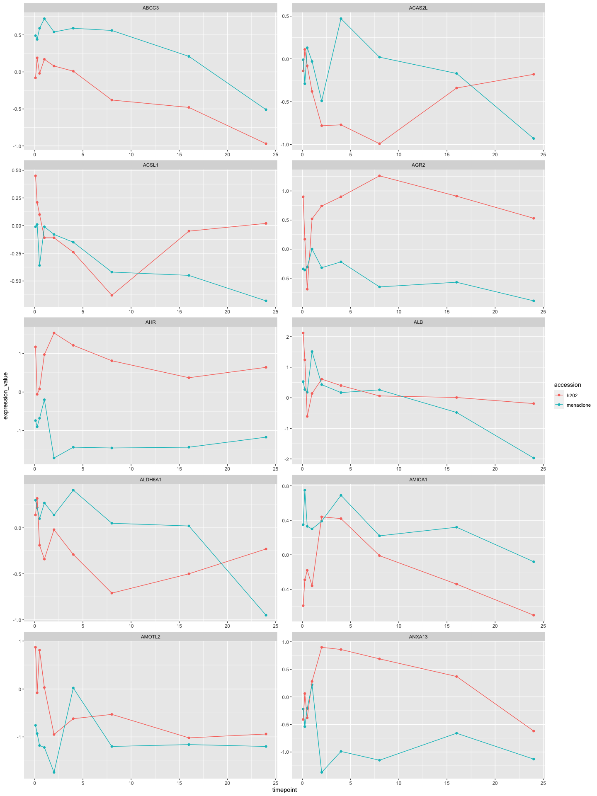
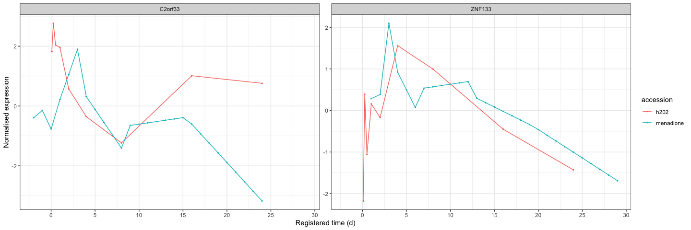

-   [Introduction](#introduction)
    -   [Processing H2O2 exposured
        data](#processing-h2o2-exposured-data)
    -   [Processing menadione exposured
        data](#processing-menadione-exposured-data)
    -   [Combine data and select only common
        genes](#combine-data-and-select-only-common-genes)
    -   [Plot data](#plot-data)
-   [Register genes](#register-genes)
-   [Register data](#register-data)
    -   [Get summary results](#get-summary-results)
    -   [Plot the results](#plot-the-results)

## Introduction

Using time series dataset from [Briede et
al.](https://academic.oup.com/toxsci/article/114/2/193/1670401): gene
expression by an extensive time series (0.08, 0.25, 0.5, 1, 2, 4, 8, 16,
or 24 h) analyses in human colon cancer (caco-2) cells after exposure to
H2O2 or the superoxide anion donor menadione.

``` r
caco_h2o2 <- readxl::read_xlsx("~/PhD/main_phd/genalignR_development/data_briede_et_all_2010_colon_cancer/exposure_h2o2.xlsx")
caco_menadione <- readxl::read_xlsx("~/PhD/main_phd/genalignR_development/data_briede_et_all_2010_colon_cancer/exposure_menadione.xlsx")
```

### Processing H2O2 exposured data

``` r
caco_h2o2 <- caco_h2o2 %>% 
  tidyr::pivot_longer(!GeneSymbol, names_to = "timepoint", values_to = "expression_value") %>% 
  dplyr::mutate(timepoint = as.numeric(stringr::str_remove_all(timepoint, "h")), 
                accession = "h202", 
                tissue = "colon", 
                group = 1
  ) %>% 
  dplyr::rename(locus_name = GeneSymbol)
```

### Processing menadione exposured data

``` r
caco_menadione <- caco_menadione %>% 
  tidyr::pivot_longer(!GeneSymbol, names_to = "timepoint", values_to = "expression_value") %>% 
  dplyr::mutate(timepoint = as.numeric(stringr::str_remove_all(timepoint, "h")), 
                accession = "menadione", 
                tissue = "colon", 
                group = 1
  ) %>% 
  dplyr::rename(locus_name = GeneSymbol)
```

### Combine data and select only common genes

``` r
common_genes <- intersect(caco_h2o2$locus_name, caco_menadione$locus_name) %>% unique()# %>% head(40)

# Combine together all of data
caco_all <- dplyr::bind_rows(caco_h2o2, caco_menadione)

# Select only first common genes 
caco_all_common_genes <- caco_all %>% 
  dplyr::filter(locus_name %in% common_genes)

subset_gene <- common_genes %>% head(10)
```

### Plot data

``` r
caco_all_common_genes %>%
  dplyr::filter(locus_name %in% subset_gene) %>% 
  ggplot2::ggplot() +
  ggplot2::aes(y = expression_value, x = timepoint, group = accession, color = accession) +
  # ggplot2::stat_summary(fun = mean, geom = "line", size = 1) +
  # ggplot2::stat_summary(
  #       fun.data = ggplot2::mean_se,
  #       fun.args = list(mult = 1),
  #       geom = "ribbon",
  #       color = NA,
  #       alpha = 0.3
  #     ) +
  ggplot2::geom_point() +
  ggplot2::geom_line() +
  ggplot2::facet_wrap(~locus_name, scales = "free", ncol = 2) 
```

<!-- -->

## Register genes

``` r
# Find the approximation of stretch factor 
GREAT::get_approximate_stretch(caco_all_common_genes, "h202", "menadione")
```

    ## [1] 1

## Register data

``` r
caco_reg_results <- scale_and_register_data(
  input_df = caco_all_common_genes,
  stretches = seq(0.9, 1.2, 0.01),
  shift_extreme = 3,
  num_shifts = 61,
  min_num_overlapping_points = 4,
  initial_rescale = FALSE,
  do_rescale = TRUE,
  accession_data_to_transform = "menadione",
  accession_data_ref = "h202",
  start_timepoint = "reference", 
  expression_value_threshold = NULL, 
  is_data_normalised = TRUE
)
```

### Get summary results

``` r
summary_data <- summary_model_comparison(caco_reg_results[["model_comparison_dt"]]) 

summary_data$df_summary
```

    ##                 Result          Value
    ## 1          Total genes            297
    ## 2     Registered genes              2
    ## 3 Non-registered genes            295
    ## 4              Stretch       1.1, 1.2
    ## 5                Shift [-2.3, 0.2596]

``` r
summary_data$registered_genes
```

    ## [1] "C2orf33" "ZNF133"

### Plot the results

``` r
caco_reg_results$imputed_mean_df %>% 
  dplyr::filter(locus_name %in% c("C2orf33", "ZNF133")) %>% 
  plot_registered_gene_of_interest()
```

<!-- -->
