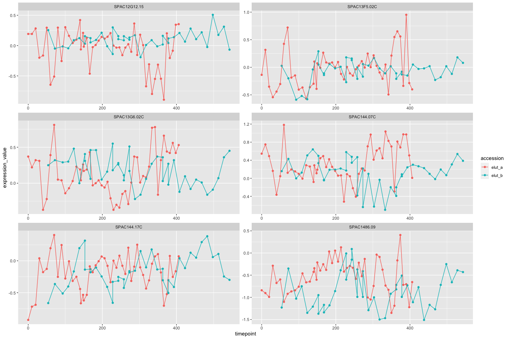
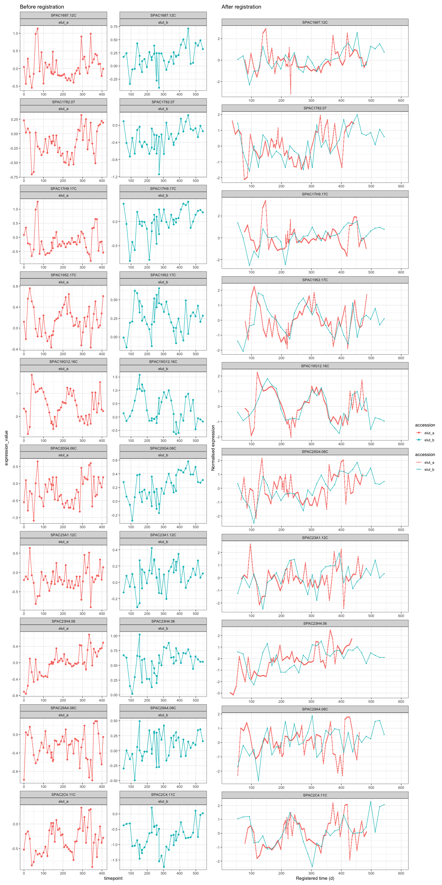
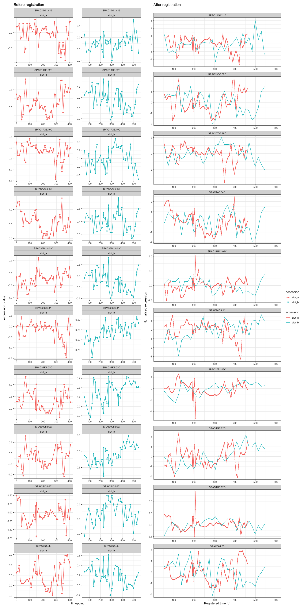

-   [Introduction](#introduction)
-   [Understand the data](#understand-the-data)
    -   [Get the summary results](#get-the-summary-results)
    -   [Plot data](#plot-data)
    -   [Plot registered genes](#plot-registered-genes)
-   [Plot non-registered data](#plot-non-registered-data)

## Introduction

Using gene expression in fission yeast *Schizosaccharomyces pombe*
[Olivia et
al. 2005](https://journals.plos.org/plosbiology/article?id=10.1371/journal.pbio.0030225#pbio-0030225-b06)

## Understand the data

``` r
elut_a <- utils::read.csv("~/PhD/main_phd/genalignR_development/data_olivia_et_al_2005_s_pombe/elut_a.csv")
elut_b <- utils::read.csv("~/PhD/main_phd/genalignR_development/data_olivia_et_al_2005_s_pombe/elut_b.csv")
```

``` r
common_genes <- intersect(elut_a$Systematic.Name, elut_a$Systematic.Name) 
```

``` r
final_elut_a <- elut_a %>% 
  tidyr::pivot_longer(!Systematic.Name, names_to = "timepoint", values_to = "expression_value") %>% 
  dplyr::mutate(timepoint = stringr::str_remove_all(timepoint, "f108_elutriation_") %>% as.numeric(), 
                group = 1, 
                tissue = "S. pombe", 
                accession = "elut_a") %>% 
  dplyr::rename(locus_name = Systematic.Name)
```

``` r
final_elut_b <- elut_b %>% 
  tidyr::pivot_longer(!Systematic.Name, names_to = "timepoint", values_to = "expression_value") %>% 
  dplyr::mutate(timepoint = stringr::str_extract(timepoint, "(\\d)+") %>% as.numeric(), 
                group = 1, 
                tissue = "S. pombe", 
                accession = "elut_b") %>% 
  dplyr::rename(locus_name = Systematic.Name)
```

``` r
s_pombe_all <- final_elut_a %>% 
  rbind(final_elut_b)

genes_without_nas <- c(
      s_pombe_all %>%
        dplyr::group_by(locus_name) %>%
        dplyr::summarise(
          na_count = sum(is.na(expression_value))
        ) %>%
        dplyr::filter(na_count == 0) %>%
        dplyr::pull(locus_name)
    )

s_pombe_all <- s_pombe_all %>%
  dplyr::filter(
    locus_name %in% common_genes,
    locus_name %in% genes_without_nas
  )
```

``` r
s_pombe_all %>%
  dplyr::filter(locus_name %in% head(genes_without_nas, 10)) %>% 
  ggplot2::ggplot() +
  ggplot2::aes(y = expression_value, x = timepoint, group = accession, color = accession) +
  ggplot2::geom_point() +
  ggplot2::geom_line() +
  ggplot2::facet_wrap(~locus_name, scales = "free", ncol = 2)
```

<!-- --> ##
Register data

Before registering data, we can use function get_approximate_stretch()
to help us finding the approximation of stretch factor.

``` r
# Find approximation of strect factor
GREAT::get_approximate_stretch(s_pombe_all, accession_data_to_transform = "elut_a", accession_data_ref = "elut_b")
```

    ## [1] 1.204433

``` r
# Register gene
registration_results <- scale_and_register_data(
  input_df = s_pombe_all %>% 
    dplyr::filter(locus_name %in% head(genes_without_nas, 50)),
  stretches = seq(1, 1.3, 0.05),
  shift_extreme = 25,
  num_shifts = 51,
  min_num_overlapping_points = 4,
  initial_rescale = TRUE,
  do_rescale = TRUE,
  accession_data_to_transform = "elut_a",
  accession_data_ref = "elut_b",
  start_timepoint = "reference", 
  expression_value_threshold = NULL, 
  is_data_normalised = TRUE
)
```

### Get the summary results

Using function summary_model_comparison() we can get the df summary of
registration results, also the list of gene that are or are not
registered.

``` r
summary_result <- GREAT::summary_model_comparison(registration_results[["model_comparison_dt"]]) 

summary_result$df_summary %>% 
  knitr::kable()
```

| Result               | Value                              |
|:---------------------|:-----------------------------------|
| Total genes          | 50                                 |
| Registered genes     | 40                                 |
| Non-registered genes | 10                                 |
| Stretch              | 1, 1.05, 1.1, 1.15, 1.2, 1.25, 1.3 |
| Shift                | \[-25, 25\]                        |

### Plot data

``` r
subset_registered_genes <- summary_result$registered_genes
subset_nonregistered_genes <- summary_result$non_registered_genes 

subset_registered_genes
```

    ##  [1] "SPAC1687.12C"  "SPAC1782.07"   "SPAC17H9.17C"  "SPAC1952.17C" 
    ##  [5] "SPAC19G12.16C" "SPAC20G4.06C"  "SPAC23A1.12C"  "SPAC23H4.06"  
    ##  [9] "SPAC29A4.08C"  "SPAC2C4.11C"   "SPAC2E1P5.03"  "SPAP15E9.02C" 
    ## [13] "SPAC1486.09"   "SPAC26A3.05"   "SPAC26F1.03"   "SPAC1782.02C" 
    ## [17] "SPAC22E12.09C" "SPAC23C4.08"   "SPAC2G11.03C"  "SPAC13F5.02C" 
    ## [21] "SPAC1F12.05"   "SPAC25H1.08C"  "SPAC4F10.09C"  "SPAC589.12"   
    ## [25] "SPAC18G6.04C"  "SPAC23H4.15"   "SPAC4A8.13C"   "SPAC4D7.09"   
    ## [29] "SPAC57A10.09C" "SPAC1805.12C"  "SPAC19B12.05C" "SPAC30.03C"   
    ## [33] "SPAC8F11.09C"  "SPAC9E9.08"    "SPAC144.07C"   "SPAC144.17C"  
    ## [37] "SPAC1805.17"   "SPAC323.03C"   "SPAC56E4.03"   "SPAPB1A10.12C"

### Plot registered genes

``` r
subset_registered_results <- registration_results[["imputed_mean_df"]] %>% 
                                   dplyr::filter(locus_name %in% head(subset_registered_genes, 10))

plot_before <- s_pombe_all %>%
  dplyr::filter(locus_name %in% head(subset_registered_genes, 10)) %>% 
  ggplot2::ggplot() +
  ggplot2::aes(y = expression_value, x = timepoint, group = accession, color = accession) +
  # ggplot2::stat_summary(fun = mean, geom = "line", size = 1) +
  # ggplot2::stat_summary(
  #       fun.data = ggplot2::mean_se,
  #       fun.args = list(mult = 1),
  #       geom = "ribbon",
  #       color = NA,
  #       alpha = 0.3
  #     ) +
  ggplot2::geom_point() +
  ggplot2::geom_line() +
  ggplot2::facet_wrap(locus_name ~ accession, scales = "free", ncol = 2) +
  ggplot2::theme(legend.position="none") +
  ggplot2::theme_bw() +
  ggplot2::ggtitle("Before registration")
  
plot_after <- plot_registered_gene_of_interest(subset_registered_results, ncol = 1) +
  ggplot2::ggtitle("After registration")

list(plot_before, plot_after) %>% 
  patchwork::wrap_plots(guides = "collect")
```

<!-- -->

## Plot non-registered data

``` r
subset_non_registered_results <- registration_results[["imputed_mean_df"]] %>% 
                                   dplyr::filter(locus_name %in% subset_nonregistered_genes)

plot_non_registered_results_before <- s_pombe_all %>%
  dplyr::filter(locus_name %in% subset_nonregistered_genes) %>% 
  ggplot2::ggplot() +
  ggplot2::aes(y = expression_value, x = timepoint, group = accession, color = accession) +
  # ggplot2::stat_summary(fun = mean, geom = "line", size = 1) +
  # ggplot2::stat_summary(
  #       fun.data = ggplot2::mean_se,
  #       fun.args = list(mult = 1),
  #       geom = "ribbon",
  #       color = NA,
  #       alpha = 0.3
  #     ) +
  ggplot2::geom_point() +
  ggplot2::geom_line() +
  ggplot2::facet_wrap(locus_name ~ accession, scales = "free", ncol = 2) +
  ggplot2::theme(legend.position="none") +
  ggplot2::theme_bw() +
  ggplot2::ggtitle("Before registration")
  
plot_non_registered_results_after <- plot_registered_gene_of_interest(subset_non_registered_results, ncol = 1) +
  ggplot2::ggtitle("After registration")

list(plot_non_registered_results_before, plot_non_registered_results_after) %>% 
  patchwork::wrap_plots(guides = "collect")
```

<!-- -->
