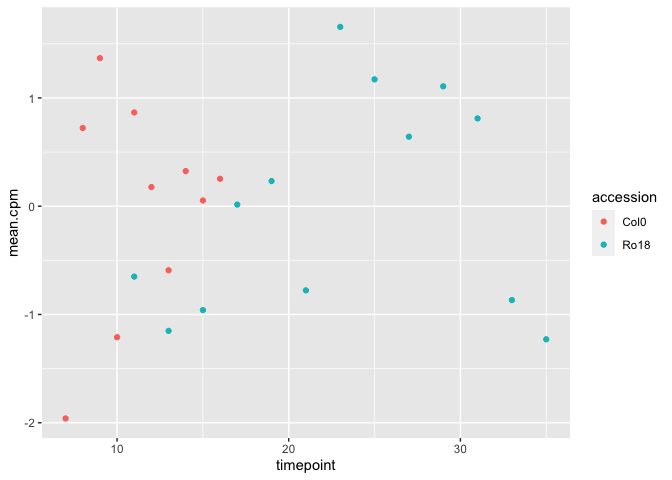
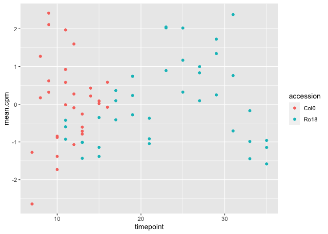
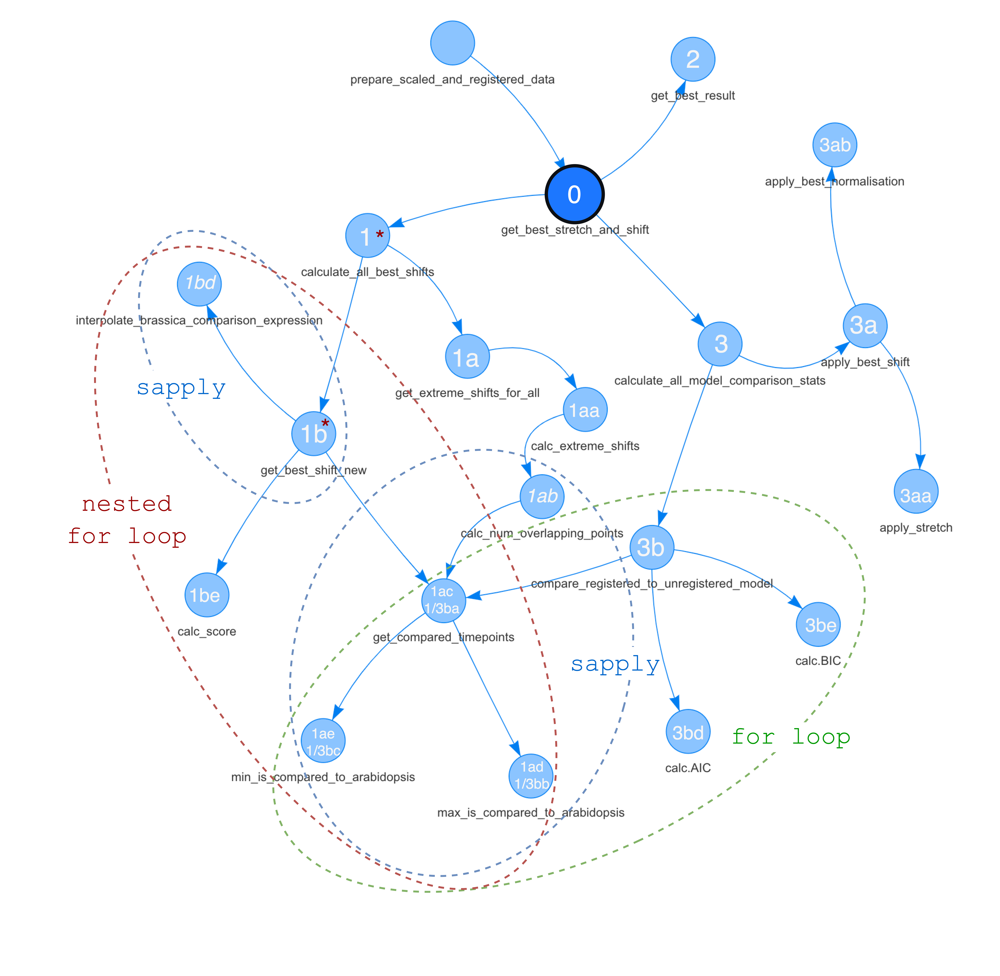

Gene registration
================

-   [Running Alex Scripts](#running-alex-scripts)
    -   [Initialise some parameters](#initialise-some-parameters)
    -   [Setup flags](#setup-flags)
    -   [Setup directory to set the
        path](#setup-directory-to-set-the-path)
    -   [View the data](#view-the-data)
    -   [Get the Brassica data](#get-the-brassica-data)
    -   [Cut down to few genes for
        testing](#cut-down-to-few-genes-for-testing)
    -   [Shuffle the data](#shuffle-the-data)
        -   [Look into each df](#look-into-each-df)
    -   [Prepare registered and scaled
        data](#prepare-registered-and-scaled-data)
        -   [Step 1: Change accession
            names](#step-1-change-accession-names)
        -   [Step 2: Scale](#step-2-scale)
        -   [Step 3: Get best stretch and
            shift](#step-3-get-best-stretch-and-shift)
        -   [Step 3a: Calculate all best
            shift](#step-3a-calculate-all-best-shift)

``` r
knitr::opts_chunk$set(echo = TRUE)
library(GREAT)
library(ggplot2)
library(data.table)
```

# Running Alex Scripts

List of all main functions

``` r
# list of main function
load_mean.df()
shuffle_ro18_timepoints(mean.df, all.data.df)
shuffle_ro18_gene_names(mean.df, all.data.df)
prepare_scaled_and_registered_data(mean.df, all.data.df, stretch=stretch, initial.rescale, should.rescale, min_num_overlapping_points, shift_extreme, transformed.timecourse)
calculate_between_sample_distance(mean.df, mean.df.sc, imputed.mean.df)
make_data_heatmaps(D.mean, D.scaled, D.registered, D.scaled.onlyNR, D.scaled.onlyR, D.registered.onlyR)
```

## Initialise some parameters

``` r
jobNum <- 1 # if running lots of times on cluster to get enough shuffled results, then jobNum is used to prevent output overwriting
do.initial.rescale <- 'nope' # should be 'rescale' if want to use scaled df for registration, rather than mean.df
do.register.rescale <- 'rescale' # should be 'rescale' if want to rescale using only the overlapping points during  registration
shuffle.type <- 'shuffle.expression' # whether should shuffle by shuffling the gene ids compared, or by shuffling the gene expression
# for each gene c('shuffle.genes', or 'shuffle.expression)

outdir.string <- 'TESTING_rescale_as_register___shuffled_g_v4__'
```

``` r
# calculate the scores associated with each candidate shift
# Arabidopsis observations = 7d -> 16d = 0d -> 9d
# Ro18 observations = 11d -> 35d = 0d -> 24d
# therefore if same start and end points stretch = 24 / 9

# lots of spurious overlaps detected when too extreme shifts allowed
stretch = c(2, 1.5, 1) # the stretch which lines up the start and end points.
min_num_overlapping_points = 4 # will only allow shifts which leave this many overlapping points after applying the stretch
shift_extreme  = 4 # the absolute maximum value which can be applied as a shift. Noticed that in the shuffled genes,
transformed.timecourse = 'Col0' # the name of the timecourse to apply the registratsion to (one of the names in the mean.df$accession column)
                                # which is loaded at line 133.

num.shuffled <- 1 #25 # for real, ran 40 jobs to get 40 * 25 random shuffled pairs for comparison. 
```

## Setup flags

``` r
print('********************')
print(paste0('output will be in ', outdir.string, '!'))
print('********************')
```

``` r
# setup flags for rescaling options
if (do.initial.rescale=='rescale') {
  initial.rescale <- TRUE
} else {
  initial.rescale <- FALSE
}
if (do.register.rescale=='rescale') {
  should.rescale <- TRUE
} else {
  should.rescale <- FALSE
}

#real.and.shuffled <- c('real', 1)

if (initial.rescale==TRUE) {
  print('********************')
  print('will rescale the data prior to registering, and register using this rescaled mean data!')
  print('********************')
}
if (should.rescale==TRUE){
  print('********************')
  print('will rescale the data when deciding optimal registration!')
  print('********************')
} 
```

    ## [1] "********************"
    ## [1] "will rescale the data when deciding optimal registration!"
    ## [1] "********************"

## Setup directory to set the path

``` r
here::here()
```

    ## [1] "/Users/kristiar/Code/GREAT"

``` r
# directories to save graphs to
real.data.graph.dir <- paste0('graphs/gene_registration/', outdir.string, '_real_data/')
shuffled.data.graph.dir <- paste0('graphs/gene_registration/', outdir.string, '_shuffled_data/job_', jobNum, '/')
# directories to save real and shuffled expression data to
real.expression.dir <- paste0('intermediate_data/gene_registration/', outdir.string, '_real_data/gene_expression/job_', jobNum, '/')
shuffled.expression.dir <- paste0('intermediate_data/gene_registration/', outdir.string, '_shuffled_data/gene_expression/')
# directories to save real and shuffled distance data to
real.distance.dir <- paste0('intermediate_data/gene_registration/', outdir.string, '_real_distance/job_', jobNum, '/')
shuffled.distance.dir <- paste0('intermediate_data/gene_registration/', outdir.string, '_shuffled_distance/')
  

# somewhere to store the data.tables and graphs
if (!(dir.exists(real.expression.dir))) {
    dir.create(real.expression.dir, recursive=T)
    dir.create(shuffled.expression.dir, recursive=T)
    
    dir.create(real.distance.dir, recursive=T)
    dir.create(shuffled.distance.dir, recursive=T)

    dir.create(real.data.graph.dir, recursive=T)
    dir.create(shuffled.data.graph.dir, recursive=T)
}
```

## View the data

``` r
ro18_chiifu_apex <- readRDS(here::here("dev/final_data/rds/ro18_chiifu_apex.rds"))
# klepikova <- readRDS(here::here("dev/final_data/rds/klepikova.rds"))

ro18_chiifu_apex %>% 
  head(5) %>% 
  knitr::kable()
```

| CDS.model        | sample\_id                         |     FPKM | accession | tissue | timepoint | dataset        | est\_counts | group        |  norm.cpm |
|:-----------------|:-----------------------------------|---------:|:----------|:-------|----------:|:---------------|------------:|:-------------|----------:|
| BRAA01G000010.3C | ERR\_ro18\_rna\_seq\_v3\_R18A1\_1  | 0.525918 | Ro18      | apex   |        11 | ro18\_rna\_seq |          35 | Ro18-apex-11 | 1.1575473 |
| BRAA01G000010.3C | ERR\_ro18\_rna\_seq\_v3\_R18A1\_2  | 0.460724 | Ro18      | apex   |        11 | ro18\_rna\_seq |          33 | Ro18-apex-11 | 0.9933499 |
| BRAA01G000010.3C | ERR\_ro18\_rna\_seq\_v3\_R18A1\_3  | 0.514991 | Ro18      | apex   |        11 | ro18\_rna\_seq |          35 | Ro18-apex-11 | 1.1297367 |
| BRAA01G000010.3C | ERR\_ro18\_rna\_seq\_v3\_R18A10\_1 | 0.512858 | Ro18      | apex   |        29 | ro18\_rna\_seq |          32 | Ro18-apex-29 | 1.0542927 |
| BRAA01G000010.3C | ERR\_ro18\_rna\_seq\_v3\_R18A10\_2 | 0.413650 | Ro18      | apex   |        29 | ro18\_rna\_seq |          29 | Ro18-apex-29 | 0.8984799 |

``` r
comparison_genes <- data.table::fread(here::here("dev/graphs/ro18_chiifu_apex/comparison_genes.tsv"))

print(unique(comparison_genes$model))
```

    ## [1] "rf"       "logistic" "trough"   "spike"    "linear"

## Get the Brassica data

``` r
## GET THE RAW DATA. MEAN EXPRESSION OF BIOLOGICAL REPS. TREAT BRASSICA GENES INDIVIDUALLY (DON'T SUM THEM).
# load the data expression data. Consider the brassica genes individually (don't sum)
L <- load_mean.df() # sumBrassica copy flag is within load_mean.df()
```

    ## [1] "rf"       "logistic" "trough"   "spike"    "linear"  
    ## [1] "2346 genes considered in the comparison"

``` r
# mean.df <- L[[1]] # will compare Col0 vs Ro18 based on accession column
# all.data.df <- L[[2]]
```

``` r
mean.df <- L[[1]]

mean.df %>% 
  head(20) %>% 
  knitr::kable()
```

| locus\_name      | accession | tissue | timepoint |  mean_cpm |
|:-----------------|:----------|:-------|----------:|----------:|
| BRAA01G000040.3C | Ro18      | apex   |        11 | 240.36628 |
| BRAA01G000040.3C | Ro18      | apex   |        29 | 353.93869 |
| BRAA01G000040.3C | Ro18      | apex   |        31 | 334.76658 |
| BRAA01G000040.3C | Ro18      | apex   |        33 | 226.34251 |
| BRAA01G000040.3C | Ro18      | apex   |        35 | 202.95764 |
| BRAA01G000040.3C | Ro18      | apex   |        13 | 207.98392 |
| BRAA01G000040.3C | Ro18      | apex   |        15 | 220.37654 |
| BRAA01G000040.3C | Ro18      | apex   |        17 | 283.34687 |
| BRAA01G000040.3C | Ro18      | apex   |        19 | 297.39388 |
| BRAA01G000040.3C | Ro18      | apex   |        21 | 232.15486 |
| BRAA01G000040.3C | Ro18      | apex   |        23 | 389.39566 |
| BRAA01G000040.3C | Ro18      | apex   |        25 | 358.07885 |
| BRAA01G000040.3C | Ro18      | apex   |        27 | 323.85892 |
| BRAA01G000200.3C | Ro18      | apex   |        11 |  23.22510 |
| BRAA01G000200.3C | Ro18      | apex   |        29 |  23.43990 |
| BRAA01G000200.3C | Ro18      | apex   |        31 |  38.25467 |
| BRAA01G000200.3C | Ro18      | apex   |        33 | 109.30457 |
| BRAA01G000200.3C | Ro18      | apex   |        35 | 132.35346 |
| BRAA01G000200.3C | Ro18      | apex   |        13 |  60.02946 |
| BRAA01G000200.3C | Ro18      | apex   |        15 |  14.63026 |

``` r
all.data.df <- L[[2]]

all.data.df %>% 
  head(20) %>% 
  knitr::kable()
```

| locus\_name      | accession | tissue | timepoint | mean_cpm | group     |
|:-----------------|:----------|:-------|----------:|---------:|:----------|
| BRAA01G000040.3C | Ro18      | apex   |        11 | 243.7133 | Ro18-11-a |
| BRAA01G000040.3C | Ro18      | apex   |        11 | 222.4201 | Ro18-11-b |
| BRAA01G000040.3C | Ro18      | apex   |        11 | 254.9654 | Ro18-11-c |
| BRAA01G000040.3C | Ro18      | apex   |        29 | 298.4637 | Ro18-29-a |
| BRAA01G000040.3C | Ro18      | apex   |        29 | 369.3682 | Ro18-29-b |
| BRAA01G000040.3C | Ro18      | apex   |        29 | 393.9842 | Ro18-29-c |
| BRAA01G000040.3C | Ro18      | apex   |        31 | 331.5383 | Ro18-31-a |
| BRAA01G000040.3C | Ro18      | apex   |        31 | 436.0348 | Ro18-31-b |
| BRAA01G000040.3C | Ro18      | apex   |        31 | 236.7266 | Ro18-31-c |
| BRAA01G000040.3C | Ro18      | apex   |        33 | 189.0828 | Ro18-33-a |
| BRAA01G000040.3C | Ro18      | apex   |        33 | 218.5916 | Ro18-33-b |
| BRAA01G000040.3C | Ro18      | apex   |        33 | 271.3531 | Ro18-33-c |
| BRAA01G000040.3C | Ro18      | apex   |        35 | 180.1084 | Ro18-35-a |
| BRAA01G000040.3C | Ro18      | apex   |        35 | 220.4163 | Ro18-35-b |
| BRAA01G000040.3C | Ro18      | apex   |        35 | 208.3482 | Ro18-35-c |
| BRAA01G000040.3C | Ro18      | apex   |        13 | 217.2517 | Ro18-13-a |
| BRAA01G000040.3C | Ro18      | apex   |        13 | 189.7403 | Ro18-13-b |
| BRAA01G000040.3C | Ro18      | apex   |        13 | 216.9598 | Ro18-13-c |
| BRAA01G000040.3C | Ro18      | apex   |        15 | 192.9661 | Ro18-15-a |
| BRAA01G000040.3C | Ro18      | apex   |        15 | 208.5015 | Ro18-15-b |

## Cut down to few genes for testing

``` r
# Total number of unique locus name 
unique(mean.df$locus_name) %>% length()
```

    ## [1] 2346

``` r
test.genes <- unique(mean.df$locus_name)[1:5]

mean.df <- mean.df[mean.df$locus_name %in% test.genes,]
all.data.df <- all.data.df[all.data.df$locus_name %in% test.genes, ]
```

## Shuffle the data

``` r
unshuffled_data <- data.table::copy(mean.df)
unshuffled_all_data <- data.table::copy(all.data.df)
```

``` r
# Make the shuffle condition as a function 

shuffle_option <- function(shuffle_type, unshuffled_data, unshuffled_all_data) {
  
  if (shuffle_type == "real") {
    
    mean_df <- data.table::copy(unshuffled_data)
    all_data_df <- data.table::copy(unshuffled_all_data)
    L <- list(mean_df, all_data_df)
    
  } else if (shuffle_type == "shuffle_expression") {
    
    print("shuffling expression timecourse for each gene")
    L <- shuffle_ro18_timepoints(unshuffled_data, unshuffled_all_data)

    
  } else if (shuffle_type == "shuffle_genes") {
      
    print("shuffling gene names")
    L <- shuffle_ro18_gene_names(unshuffled_data, unshuffled_all_data)

    
  } else {
    
    message("Could not perform shuffle, wrong shuffle type!")
    
  }
  return(L)
}
```

``` r
# Try not to shuffle
list <- shuffle_option(shuffle_type = "real", unshuffled_data, unshuffled_all_data)

mean.df <- list[[1]]
all.data.df <- list[[2]]

# Try to shuffle expression
list_shuff_expression <- shuffle_option(shuffle_type = "shuffle_expression", unshuffled_data, unshuffled_all_data)
```

    ## [1] "shuffling expression timecourse for each gene"

``` r
mean_df_shuff_expression <- list_shuff_expression[[1]]
all_data_dfshuff_expression <- list_shuff_expression[[2]]


# Try to shuffle genes
list_shuff_genes <- shuffle_option(shuffle_type = "shuffle_genes", unshuffled_data, unshuffled_all_data)
```

    ## [1] "shuffling gene names"

``` r
mean_df_shuff_genes <- list_shuff_genes[[1]]
all_data_dfshuff_genes <- list_shuff_genes[[2]]
```

### Look into each df

``` r
mean_df_shuff_expression %>%
  head(5)
```

    ##          locus_name accession tissue timepoint mean_cpm
    ## 1: BRAA01G000040.3C      Col0   apex         7 44.33938
    ## 2: BRAA01G000040.3C      Col0   apex         8 88.68734
    ## 3: BRAA01G000040.3C      Col0   apex         9 99.36219
    ## 4: BRAA01G000040.3C      Col0   apex        10 56.74497
    ## 5: BRAA01G000040.3C      Col0   apex        11 91.06398

``` r
mean_df_shuff_genes %>% 
  head(5)
```

    ##          locus_name accession tissue timepoint mean_cpm
    ## 1: BRAA01G000700.3C      Ro18   apex        11 240.3663
    ## 2: BRAA01G000700.3C      Ro18   apex        29 353.9387
    ## 3: BRAA01G000700.3C      Ro18   apex        31 334.7666
    ## 4: BRAA01G000700.3C      Ro18   apex        33 226.3425
    ## 5: BRAA01G000700.3C      Ro18   apex        35 202.9576

``` r
mean.df %>%
  head(5)
```

    ##          locus_name accession tissue timepoint mean_cpm
    ## 1: BRAA01G000040.3C      Ro18   apex        11 240.3663
    ## 2: BRAA01G000040.3C      Ro18   apex        29 353.9387
    ## 3: BRAA01G000040.3C      Ro18   apex        31 334.7666
    ## 4: BRAA01G000040.3C      Ro18   apex        33 226.3425
    ## 5: BRAA01G000040.3C      Ro18   apex        35 202.9576

## Prepare registered and scaled data

### Step 1: Change accession names

``` r
list_res_change_accession_names <- change.accession.names(mean.df, all.data.df, transformed.timecourse)

mean.df_change_accession_names <- list_res_change_accession_names[['mean.df']]
all.data.df_change_accession_names <- list_res_change_accession_names[['all.data.df']]
original.transformed.accession_change_accession_names <- list_res_change_accession_names[['original.transformed.accession.name']]
original.other.accession_change_accession_names <- list_res_change_accession_names[['original.other.accession.name']]
```

``` r
mean.df_change_accession_names %>% 
  head(5)
```

    ##          locus_name accession tissue timepoint mean_cpm
    ## 1: BRAA01G000040.3C      Ro18   apex        11 240.3663
    ## 2: BRAA01G000040.3C      Ro18   apex        29 353.9387
    ## 3: BRAA01G000040.3C      Ro18   apex        31 334.7666
    ## 4: BRAA01G000040.3C      Ro18   apex        33 226.3425
    ## 5: BRAA01G000040.3C      Ro18   apex        35 202.9576

### Step 2: Scale

``` r
mean.df.sc <- data.table::copy(mean.df_change_accession_names)
# specify what kind of scaling
mean.df.sc[, sc.mean_cpm := scale(mean_cpm, scale = TRUE, center = TRUE), by = .(locus_name, accession)]

mean.df.sc %>% 
  head(5)
```

    ##          locus_name accession tissue timepoint mean_cpm sc.mean_cpm
    ## 1: BRAA01G000040.3C      Ro18   apex        11 240.3663  -0.6501871
    ## 2: BRAA01G000040.3C      Ro18   apex        29 353.9387   1.1073447
    ## 3: BRAA01G000040.3C      Ro18   apex        31 334.7666   0.8106565
    ## 4: BRAA01G000040.3C      Ro18   apex        33 226.3425  -0.8672048
    ## 5: BRAA01G000040.3C      Ro18   apex        35 202.9576  -1.2290854

``` r
initial.rescale = "TRUE"
if (initial.rescale == TRUE) {
  # apply rescale to mean.df prior to registration
  to.shift.df <- data.table::copy(mean.df.sc)
  to.shift.df$mean_cpm <- to.shift.df$sc.mean_cpm
  to.shift.df$sc.mean_cpm <- NULL
  all.data.df <- scale_all_rep_data(mean.df, all.data.df, "scale")
    
} else {
  to.shift.df <- data.table::copy(mean.df)
}
```

``` r
ggplot2::ggplot(to.shift.df[to.shift.df$locus_name=='BRAA01G000040.3C'])+
  ggplot2::aes(x=timepoint, y=mean_cpm, color=accession) +
  ggplot2::geom_point()
```

<!-- -->

``` r
all.data.df %>% 
  head(5) %>% 
  knitr::kable()
```

| locus\_name      | accession | tissue | timepoint |   mean_cpm |
|:-----------------|:----------|:-------|----------:|-----------:|
| BRAA01G000040.3C | Col0      | apex   |         7 | -1.2751929 |
| BRAA01G000040.3C | Col0      | apex   |         7 | -2.6450054 |
| BRAA01G000040.3C | Col0      | apex   |         8 |  1.2716445 |
| BRAA01G000040.3C | Col0      | apex   |         8 |  0.1723505 |
| BRAA01G000040.3C | Col0      | apex   |         9 |  2.1123312 |

``` r
# sanity plot that rescale all data worked
ggplot2::ggplot(all.data.df[all.data.df$locus_name=='BRAA01G000040.3C']) +
  ggplot2::aes(x=timepoint, y=mean_cpm, color=accession) +
  ggplot2::geom_point()
```

<!-- -->

### Step 3: Get best stretch and shift

``` r

```


The main function:

``` r
# calculate the best registration. Returns all tried registrations, best stretch and shift combo,
# and AIC/BIC stats for comparison of best registration model to separate models for expression of
# each gene in Ro18 and Col0.
best_stretch_and_shift <- get_best_stretch_and_shift(to.shift.df, all.data.df, stretches = stretch, do_rescale = should.rescale, min_num_overlapping_points, shift_extreme)
```

    ## testing models for stretch factor = 2

    ## [1] "0 / 5"
    ## [1] "Normalising expression by mean and sd of compared values..."
    ## [1] "0 / 5"
    ## [1] "done!"
    ## [1] "applying best shift..."
    ## [1] "done!"
    ## [1] "calculating registration vs different expression comparison AIC & BIC..."

    ## finished testing models for stretch factor = 2

    ## testing models for stretch factor = 1.5

    ## [1] "0 / 5"
    ## [1] "Normalising expression by mean and sd of compared values..."
    ## [1] "0 / 5"
    ## [1] "done!"
    ## [1] "applying best shift..."
    ## [1] "done!"
    ## [1] "calculating registration vs different expression comparison AIC & BIC..."

    ## finished testing models for stretch factor = 1.5

    ## testing models for stretch factor = 1

    ## [1] "0 / 5"
    ## [1] "Normalising expression by mean and sd of compared values..."
    ## [1] "0 / 5"
    ## [1] "done!"
    ## [1] "applying best shift..."
    ## [1] "done!"
    ## [1] "calculating registration vs different expression comparison AIC & BIC..."

    ## finished testing models for stretch factor = 1

``` r
best_stretch_and_shift %>% summary()
```

    ##                     Length Class      Mode
    ## all_shifts          8      data.table list
    ## best_shifts         9      data.table list
    ## model.comparison.dt 8      data.table list

### Step 3a: Calculate all best shift

Break down Step 3. Main function:

``` r
# call in script
calculate_all_best_shifts(to.shift.df, stretch_factor=stretch, do_rescale=FALSE, min_num_overlapping_points, shift_extreme)
```

    # original function
    calculate_all_best_shifts(mean.df, stretch_factor, do_rescale, min_num_overlapping_points, shift_extreme)

#### Step 3a.1 : Get extreme shift for all

``` r
min_shift
```

    ## [1] -4

``` r
max_shift
```

    ## [1] 4

#### Step 3a.2 onwards

``` r
symbols <- c()
num_points <- c()
#curr_sym <- 'TT16'
all_scores_list <- rep(list(0), length(unique(to.shift.df$locus_name)))
length(unique(to.shift.df$locus_name))
```

    ## [1] 5

``` r
count <- 0
curr_sym <- unique(to.shift.df$locus_name)[2]
i <- 1

for (i in 1:length(unique(to.shift.df$locus_name))) {
  # for (curr_sym in unique(mean.df$locus_name)) {
  curr_sym <- unique(to.shift.df$locus_name)[i]
  if (count %% 100 == 0) {
    print(paste0(count, " / ", length(unique(to.shift.df$locus_name))))
  }

  # out is mean SSD between arabidopsis, and interpolated brassica (interpolated between 2 nearest points)
  # ggplot2::ggplot(to.shift.df[to.shift.df$locus_name==curr_sym,])+
  #   ggplot2::aes(x=timepoint, y=mean_cpm, color=accession) +
  #   ggplot2::geom_point()

  ### get "score" for all the candidate shifts - score is mean error / brassica expression for compared points.
  ### if timepoints don't line up, brassica value is linearly imputed
  out <- get_best_shift(curr_sym, to.shift.df, stretch_factor = 2, do_rescale = FALSE, min_shift, max_shift, testing = FALSE)

  best_shift <- out$shift[out$score == min(out$score)]
  if (length(best_shift) > 1) {
    if (max(out$score) == "Inf") { # can get inf score if brassica gene note expressed in the comparison
      next
    } else {
      # if ties for the best shift applied, apply the smaller absolute one
      best_shift <- best_shift[abs(best_shift) == min(abs(best_shift))]
    }
  }

  all_scores <- out
  all_scores_list[[i]] <- all_scores
  symbols <- c(symbols, curr_sym)
  # num_points <- c(num_points, best_shift)
  # print(best_shift)

  count <- count + 1
}
```

    ## [1] "0 / 5"

``` r
# shift_results <- data.frame(symbol=symbols, num.points = num_points)
all_scores_df <- do.call("rbind", all_scores_list)
```

``` r
all_scores_df %>% 
  knitr::kable()
```

| gene             | stretch |      shift |     score | ara.compared.mean | bra.compared.mean | ara.compared.sd | bra.compared.sd |
|:-----------------|--------:|-----------:|----------:|------------------:|------------------:|----------------:|----------------:|
| BRAA01G000040.3C |       2 | -4.0000000 | 1.5922145 |                 0 |                 0 |               1 |               1 |
| BRAA01G000040.3C |       2 | -3.1111111 | 1.1895553 |                 0 |                 0 |               1 |               1 |
| BRAA01G000040.3C |       2 | -2.2222222 | 1.2185111 |                 0 |                 0 |               1 |               1 |
| BRAA01G000040.3C |       2 | -1.3333333 | 1.3729348 |                 0 |                 0 |               1 |               1 |
| BRAA01G000040.3C |       2 | -0.4444444 | 1.7359210 |                 0 |                 0 |               1 |               1 |
| BRAA01G000040.3C |       2 |  0.4444444 | 1.7983528 |                 0 |                 0 |               1 |               1 |
| BRAA01G000040.3C |       2 |  1.3333333 | 1.6031473 |                 0 |                 0 |               1 |               1 |
| BRAA01G000040.3C |       2 |  2.2222222 | 1.4837392 |                 0 |                 0 |               1 |               1 |
| BRAA01G000040.3C |       2 |  3.1111111 | 0.9403756 |                 0 |                 0 |               1 |               1 |
| BRAA01G000040.3C |       2 |  4.0000000 | 0.8556394 |                 0 |                 0 |               1 |               1 |
| BRAA01G000040.3C |       2 |  0.0000000 | 2.0299542 |                 0 |                 0 |               1 |               1 |
| BRAA01G000200.3C |       2 | -4.0000000 | 1.2379937 |                 0 |                 0 |               1 |               1 |
| BRAA01G000200.3C |       2 | -3.1111111 | 0.9571280 |                 0 |                 0 |               1 |               1 |
| BRAA01G000200.3C |       2 | -2.2222222 | 0.7965620 |                 0 |                 0 |               1 |               1 |
| BRAA01G000200.3C |       2 | -1.3333333 | 1.0381863 |                 0 |                 0 |               1 |               1 |
| BRAA01G000200.3C |       2 | -0.4444444 | 1.0724379 |                 0 |                 0 |               1 |               1 |
| BRAA01G000200.3C |       2 |  0.4444444 | 1.0398973 |                 0 |                 0 |               1 |               1 |
| BRAA01G000200.3C |       2 |  1.3333333 | 1.1493830 |                 0 |                 0 |               1 |               1 |
| BRAA01G000200.3C |       2 |  2.2222222 | 1.2934954 |                 0 |                 0 |               1 |               1 |
| BRAA01G000200.3C |       2 |  3.1111111 | 1.3934181 |                 0 |                 0 |               1 |               1 |
| BRAA01G000200.3C |       2 |  4.0000000 | 1.6868071 |                 0 |                 0 |               1 |               1 |
| BRAA01G000200.3C |       2 |  0.0000000 | 1.0235811 |                 0 |                 0 |               1 |               1 |
| BRAA01G000630.3C |       2 | -4.0000000 | 2.3193604 |                 0 |                 0 |               1 |               1 |
| BRAA01G000630.3C |       2 | -3.1111111 | 1.7991920 |                 0 |                 0 |               1 |               1 |
| BRAA01G000630.3C |       2 | -2.2222222 | 1.7763641 |                 0 |                 0 |               1 |               1 |
| BRAA01G000630.3C |       2 | -1.3333333 | 1.4877320 |                 0 |                 0 |               1 |               1 |
| BRAA01G000630.3C |       2 | -0.4444444 | 1.6815715 |                 0 |                 0 |               1 |               1 |
| BRAA01G000630.3C |       2 |  0.4444444 | 1.6425439 |                 0 |                 0 |               1 |               1 |
| BRAA01G000630.3C |       2 |  1.3333333 | 1.6954972 |                 0 |                 0 |               1 |               1 |
| BRAA01G000630.3C |       2 |  2.2222222 | 1.7726748 |                 0 |                 0 |               1 |               1 |
| BRAA01G000630.3C |       2 |  3.1111111 | 1.0458421 |                 0 |                 0 |               1 |               1 |
| BRAA01G000630.3C |       2 |  4.0000000 | 0.6636411 |                 0 |                 0 |               1 |               1 |
| BRAA01G000630.3C |       2 |  0.0000000 | 1.7720784 |                 0 |                 0 |               1 |               1 |
| BRAA01G000680.3C |       2 | -4.0000000 | 1.7007777 |                 0 |                 0 |               1 |               1 |
| BRAA01G000680.3C |       2 | -3.1111111 | 1.0976068 |                 0 |                 0 |               1 |               1 |
| BRAA01G000680.3C |       2 | -2.2222222 | 1.4155748 |                 0 |                 0 |               1 |               1 |
| BRAA01G000680.3C |       2 | -1.3333333 | 1.1292446 |                 0 |                 0 |               1 |               1 |
| BRAA01G000680.3C |       2 | -0.4444444 | 0.8667034 |                 0 |                 0 |               1 |               1 |
| BRAA01G000680.3C |       2 |  0.4444444 | 0.8020647 |                 0 |                 0 |               1 |               1 |
| BRAA01G000680.3C |       2 |  1.3333333 | 0.9893351 |                 0 |                 0 |               1 |               1 |
| BRAA01G000680.3C |       2 |  2.2222222 | 1.4903140 |                 0 |                 0 |               1 |               1 |
| BRAA01G000680.3C |       2 |  3.1111111 | 1.4740253 |                 0 |                 0 |               1 |               1 |
| BRAA01G000680.3C |       2 |  4.0000000 | 2.2352483 |                 0 |                 0 |               1 |               1 |
| BRAA01G000680.3C |       2 |  0.0000000 | 0.9861921 |                 0 |                 0 |               1 |               1 |
| BRAA01G000700.3C |       2 | -4.0000000 | 0.8631524 |                 0 |                 0 |               1 |               1 |
| BRAA01G000700.3C |       2 | -3.1111111 | 0.9637036 |                 0 |                 0 |               1 |               1 |
| BRAA01G000700.3C |       2 | -2.2222222 | 1.1029523 |                 0 |                 0 |               1 |               1 |
| BRAA01G000700.3C |       2 | -1.3333333 | 1.1695564 |                 0 |                 0 |               1 |               1 |
| BRAA01G000700.3C |       2 | -0.4444444 | 1.1791796 |                 0 |                 0 |               1 |               1 |
| BRAA01G000700.3C |       2 |  0.4444444 | 1.1830576 |                 0 |                 0 |               1 |               1 |
| BRAA01G000700.3C |       2 |  1.3333333 | 1.3162603 |                 0 |                 0 |               1 |               1 |
| BRAA01G000700.3C |       2 |  2.2222222 | 1.5579653 |                 0 |                 0 |               1 |               1 |
| BRAA01G000700.3C |       2 |  3.1111111 | 2.1023789 |                 0 |                 0 |               1 |               1 |
| BRAA01G000700.3C |       2 |  4.0000000 | 2.8183459 |                 0 |                 0 |               1 |               1 |
| BRAA01G000700.3C |       2 |  0.0000000 | 1.1350304 |                 0 |                 0 |               1 |               1 |

``` r
  ## PREPARE, AND REGISTER AND SCALE THE DATA
  O <- prepare_scaled_and_registered_data(mean.df, all.data.df, stretch=stretch, initial.rescale, should.rescale, min_num_overlapping_points, shift_extreme, transformed.timecourse)

  mean.df <- O[['mean.df']] # mean.df is unchanged
  mean.df.sc <- O[['mean.df.sc']] # mean.df.sc : data is scaled(center=T, scale=T)
  imputed.mean.df <- O[['imputed.mean.df']] # imputed.mean.df is registered data, Col0 values imputed to make a single timepoint.
  all_shifts <- O[['all_shifts']] # all_shifts is data.table of score for each shift for each gene. 
  model.comparison <- O[['model.comparison']]

  
  ### CALCULATE THE DISTANCES BETWEEN THE SAMPLES ####
  O <- calculate_between_sample_distance(mean.df, mean.df.sc, imputed.mean.df)
  D.mean <- O[['D.mean']]
  D.scaled <- O[['D.scaled']]
  D.registered <- O[['D.registered']]
  D.scaled.onlyNR <- O[['D.scaled.onlyNR']]
  D.scaled.onlyR <- O[['D.scaled.onlyR']]
  D.registered.onlyR <- O[['D.registered.onlyR']]
  
  
  # Save the generated tables
  if (i=='real') {
    # save the expression info
    saveRDS(mean.df, file=paste0(real.expression.dir, 'mean.df.rds'))
    saveRDS(mean.df.sc, file=paste0(real.expression.dir, 'mean.df.sc.rds'))
    saveRDS(imputed.mean.df, file=paste0(real.expression.dir, 'imputed.mean.df.rds'))
    saveRDS(all_shifts, file=paste0(real.expression.dir, 'all_shifts.rds'))
    saveRDS(model.comparison, file=paste0(real.expression.dir, 'model.comparison.rds'))
    
    # save the distances calculated
    saveRDS(D.mean, file=paste0(real.distance.dir, 'D.mean.rds'))
    saveRDS(D.scaled, file=paste0(real.distance.dir, 'D.scaled.rds'))
    saveRDS(D.registered, file=paste0(real.distance.dir, 'D.registered.rds'))
    saveRDS(D.scaled.onlyNR, file=paste0(real.distance.dir, 'D.scaled.onlyNR.rds'))
    saveRDS(D.scaled.onlyR, file=paste0(real.distance.dir, 'D.scaled.onlyR.rds'))
    saveRDS(D.registered.onlyR, file=paste0(real.distance.dir, 'D.registered.onlyR.rds'))
    
  } else { # if the data timecourse has been shuffled
    # save the expression info
    saveRDS(mean.df, file=paste0(shuffled.expression.dir, 'mean.df_', jobNum, '_', i, '.rds'))
    saveRDS(mean.df.sc, file=paste0(shuffled.expression.dir, 'mean.df.sc_', jobNum, '_', i, '.rds'))
    saveRDS(imputed.mean.df, file=paste0(shuffled.expression.dir, 'imputed.mean.df_', jobNum, '_', i, '.rds'))
    saveRDS(all_shifts, file=paste0(shuffled.expression.dir, 'all_shifts_', jobNum, '_', i, '.rds'))
    saveRDS(model.comparison, file=paste0(shuffled.expression.dir, 'model.comparison_', jobNum, '_', i,'.rds'))
    
    
    # save the distances calculated
    saveRDS(D.mean, file=paste0(shuffled.distance.dir, 'D.mean_', jobNum, '_', i, '.rds'))
    saveRDS(D.scaled, file=paste0(shuffled.distance.dir, 'D.scaled_', jobNum, '_', i, '.rds'))
    saveRDS(D.registered, file=paste0(shuffled.distance.dir, 'D.registered_', jobNum, '_', i, '.rds'))
    saveRDS(D.scaled.onlyNR, file=paste0(shuffled.distance.dir, 'D.scaled.onlyNR', jobNum, '_', i,'.rds'))
    saveRDS(D.scaled.onlyR, file=paste0(shuffled.distance.dir, 'D.scaled.onlyR', jobNum, '_', i, '.rds'))
    saveRDS(D.registered.onlyR, file=paste0(shuffled.distance.dir, 'D.registered.onlyR', jobNum, '_', i, '.rds'))
  }
  
  
  # replace self comparison with NA for scaled
  D.scaled$distance[grepl('Col0', D.scaled$x.sample) &
                          grepl('Col0', D.scaled$y.sample) ] <- NA
  D.scaled$distance[grepl('Ro18', D.scaled$x.sample) &
                          grepl('Ro18', D.scaled$y.sample) ] <- NA
  
  D.scaled.onlyNR$distance[grepl('Col0', D.scaled.onlyNR$x.sample) &
                      grepl('Col0', D.scaled.onlyNR$y.sample) ] <- NA
  D.scaled.onlyNR$distance[grepl('Ro18', D.scaled.onlyNR$x.sample) &
                      grepl('Ro18', D.scaled.onlyNR$y.sample) ] <- NA
  
  D.scaled.onlyR$distance[grepl('Col0', D.scaled.onlyR$x.sample) &
                      grepl('Col0', D.scaled.onlyR$y.sample) ] <- NA
  D.scaled.onlyR$distance[grepl('Ro18', D.scaled.onlyR$x.sample) &
                      grepl('Ro18', D.scaled.onlyR$y.sample) ] <- NA
  
  
  
  # replace self comparison with NA for registered
  D.registered$distance[grepl('Col0', D.registered$x.sample) &
                        grepl('Col0', D.registered$y.sample) ] <- NA
  D.registered$distance[grepl('Ro18', D.registered$x.sample) &
                          grepl('Ro18', D.registered$y.sample) ] <- NA
  
  D.registered.onlyR$distance[grepl('Col0', D.registered.onlyR$x.sample) &
                          grepl('Col0', D.registered.onlyR$y.sample) ] <- NA
  D.registered.onlyR$distance[grepl('Ro18', D.registered.onlyR$x.sample) &
                          grepl('Ro18', D.registered.onlyR$y.sample) ] <- NA
  
  p.all <- make_data_heatmaps(D.mean, D.scaled, D.registered, D.scaled.onlyNR, D.scaled.onlyR, D.registered.onlyR)
  if (i=='real') {
    ggsave(filename=paste0(real.data.graph.dir, 'job_', jobNum, '_distance_plots_real_data_all_sepScale.pdf'),
           p.all,
           width=12,
           height=16)
  } else {
    ggsave(filename=paste0(shuffled.data.graph.dir, i, '_distance_plots_shuffled_data_all_sepScale.pdf'),
           p.all,
           width=12,
           height=16)
  }
}
```
