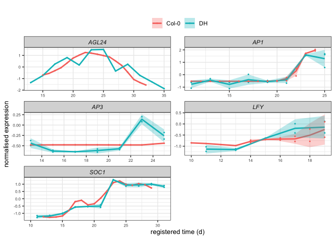
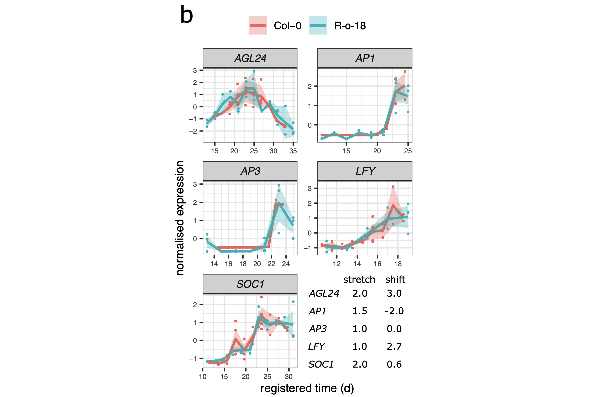

Gene registration – running all functions for *B.rapa* key floral genes
================

-   [Apply all of the registration function to *B.rapa* key floral
    genes](#apply-all-of-the-registration-function-to-brapa-key-floral-genes)
    -   [Background](#background)
    -   [Run scripts](#run-scripts)
    -   [Get the saved RDS data](#get-the-saved-rds-data)
        -   [Take the reference](#take-the-reference)
        -   [Get the registered key floral
            genes](#get-the-registered-key-floral-genes)
        -   [Plot the registered genes](#plot-the-registered-genes)
        -   [Debug (what happened)](#debug-what-happened)

``` r
knitr::opts_chunk$set(echo = TRUE)
library(GREAT)
library(ggplot2)
library(data.table)

source("scripts/chiifu_v3_scripts/unused_functions.R")
```

# Apply all of the registration function to *B.rapa* key floral genes

## Background

This short report is to try to run all of the registration functions,
with the purpose to get/reproduce the same results in Alex’s paper.

``` r
do.initial.rescale <- 'rescale' # should be 'rescale' if want to use scaled df for registration, rather than mean_df
do.register.rescale <- 'rescale' 
outdir.string <- 'TESTING_rescale_as_register___shuffled_g_v4__'
```

``` r
# calculate the scores associated with each candidate shift
# Arabidopsis observations = 7d -> 16d = 0d -> 9d
# Ro18 observations = 11d -> 35d = 0d -> 24d
# therefore if same start and end points stretch = 24 / 9

# lots of spurious overlaps detected when too extreme shifts allowed
stretch = c(2, 1.5, 1) 
min_num_overlapping_points = 4
shift.extreme  = 4 
transformed.timecourse = 'Col0' 
num.shuffled <- 1 
jobNum <- 1
```

## Run scripts

``` r
# setup flags for rescaling options
if (do.initial.rescale=='rescale') {
  initial.rescale <- TRUE
} else {
  initial.rescale <- FALSE
}
if (do.register.rescale=='rescale') {
  should.rescale <- TRUE
} else {
  should.rescale <- FALSE
}

if (initial.rescale==TRUE) {
  print('********************')
  print('will rescale the data prior to registering, and register using this rescaled mean data!')
  print('********************')
}
if (should.rescale==TRUE){
  print('********************')
  print('will rescale the data when deciding optimal registration!')
  print('********************')
} 
```

``` r
# directories to save graphs to
real.data.graph.dir <- paste0('graphs/gene_registration/', outdir.string, '_real_data/')
# shuffled.data.graph.dir <- paste0('graphs/gene_registration/', outdir.string, '_shuffled_data/job_', jobNum, '/')
# directories to save real and shuffled expression data to
real.expression.dir <- paste0('intermediate_data/gene_registration/', outdir.string, '_real_data/gene_expression/job_', jobNum, '/')
shuffled.expression.dir <- paste0('intermediate_data/gene_registration/', outdir.string, '_shuffled_data/gene_expression/')
# directories to save real and shuffled distance data to
real.distance.dir <- paste0('intermediate_data/gene_registration/', outdir.string, '_real_distance/job_', jobNum, '/')
shuffled.distance.dir <- paste0('intermediate_data/gene_registration/', outdir.string, '_shuffled_distance/')
  

# somewhere to store the data.tables and graphs
if (!(dir.exists(real.expression.dir))) {
    dir.create(real.expression.dir, recursive=T)
    dir.create(shuffled.expression.dir, recursive=T)
    
    dir.create(real.distance.dir, recursive=T)
    dir.create(shuffled.distance.dir, recursive=T)

    dir.create(real.data.graph.dir, recursive=T)
    dir.create(shuffled.data.graph.dir, recursive=T)
}
```

``` r
## GET THE RAW DATA. MEAN EXPRESSION OF BIOLOGICAL REPS. TREAT BRASSICA GENES INDIVIDUALLY (DON'T SUM THEM).
# load the data expression data. Consider the brassica genes individually (don't sum)
L <- load_mean_df() # sumBrassica copy flag is within load_mean_df()
mean_df <- L[[1]] # will compare Col0 vs Ro18 based on accession column
all.data.df <- L[[2]]
```

``` r
## PREPARE, AND REGISTER AND SCALE THE DATA
O <- prepare_scaled_and_registered_data(mean_df, all.data.df,
  stretch = stretch, initial.rescale, should.rescale, min_num_overlapping_points,
  shift.extreme, transformed.timecourse
)

mean_df <- O[["mean_df"]] # mean_df is unchanged
mean_df.sc <- O[["mean_df.sc"]] # mean_df.sc : data is scaled(center=T, scale=T)
imputed.mean_df <- O[["imputed.mean_df"]] # imputed.mean_df is registered data, Col0 values imputed to make a single timepoint.
all.shifts <- O[["all.shifts"]] # all.shifts is data.table of score for each shift for each gene.
model.comparison <- O[["model.comparison"]]

# sanity test plot
# ggplot(imputed.mean_df[imputed.mean_df$locus_name=='BRAA02G015410.3C',],
#        aes(x=shifted.time, y=mean.cpm, color=accession))+
#   geom_point()+
#   geom_line()

#### CALCULATE THE DISTANCES BETWEEN THE SAMPLES ####
O <- calculate_between_sample_distance(mean_df, mean_df.sc, imputed.mean_df)
D.mean <- O[["D.mean"]]
D.scaled <- O[["D.scaled"]]
D.registered <- O[["D.registered"]]
D.scaled.onlyNR <- O[["D.scaled.onlyNR"]]
D.scaled.onlyR <- O[["D.scaled.onlyR"]]
D.registered.onlyR <- O[["D.registered.onlyR"]]
```

``` r
saveRDS(mean_df, file = paste0(real.expression.dir, "mean_df.rds"))
saveRDS(mean_df.sc, file = paste0(real.expression.dir, "mean_df.sc.rds"))
saveRDS(imputed.mean_df, file = paste0(real.expression.dir, "imputed.mean_df.rds"))
saveRDS(all.shifts, file = paste0(real.expression.dir, "all.shifts.rds"))
saveRDS(model.comparison, file = paste0(real.expression.dir, "model.comparison.rds"))

# save the distances calculated
saveRDS(D.mean, file = paste0(real.distance.dir, "D.mean.rds"))
saveRDS(D.scaled, file = paste0(real.distance.dir, "D.scaled.rds"))
saveRDS(D.registered, file = paste0(real.distance.dir, "D.registered.rds"))
saveRDS(D.scaled.onlyNR, file = paste0(real.distance.dir, "D.scaled.onlyNR.rds"))
saveRDS(D.scaled.onlyR, file = paste0(real.distance.dir, "D.scaled.onlyR.rds"))
saveRDS(D.registered.onlyR, file = paste0(real.distance.dir, "D.registered.onlyR.rds"))
```

## Get the saved RDS data

``` r
mean_df <- readRDS("intermediate_data/gene_registration/TESTING_rescale_as_register___shuffled_g_v4___real_data/gene_expression/job_1/mean_df.rds")
imputed.mean_df <- readRDS("intermediate_data/gene_registration/TESTING_rescale_as_register___shuffled_g_v4___real_data/gene_expression/job_1/imputed.mean_df.rds")
model.comparison <- readRDS("intermediate_data/gene_registration/TESTING_rescale_as_register___shuffled_g_v4___real_data/gene_expression/job_1/model.comparison.rds")
```

``` r
mean_df %>% 
  head(10) %>% 
  knitr::kable()
```

| locus\_name      | accession | tissue | timepoint | mean.cpm |
|:-----------------|:----------|:-------|----------:|---------:|
| BRAA01G000040.3C | Ro18      | apex   |        11 | 240.3663 |
| BRAA01G000040.3C | Ro18      | apex   |        29 | 353.9387 |
| BRAA01G000040.3C | Ro18      | apex   |        31 | 334.7666 |
| BRAA01G000040.3C | Ro18      | apex   |        33 | 226.3425 |
| BRAA01G000040.3C | Ro18      | apex   |        35 | 202.9576 |
| BRAA01G000040.3C | Ro18      | apex   |        13 | 207.9839 |
| BRAA01G000040.3C | Ro18      | apex   |        15 | 220.3765 |
| BRAA01G000040.3C | Ro18      | apex   |        17 | 283.3469 |
| BRAA01G000040.3C | Ro18      | apex   |        19 | 297.3939 |
| BRAA01G000040.3C | Ro18      | apex   |        21 | 232.1549 |

``` r
imputed.mean_df %>% 
  head(10) %>% 
  knitr::kable()
```

| locus\_name      | accession | tissue | timepoint |   mean.cpm | stretched.time.delta | shifted.time | is.registered |
|:-----------------|:----------|:-------|----------:|-----------:|---------------------:|-------------:|:--------------|
| BRAA01G000040.3C | Ro18      | apex   |        11 |  0.0710772 |                    0 |           11 | TRUE          |
| BRAA01G000040.3C | Ro18      | apex   |        29 |  3.5092531 |                   18 |           29 | TRUE          |
| BRAA01G000040.3C | Ro18      | apex   |        31 |  2.9288561 |                   20 |           31 | TRUE          |
| BRAA01G000040.3C | Ro18      | apex   |        33 | -0.3534641 |                   22 |           33 | TRUE          |
| BRAA01G000040.3C | Ro18      | apex   |        35 | -1.0613940 |                   24 |           35 | TRUE          |
| BRAA01G000040.3C | Ro18      | apex   |        13 | -0.9092334 |                    2 |           13 | TRUE          |
| BRAA01G000040.3C | Ro18      | apex   |        15 | -0.5340718 |                    4 |           15 | TRUE          |
| BRAA01G000040.3C | Ro18      | apex   |        17 |  1.3722281 |                    6 |           17 | TRUE          |
| BRAA01G000040.3C | Ro18      | apex   |        19 |  1.7974730 |                    8 |           19 | TRUE          |
| BRAA01G000040.3C | Ro18      | apex   |        21 | -0.1775068 |                   10 |           21 | TRUE          |

``` r
model.comparison %>% 
  head(10) %>% 
  knitr::kable()
```

| gene             | seperate.AIC | registered.AIC | seperate.BIC | registered.BIC | stretch |      shift | is.best | BIC.registered.is.better | AIC.registered.is.better | ABIC.registered.is.better |
|:-----------------|-------------:|---------------:|-------------:|---------------:|--------:|-----------:|:--------|:-------------------------|:-------------------------|:--------------------------|
| BRAA01G000630.3C |     97.33704 |       123.0187 |     122.4692 |       139.7734 |       2 |  4.0000000 | TRUE    | FALSE                    | FALSE                    | FALSE                     |
| BRAA01G000680.3C |    140.90437 |       156.8583 |     165.6297 |       173.3418 |       2 | -0.4444444 | TRUE    | FALSE                    | FALSE                    | FALSE                     |
| BRAA01G000880.3C |    178.53595 |       194.9239 |     204.2536 |       212.0690 |       2 |  2.2222222 | TRUE    | FALSE                    | FALSE                    | FALSE                     |
| BRAA01G001200.3C |    139.06713 |       150.4136 |     164.7847 |       167.5587 |       2 |  3.1111111 | TRUE    | FALSE                    | FALSE                    | FALSE                     |
| BRAA01G001230.3C |    122.90216 |       127.0082 |     148.6198 |       144.1532 |       2 |  1.3333333 | TRUE    | TRUE                     | FALSE                    | FALSE                     |
| BRAA01G001240.3C |    154.35661 |       157.3255 |     180.0742 |       174.4706 |       2 |  0.4444444 | TRUE    | TRUE                     | FALSE                    | FALSE                     |
| BRAA01G002280.3C |    132.69604 |       142.9731 |     158.4137 |       160.1182 |       2 |  3.1111111 | TRUE    | FALSE                    | FALSE                    | FALSE                     |
| BRAA01G002390.3C |    108.60115 |       113.7270 |     133.3265 |       130.2106 |       2 | -0.4444444 | TRUE    | TRUE                     | FALSE                    | FALSE                     |
| BRAA01G002980.3C |    137.61527 |       145.6238 |     163.3329 |       162.7689 |       2 |  3.1111111 | TRUE    | TRUE                     | FALSE                    | FALSE                     |
| BRAA01G003080.3C |    133.61625 |       156.9642 |     159.3339 |       174.1093 |       2 |  3.1111111 | TRUE    | FALSE                    | FALSE                    | FALSE                     |

### Take the reference

This reference table contains all of the name of key floral genes.

``` r
id_table <- readRDS("reference_data/ID_TABLE_brapa-v3.rds")

id_table_unique_key_floral <- unique(id_table[, c('locus_name', 'symbol', 'CDS.model')]) %>% 
  dplyr::filter(!is.na(symbol)) %>% 
  dplyr::filter(symbol %in% c("SOC1", "LFY", "AP1", "AP3", "AGL24"))
```

``` r
id_table_unique_key_floral %>% 
  knitr::kable()
```

| locus\_name | symbol | CDS.model        |
|:------------|:-------|:-----------------|
| AT4G24540   | AGL24  | BRAA01G016140.3C |
| AT1G69120   | AP1    | BRAA02G018970.3C |
| AT5G61850   | LFY    | BRAA02G043220.3C |
| AT2G45660   | SOC1   | BRAA03G023790.3C |
| AT4G24540   | AGL24  | BRAA03G051930.3C |
| AT3G54340   | AP3    | BRAA04G005470.3C |
| AT2G45660   | SOC1   | BRAA05G005370.3C |
| AT5G61850   | LFY    | BRAA06G025360.3C |
| AT1G69120   | AP1    | BRAA07G030470.3C |
| AT1G69120   | AP1    | BRAA07G034100.3C |
| AT3G54340   | AP3    | BRAA09G045310.3C |

``` r
# get list of CDS.model
cds_model_wanted <- id_table_unique_key_floral %>% 
  dplyr::pull(CDS.model)
```

### Get the registered key floral genes

``` r
imputed.mean_df_key_floral <- imputed.mean_df %>% 
  dplyr::filter(locus_name %in% cds_model_wanted)
```

``` r
# left join to get the symbol genes (e.g. AP3 etc) to the main df
imputed.mean_df_wanted <- imputed.mean_df_key_floral %>%
  dplyr::left_join(id_table_unique_key_floral, by = c("locus_name" = "CDS.model")) %>% 
  dplyr::select(-c(locus_name.y)) %>%
  dplyr::rename(locus_name = symbol, bra_gene = locus_name)
```

### Plot the registered genes

``` r
plot_registered_GoIs_for_comparible_timepoints(imputed.mean_df_wanted)
```

<!-- -->

Figure in Ales’s paper:

<!-- -->

### Debug (what happened)

#### Missing “CDS.model”?

``` r
raw <- readRDS("final_data/rds/ro18_chiifu_apex.rds")
```

``` r
raw %>% 
  head(5) %>% 
  knitr::kable()
```

| CDS.model        | sample\_id                         |     FPKM | accession | tissue | timepoint | dataset        | est\_counts | group        |  norm.cpm |
|:-----------------|:-----------------------------------|---------:|:----------|:-------|----------:|:---------------|------------:|:-------------|----------:|
| BRAA01G000010.3C | ERR\_ro18\_rna\_seq\_v3\_R18A1\_1  | 0.525918 | Ro18      | apex   |        11 | ro18\_rna\_seq |          35 | Ro18-apex-11 | 1.1575473 |
| BRAA01G000010.3C | ERR\_ro18\_rna\_seq\_v3\_R18A1\_2  | 0.460724 | Ro18      | apex   |        11 | ro18\_rna\_seq |          33 | Ro18-apex-11 | 0.9933499 |
| BRAA01G000010.3C | ERR\_ro18\_rna\_seq\_v3\_R18A1\_3  | 0.514991 | Ro18      | apex   |        11 | ro18\_rna\_seq |          35 | Ro18-apex-11 | 1.1297367 |
| BRAA01G000010.3C | ERR\_ro18\_rna\_seq\_v3\_R18A10\_1 | 0.512858 | Ro18      | apex   |        29 | ro18\_rna\_seq |          32 | Ro18-apex-29 | 1.0542927 |
| BRAA01G000010.3C | ERR\_ro18\_rna\_seq\_v3\_R18A10\_2 | 0.413650 | Ro18      | apex   |        29 | ro18\_rna\_seq |          29 | Ro18-apex-29 | 0.8984799 |

``` r
id_table_unique_key_floral %>% 
  knitr::kable()
```

| locus\_name | symbol | CDS.model        |
|:------------|:-------|:-----------------|
| AT4G24540   | AGL24  | BRAA01G016140.3C |
| AT1G69120   | AP1    | BRAA02G018970.3C |
| AT5G61850   | LFY    | BRAA02G043220.3C |
| AT2G45660   | SOC1   | BRAA03G023790.3C |
| AT4G24540   | AGL24  | BRAA03G051930.3C |
| AT3G54340   | AP3    | BRAA04G005470.3C |
| AT2G45660   | SOC1   | BRAA05G005370.3C |
| AT5G61850   | LFY    | BRAA06G025360.3C |
| AT1G69120   | AP1    | BRAA07G030470.3C |
| AT1G69120   | AP1    | BRAA07G034100.3C |
| AT3G54340   | AP3    | BRAA09G045310.3C |

``` r
cds_model_raw <-raw %>% 
  dplyr::filter(CDS.model %in% cds_model_wanted) %>%
  dplyr::pull(CDS.model) %>% 
  unique()

cds_model_raw
```

    ##  [1] "BRAA02G018970.3C" "BRAA02G043220.3C" "BRAA03G023790.3C" "BRAA03G051930.3C"
    ##  [5] "BRAA04G005470.3C" "BRAA05G005370.3C" "BRAA06G025360.3C" "BRAA07G030470.3C"
    ##  [9] "BRAA07G034100.3C" "BRAA09G045310.3C"

``` r
cds_model_wanted
```

    ##  [1] "BRAA01G016140.3C" "BRAA02G018970.3C" "BRAA02G043220.3C" "BRAA03G023790.3C"
    ##  [5] "BRAA03G051930.3C" "BRAA04G005470.3C" "BRAA05G005370.3C" "BRAA06G025360.3C"
    ##  [9] "BRAA07G030470.3C" "BRAA07G034100.3C" "BRAA09G045310.3C"

``` r
dplyr::setdiff(cds_model_wanted, cds_model_raw)
```

    ## [1] "BRAA01G016140.3C"

``` r
id_table_unique_key_floral %>% 
  dplyr::filter(CDS.model == dplyr::setdiff(cds_model_wanted, cds_model_raw)) %>% 
  knitr::kable()
```

| locus\_name | symbol | CDS.model        |
|:------------|:-------|:-----------------|
| AT4G24540   | AGL24  | BRAA01G016140.3C |

#### Do they actually have the same optimal parameters?

``` r
model.comparison %>% 
  dplyr::filter(gene %in% cds_model_wanted) %>% 
  dplyr::select(gene, stretch, shift) %>% 
  dplyr::left_join(id_table_unique_key_floral, by = c("gene" = "CDS.model")) %>% 
  dplyr::select(symbol, gene, stretch, shift) %>% 
  dplyr::arrange(symbol) %>% 
  knitr::kable()
```

| symbol | gene             | stretch |      shift |
|:-------|:-----------------|--------:|-----------:|
| AGL24  | BRAA03G051930.3C |     2.0 |  3.1111111 |
| AP1    | BRAA07G030470.3C |     1.5 |  0.0000000 |
| AP1    | BRAA07G034100.3C |     1.5 |  0.0000000 |
| AP1    | BRAA02G018970.3C |     1.0 |  4.0000000 |
| AP3    | BRAA04G005470.3C |     2.0 |  0.0000000 |
| AP3    | BRAA09G045310.3C |     2.0 |  0.0000000 |
| LFY    | BRAA02G043220.3C |     2.0 | -4.0000000 |
| LFY    | BRAA06G025360.3C |     1.5 |  2.2222222 |
| SOC1   | BRAA03G023790.3C |     2.0 |  0.4444444 |
| SOC1   | BRAA05G005370.3C |     2.0 |  0.4444444 |

``` r
seq(-4, 4, length.out = 10)
```

    ##  [1] -4.0000000 -3.1111111 -2.2222222 -1.3333333 -0.4444444  0.4444444
    ##  [7]  1.3333333  2.2222222  3.1111111  4.0000000

The paramater used by alex

``` r
seq(-4, 4, length.out = 13)
```

    ##  [1] -4.0000000 -3.3333333 -2.6666667 -2.0000000 -1.3333333 -0.6666667
    ##  [7]  0.0000000  0.6666667  1.3333333  2.0000000  2.6666667  3.3333333
    ## [13]  4.0000000
