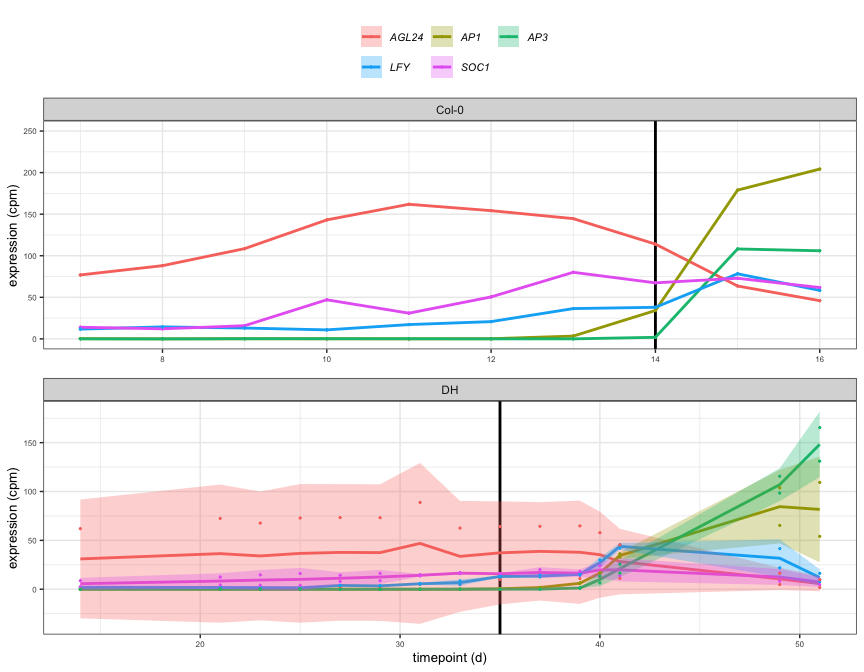
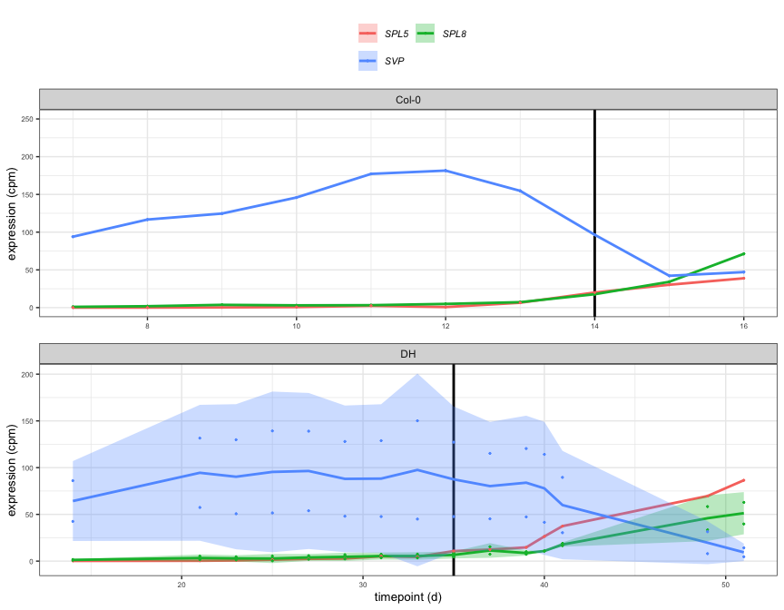
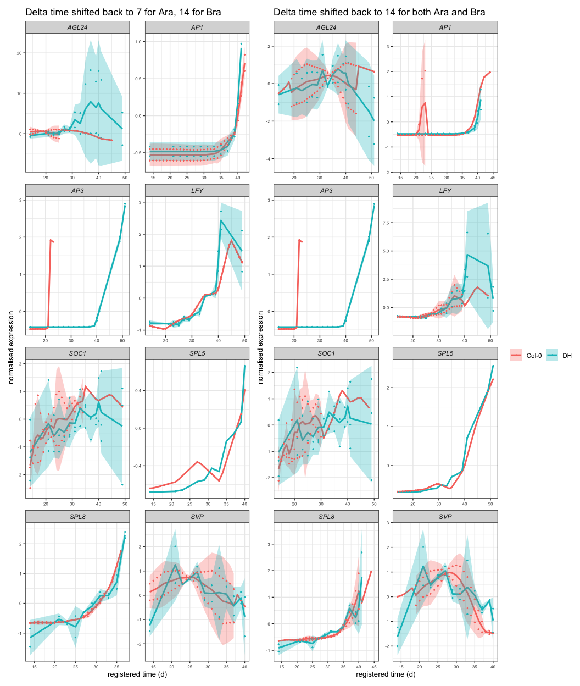
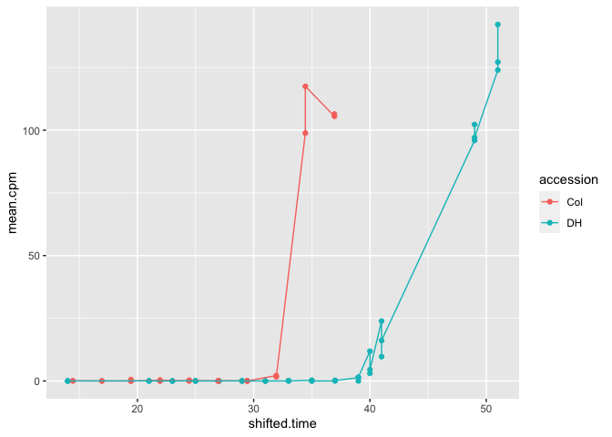

Running all of gene-registration functions for limited genes in B.
Oleracea
================

-   [Get all of data](#get-all-of-data)
-   [Specify all parameters](#specify-all-parameters)
-   [Run the shift, stretch data](#run-the-shift-stretch-data)
-   [Plotting the results](#plotting-the-results)
    -   [Try to plot shifted AP3](#try-to-plot-shifted-ap3)
-   [Debug——————————–](#debug)
    -   [Change accession names](#change-accession-names)
    -   [Getting extreme shifts](#getting-extreme-shifts)

``` r
knitr::opts_chunk$set()
library(genereg)
library(ggplot2)
library(data.table)
library(cowplot)
library(ggpubr)
```

    ## 
    ## Attaching package: 'ggpubr'

    ## The following object is masked from 'package:cowplot':
    ## 
    ##     get_legend

## Get all of data

``` r
# Get all of the data path
table_id_path <- "/Users/kristiar/PhD/second-rotation-JIC/b_oleracea/data/ID_TAB.csv"
ara_path <- '/Users/kristiar/PhD/second-rotation-JIC/b_oleracea/data/klepikova.rds'
b_oleracea_path <- "/Users/kristiar/PhD/second-rotation-JIC/b_oleracea/data/dh_with_sample_id.rds"
```

``` r
table_id_info_key_floral_genes <- data.table::fread(table_id_path) %>% 
  dplyr::filter(symbol %in% c("SOC1", "AP1", "AP3", "AGL24", "LFY", "SPL8", "SVP", "SPL5")) %>% 
  dplyr::select(CDS.model, symbol, locus_name) %>% 
  unique() %>% 
  dplyr::arrange(symbol)


table_id_info_key_floral_genes %>% 
  knitr::kable()
```

| CDS.model  | symbol | locus\_name |
|:-----------|:-------|:------------|
| Bo1g039080 | AGL24  | AT4G24540   |
| Bo7g109590 | AGL24  | AT4G24540   |
| Bo2g062650 | AP1    | AT1G69120   |
| Bo6g095760 | AP1    | AT1G69120   |
| Bo6g108600 | AP1    | AT1G69120   |
| Bo4g120010 | AP3    | AT3G54340   |
| Bo8g083600 | AP3    | AT3G54340   |
| Bo2g161690 | LFY    | AT5G61850   |
| Bo3g109270 | LFY    | AT5G61850   |
| Bo3g038880 | SOC1   | AT2G45660   |
| Bo4g024850 | SOC1   | AT2G45660   |
| Bo4g195720 | SOC1   | AT2G45660   |
| Bo1g129690 | SPL5   | AT3G15270   |
| Bo5g127310 | SPL5   | AT3G15270   |
| Bo9g137270 | SPL5   | AT3G15270   |
| Bo5g001290 | SPL8   | AT1G02065   |
| Bo8g118210 | SPL8   | AT1G02065   |
| Bo4g149800 | SVP    | AT2G22540   |
| Bo8g101000 | SVP    | AT2G22540   |

``` r
# Get the current genes of interest 

list_gene_of_interest <- data.table::fread(table_id_path) %>% 
  dplyr::filter(symbol %in% c("SOC1", "AP1", "AP3", "AGL24", "LFY", "SPL8", "SVP", "SPL5")) %>% 
  dplyr::pull(locus_name) %>% 
  unique()

list_gene_of_interest
```

    ## [1] "AT4G24540" "AT3G15270" "AT1G69120" "AT5G61850" "AT2G45660" "AT3G54340"
    ## [7] "AT2G22540" "AT1G02065"

``` r
b_oleracea_mean_df <- genereg::load_mean_df(
  file_path_brassica = b_oleracea_path,
  file_path_arabidopsis = ara_path,
  file_path_id_table = table_id_path,
  tissue_wanted = "apex",
  curr_GoIs = list_gene_of_interest,
  sum_brassicas = F
)
```

    ## [1] "15 brassica genes considered in the comparison"
    ## [1] "Discarded genes: BO1G129690, BO4G195720, BO9G137270"

``` r
b_oleracea_mean_df[[1]] %>%
  head(10) %>% 
  knitr::kable()
```

| locus\_name | accession | tissue | timepoint |   mean.cpm |
|:------------|:----------|:-------|----------:|-----------:|
| BO1G039080  | DH        | apex   |        37 | 13.0537645 |
| BO1G039080  | DH        | apex   |        39 | 10.8384186 |
| BO1G039080  | DH        | apex   |        40 | 12.8941918 |
| BO1G039080  | DH        | apex   |        41 | 11.1781454 |
| BO1G039080  | DH        | apex   |        49 |  4.7681886 |
| BO1G039080  | DH        | apex   |        51 |  1.7475448 |
| BO1G039080  | DH        | apex   |        14 |  0.0000000 |
| BO1G039080  | DH        | apex   |        21 |  0.3524117 |
| BO1G039080  | DH        | apex   |        23 |  0.4133885 |
| BO1G039080  | DH        | apex   |        25 |  0.4869813 |

#### Check if there is genes are missing

``` r
b_oleracea_mean_df[[1]] %>% 
  dplyr::pull(locus_name) %>% 
  unique()
```

    ##  [1] "BO1G039080" "BO2G161690" "BO3G038880" "BO3G109270" "BO4G024850"
    ##  [6] "BO4G120010" "BO4G149800" "BO5G001290" "BO5G127310" "BO6G095760"
    ## [11] "BO6G108600" "BO7G109590" "BO8G083600" "BO8G101000" "BO8G118210"

``` r
missing_genes <- setdiff(table_id_info_key_floral_genes %>% dplyr::pull(CDS.model) %>% toupper(), 
        b_oleracea_mean_df[[1]] %>% dplyr::pull(locus_name) %>% unique())

missing_genes
```

    ## [1] "BO2G062650" "BO4G195720" "BO1G129690" "BO9G137270"

``` r
# What are they? 

table_id_info_key_floral_genes %>% 
  dplyr::mutate(CDS.model = toupper(CDS.model)) %>% 
  dplyr::filter(CDS.model %in% missing_genes) %>% 
  knitr::kable()
```

| CDS.model  | symbol | locus\_name |
|:-----------|:-------|:------------|
| BO2G062650 | AP1    | AT1G69120   |
| BO4G195720 | SOC1   | AT2G45660   |
| BO1G129690 | SPL5   | AT3G15270   |
| BO9G137270 | SPL5   | AT3G15270   |

``` r
# Check the data availability from the original RDS
b_oleracea_rds <- readRDS(b_oleracea_path)

setdiff(missing_genes, b_oleracea_rds %>% 
  dplyr::pull(CDS.model) %>% 
  unique())
```

    ## [1] "BO2G062650"

## Specify all parameters

``` r
do.initial.rescale <- 'TRUE' # should be 'rescale' if want to use scaled df for registration, rather than mean.df
do.register.rescale <- 'rescale' 
outdir.string <- 'TESTING_B_Oleracea_key_floral_genes'

stretch = c(6, 5.5, 5, 4.5, 4, 3.5, 3, 2.5)
min.num.overlapping.points = 4
shift.extreme = 6
transformed.timecourse = 'Col0'
num.shuffled <- 1 
jobNum <- 1
```

    ## [1] "********************"
    ## [1] "will rescale the data when deciding optimal registration!"
    ## [1] "********************"

## Run the shift, stretch data

``` r
# just for test
mean.df <- b_oleracea_mean_df[[1]] %>% 
  dplyr::mutate(accession = ifelse(accession == "DH", "Ro18", "Col0"))
all.data.df <- b_oleracea_mean_df[[2]] %>% 
  dplyr::mutate(accession = ifelse(accession == "DH", "Ro18", "Col0"))
```

``` r
mean.df_to_plot <- mean.df %>%
  dplyr::left_join(table_id_info_key_floral_genes %>% 
                     dplyr::mutate(CDS.model = toupper(CDS.model)), by = c("locus_name" = "CDS.model")) %>% 
  dplyr::rename(bra_gene = locus_name, Ara.id = locus_name.y, Ara.name = symbol)

plot_goI_expression(mean.df_to_plot %>% 
                      dplyr::filter(Ara.name %in% c("AGL24", "SOC1", "AP1", "AP3", "LFY")))
```

<!-- -->

``` r
plot_goI_expression(mean.df_to_plot %>% 
                      dplyr::filter(Ara.name %in% c("SPL5", "SPL8", "SVP")))
```

<!-- -->

``` r
shifted_stretched_all <- prepare_scaled_and_registered_data(
  mean.df, 
  all.data.df,
  stretch, 
  initial.rescale = TRUE, 
  # do.rescale = should.rescale,
  do.rescale = TRUE,
  min.num.overlapping.points,
  shift.extreme, 
  transformed.timecourse
)
```

## Plotting the results

``` r
imputed_mean_df_shifted_back <- readRDS("intermediate_data/gene_registration/b_oleracea_shifted_to_original_7_14_to_plot.RDS")
imputed_mean_df_shifted_to_brassica <- readRDS("intermediate_data/gene_registration/b_oleracea_from_original_14_14_to_plot.RDS")
```

``` r
plot_a <- plot_registered_GoIs_for_comparible_timepoints_new(imputed_mean_df_shifted_back) + 
  ggtitle('Delta time shifted back to 7 for Ara, 14 for Bra')
plot_b <- plot_registered_GoIs_for_comparible_timepoints_new(imputed_mean_df_shifted_to_brassica) + 
  ggtitle('Delta time shifted back to 14 for both Ara and Bra')
```

``` r
list(plot_a, plot_b) %>%
  patchwork::wrap_plots(ncol = 2, guides = "collect")
```

<!-- -->

### Try to plot shifted AP3

``` r
bra_genes_AP3 <- table_id_info_key_floral_genes %>% 
  dplyr::filter(symbol == "AP3") %>% 
  dplyr::pull(CDS.model) %>% 
  toupper()

bra_genes_AP3
```

    ## [1] "BO4G120010" "BO8G083600"

``` r
all.shifts <- readRDS("intermediate_data/gene_registration/all.shifts_b_oleracea_from_original_14_14.RDS")
model.comparison.dt <- readRDS("intermediate_data/gene_registration/model.comparison_b_oleracea_from_original_14_14.RDS")

best_shift_stretch_AP3 <- model.comparison.dt %>% 
  dplyr::filter(gene %in% bra_genes_AP3) %>% 
  dplyr::select(gene, stretch, shift)

best_shift_stretch_AP3 %>% 
  knitr::kable()
```

| gene       | stretch |     shift |
|:-----------|--------:|----------:|
| BO8G083600 |     3.0 | 4.8888889 |
| BO4G120010 |     2.5 | 0.4444444 |

``` r
AP3_shifted_results <- apply_best_shift(all.data.df, best_shift_stretch_AP3)
```

    ## [1] "No normalisation was carried out DURING registration (though may have been, prior to Col-Ro18 comparison)"
    ## [1] "applying best shift..."
    ## [1] "done!"

``` r
AP3_shifted_results <- AP3_shifted_results %>% 
  dplyr::mutate(accession = ifelse(accession == "Ro18", "DH", "Col"))
```

Plot the results

``` r
ggplot2::ggplot(AP3_shifted_results[AP3_shifted_results$locus_name=='BO8G083600'])+
  ggplot2::aes(x=shifted.time, y=mean.cpm, color=accession) +
  ggplot2::geom_point() +
  ggplot2::geom_line()
```

<!-- -->

``` r
ggplot2::ggplot(AP3_shifted_results[AP3_shifted_results$locus_name=='BO4G120010'])+
  ggplot2::aes(x=shifted.time, y=mean.cpm, color=accession) +
  ggplot2::geom_point() +
  ggplot2::geom_line()
```

<!-- -->

``` r
mean_df <- shifted_stretched_all[["mean.df"]] 
mean.df.sc <- shifted_stretched_all[["mean.df.sc"]]
imputed.mean.df <- shifted_stretched_all[["imputed.mean.df"]] 
all.shifts <- shifted_stretched_all[["all.shifts"]] 
model.comparison <- shifted_stretched_all[["model.comparison"]]
```

``` r
# Left join to get the symbol genes (e.g. AP3 etc) to the main df
imputed.mean.df_wanted <- imputed.mean.df %>%
  dplyr::left_join(table_id_info_key_floral_genes %>% 
                     dplyr::mutate(CDS.model = toupper(CDS.model)), by = c("locus_name" = "CDS.model")) %>% 
  dplyr::select(-c(locus_name.y)) %>%
  dplyr::rename(locus_name = symbol, bra_gene = locus_name)
```

``` r}
# registered.plot.df <- imputed.mean.df_wanted
# registered.plot.df <- registered.plot.df[(registered.plot.df$shifted.time >=14),]
test <- imputed.mean.df_wanted %>% 
  dplyr::filter(dplyr::case_when(locus_name == "AGL24" ~ shifted.time >= 14 & shifted.time <= 51, 
                          locus_name == "AP1" ~  shifted.time >= 14 & shifted.time <= 45,
                          locus_name == "AP3" ~  shifted.time >= 14 & shifted.time <= 51,
                          locus_name == "AGL24" ~ shifted.time >= 14 & shifted.time <= 51,
                          locus_name == "LFY" ~ shifted.time >= 14 & shifted.time <= 51,
                          locus_name == "SOC1" ~ shifted.time >= 14 & shifted.time <= 50,
                          locus_name == "SPL8" ~ shifted.time >= 14 & shifted.time <= 45,
                          locus_name == "SPL5" ~ shifted.time >= 14 & shifted.time <= 51,
                          T ~  shifted.time >= 14 & shifted.time <= 40))
```

``` r
plot_registered_GoIs_for_comparible_timepoints_new(test)
```

``` r
model.comparison %>% 
  # dplyr::filter(gene %in% cds_model_wanted) %>% 
  dplyr::select(gene, stretch, shift) %>% 
  dplyr::left_join(table_id_info_key_floral_genes %>% 
                     dplyr::mutate(CDS.model = toupper(CDS.model)), by = c("gene" = "CDS.model")) %>% 
  dplyr::select(symbol, gene, stretch, shift) %>% 
  dplyr::arrange(symbol) 
```

## Debug——————————–

### Change accession names

``` r
change.accession.names_df <- change.accession.names(mean.df, all.data.df, transformed.timecourse)
```

``` r
setdiff(change.accession.names_df[[1]], mean.df)
```

``` r
change.accession.names_df[['original.transformed.accession.name']]
change.accession.names_df[['original.other.accession.name']]
```

``` r
mean.df.sc <- data.table::copy(mean.df)
mean.df.sc
```

``` r
# specify what kind of scaling
# TODO: handle my.scale in conditional
mean.df.sc[, sc.mean.cpm:=scale(mean.cpm, scale=TRUE, center=TRUE), by=.(locus_name, accession)]
mean.df.sc
```

``` r
# if rescale == true
to.shift.df <- data.table::copy(mean.df.sc)
to.shift.df$mean.cpm <- to.shift.df$sc.mean.cpm
to.shift.df$sc.mean.cpm <- NULL
# apply THE SAME rescale to all.data.df prior to registration
# TODO: handle my.scale in conditional
all.data.df <- scale_all_rep_data(mean.df, all.data.df, 'scale')
```

``` r
to.shift.df 
```

#### Until here is okay ———

``` r
L <- get_best_stretch_and_shift(to.shift.df, all.data.df, stretches = stretch, do.rescale = should.rescale, min.num.overlapping.points, shift.extreme)
```

``` r
all_shifts <- L[['all_shifts']]
best_shifts <- L[['best_shifts']]
model.comparison.dt <- L[['model.comparison.dt']]

model.comparison.dt %>% 
  # dplyr::select(-c(seperate.AIC, registered.AIC)) %>%
  dplyr::left_join(table_id_info_key_floral_genes %>% 
                     dplyr::mutate(CDS.model = toupper(CDS.model)), by = c("gene" = "CDS.model")) %>% 
  # dplyr::select(symbol, gene, stretch, shift) %>% 
  dplyr::arrange(symbol) 
```

``` r
# report model comparison results
model.comparison.dt$BIC.registered.is.better <- (model.comparison.dt$registered.BIC < model.comparison.dt$seperate.BIC)
model.comparison.dt$AIC.registered.is.better <- (model.comparison.dt$registered.AIC < model.comparison.dt$seperate.AIC)
model.comparison.dt$ABIC.registered.is.better <- (model.comparison.dt$BIC.registered.is.better & model.comparison.dt$AIC.registered.is.better)
print("################## Model comparison results #######################")
print(paste0("AIC finds registration better than seperate for :", sum(model.comparison.dt$AIC.registered.is.better), " / ", nrow(model.comparison.dt)))
print(paste0("BIC finds registration better than seperate for :", sum(model.comparison.dt$BIC.registered.is.better), " / ", nrow(model.comparison.dt)))
print(paste0("AIC & BIC finds registration better than seperate for :", sum(model.comparison.dt$ABIC.registered.is.better), " / ", nrow(model.comparison.dt)))
print("###################################################################")
```

``` r
model.comparison.dt %>% 
  dplyr::select(-c(seperate.AIC, registered.AIC, AIC.registered.is.better)) %>%
  dplyr::left_join(table_id_info_key_floral_genes %>% 
                     dplyr::mutate(CDS.model = toupper(CDS.model)), by = c("gene" = "CDS.model")) %>% 
  # dplyr::select(symbol, gene, stretch, shift) %>% 
  dplyr::arrange(symbol) 
```

``` r
shifted.mean.df <- apply_shift_to_registered_genes_only(to.shift.df, best_shifts, model.comparison.dt)
```

``` r
locus <- c("Bo4g120010", "Bo8g083600")
shifted.mean.df %>% 
  dplyr::filter(locus_name %in% toupper(locus))
```

``` r
imputed.mean.df <- impute_arabidopsis_values(shifted.mean.df)
```

``` r
imputed.mean.df %>% 
  dplyr::filter(locus_name %in% toupper(locus))
```

``` r
# left join to get the symbol genes (e.g. AP3 etc) to the main df
imputed.mean.df_wanted <- imputed.mean.df %>%
  dplyr::left_join(table_id_info_key_floral_genes %>% 
                     dplyr::mutate(CDS.model = toupper(CDS.model)), by = c("locus_name" = "CDS.model")) %>% 
  dplyr::select(-c(locus_name.y)) %>%
  dplyr::rename(locus_name = symbol, bra_gene = locus_name)
```

``` r
plot_registered_GoIs_for_comparible_timepoints(imputed.mean.df_wanted)
```

### Getting extreme shifts

``` r
# Make input data name as it is inside the function
test <- mean_df
stretch_factor <- stretch
stretch_factor

curr_sym <- unique(test$locus_name)[2]
curr_sym

test <- test[test$locus_name==curr_sym, ]
# test
```

``` r
# transform timepoint to be time from first timepoint
test[, delta.time:=timepoint - min(timepoint), by=.(accession)]
# test
```

``` r
ggplot(test[test$locus_name=='BO2G161690',],
       aes(x=delta.time, y=mean.cpm, color=accession))+
  geom_point()+
  geom_line()
```

``` r
# apply stretch_factor to the arabidopsis, leave the rapa as is
test$delta.time[test$accession=='Col0'] <- test$delta.time[test$accession=='Col0'] * 6

# test
```

``` r
ggplot(test,
       aes(x=delta.time, y=mean.cpm, color=accession))+
  geom_point()+
  geom_line()
```
