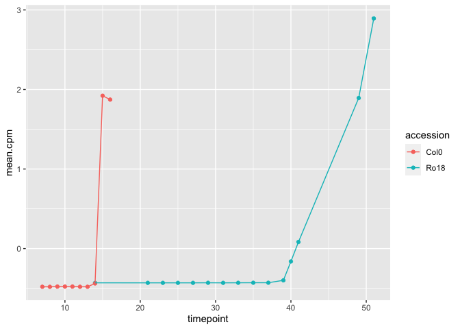
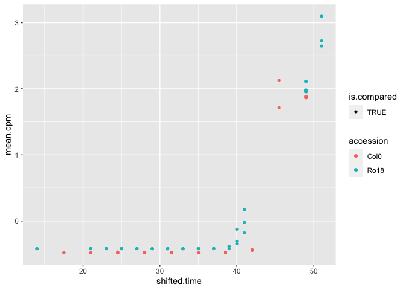

Get myself understand why AP3 did not want to be stretched/shifted
================

-   [Background](#background)
-   [Get the data](#get-the-data)
-   [Specify all parameters](#specify-all-parameters)
-   [Get best shift for one shift](#get-best-shift-for-one-shift)
-   [Running
    calculate\_all\_model\_comparison\_stats](#running-calculate_all_model_comparison_stats)

``` r
knitr::opts_chunk$set(echo = TRUE)
library(GREAT)
library(ggplot2)
library(data.table)
library(cowplot)
library(ggpubr)
```

    ## 
    ## Attaching package: 'ggpubr'

    ## The following object is masked from 'package:cowplot':
    ## 
    ##     get_legend

## Background

Investigating why AP3 gene did not want to get stretched and shifted. I
tried to step-by-step understand the process.

## Get the data

``` r
# Get all of the data path
table_id_path <- "/Users/kristiar/PhD/second-rotation-JIC/b_oleracea/data/ID_TAB.csv"
ara_path <- '/Users/kristiar/PhD/second-rotation-JIC/b_oleracea/data/klepikova.rds'
b_oleracea_path <- "/Users/kristiar/PhD/second-rotation-JIC/b_oleracea/data/dh_with_sample_id.rds"

table_id_info_key_floral_genes <- data.table::fread(table_id_path) %>% 
  dplyr::filter(symbol == "AP3") %>% 
  dplyr::select(CDS.model, symbol, locus_name) %>% 
  unique() %>% 
  dplyr::arrange(symbol)

list_gene_AP3 <- table_id_info_key_floral_genes  %>%
  dplyr::pull(locus_name) %>%
  unique()

table_id_info_key_floral_genes
```

    ##     CDS.model symbol locus_name
    ## 1: Bo4g120010    AP3  AT3G54340
    ## 2: Bo8g083600    AP3  AT3G54340

``` r
# tools::file_ext("/Users/kristiar/PhD/second-rotation-JIC/b_oleracea/data/ID_TAB.csv")

b_oleracea_mean_df_AP3 <- GREAT::load_mean_df(
  file_path_brassica = b_oleracea_path,
  file_path_arabidopsis = ara_path,
  file_path_id_table = table_id_path,
  tissue_wanted = "apex",
  curr_GoIs = list_gene_AP3,
  sum_brassicas = F
)
```

    ## [1] "2 brassica genes considered in the comparison"
    ## [1] "2 all genes considered in the comparison"

``` r
# just for test
mean_df <- b_oleracea_mean_df_AP3[[1]] %>% 
  dplyr::mutate(accession = ifelse(accession == "DH", "Ro18", "Col0"))
all.data.df <- b_oleracea_mean_df_AP3[[2]] %>% 
  dplyr::mutate(accession = ifelse(accession == "DH", "Ro18", "Col0"))
```

``` r
mean_df
```

    ##     locus_name accession tissue timepoint     mean_cpm
    ##  1: BO4G120010      Ro18   apex        37 1.285588e-01
    ##  2: BO4G120010      Ro18   apex        39 9.283968e-01
    ##  3: BO4G120010      Ro18   apex        40 6.475194e+00
    ##  4: BO4G120010      Ro18   apex        41 1.655575e+01
    ##  5: BO4G120010      Ro18   apex        49 9.841951e+01
    ##  6: BO4G120010      Ro18   apex        51 1.311016e+02
    ##  7: BO4G120010      Ro18   apex        14 0.000000e+00
    ##  8: BO4G120010      Ro18   apex        21 1.484708e-02
    ##  9: BO4G120010      Ro18   apex        23 0.000000e+00
    ## 10: BO4G120010      Ro18   apex        25 1.461867e-02
    ## 11: BO4G120010      Ro18   apex        27 0.000000e+00
    ## 12: BO4G120010      Ro18   apex        29 1.529910e-02
    ## 13: BO4G120010      Ro18   apex        31 0.000000e+00
    ## 14: BO4G120010      Ro18   apex        33 5.626598e-02
    ## 15: BO4G120010      Ro18   apex        35 9.933332e-02
    ## 16: BO8G083600      Ro18   apex        37 7.546722e-02
    ## 17: BO8G083600      Ro18   apex        39 1.575683e+00
    ## 18: BO8G083600      Ro18   apex        40 1.337814e+01
    ## 19: BO8G083600      Ro18   apex        41 2.555993e+01
    ## 20: BO8G083600      Ro18   apex        49 1.156119e+02
    ## 21: BO8G083600      Ro18   apex        51 1.653839e+02
    ## 22: BO8G083600      Ro18   apex        14 7.782909e-03
    ## 23: BO8G083600      Ro18   apex        21 0.000000e+00
    ## 24: BO8G083600      Ro18   apex        23 0.000000e+00
    ## 25: BO8G083600      Ro18   apex        25 0.000000e+00
    ## 26: BO8G083600      Ro18   apex        27 0.000000e+00
    ## 27: BO8G083600      Ro18   apex        29 4.111749e-02
    ## 28: BO8G083600      Ro18   apex        31 0.000000e+00
    ## 29: BO8G083600      Ro18   apex        33 3.751065e-02
    ## 30: BO8G083600      Ro18   apex        35 7.030730e-02
    ## 31: BO4G120010      Col0   apex         7 3.709504e-02
    ## 32: BO4G120010      Col0   apex         8 0.000000e+00
    ## 33: BO4G120010      Col0   apex         9 1.359425e-01
    ## 34: BO4G120010      Col0   apex        10 1.381684e-01
    ## 35: BO4G120010      Col0   apex        11 1.447425e-01
    ## 36: BO4G120010      Col0   apex        12 2.698227e-02
    ## 37: BO4G120010      Col0   apex        13 2.873793e-02
    ## 38: BO4G120010      Col0   apex        14 1.893566e+00
    ## 39: BO4G120010      Col0   apex        15 1.081783e+02
    ## 40: BO4G120010      Col0   apex        16 1.059899e+02
    ## 41: BO8G083600      Col0   apex         7 3.709504e-02
    ## 42: BO8G083600      Col0   apex         8 0.000000e+00
    ## 43: BO8G083600      Col0   apex         9 1.359425e-01
    ## 44: BO8G083600      Col0   apex        10 1.381684e-01
    ## 45: BO8G083600      Col0   apex        11 1.447425e-01
    ## 46: BO8G083600      Col0   apex        12 2.698227e-02
    ## 47: BO8G083600      Col0   apex        13 2.873793e-02
    ## 48: BO8G083600      Col0   apex        14 1.893566e+00
    ## 49: BO8G083600      Col0   apex        15 1.081783e+02
    ## 50: BO8G083600      Col0   apex        16 1.059899e+02
    ##     locus_name accession tissue timepoint     mean_cpm

## Specify all parameters

``` r
do.initial_rescale <- 'TRUE' # should be 'rescale' if want to use scaled df for registration, rather than mean_df
do.register.rescale <- 'rescale' 
outdir.string <- 'TESTING_B_Oleracea_key_floral_genes_AP3'

# calculate the scores associated with each candidate shift
# Arabidopsis observations = 7d -> 16d = 0d -> 9d
# Ro18 observations = 11d -> 35d = 0d -> 24d
# therefore if same start and end points stretch = 24 / 9

# lots of spurious overlaps detected when too extreme shifts allowed
stretch = c(6, 5.5, 5, 4.5, 4, 3.5, 3, 2.5)
# stretch = c(2, 1.5)
min_num_overlapping_points = 4
shift_extreme = 4
transformed.timecourse = 'Col0'
num.shuffled <- 1 
jobNum <- 1

# Setup flags for rescaling options
if (do.initial_rescale=='rescale') {
  initial_rescale <- TRUE
} else {
  initial_rescale <- FALSE
}
if (do.register.rescale=='rescale') {
  should.rescale <- TRUE
} else {
  should.rescale <- FALSE
}

# directories to save graphs to
real.data.graph.dir <- paste0('graphs/gene_registration/', outdir.string, '_real_data/')
# shuffled.data.graph.dir <- paste0('graphs/gene_registration/', outdir.string, '_shuffled_data/job_', jobNum, '/')
# directories to save real and shuffled expression data to
real.expression.dir <- paste0('intermediate_data/gene_registration/', outdir.string, '_real_data/gene_expression/job_', jobNum, '/')
# shuffled.expression.dir <- paste0('intermediate_data/gene_registration/', outdir.string, '_shuffled_data/gene_expression/')
# directories to save real and shuffled distance data to
real.distance.dir <- paste0('intermediate_data/gene_registration/', outdir.string, '_real_distance/job_', jobNum, '/')
# shuffled.distance.dir <- paste0('intermediate_data/gene_registration/', outdir.string, '_shuffled_distance/')
  

# somewhere to store the data.tables and graphs
if (!(dir.exists(real.expression.dir))) {
    dir.create(real.expression.dir, recursive=T)
    # dir.create(shuffled.expression.dir, recursive=T)
    
    dir.create(real.distance.dir, recursive=T)
    # dir.create(shuffled.distance.dir, recursive=T)

    dir.create(real.data.graph.dir, recursive=T)
    # dir.create(shuffled.data.graph.dir, recursive=T)
}
```

## Get best shift for one shift

``` r
mean_df.sc <- data.table::copy(mean_df)
mean_df.sc[, sc.mean_cpm := scale(mean_cpm, scale = TRUE, center = TRUE), by = .(locus_name, accession)]
to.shift.df <- data.table::copy(mean_df.sc)
to.shift.df$mean_cpm <- to.shift.df$sc.mean_cpm
to.shift.df$sc.mean_cpm <- NULL

all.data.df <- scale_all_rep_data(mean_df, all.data.df, 'scale')
```

``` r
test <- to.shift.df[to.shift.df$locus_name == "BO8G083600", ]

test %>% 
  head(5)
```

    ##    locus_name accession tissue timepoint    mean_cpm
    ## 1: BO8G083600      Ro18   apex        37 -0.42962365
    ## 2: BO8G083600      Ro18   apex        39 -0.39946884
    ## 3: BO8G083600      Ro18   apex        40 -0.16223574
    ## 4: BO8G083600      Ro18   apex        41  0.08262199
    ## 5: BO8G083600      Ro18   apex        49  1.89269453

``` r
ggplot2::ggplot(test)+
  ggplot2::aes(x=timepoint, y=mean_cpm, color=accession) +
  ggplot2::geom_point() +
  ggplot2::geom_line()
```

<!-- -->

``` r
test[, delta_time:=timepoint - min(timepoint), by=.(accession)]
```

``` r
ggplot2::ggplot(test)+
  ggplot2::aes(x=delta_time, y=mean_cpm, color=accession) +
  ggplot2::geom_point() +
  ggplot2::geom_line()
```

<!-- -->

``` r
test$delta_time[test$accession == 'Col0'] <- test$delta_time[test$accession=='Col0'] * 3.5
```

``` r
ggplot2::ggplot(test)+
  ggplot2::aes(x=delta_time, y=mean_cpm, color=accession) +
  ggplot2::geom_point() +
  ggplot2::geom_line()
```

<!-- -->

``` r
# Try to make it consistent as in apply stretch
test$delta_time[test$accession=='Col0'] <- test$delta_time[test$accession=='Col0'] + 7
test$delta_time[test$accession=='Ro18'] <- test$delta_time[test$accession=='Ro18'] + 14
```

``` r
ggplot2::ggplot(test)+
  ggplot2::aes(x=delta_time, y=mean_cpm, color=accession) +
  ggplot2::geom_point() +
  ggplot2::geom_line()
```

<!-- -->

``` r
test$shifted_time <- test$delta_time
test$shifted_time[test$accession == 'Col0'] <- test$delta_time[test$accession == 'Col0'] + 0.6
```

``` r
ggplot2::ggplot(test)+
  ggplot2::aes(x = shifted_time, y=mean_cpm, color=accession) +
  ggplot2::geom_point() +
  ggplot2::geom_line()
```

<!-- -->

``` r
test <- get_compared_timepoints(test)
test
```

    ##     locus_name accession tissue timepoint    mean_cpm delta_time shifted_time
    ##  1: BO8G083600      Ro18   apex        37 -0.42962365       23.0         23.0
    ##  2: BO8G083600      Ro18   apex        39 -0.39946884       25.0         25.0
    ##  3: BO8G083600      Ro18   apex        40 -0.16223574       26.0         26.0
    ##  4: BO8G083600      Ro18   apex        41  0.08262199       27.0         27.0
    ##  5: BO8G083600      Ro18   apex        49  1.89269453       35.0         35.0
    ##  6: BO8G083600      Ro18   apex        51  2.89312670       37.0         37.0
    ##  7: BO8G083600      Ro18   apex        14 -0.43098412        0.0          0.0
    ##  8: BO8G083600      Ro18   apex        21 -0.43114056        7.0          7.0
    ##  9: BO8G083600      Ro18   apex        23 -0.43114056        9.0          9.0
    ## 10: BO8G083600      Ro18   apex        25 -0.43114056       11.0         11.0
    ## 11: BO8G083600      Ro18   apex        27 -0.43114056       13.0         13.0
    ## 12: BO8G083600      Ro18   apex        29 -0.43031409       15.0         15.0
    ## 13: BO8G083600      Ro18   apex        31 -0.43114056       17.0         17.0
    ## 14: BO8G083600      Ro18   apex        33 -0.43038659       19.0         19.0
    ## 15: BO8G083600      Ro18   apex        35 -0.42972737       21.0         21.0
    ## 16: BO8G083600      Col0   apex         7 -0.48012544        0.0          0.6
    ## 17: BO8G083600      Col0   apex         8 -0.48094922        3.5          4.1
    ## 18: BO8G083600      Col0   apex         9 -0.47793032        7.0          7.6
    ## 19: BO8G083600      Col0   apex        10 -0.47788088       10.5         11.1
    ## 20: BO8G083600      Col0   apex        11 -0.47773489       14.0         14.6
    ## 21: BO8G083600      Col0   apex        12 -0.48035002       17.5         18.1
    ## 22: BO8G083600      Col0   apex        13 -0.48031103       21.0         21.6
    ## 23: BO8G083600      Col0   apex        14 -0.43889838       24.5         25.1
    ## 24: BO8G083600      Col0   apex        15  1.92138994       28.0         28.6
    ## 25: BO8G083600      Col0   apex        16  1.87279025       31.5         32.1
    ##     locus_name accession tissue timepoint    mean_cpm delta_time shifted_time
    ##     is.compared
    ##  1:        TRUE
    ##  2:        TRUE
    ##  3:        TRUE
    ##  4:        TRUE
    ##  5:        TRUE
    ##  6:       FALSE
    ##  7:        TRUE
    ##  8:        TRUE
    ##  9:        TRUE
    ## 10:        TRUE
    ## 11:        TRUE
    ## 12:        TRUE
    ## 13:        TRUE
    ## 14:        TRUE
    ## 15:        TRUE
    ## 16:        TRUE
    ## 17:        TRUE
    ## 18:        TRUE
    ## 19:        TRUE
    ## 20:        TRUE
    ## 21:        TRUE
    ## 22:        TRUE
    ## 23:        TRUE
    ## 24:        TRUE
    ## 25:        TRUE
    ##     is.compared

``` r
compared <- test[test$is.compared==TRUE, ]

compared
```

    ##     locus_name accession tissue timepoint    mean_cpm delta_time shifted_time
    ##  1: BO8G083600      Ro18   apex        37 -0.42962365       23.0         23.0
    ##  2: BO8G083600      Ro18   apex        39 -0.39946884       25.0         25.0
    ##  3: BO8G083600      Ro18   apex        40 -0.16223574       26.0         26.0
    ##  4: BO8G083600      Ro18   apex        41  0.08262199       27.0         27.0
    ##  5: BO8G083600      Ro18   apex        49  1.89269453       35.0         35.0
    ##  6: BO8G083600      Ro18   apex        14 -0.43098412        0.0          0.0
    ##  7: BO8G083600      Ro18   apex        21 -0.43114056        7.0          7.0
    ##  8: BO8G083600      Ro18   apex        23 -0.43114056        9.0          9.0
    ##  9: BO8G083600      Ro18   apex        25 -0.43114056       11.0         11.0
    ## 10: BO8G083600      Ro18   apex        27 -0.43114056       13.0         13.0
    ## 11: BO8G083600      Ro18   apex        29 -0.43031409       15.0         15.0
    ## 12: BO8G083600      Ro18   apex        31 -0.43114056       17.0         17.0
    ## 13: BO8G083600      Ro18   apex        33 -0.43038659       19.0         19.0
    ## 14: BO8G083600      Ro18   apex        35 -0.42972737       21.0         21.0
    ## 15: BO8G083600      Col0   apex         7 -0.48012544        0.0          0.6
    ## 16: BO8G083600      Col0   apex         8 -0.48094922        3.5          4.1
    ## 17: BO8G083600      Col0   apex         9 -0.47793032        7.0          7.6
    ## 18: BO8G083600      Col0   apex        10 -0.47788088       10.5         11.1
    ## 19: BO8G083600      Col0   apex        11 -0.47773489       14.0         14.6
    ## 20: BO8G083600      Col0   apex        12 -0.48035002       17.5         18.1
    ## 21: BO8G083600      Col0   apex        13 -0.48031103       21.0         21.6
    ## 22: BO8G083600      Col0   apex        14 -0.43889838       24.5         25.1
    ## 23: BO8G083600      Col0   apex        15  1.92138994       28.0         28.6
    ## 24: BO8G083600      Col0   apex        16  1.87279025       31.5         32.1
    ##     locus_name accession tissue timepoint    mean_cpm delta_time shifted_time
    ##     is.compared
    ##  1:        TRUE
    ##  2:        TRUE
    ##  3:        TRUE
    ##  4:        TRUE
    ##  5:        TRUE
    ##  6:        TRUE
    ##  7:        TRUE
    ##  8:        TRUE
    ##  9:        TRUE
    ## 10:        TRUE
    ## 11:        TRUE
    ## 12:        TRUE
    ## 13:        TRUE
    ## 14:        TRUE
    ## 15:        TRUE
    ## 16:        TRUE
    ## 17:        TRUE
    ## 18:        TRUE
    ## 19:        TRUE
    ## 20:        TRUE
    ## 21:        TRUE
    ## 22:        TRUE
    ## 23:        TRUE
    ## 24:        TRUE
    ##     is.compared

``` r
ara.mean <- mean(compared$mean_cpm[compared$accession == "Col0"])
bra.mean <- mean(compared$mean_cpm[compared$accession == "Ro18"])
ara.sd <- stats::sd(compared$mean_cpm[compared$accession == "Col0"])
bra.sd <- stats::sd(compared$mean_cpm[compared$accession == "Ro18"])

bra.sd
```

    ## [1] 0.6221518

``` r
# do the transformation for here
if ((ara.sd != 0) & (bra.sd != 0)) { 
  # if neither are 0, so won't be dividing by 0 (which gives NaNs)
  compared[, mean_cpm := scale(mean_cpm, scale = TRUE, center = TRUE), by = .(accession)]
} else { 
  # if at least one of them is all 0
  ara.compared <- compared[compared$accession == "Col0", ]
  bra.compared <- compared[compared$accession == "Ro18", ]
  if ((ara.sd == 0) & (bra.sd != 0)) { # if only ara.sd==0
    bra.compared[, mean_cpm := scale(mean_cpm, scale = TRUE, center = TRUE), by = .(accession)]
  }
  if ((ara.sd != 0) & (bra.sd == 0)) { # if only bra.sd == 0
    ara.compared[, mean_cpm := scale(mean_cpm, scale = TRUE, center = TRUE), by = .(accession)]
  }
  # if both are all 0, then do nothing.
  compared <- rbind(ara.compared, bra.compared)
}
```

``` r
compared
```

    ##     locus_name accession tissue timepoint    mean_cpm delta_time shifted_time
    ##  1: BO8G083600      Ro18   apex        37 -0.35838798       23.0         23.0
    ##  2: BO8G083600      Ro18   apex        39 -0.30991942       25.0         25.0
    ##  3: BO8G083600      Ro18   apex        40  0.07139121       26.0         26.0
    ##  4: BO8G083600      Ro18   apex        41  0.46495707       27.0         27.0
    ##  5: BO8G083600      Ro18   apex        49  3.37433134       35.0         35.0
    ##  6: BO8G083600      Ro18   apex        14 -0.36057471        0.0          0.0
    ##  7: BO8G083600      Ro18   apex        21 -0.36082616        7.0          7.0
    ##  8: BO8G083600      Ro18   apex        23 -0.36082616        9.0          9.0
    ##  9: BO8G083600      Ro18   apex        25 -0.36082616       11.0         11.0
    ## 10: BO8G083600      Ro18   apex        27 -0.36082616       13.0         13.0
    ## 11: BO8G083600      Ro18   apex        29 -0.35949775       15.0         15.0
    ## 12: BO8G083600      Ro18   apex        31 -0.36082616       17.0         17.0
    ## 13: BO8G083600      Ro18   apex        33 -0.35961427       19.0         19.0
    ## 14: BO8G083600      Ro18   apex        35 -0.35855469       21.0         21.0
    ## 15: BO8G083600      Col0   apex         7 -0.48012544        0.0          0.6
    ## 16: BO8G083600      Col0   apex         8 -0.48094922        3.5          4.1
    ## 17: BO8G083600      Col0   apex         9 -0.47793032        7.0          7.6
    ## 18: BO8G083600      Col0   apex        10 -0.47788088       10.5         11.1
    ## 19: BO8G083600      Col0   apex        11 -0.47773489       14.0         14.6
    ## 20: BO8G083600      Col0   apex        12 -0.48035002       17.5         18.1
    ## 21: BO8G083600      Col0   apex        13 -0.48031103       21.0         21.6
    ## 22: BO8G083600      Col0   apex        14 -0.43889838       24.5         25.1
    ## 23: BO8G083600      Col0   apex        15  1.92138994       28.0         28.6
    ## 24: BO8G083600      Col0   apex        16  1.87279025       31.5         32.1
    ##     locus_name accession tissue timepoint    mean_cpm delta_time shifted_time
    ##     is.compared
    ##  1:        TRUE
    ##  2:        TRUE
    ##  3:        TRUE
    ##  4:        TRUE
    ##  5:        TRUE
    ##  6:        TRUE
    ##  7:        TRUE
    ##  8:        TRUE
    ##  9:        TRUE
    ## 10:        TRUE
    ## 11:        TRUE
    ## 12:        TRUE
    ## 13:        TRUE
    ## 14:        TRUE
    ## 15:        TRUE
    ## 16:        TRUE
    ## 17:        TRUE
    ## 18:        TRUE
    ## 19:        TRUE
    ## 20:        TRUE
    ## 21:        TRUE
    ## 22:        TRUE
    ## 23:        TRUE
    ## 24:        TRUE
    ##     is.compared

``` r
ggplot2::ggplot(compared)+
  ggplot2::aes(x = shifted_time, y=mean_cpm, color=accession) +
  ggplot2::geom_point() +
  ggplot2::geom_line()
```

<!-- -->

``` r
# for each arabidopsis timepoint, linear interpolate between the two nearest brassica timepoints
ara.compared <- compared[compared$accession == "Col0"]
bra.compared <- compared[compared$accession == "Ro18"]

ara.compared$pred.bra.expression <- sapply(ara.compared$shifted_time, interpolate_brassica_comparison_expression, bra.dt = bra.compared)
```

``` r
ara.compared
```

    ##     locus_name accession tissue timepoint   mean_cpm delta_time shifted_time
    ##  1: BO8G083600      Col0   apex         7 -0.4801254        0.0          0.6
    ##  2: BO8G083600      Col0   apex         8 -0.4809492        3.5          4.1
    ##  3: BO8G083600      Col0   apex         9 -0.4779303        7.0          7.6
    ##  4: BO8G083600      Col0   apex        10 -0.4778809       10.5         11.1
    ##  5: BO8G083600      Col0   apex        11 -0.4777349       14.0         14.6
    ##  6: BO8G083600      Col0   apex        12 -0.4803500       17.5         18.1
    ##  7: BO8G083600      Col0   apex        13 -0.4803110       21.0         21.6
    ##  8: BO8G083600      Col0   apex        14 -0.4388984       24.5         25.1
    ##  9: BO8G083600      Col0   apex        15  1.9213899       28.0         28.6
    ## 10: BO8G083600      Col0   apex        16  1.8727903       31.5         32.1
    ##     is.compared pred.bra.expression
    ##  1:        TRUE          -0.3605963
    ##  2:        TRUE          -0.3607220
    ##  3:        TRUE          -0.3608262
    ##  4:        TRUE          -0.3608262
    ##  5:        TRUE          -0.3597634
    ##  6:        TRUE          -0.3601596
    ##  7:        TRUE          -0.3585047
    ##  8:        TRUE          -0.2717884
    ##  9:        TRUE           1.0946625
    ## 10:        TRUE           2.3196832

``` r
ara.compared$shifted_time
```

    ##  [1]  0.6  4.1  7.6 11.1 14.6 18.1 21.6 25.1 28.6 32.1

``` r
interpolate_brassica_comparison_expression(4.1, bra.compared)
```

    ## [1] -0.360722

``` r
score <- calc_score(ara.compared$mean_cpm, ara.compared$pred.bra.expression)

score
```

    ## [1] 0.1010474

``` r
out <- get_best_shift(curr_sym = "BO8G083600", to.shift.df, stretch_factor = 3.5, do_rescale = TRUE, -4, 4, testing=FALSE)


out
```

    ##           gene stretch       shift      score ara.compared.mean
    ##  1: BO8G083600     3.5 -4.00000000 0.62202749      1.201343e-01
    ##  2: BO8G083600     3.5 -3.83673469 0.60556677      1.201343e-01
    ##  3: BO8G083600     3.5 -3.67346939 0.59014218      1.201343e-01
    ##  4: BO8G083600     3.5 -3.51020408 0.57575370      1.201343e-01
    ##  5: BO8G083600     3.5 -3.34693878 0.51994591      5.334727e-02
    ##  6: BO8G083600     3.5 -3.18367347 0.53628789      5.334727e-02
    ##  7: BO8G083600     3.5 -3.02040816 0.55440864      5.334727e-02
    ##  8: BO8G083600     3.5 -2.85714286 0.52354576      5.334727e-02
    ##  9: BO8G083600     3.5 -2.69387755 0.48720989      5.334727e-02
    ## 10: BO8G083600     3.5 -2.53061224 0.45265278      5.334727e-02
    ## 11: BO8G083600     3.5 -2.36734694 0.41986574      5.334727e-02
    ## 12: BO8G083600     3.5 -2.20408163 0.38885909      5.334727e-02
    ## 13: BO8G083600     3.5 -2.04081633 0.35963121      5.334727e-02
    ## 14: BO8G083600     3.5 -1.87755102 0.33162556      5.334727e-02
    ## 15: BO8G083600     3.5 -1.71428571 0.30526238      5.334727e-02
    ## 16: BO8G083600     3.5 -1.55102041 0.28073423      5.334727e-02
    ## 17: BO8G083600     3.5 -1.38775510 0.25810966      5.334727e-02
    ## 18: BO8G083600     3.5 -1.22448980 0.23735421      5.334727e-02
    ## 19: BO8G083600     3.5 -1.06122449 0.21843726      5.334727e-02
    ## 20: BO8G083600     3.5 -0.89795918 0.19924507      5.334727e-02
    ## 21: BO8G083600     3.5 -0.73469388 0.18236656      5.334727e-02
    ## 22: BO8G083600     3.5 -0.57142857 0.16719245      5.334727e-02
    ## 23: BO8G083600     3.5 -0.40816327 0.15372665      5.334727e-02
    ## 24: BO8G083600     3.5 -0.24489796 0.14196827      5.334727e-02
    ## 25: BO8G083600     3.5 -0.08163265 0.13191430      5.334727e-02
    ## 26: BO8G083600     3.5  0.08163265 0.13116170      1.112391e-17
    ## 27: BO8G083600     3.5  0.24489796 0.11854954      1.112391e-17
    ## 28: BO8G083600     3.5  0.40816327 0.10824335      1.112391e-17
    ## 29: BO8G083600     3.5  0.57142857 0.10164830      1.112391e-17
    ## 30: BO8G083600     3.5  0.73469388 0.09916588      1.112391e-17
    ## 31: BO8G083600     3.5  0.89795918 0.09898943      1.112391e-17
    ## 32: BO8G083600     3.5  1.06122449 0.10111492      1.112391e-17
    ## 33: BO8G083600     3.5  1.22448980 0.10554543      1.112391e-17
    ## 34: BO8G083600     3.5  1.38775510 0.11228190      1.112391e-17
    ## 35: BO8G083600     3.5  1.55102041 0.12139054      1.112391e-17
    ## 36: BO8G083600     3.5  1.71428571 0.13298400      1.112391e-17
    ## 37: BO8G083600     3.5  1.87755102 0.14693405      1.112391e-17
    ## 38: BO8G083600     3.5  2.04081633 0.16326484      1.112391e-17
    ## 39: BO8G083600     3.5  2.20408163 0.18202658      1.112391e-17
    ## 40: BO8G083600     3.5  2.36734694 0.20314806      1.112391e-17
    ## 41: BO8G083600     3.5  2.53061224 0.22915597      1.112391e-17
    ## 42: BO8G083600     3.5  2.69387755 0.25375107      1.112391e-17
    ## 43: BO8G083600     3.5  2.85714286 0.28058522      1.112391e-17
    ## 44: BO8G083600     3.5  3.02040816 0.30965902      1.112391e-17
    ## 45: BO8G083600     3.5  3.18367347 0.34097612      1.112391e-17
    ## 46: BO8G083600     3.5  3.34693878 0.37453227      1.112391e-17
    ## 47: BO8G083600     3.5  3.51020408 0.13142777      1.112391e-17
    ## 48: BO8G083600     3.5  3.67346939 0.13152628      1.112391e-17
    ## 49: BO8G083600     3.5  3.83673469 0.13385130      1.112391e-17
    ## 50: BO8G083600     3.5  4.00000000 0.13840283      1.112391e-17
    ## 51: BO8G083600     3.5  0.00000000 0.12948158      1.112391e-17
    ##           gene stretch       shift      score ara.compared.mean
    ##     bra.compared.mean ara.compared.sd bra.compared.sd
    ##  1:     -2.066519e-01        1.096925       0.6221518
    ##  2:     -2.066519e-01        1.096925       0.6221518
    ##  3:     -2.066519e-01        1.096925       0.6221518
    ##  4:     -2.066519e-01        1.096925       0.6221518
    ##  5:     -2.066519e-01        1.045458       0.6221518
    ##  6:     -2.066519e-01        1.045458       0.6221518
    ##  7:     -2.066519e-01        1.045458       0.6221518
    ##  8:     -2.066519e-01        1.045458       0.6221518
    ##  9:     -2.066519e-01        1.045458       0.6221518
    ## 10:     -2.066519e-01        1.045458       0.6221518
    ## 11:     -2.066519e-01        1.045458       0.6221518
    ## 12:     -2.066519e-01        1.045458       0.6221518
    ## 13:     -2.066519e-01        1.045458       0.6221518
    ## 14:     -2.066519e-01        1.045458       0.6221518
    ## 15:     -2.066519e-01        1.045458       0.6221518
    ## 16:     -2.066519e-01        1.045458       0.6221518
    ## 17:     -2.066519e-01        1.045458       0.6221518
    ## 18:     -2.066519e-01        1.045458       0.6221518
    ## 19:     -2.066519e-01        1.045458       0.6221518
    ## 20:     -2.066519e-01        1.045458       0.6221518
    ## 21:     -2.066519e-01        1.045458       0.6221518
    ## 22:     -2.066519e-01        1.045458       0.6221518
    ## 23:     -2.066519e-01        1.045458       0.6221518
    ## 24:     -2.066519e-01        1.045458       0.6221518
    ## 25:     -2.066519e-01        1.045458       0.6221518
    ## 26:     -2.066519e-01        1.000000       0.6221518
    ## 27:     -2.066519e-01        1.000000       0.6221518
    ## 28:     -2.066519e-01        1.000000       0.6221518
    ## 29:     -2.066519e-01        1.000000       0.6221518
    ## 30:     -2.066519e-01        1.000000       0.6221518
    ## 31:     -2.066519e-01        1.000000       0.6221518
    ## 32:     -2.066519e-01        1.000000       0.6221518
    ## 33:     -2.066519e-01        1.000000       0.6221518
    ## 34:     -2.066519e-01        1.000000       0.6221518
    ## 35:     -2.066519e-01        1.000000       0.6221518
    ## 36:     -2.066519e-01        1.000000       0.6221518
    ## 37:     -2.066519e-01        1.000000       0.6221518
    ## 38:     -2.066519e-01        1.000000       0.6221518
    ## 39:     -2.066519e-01        1.000000       0.6221518
    ## 40:     -2.066519e-01        1.000000       0.6221518
    ## 41:     -2.066519e-01        1.000000       0.6221518
    ## 42:     -2.066519e-01        1.000000       0.6221518
    ## 43:     -2.066519e-01        1.000000       0.6221518
    ## 44:     -2.066519e-01        1.000000       0.6221518
    ## 45:     -2.066519e-01        1.000000       0.6221518
    ## 46:     -2.066519e-01        1.000000       0.6221518
    ## 47:      6.451003e-18        1.000000       1.0000000
    ## 48:      6.451003e-18        1.000000       1.0000000
    ## 49:      6.451003e-18        1.000000       1.0000000
    ## 50:      6.451003e-18        1.000000       1.0000000
    ## 51:     -2.066519e-01        1.000000       0.6221518
    ##     bra.compared.mean ara.compared.sd bra.compared.sd

``` r
all_shifts <- calculate_all_best_shifts(to.shift.df, stretch_factor = 3.5, do_rescale = TRUE, min_num_overlapping_points = 4, shift_extreme = 4)
```

    ## [1] "min shift:-4max shift:4"
    ## [1] "0 / 2"

``` r
all_shifts %>% 
  dplyr::select(gene) %>% 
  unique()
```

    ##          gene
    ## 1: BO4G120010
    ## 2: BO8G083600

``` r
all_shifts
```

    ##            gene stretch     shift     score ara.compared.mean bra.compared.mean
    ##   1: BO4G120010     3.5 -4.000000 0.6639605      1.201343e-01     -2.016726e-01
    ##   2: BO4G120010     3.5 -3.836735 0.6458602      1.201343e-01     -2.016726e-01
    ##   3: BO4G120010     3.5 -3.673469 0.6287475      1.201343e-01     -2.016726e-01
    ##   4: BO4G120010     3.5 -3.510204 0.6126225      1.201343e-01     -2.016726e-01
    ##   5: BO4G120010     3.5 -3.346939 0.5836546      5.334727e-02     -2.016726e-01
    ##  ---                                                                           
    ##  98: BO8G083600     3.5  3.510204 0.1314278      1.112391e-17      6.451003e-18
    ##  99: BO8G083600     3.5  3.673469 0.1315263      1.112391e-17      6.451003e-18
    ## 100: BO8G083600     3.5  3.836735 0.1338513      1.112391e-17      6.451003e-18
    ## 101: BO8G083600     3.5  4.000000 0.1384028      1.112391e-17      6.451003e-18
    ## 102: BO8G083600     3.5  0.000000 0.1294816      1.112391e-17     -2.066519e-01
    ##      ara.compared.sd bra.compared.sd
    ##   1:        1.096925       0.6480098
    ##   2:        1.096925       0.6480098
    ##   3:        1.096925       0.6480098
    ##   4:        1.096925       0.6480098
    ##   5:        1.045458       0.6480098
    ##  ---                                
    ##  98:        1.000000       1.0000000
    ##  99:        1.000000       1.0000000
    ## 100:        1.000000       1.0000000
    ## 101:        1.000000       1.0000000
    ## 102:        1.000000       0.6221518

``` r
all_shifts <- unique(all_shifts) # ensure no duplicated rows

# cut down to single best shift for each gene
all_shifts[, is_best:=get_best_result(.SD), by=.(gene)]
best_shifts <- all_shifts[is_best==TRUE,]
all_shifts$is_best <- NULL

best_shifts
```

    ##          gene stretch     shift      score ara.compared.mean bra.compared.mean
    ## 1: BO4G120010     3.5 3.5102041 0.11547260      1.112391e-17     -2.130457e-17
    ## 2: BO8G083600     3.5 0.8979592 0.09898943      1.112391e-17     -2.066519e-01
    ##    ara.compared.sd bra.compared.sd is_best
    ## 1:               1       1.0000000    TRUE
    ## 2:               1       0.6221518    TRUE

## Running calculate\_all\_model\_comparison\_stats

``` r
model.comparison.dt <- calculate_all_model_comparison_stats(all.data.df, best_shifts)
```

    ## [1] "Normalising expression by mean and sd of compared values..."
    ## [1] "0 / 2"
    ## [1] "done!"
    ## [1] "applying best shift..."
    ## [1] "done!"
    ## [1] "calculating registration vs different expression comparison AIC & BIC..."

``` r
model.comparison.dt
```

    ##          gene separate.AIC registered.AIC separate.BIC registered.BIC
    ## 1: BO4G120010    -77.63306     -20.938622   -49.823202      -2.398717
    ## 2: BO8G083600    -24.19456       2.278069     3.125433      20.491398

``` r
shifted.all.data.df <- apply_best_shift(all.data.df, best_shifts)
```

    ## [1] "Normalising expression by mean and sd of compared values..."
    ## [1] "0 / 2"
    ## [1] "done!"
    ## [1] "applying best shift..."
    ## [1] "done!"

``` r
shifted.all.data.df 
```

    ##      locus_name accession tissue timepoint   mean_cpm stretched.time.delta
    ##   1: BO4G120010      Ro18   apex        37 -0.4184056                 23.0
    ##   2: BO4G120010      Ro18   apex        37 -0.4130350                 23.0
    ##   3: BO4G120010      Ro18   apex        37 -0.4142394                 23.0
    ##   4: BO4G120010      Ro18   apex        39 -0.3861679                 25.0
    ##   5: BO4G120010      Ro18   apex        39 -0.4184056                 25.0
    ##  ---                                                                      
    ## 146: BO8G083600      Col0   apex        13 -0.4809492                 21.0
    ## 147: BO8G083600      Col0   apex         9 -0.4688736                  7.0
    ## 148: BO8G083600      Col0   apex         9 -0.4809492                  7.0
    ## 149: BO8G083600      Col0   apex        12 -0.4809492                 17.5
    ## 150: BO8G083600      Col0   apex        12 -0.4785524                 17.5
    ##      shifted_time
    ##   1:     37.00000
    ##   2:     37.00000
    ##   3:     37.00000
    ##   4:     39.00000
    ##   5:     39.00000
    ##  ---             
    ## 146:     35.89796
    ## 147:     21.89796
    ## 148:     21.89796
    ## 149:     32.39796
    ## 150:     32.39796

``` r
all.data.df
```

    ##      locus_name accession tissue timepoint   mean_cpm
    ##   1: BO4G120010      Col0   apex         7 -0.4809492
    ##   2: BO4G120010      Col0   apex         7 -0.4793017
    ##   3: BO4G120010      Col0   apex         8 -0.4809492
    ##   4: BO4G120010      Col0   apex         8 -0.4809492
    ##   5: BO4G120010      Col0   apex         9 -0.4809492
    ##  ---                                                 
    ## 146: BO8G083600      Ro18   apex        33 -0.4288786
    ## 147: BO8G083600      Ro18   apex        33 -0.4311406
    ## 148: BO8G083600      Ro18   apex        35 -0.4280030
    ## 149: BO8G083600      Ro18   apex        35 -0.4300385
    ## 150: BO8G083600      Ro18   apex        35 -0.4311406

``` r
mean_df
```

    ##     locus_name accession tissue timepoint     mean_cpm
    ##  1: BO4G120010      Ro18   apex        37 1.285588e-01
    ##  2: BO4G120010      Ro18   apex        39 9.283968e-01
    ##  3: BO4G120010      Ro18   apex        40 6.475194e+00
    ##  4: BO4G120010      Ro18   apex        41 1.655575e+01
    ##  5: BO4G120010      Ro18   apex        49 9.841951e+01
    ##  6: BO4G120010      Ro18   apex        51 1.311016e+02
    ##  7: BO4G120010      Ro18   apex        14 0.000000e+00
    ##  8: BO4G120010      Ro18   apex        21 1.484708e-02
    ##  9: BO4G120010      Ro18   apex        23 0.000000e+00
    ## 10: BO4G120010      Ro18   apex        25 1.461867e-02
    ## 11: BO4G120010      Ro18   apex        27 0.000000e+00
    ## 12: BO4G120010      Ro18   apex        29 1.529910e-02
    ## 13: BO4G120010      Ro18   apex        31 0.000000e+00
    ## 14: BO4G120010      Ro18   apex        33 5.626598e-02
    ## 15: BO4G120010      Ro18   apex        35 9.933332e-02
    ## 16: BO8G083600      Ro18   apex        37 7.546722e-02
    ## 17: BO8G083600      Ro18   apex        39 1.575683e+00
    ## 18: BO8G083600      Ro18   apex        40 1.337814e+01
    ## 19: BO8G083600      Ro18   apex        41 2.555993e+01
    ## 20: BO8G083600      Ro18   apex        49 1.156119e+02
    ## 21: BO8G083600      Ro18   apex        51 1.653839e+02
    ## 22: BO8G083600      Ro18   apex        14 7.782909e-03
    ## 23: BO8G083600      Ro18   apex        21 0.000000e+00
    ## 24: BO8G083600      Ro18   apex        23 0.000000e+00
    ## 25: BO8G083600      Ro18   apex        25 0.000000e+00
    ## 26: BO8G083600      Ro18   apex        27 0.000000e+00
    ## 27: BO8G083600      Ro18   apex        29 4.111749e-02
    ## 28: BO8G083600      Ro18   apex        31 0.000000e+00
    ## 29: BO8G083600      Ro18   apex        33 3.751065e-02
    ## 30: BO8G083600      Ro18   apex        35 7.030730e-02
    ## 31: BO4G120010      Col0   apex         7 3.709504e-02
    ## 32: BO4G120010      Col0   apex         8 0.000000e+00
    ## 33: BO4G120010      Col0   apex         9 1.359425e-01
    ## 34: BO4G120010      Col0   apex        10 1.381684e-01
    ## 35: BO4G120010      Col0   apex        11 1.447425e-01
    ## 36: BO4G120010      Col0   apex        12 2.698227e-02
    ## 37: BO4G120010      Col0   apex        13 2.873793e-02
    ## 38: BO4G120010      Col0   apex        14 1.893566e+00
    ## 39: BO4G120010      Col0   apex        15 1.081783e+02
    ## 40: BO4G120010      Col0   apex        16 1.059899e+02
    ## 41: BO8G083600      Col0   apex         7 3.709504e-02
    ## 42: BO8G083600      Col0   apex         8 0.000000e+00
    ## 43: BO8G083600      Col0   apex         9 1.359425e-01
    ## 44: BO8G083600      Col0   apex        10 1.381684e-01
    ## 45: BO8G083600      Col0   apex        11 1.447425e-01
    ## 46: BO8G083600      Col0   apex        12 2.698227e-02
    ## 47: BO8G083600      Col0   apex        13 2.873793e-02
    ## 48: BO8G083600      Col0   apex        14 1.893566e+00
    ## 49: BO8G083600      Col0   apex        15 1.081783e+02
    ## 50: BO8G083600      Col0   apex        16 1.059899e+02
    ##     locus_name accession tissue timepoint     mean_cpm

``` r
ggplot2::ggplot(all.data.df[all.data.df$locus_name=='BO4G120010'])+
  ggplot2::aes(x=timepoint, y=mean_cpm, color=accession) +
  ggplot2::geom_point()
```

<!-- -->

``` r
ggplot2::ggplot(shifted.all.data.df[shifted.all.data.df$locus_name=='BO4G120010'])+
  ggplot2::aes(x = shifted_time, y=mean_cpm, color=accession) +
  ggplot2::geom_point()
```

<!-- -->

``` r
test_stretch <- apply_stretch(all.data.df, best_shifts)

test_stretch
```

    ##      locus_name accession tissue timepoint   mean_cpm stretched.time.delta
    ##   1: BO4G120010      Ro18   apex        37 -0.4184056                 23.0
    ##   2: BO4G120010      Ro18   apex        37 -0.4130350                 23.0
    ##   3: BO4G120010      Ro18   apex        37 -0.4142394                 23.0
    ##   4: BO4G120010      Ro18   apex        39 -0.3861679                 25.0
    ##   5: BO4G120010      Ro18   apex        39 -0.4184056                 25.0
    ##  ---                                                                      
    ## 146: BO8G083600      Col0   apex        13 -0.4809492                 21.0
    ## 147: BO8G083600      Col0   apex         9 -0.4688736                  7.0
    ## 148: BO8G083600      Col0   apex         9 -0.4809492                  7.0
    ## 149: BO8G083600      Col0   apex        12 -0.4809492                 17.5
    ## 150: BO8G083600      Col0   apex        12 -0.4785524                 17.5
    ##      shifted_time
    ##   1:         37.0
    ##   2:         37.0
    ##   3:         37.0
    ##   4:         39.0
    ##   5:         39.0
    ##  ---             
    ## 146:         35.0
    ## 147:         21.0
    ## 148:         21.0
    ## 149:         31.5
    ## 150:         31.5

``` r
ggplot2::ggplot(test_stretch[test_stretch$locus_name=='BO4G120010'])+
  ggplot2::aes(x=shifted_time, y=mean_cpm, color=accession) +
  ggplot2::geom_point()
```

<!-- -->

``` r
curr.data.df <- shifted.all.data.df[shifted.all.data.df$locus_name == 'BO4G120010']

# print('line 662')
# print(curr.data.df)

# flag the timepoints to be used in the modelling, only the ones which overlap!
curr.data.df <- get_compared_timepoints(curr.data.df)

ggplot2::ggplot(curr.data.df)+
  ggplot2::aes(x=shifted_time, y=mean_cpm, shape=is.compared, color=accession)+
  ggplot2::geom_point()
```

<!-- -->

``` r
curr.data.df
```

    ##     locus_name accession tissue timepoint    mean_cpm stretched.time.delta
    ##  1: BO4G120010      Ro18   apex        37 -0.41840559                 23.0
    ##  2: BO4G120010      Ro18   apex        37 -0.41303496                 23.0
    ##  3: BO4G120010      Ro18   apex        37 -0.41423938                 23.0
    ##  4: BO4G120010      Ro18   apex        39 -0.38616789                 25.0
    ##  5: BO4G120010      Ro18   apex        39 -0.41840559                 25.0
    ##  6: BO4G120010      Ro18   apex        39 -0.38177236                 25.0
    ##  7: BO4G120010      Ro18   apex        40 -0.12477486                 26.0
    ##  8: BO4G120010      Ro18   apex        40 -0.34326618                 26.0
    ##  9: BO4G120010      Ro18   apex        40 -0.30682868                 26.0
    ## 10: BO4G120010      Ro18   apex        41  0.17170605                 27.0
    ## 11: BO4G120010      Ro18   apex        41 -0.17895702                 27.0
    ## 12: BO4G120010      Ro18   apex        41 -0.01981659                 27.0
    ## 13: BO4G120010      Ro18   apex        49  1.95277327                 35.0
    ## 14: BO4G120010      Ro18   apex        49  2.11081567                 35.0
    ## 15: BO4G120010      Ro18   apex        49  1.98221387                 35.0
    ## 16: BO4G120010      Ro18   apex        51  2.64730980                 37.0
    ## 17: BO4G120010      Ro18   apex        51  2.72598722                 37.0
    ## 18: BO4G120010      Ro18   apex        51  3.09695056                 37.0
    ## 19: BO4G120010      Ro18   apex        14 -0.41840559                  0.0
    ## 20: BO4G120010      Ro18   apex        14 -0.41840559                  0.0
    ## 21: BO4G120010      Ro18   apex        14 -0.41840559                  0.0
    ## 22: BO4G120010      Ro18   apex        21 -0.41730419                  7.0
    ## 23: BO4G120010      Ro18   apex        21 -0.41840559                  7.0
    ## 24: BO4G120010      Ro18   apex        21 -0.41840559                  7.0
    ## 25: BO4G120010      Ro18   apex        23 -0.41840559                  9.0
    ## 26: BO4G120010      Ro18   apex        23 -0.41840559                  9.0
    ## 27: BO4G120010      Ro18   apex        23 -0.41840559                  9.0
    ## 28: BO4G120010      Ro18   apex        25 -0.41732114                 11.0
    ## 29: BO4G120010      Ro18   apex        25 -0.41840559                 11.0
    ## 30: BO4G120010      Ro18   apex        25 -0.41840559                 11.0
    ## 31: BO4G120010      Ro18   apex        27 -0.41840559                 13.0
    ## 32: BO4G120010      Ro18   apex        27 -0.41840559                 13.0
    ## 33: BO4G120010      Ro18   apex        27 -0.41840559                 13.0
    ## 34: BO4G120010      Ro18   apex        29 -0.41727066                 15.0
    ## 35: BO4G120010      Ro18   apex        29 -0.41840559                 15.0
    ## 36: BO4G120010      Ro18   apex        29 -0.41840559                 15.0
    ## 37: BO4G120010      Ro18   apex        31 -0.41840559                 17.0
    ## 38: BO4G120010      Ro18   apex        31 -0.41840559                 17.0
    ## 39: BO4G120010      Ro18   apex        31 -0.41840559                 17.0
    ## 40: BO4G120010      Ro18   apex        33 -0.41840559                 19.0
    ## 41: BO4G120010      Ro18   apex        33 -0.41423163                 19.0
    ## 42: BO4G120010      Ro18   apex        33 -0.41840559                 19.0
    ## 43: BO4G120010      Ro18   apex        35 -0.41103678                 21.0
    ## 44: BO4G120010      Ro18   apex        35 -0.41840559                 21.0
    ## 45: BO4G120010      Ro18   apex        35 -0.41840559                 21.0
    ## 46: BO4G120010      Col0   apex         7 -0.48094922                  0.0
    ## 47: BO4G120010      Col0   apex         7 -0.47930167                  0.0
    ## 48: BO4G120010      Col0   apex         8 -0.48094922                  3.5
    ## 49: BO4G120010      Col0   apex         8 -0.48094922                  3.5
    ## 50: BO4G120010      Col0   apex         9 -0.48094922                  7.0
    ## 51: BO4G120010      Col0   apex         9 -0.48094922                  7.0
    ## 52: BO4G120010      Col0   apex        10 -0.47577924                 10.5
    ## 53: BO4G120010      Col0   apex        10 -0.48094922                 10.5
    ## 54: BO4G120010      Col0   apex        11 -0.48094922                 14.0
    ## 55: BO4G120010      Col0   apex        11 -0.47826875                 14.0
    ## 56: BO4G120010      Col0   apex        12 -0.48094922                 17.5
    ## 57: BO4G120010      Col0   apex        12 -0.48094922                 17.5
    ## 58: BO4G120010      Col0   apex        13 -0.48094922                 21.0
    ## 59: BO4G120010      Col0   apex        13 -0.48094922                 21.0
    ## 60: BO4G120010      Col0   apex        14 -0.43335459                 24.5
    ## 61: BO4G120010      Col0   apex        14 -0.44444218                 24.5
    ## 62: BO4G120010      Col0   apex        15  1.71440089                 28.0
    ## 63: BO4G120010      Col0   apex        15  2.12837899                 28.0
    ## 64: BO4G120010      Col0   apex        16  1.86285958                 31.5
    ## 65: BO4G120010      Col0   apex        16  1.88272092                 31.5
    ## 66: BO4G120010      Col0   apex        13 -0.47839646                 21.0
    ## 67: BO4G120010      Col0   apex        10 -0.48094922                 10.5
    ## 68: BO4G120010      Col0   apex        10 -0.47384585                 10.5
    ## 69: BO4G120010      Col0   apex        11 -0.47503143                 14.0
    ## 70: BO4G120010      Col0   apex        11 -0.47669017                 14.0
    ## 71: BO4G120010      Col0   apex        13 -0.48094922                 21.0
    ## 72: BO4G120010      Col0   apex         9 -0.46887360                  7.0
    ## 73: BO4G120010      Col0   apex         9 -0.48094922                  7.0
    ## 74: BO4G120010      Col0   apex        12 -0.48094922                 17.5
    ## 75: BO4G120010      Col0   apex        12 -0.47855242                 17.5
    ##     locus_name accession tissue timepoint    mean_cpm stretched.time.delta
    ##     shifted_time is.compared
    ##  1:      37.0000        TRUE
    ##  2:      37.0000        TRUE
    ##  3:      37.0000        TRUE
    ##  4:      39.0000        TRUE
    ##  5:      39.0000        TRUE
    ##  6:      39.0000        TRUE
    ##  7:      40.0000        TRUE
    ##  8:      40.0000        TRUE
    ##  9:      40.0000        TRUE
    ## 10:      41.0000        TRUE
    ## 11:      41.0000        TRUE
    ## 12:      41.0000        TRUE
    ## 13:      49.0000        TRUE
    ## 14:      49.0000        TRUE
    ## 15:      49.0000        TRUE
    ## 16:      51.0000        TRUE
    ## 17:      51.0000        TRUE
    ## 18:      51.0000        TRUE
    ## 19:      14.0000        TRUE
    ## 20:      14.0000        TRUE
    ## 21:      14.0000        TRUE
    ## 22:      21.0000        TRUE
    ## 23:      21.0000        TRUE
    ## 24:      21.0000        TRUE
    ## 25:      23.0000        TRUE
    ## 26:      23.0000        TRUE
    ## 27:      23.0000        TRUE
    ## 28:      25.0000        TRUE
    ## 29:      25.0000        TRUE
    ## 30:      25.0000        TRUE
    ## 31:      27.0000        TRUE
    ## 32:      27.0000        TRUE
    ## 33:      27.0000        TRUE
    ## 34:      29.0000        TRUE
    ## 35:      29.0000        TRUE
    ## 36:      29.0000        TRUE
    ## 37:      31.0000        TRUE
    ## 38:      31.0000        TRUE
    ## 39:      31.0000        TRUE
    ## 40:      33.0000        TRUE
    ## 41:      33.0000        TRUE
    ## 42:      33.0000        TRUE
    ## 43:      35.0000        TRUE
    ## 44:      35.0000        TRUE
    ## 45:      35.0000        TRUE
    ## 46:      17.5102        TRUE
    ## 47:      17.5102        TRUE
    ## 48:      21.0102        TRUE
    ## 49:      21.0102        TRUE
    ## 50:      24.5102        TRUE
    ## 51:      24.5102        TRUE
    ## 52:      28.0102        TRUE
    ## 53:      28.0102        TRUE
    ## 54:      31.5102        TRUE
    ## 55:      31.5102        TRUE
    ## 56:      35.0102        TRUE
    ## 57:      35.0102        TRUE
    ## 58:      38.5102        TRUE
    ## 59:      38.5102        TRUE
    ## 60:      42.0102        TRUE
    ## 61:      42.0102        TRUE
    ## 62:      45.5102        TRUE
    ## 63:      45.5102        TRUE
    ## 64:      49.0102        TRUE
    ## 65:      49.0102        TRUE
    ## 66:      38.5102        TRUE
    ## 67:      28.0102        TRUE
    ## 68:      28.0102        TRUE
    ## 69:      31.5102        TRUE
    ## 70:      31.5102        TRUE
    ## 71:      38.5102        TRUE
    ## 72:      24.5102        TRUE
    ## 73:      24.5102        TRUE
    ## 74:      35.0102        TRUE
    ## 75:      35.0102        TRUE
    ##     shifted_time is.compared

``` r
# cut down to the data for each model
ara.spline.data <- curr.data.df[curr.data.df$is.compared == TRUE &
  curr.data.df$accession == "Col0", ]
bra.spline.data <- curr.data.df[curr.data.df$is.compared == TRUE &
  curr.data.df$accession == "Ro18", ]
combined.spline.data <- curr.data.df[curr.data.df$is.compared == TRUE, ]
```

``` r
num.spline.params <- 6 # number of parameters for each spline fitting (degree and this used to calculate num knots).
num.registration.params <- 2 # stretch, shift
num.obs <- nrow(combined.spline.data)

# print('line 676')
# print(ara.spline.data)
# print(bra.spline.data)


ara.fit <- stats::lm(mean_cpm ~ splines::bs(shifted_time, df = num.spline.params, degree = 3), data = ara.spline.data)
bra.fit <- stats::lm(mean_cpm ~ splines::bs(shifted_time, df = num.spline.params, degree = 3), data = bra.spline.data)
combined.fit <- stats::lm(mean_cpm ~ splines::bs(shifted_time, df = num.spline.params, degree = 3), data = combined.spline.data)

ara.fit
```

    ## 
    ## Call:
    ## stats::lm(formula = mean_cpm ~ splines::bs(shifted_time, df = num.spline.params, 
    ##     degree = 3), data = ara.spline.data)
    ## 
    ## Coefficients:
    ##                                                    (Intercept)  
    ##                                                        -0.4915  
    ## splines::bs(shifted_time, df = num.spline.params, degree = 3)1  
    ##                                                         0.2717  
    ## splines::bs(shifted_time, df = num.spline.params, degree = 3)2  
    ##                                                        -0.3638  
    ## splines::bs(shifted_time, df = num.spline.params, degree = 3)3  
    ##                                                         0.4822  
    ## splines::bs(shifted_time, df = num.spline.params, degree = 3)4  
    ##                                                        -1.1327  
    ## splines::bs(shifted_time, df = num.spline.params, degree = 3)5  
    ##                                                         2.5054  
    ## splines::bs(shifted_time, df = num.spline.params, degree = 3)6  
    ##                                                         2.4851
