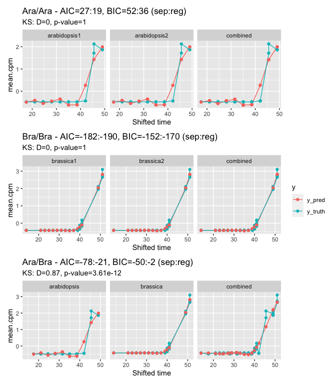

Compare registered and non-registered model
================

-   [Background](#background)
    -   [Modified function with ks](#modified-function-with-ks)
    -   [Plotting all](#plotting-all)

``` r
knitr::opts_chunk$set(echo = TRUE)
library(GREAT)
library(ggplot2)
library(data.table)
```

## Background

Trying to understand the difference of BIC/AIC values between registered
and non-registered models with simple simulations.

### Modified function with ks

``` r
compare_registered_to_unregistered_model_with_ks <- function(curr.sym, all.data.df, is.testing = FALSE, accessions = c("Col0", "Ro18")) {
  # message_function_header(unlist(stringr::str_split(deparse(sys.call()), "\\("))[[1]])
  # compare the overlapping timepoints in brassica and arabidopsis after the best registration,
  # and without registration (use the same timepoints for both models).
  # use the stretched data for both models, whether considering as registered or not.

  curr.data.df <- all.data.df[all.data.df$locus_name == curr.sym]

  # print('line 662')
  # print(curr.data.df)

  # flag the timepoints to be used in the modelling, only the ones which overlap!
  curr.data.df <- get_compared_timepoints(curr.data.df)

  # ggplot2::ggplot(curr.data.df)+
  #   ggplot2::aes(x=shifted_time, y=mean_cpm, shape=is.compared, color=accession)+
  #   ggplot2::geom_point()

  # cut down to the data for each model
  ara.spline.data      <- curr.data.df[curr.data.df$is.compared == TRUE & curr.data.df$accession == accessions[[1]], ]
  bra.spline.data      <- curr.data.df[curr.data.df$is.compared == TRUE & curr.data.df$accession == accessions[[2]], ]
  combined.spline.data <- as.data.table(rbind(ara.spline.data, bra.spline.data))
  # bra.spline.data      <- curr.data.df[curr.data.df$is.compared == TRUE & curr.data.df$accession == "Ro18", ]
  # combined.spline.data <- curr.data.df[curr.data.df$is.compared == TRUE, ]

  # fit the models - fit regression splines.
  # http://www.utstat.utoronto.ca/reid/sta450/feb23.pdf
  # for cubic spline, K+3 params where K=num.knots
  # as can omit constant term
  num.spline.params <- 6 # number of parameters for each spline fitting (degree and this used to calculate num knots).
  num.registration.params <- 2 # stretch, shift
  num.obs <- nrow(combined.spline.data)

  # print('line 676')
  # print(ara.spline.data)
  # print(bra.spline.data)


  ara.fit <- stats::lm(mean_cpm ~ splines::bs(shifted_time, df = num.spline.params, degree = 3), data = ara.spline.data)
  bra.fit <- stats::lm(mean_cpm ~ splines::bs(shifted_time, df = num.spline.params, degree = 3), data = bra.spline.data)
  combined.fit <- stats::lm(mean_cpm ~ splines::bs(shifted_time, df = num.spline.params, degree = 3), data = combined.spline.data)
  # calculate the log likelihoods
  ara.logLik <- stats::logLik(ara.fit)
  bra.logLik <- stats::logLik(bra.fit)
  separate.logLik <- ara.logLik + bra.logLik # logLikelihoods, so sum
  combined.logLik <- stats::logLik(combined.fit)

  # calculate the comparison.stats - - AIC, BIC, smaller is better!
  # 2*num.spline.params as fitting separate models for Ara * Col
  separate.AIC <- calc_AIC(separate.logLik, 2 * num.spline.params)
  combined.AIC <- calc_AIC(combined.logLik, num.spline.params + num.registration.params)

  separate.BIC <- calc_BIC(separate.logLik, 2 * num.spline.params, num.obs)
  combined.BIC <- calc_BIC(combined.logLik, num.spline.params + num.registration.params, num.obs)

  # Kolmogorov-Smirnov test

  ks <- stats::ks.test(ara.spline.data$mean_cpm, bra.spline.data$mean_cpm)


  if (is.testing == TRUE) {
    ara.pred <- stats::predict(ara.fit)
    ara.pred.df <- unique(data.frame(
      "shifted_time" = ara.spline.data$shifted_time,
      "mean_cpm" = ara.pred, "accession" = "Col0"
    ))
    bra.pred <- stats::predict(bra.fit)
    bra.pred.df <- unique(data.frame(
      "shifted_time" = bra.spline.data$shifted_time,
      "mean_cpm" = bra.pred, "accession" = "Ro18"
    ))

    combined.pred <- stats::predict(combined.fit)
    combined.pred.df <- unique(data.frame(
      "shifted_time" = combined.spline.data$shifted_time,
      "mean_cpm" = combined.pred, "accession" = "registered"
    ))
    spline.df <- rbind(ara.pred.df, bra.pred.df, combined.pred.df)

    p <- ggplot2::ggplot(data = combined.spline.data) +
      ggplot2::aes(x = shifted_time, y = mean_cpm, colour = accession) +
      ggplot2::geom_point() +
      ggplot2::geom_line(data = spline.df) +
      ggplot2::ggtitle(paste0(
        curr.sym, " : sep AIC:combo AIC=", round(separate.AIC), ":", round(combined.AIC),
        ", sep BIC: combo BIC=", round(separate.BIC), ":", round(combined.BIC)
      ))
    # ggplot2::ggsave(paste0('./testing/fitted_splines/', curr.sym, '_', max(ara.pred.df$shifted_time), '.pdf'))
  }
  # browser()

  results <- list(
    ara.spline.data = ara.spline.data,
    bra.spline.data = bra.spline.data,
    combined.spline.data = combined.spline.data,
    ara.fit = ara.fit,
    bra.fit = bra.fit,
    combined.fit = combined.fit,
    separate.AIC = separate.AIC,
    combined.AIC = combined.AIC,
    separate.BIC = separate.BIC,
    combined.BIC = combined.BIC,
    ks = ks
  )

  return(results)
}
```

### Plotting all

``` r
shifted.all.data.df <- readRDS("others/shifted.all.data.df.RDS")
plot_fit <- function(results_list, facets = c("arabidopsis", "brassica"), title = NULL) {
  data <- rbind(
    data.frame(
      shifted_time = results_list$ara.spline.data$shifted_time,
      y_truth = broom::augment(results_list$ara.fit)$mean_cpm,
      y_pred = broom::augment(results_list$ara.fit)$.fitted,
      type = facets[[1]]
    ),
    data.frame(
      shifted_time = results_list$bra.spline.data$shifted_time,
      y_truth = broom::augment(results_list$bra.fit)$mean_cpm,
      y_pred = broom::augment(results_list$bra.fit)$.fitted,
      type = facets[[2]]
    ),
    data.frame(
      shifted_time = results_list$combined.spline.data$shifted_time,
      y_truth = broom::augment(results_list$combined.fit)$mean_cpm,
      y_pred = broom::augment(results_list$combined.fit)$.fitted,
      type = "combined"
    )
  )

  data %>%
    tidyr::pivot_longer(
      cols = -c(shifted_time, type),
      names_to = "y"
    ) %>%
    ggplot() +
    aes(x = shifted_time, y = value, color = y) +
    geom_line() +
    geom_point() +
    facet_wrap(~type, nrow = 1) +
    labs(
      title = paste0(
        title,
        "AIC=",
        round(results_list$separate.AIC), ":", round(results_list$combined.AIC),
        ", BIC=",
        round(results_list$separate.BIC), ":", round(results_list$combined.BIC),
        " (sep:reg)"
      ),
      subtitle = paste0(
        "KS: ",
        "D=", round(results_list$ks$statistic, 2),
        ", p-value=", signif(results_list$ks$p.value, 3)
      ),
      x = "Shifted time",
      y = "mean_cpm"
    )
}

L_ara_ara <- compare_registered_to_unregistered_model_with_ks(
  curr.sym = "BO4G120010",
  shifted.all.data.df,
  accessions = rep("Col0", 2)
)

L_bra_bra <- compare_registered_to_unregistered_model_with_ks(
  curr.sym = "BO4G120010",
  shifted.all.data.df,
  accessions = rep("Ro18", 2)
)

L_ara_bra <- compare_registered_to_unregistered_model_with_ks(
  curr.sym = "BO4G120010",
  shifted.all.data.df
)

list(
  plot_fit(L_ara_ara, title = "Ara/Ara - ", facets = c("arabidopsis1", "arabidopsis2")),
  plot_fit(L_bra_bra, title = "Bra/Bra - ", facets = c("brassica1", "brassica2")),
  plot_fit(L_ara_bra, title = "Ara/Bra - ")
) %>%
  patchwork::wrap_plots(ncol = 1, guides = "collect")
```

<!-- -->
