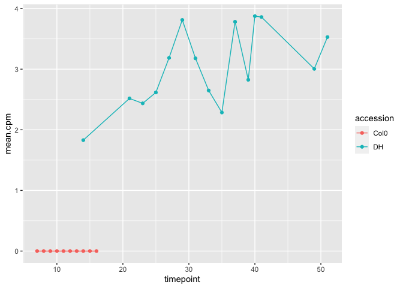

Running all of gene-registration functions for all genes in B. Oleracea
================

-   [Introduction](#introduction)
-   [Load mean data frame](#load-mean-data-frame)
-   [Specify all parameters](#specify-all-parameters)
-   [Testing if we also filter out the Arabidopsis with value all
    zeros](#testing-if-we-also-filter-out-the-arabidopsis-with-value-all-zeros)

``` r
knitr::opts_chunk$set()
library(genereg)
library(ggplot2)
library(data.table)
library(cowplot)
library(ggpubr)
```

    ## 
    ## Attaching package: 'ggpubr'

    ## The following object is masked from 'package:cowplot':
    ## 
    ##     get_legend

## Introduction

In this report, I am going to try running gene registration scripts for
all *B. Oleracea* genes. However, since there are some *Arabidopsis*
values that are zeros, it gave some errors. Therefore, the solutions are
to filter *Arabidopsis* genes with all zero values.

## Load mean data frame

``` r
# Get all of the data path
table_id_path <- "/Users/kristiar/PhD/second-rotation-JIC/b_oleracea/data/ID_TAB.csv"
ara_path <- '/Users/kristiar/PhD/second-rotation-JIC/b_oleracea/data/klepikova.rds'
b_oleracea_path <- "/Users/kristiar/PhD/second-rotation-JIC/b_oleracea/data/dh_with_sample_id.rds"
```

``` r
id_table_all <- data.table::fread(table_id_path) %>% 
  dplyr::select(CDS.model, symbol, locus_name) %>% 
  dplyr::arrange(symbol) %>% 
  dplyr::mutate(CDS.model = toupper(CDS.model)) %>% 
  unique()

# Take all locus name from the table
list_all_ara_locus_name <- id_table_all %>% 
  dplyr::pull(locus_name)
```

``` r
id_table_all %>% 
  head(10) 
```

    ##       CDS.model symbol locus_name
    ##  1: BO00285S150         AT1G27170
    ##  2: BO00285S270         AT4G31740
    ##  3: BO00285S310         AT3G26510
    ##  4: BO00285S380         AT3G26670
    ##  5: BO00285S400         AT3G26700
    ##  6: BO00285S420         AT3G26730
    ##  7: BO00285S450         AT3G26760
    ##  8: BO00285S460         AT3G26770
    ##  9: BO00285S510         AT3G26780
    ## 10: BO00285S570         AT3G26820

``` r
# Get summary 
id_table_with_symbol <- id_table_all %>% 
  dplyr::filter(symbol != "") %>% 
  nrow()

id_table_without_symbol <- id_table_all %>% 
  dplyr::filter(symbol == "") %>% 
  nrow()

data.frame(with_symbol = id_table_with_symbol, 
           without_symbol = id_table_without_symbol)
```

    ##   with_symbol without_symbol
    ## 1       20200          13493

``` r
b_oleracea_mean_df <- genereg::load_mean_df(
  file_path_brassica = b_oleracea_path,
  file_path_arabidopsis = ara_path,
  file_path_id_table = table_id_path,
  tissue_wanted = "apex",
  curr_GoIs = list_all_ara_locus_name,
  sum_brassicas = F
)
```

    ## [1] "20870 brassica genes considered in the comparison"
    ## [1] "Discarded genes: BO00285S220, BO00285S290, BO00285S310, BO00285S360, BO00285S450, BO00285S460, BO00418S020, BO00418S030, BO00418S060, BO00418S120, BO00418S130, BO00434S010, BO00534S100, BO00534S110, BO00534S170, BO00534S230, BO00576S010, BO00578S090, BO00578S150, BO00578S270, BO00579S030, BO00579S100, BO00579S120, BO00579S130, BO00579S180, BO00579S190, BO00579S200, BO00579S210, BO00579S220, BO00613S070, BO00613S200, BO00615S020, BO00615S060, BO00615S190, BO00615S200, BO00615S230, BO00615S250, BO00626S010, BO00629S080, BO00629S110, BO00629S150, BO00641S080, BO00641S120, BO00667S090, BO00673S080, BO00673S130, BO00673S150, BO00673S170, BO00673S190, BO00679S060, BO00679S070, BO00722S010, BO00746S010, BO00746S040, BO00746S050, BO00751S080, BO00758S040, BO00758S080, BO00758S100, BO00758S110, BO00763S030, BO00770S010, BO00795S080, BO00802S010, BO00825S040, BO00834S050, BO00846S050, BO00851S060, BO00852S040, BO00853S060, BO00866S030, BO00871S010, BO00875S030, BO00875S040, BO00877S020, BO00877S060, BO00887S030, BO00895S030, BO00898S020, BO00898S030, BO00900S090, BO00902S060, BO00902S070, BO00911S030, BO00911S040, BO00916S040, BO00921S010, BO00932S010, BO00932S020, BO00932S030, BO00935S010, BO00940S050, BO00940S060, BO00945S010, BO00945S030, BO00946S020, BO00946S040, BO00948S040, BO00948S050, BO00951S010, BO00954S080, BO00955S010, BO00957S010, BO00957S020, BO00962S030, BO00967S010, BO00967S020, BO00969S020, BO00983S010, BO00992S030, BO01002S040, BO01008S010, BO01021S030, BO01023S040, BO01023S060, BO01039S010, BO01040S010, BO01045S050, BO01045S060, BO01045S070, BO01051S050, BO01052S010, BO01055S010, BO01061S010, BO01061S030, BO01076S020, BO01078S020, BO01079S020, BO01087S040, BO01087S060, BO01095S010, BO01097S040, BO01107S010, BO01107S030, BO01108S050, BO01129S030, BO01139S040, BO01139S060, BO01143S020, BO01143S040, BO01146S020, BO01158S030, BO01158S040, BO01160S010, BO01176S030, BO01178S020, BO01178S030, BO01178S050, BO01186S020, BO01195S010, BO01195S020, BO01211S020, BO01212S010, BO01213S020, BO01214S010, BO01217S020, BO01224S050, BO01233S030, BO01234S020, BO01256S010, BO01256S020, BO01256S030, BO01260S010, BO01282S010, BO01335S010, BO01339S010, BO01342S020, BO01357S030, BO01369S020, BO01383S020, BO01385S020, BO01390S040, BO01408S010, BO01416S010, BO01463S020, BO01463S030, BO01471S010, BO01495S010, BO01512S010, BO01516S010, BO01539S020, BO01561S020, BO01569S010, BO01589S010, BO01589S020, BO01593S010, BO01640S010, BO01640S020, BO01651S010, BO01689S030, BO01709S010, BO01740S020, BO01827S020, BO01841S010, BO01855S010, BO01884S010, BO01914S010, BO01914S020, BO01923S010, BO01948S010, BO01965S020, BO02077S010, BO02097S010, BO02132S010, BO02164S010, BO02176S010, BO02178S010, BO02271S010, BO02285S010, BO02309S010, BO02309S020, BO02350S010, BO02353S010, BO02355S010, BO02475S010, BO02562S010, BO02580S010, BO02609S010, BO02754S010, BO02794S010, BO02821S010, BO02842S010, BO02862S010, BO02928S010, BO02976S010, BO02988S010, BO03074S010, BO03198S010, BO03207S010, BO03215S010, BO03342S010, BO03358S010, BO03384S010, BO03392S010, BO03416S010, BO03447S010, BO03563S010, BO03661S010, BO03662S010, BO03712S010, BO03832S010, BO03904S010, BO03919S010, BO04151S010, BO04312S010, BO04357S010, BO04373S010, BO04487S010, BO04489S010, BO04611S010, BO04805S010, BO04824S010, BO04862S010, BO04917S010, BO04964S010, BO05064S010, BO05126S010, BO05226S010, BO05413S010, BO05482S010, BO05668S010, BO05681S010, BO05709S010, BO05769S010, BO05984S010, BO05995S010, BO06241S010, BO06251S010, BO06275S010, BO06340S010, BO06469S010, BO06662S010, BO06723S010, BO06753S010, BO06804S010, BO06826S010, BO07217S010, BO07227S010, BO07445S010, BO07610S010, BO07997S010, BO08138S010, BO08159S010, BO08162S010, BO08216S010, BO08238S010, BO08641S010, BO08794S010, BO08912S010, BO08965S010, BO09116S010, BO09195S010, BO09523S010, BO09649S010, BO09981S010, BO09984S010, BO10119S010, BO10177S010, BO10241S010, BO10284S010, BO10324S010, BO10409S010, BO10417S010, BO10908S010, BO11040S010, BO11163S010, BO11165S010, BO11270S010, BO11434S010, BO11508S010, BO11511S010, BO11579S010, BO11616S010, BO11619S010, BO11842S010, BO11875S010, BO12079S010, BO12272S010, BO12349S010, BO12350S010, BO12391S010, BO12455S010, BO12869S010, BO13085S010, BO13129S010, BO13157S010, BO13628S010, BO13722S010, BO14172S010, BO14520S010, BO14644S010, BO14654S010, BO15004S010, BO15070S010, BO15117S010, BO15161S010, BO15489S010, BO15704S010, BO15776S010, BO16012S010, BO16290S010, BO16798S010, BO16842S010, BO17221S010, BO17227S010, BO17398S010, BO17498S010, BO17514S010, BO18097S010, BO18196S010, BO18217S010, BO18727S010, BO18845S010, BO19065S010, BO19487S010, BO19904S010, BO1G001060, BO1G002190, BO1G002210, BO1G002250, BO1G002330, BO1G002370, BO1G002450, BO1G002480, BO1G002700, BO1G002840, BO1G002880, BO1G003060, BO1G003150, BO1G003200, BO1G003240, BO1G003340, BO1G003350, BO1G003420, BO1G003430, BO1G003680, BO1G003710, BO1G004740, BO1G004790, BO1G004840, BO1G004870, BO1G004920, BO1G005070, BO1G005090, BO1G005100, BO1G005360, BO1G005540, BO1G005610, BO1G005620, BO1G005640, BO1G005680, BO1G005730, BO1G005810, BO1G005900, BO1G005950, BO1G006240, BO1G006300, BO1G006330, BO1G006480, BO1G006500, BO1G006510, BO1G006580, BO1G006660, BO1G006670, BO1G006740, BO1G006770, BO1G006790, BO1G006860, BO1G006920, BO1G006930, BO1G006940, BO1G006950, BO1G006970, BO1G007020, BO1G007070, BO1G007170, BO1G007380, BO1G007510, BO1G007620, BO1G007690, BO1G007720, BO1G007980, BO1G008170, BO1G008200, BO1G008230, BO1G008330, BO1G008440, BO1G008480, BO1G008510, BO1G008580, BO1G009870, BO1G009920, BO1G009940, BO1G009960, BO1G010170, BO1G010300, BO1G010360, BO1G010460, BO1G010500, BO1G010560, BO1G010810, BO1G010960, BO1G011370, BO1G011640, BO1G011840, BO1G011920, BO1G012100, BO1G013130, BO1G013180, BO1G014310, BO1G014320, BO1G014570, BO1G014650, BO1G014720, BO1G014950, BO1G016090, BO1G016350, BO1G016610, BO1G016760, BO1G016850, BO1G016870, BO1G016880, BO1G016990, BO1G017010, BO1G017080, BO1G017090, BO1G017200, BO1G017210, BO1G017280, BO1G017380, BO1G017390, BO1G017580, BO1G017590, BO1G017630, BO1G017820, BO1G017920, BO1G018030, BO1G018040, BO1G019100, BO1G019120, BO1G019260, BO1G019330, BO1G019430, BO1G019440, BO1G019450, BO1G019570, BO1G019680, BO1G019710, BO1G019780, BO1G020010, BO1G020050, BO1G020150, BO1G020160, BO1G021390, BO1G021420, BO1G021430, BO1G021500, BO1G021540, BO1G021570, BO1G021650, BO1G021720, BO1G021740, BO1G021790, BO1G021800, BO1G021880, BO1G021960, BO1G021980, BO1G021990, BO1G022030, BO1G022070, BO1G022190, BO1G022220, BO1G022240, BO1G022520, BO1G022660, BO1G023950, BO1G024010, BO1G024110, BO1G024130, BO1G024170, BO1G025520, BO1G025540, BO1G025550, BO1G025750, BO1G025790, BO1G025900, BO1G026910, BO1G027250, BO1G028410, BO1G028450, BO1G028520, BO1G030680, BO1G031730, BO1G031740, BO1G031850, BO1G031870, BO1G031980, BO1G032010, BO1G032020, BO1G032040, BO1G033040, BO1G033180, BO1G033210, BO1G033280, BO1G034310, BO1G034320, BO1G034330, BO1G034370, BO1G034390, BO1G034410, BO1G034580, BO1G034690, BO1G036820, BO1G036950, BO1G036970, BO1G037040, BO1G037050, BO1G037080, BO1G037110, BO1G037360, BO1G037390, BO1G037400, BO1G037450, BO1G037460, BO1G037470, BO1G037610, BO1G037670, BO1G037780, BO1G037850, BO1G038850, BO1G038960, BO1G039010, BO1G039420, BO1G039650, BO1G039710, BO1G039850, BO1G039900, BO1G040000, BO1G040010, BO1G040100, BO1G040130, BO1G040150, BO1G040210, BO1G040420, BO1G040530, BO1G040650, BO1G040670, BO1G040700, BO1G041860, BO1G041880, BO1G042950, BO1G042970, BO1G043060, BO1G045280, BO1G045390, BO1G046420, BO1G046430, BO1G046560, BO1G046620, BO1G046680, BO1G046690, BO1G047860, BO1G047950, BO1G047960, BO1G048160, BO1G048170, BO1G048240, BO1G048300, BO1G049330, BO1G049390, BO1G050760, BO1G050830, BO1G050900, BO1G050910, BO1G051120, BO1G051130, BO1G051230, BO1G051350, BO1G051370, BO1G051430, BO1G051460, BO1G051720, BO1G051740, BO1G052880, BO1G053030, BO1G053270, BO1G053390, BO1G053480, BO1G053490, BO1G053540, BO1G053580, BO1G053730, BO1G054810, BO1G054940, BO1G055040, BO1G055240, BO1G055330, BO1G055460, BO1G056550, BO1G056560, BO1G056580, BO1G056620, BO1G056640, BO1G056690, BO1G056740, BO1G056750, BO1G056770, BO1G056920, BO1G056950, BO1G056990, BO1G057080, BO1G057140, BO1G057200, BO1G057280, BO1G057320, BO1G057490, BO1G058800, BO1G058820, BO1G059010, BO1G059140, BO1G059230, BO1G059260, BO1G059350, BO1G060570, BO1G065030, BO1G065190, BO1G067420, BO1G070870, BO1G070880, BO1G070940, BO1G071040, BO1G071070, BO1G071130, BO1G072200, BO1G072360, BO1G072390, BO1G072530, BO1G076850, BO1G077000, BO1G077120, BO1G078190, BO1G078240, BO1G078300, BO1G078350, BO1G078440, BO1G078620, BO1G078720, BO1G078730, BO1G078830, BO1G078860, BO1G079060, BO1G080120, BO1G080130, BO1G081350, BO1G081370, BO1G082450, BO1G084730, BO1G086100, BO1G087490, BO1G087500, BO1G087530, BO1G087950, BO1G087960, BO1G088070, BO1G089120, BO1G090330, BO1G090490, BO1G090540, BO1G091580, BO1G091620, BO1G091790, BO1G091800, BO1G093090, BO1G094210, BO1G098140, BO1G098150, BO1G098200, BO1G098240, BO1G098290, BO1G098300, BO1G098400, BO1G098480, BO1G098490, BO1G098560, BO1G098640, BO1G098650, BO1G098660, BO1G098670, BO1G098830, BO1G098860, BO1G099890, BO1G101230, BO1G101850, BO1G101920, BO1G102110, BO1G102130, BO1G102190, BO1G102210, BO1G102280, BO1G102290, BO1G102330, BO1G102390, BO1G102410, BO1G103500, BO1G103650, BO1G103680, BO1G103690, BO1G104980, BO1G104990, BO1G105240, BO1G105440, BO1G105530, BO1G105550, BO1G105660, BO1G105700, BO1G105730, BO1G105780, BO1G105790, BO1G105800, BO1G105830, BO1G105880, BO1G105970, BO1G107040, BO1G107090, BO1G107120, BO1G107140, BO1G108330, BO1G108770, BO1G108800, BO1G108820, BO1G108930, BO1G108950, BO1G108980, BO1G111260, BO1G112430, BO1G112450, BO1G112490, BO1G113510, BO1G113530, BO1G113560, BO1G114740, BO1G114760, BO1G115950, BO1G116230, BO1G116240, BO1G116280, BO1G116320, BO1G116390, BO1G117490, BO1G118790, BO1G118850, BO1G118880, BO1G119070, BO1G119140, BO1G119210, BO1G119320, BO1G119330, BO1G119340, BO1G119420, BO1G119430, BO1G120490, BO1G121540, BO1G122650, BO1G122660, BO1G122950, BO1G123140, BO1G123260, BO1G123350, BO1G123490, BO1G123520, BO1G123570, BO1G123620, BO1G123730, BO1G124880, BO1G124910, BO1G126030, BO1G126060, BO1G126110, BO1G128360, BO1G128390, BO1G128410, BO1G128420, BO1G128450, BO1G128490, BO1G128660, BO1G129690, BO1G129700, BO1G129740, BO1G129810, BO1G130000, BO1G130010, BO1G131110, BO1G131150, BO1G131200, BO1G134480, BO1G134580, BO1G134930, BO1G136160, BO1G136170, BO1G138360, BO1G138390, BO1G138560, BO1G138620, BO1G138690, BO1G138800, BO1G138810, BO1G138840, BO1G138880, BO1G138940, BO1G138950, BO1G138970, BO1G139030, BO1G139240, BO1G139440, BO1G139480, BO1G139600, BO1G139630, BO1G139730, BO1G139780, BO1G139800, BO1G139890, BO1G141090, BO1G141100, BO1G141120, BO1G141190, BO1G141230, BO1G141240, BO1G141270, BO1G141280, BO1G141340, BO1G141380, BO1G142590, BO1G143630, BO1G143920, BO1G143940, BO1G144090, BO1G144150, BO1G144160, BO1G144410, BO1G144480, BO1G144490, BO1G144620, BO1G144630, BO1G144640, BO1G144820, BO1G144870, BO1G144910, BO1G145050, BO1G145100, BO1G147160, BO1G147280, BO1G147400, BO1G147410, BO1G147540, BO1G147690, BO1G147720, BO1G147790, BO1G147810, BO1G147890, BO1G150080, BO1G150090, BO1G150140, BO1G150150, BO1G150270, BO1G150290, BO1G150400, BO1G150440, BO1G150470, BO1G151670, BO1G151680, BO1G151810, BO1G151840, BO1G151850, BO1G152070, BO1G152080, BO1G152220, BO1G152230, BO1G153230, BO1G153240, BO1G153450, BO1G153490, BO1G153650, BO1G154720, BO1G154750, BO1G154800, BO1G154830, BO1G154980, BO1G155100, BO1G156220, BO1G156240, BO1G156260, BO1G157390, BO1G157560, BO1G157640, BO1G157700, BO1G158780, BO1G158910, BO1G158950, BO20391S010, BO21255S010, BO21317S010, BO22769S010, BO22846S010, BO23266S010, BO23437S010, BO23556S010, BO24335S010, BO24578S010, BO24898S010, BO26969S010, BO26984S010, BO27765S010, BO28129S010, BO28654S010, BO29895S010, BO2G001000, BO2G001110, BO2G001160, BO2G001210, BO2G002360, BO2G002390, BO2G002500, BO2G002510, BO2G002570, BO2G002660, BO2G002680, BO2G002710, BO2G002800, BO2G002820, BO2G003990, BO2G004110, BO2G005280, BO2G005360, BO2G005370, BO2G005380, BO2G006530, BO2G006570, BO2G006670, BO2G006770, BO2G006840, BO2G006950, BO2G006960, BO2G007010, BO2G007100, BO2G007410, BO2G007480, BO2G007520, BO2G007530, BO2G008570, BO2G008760, BO2G008780, BO2G008800, BO2G008810, BO2G008920, BO2G008960, BO2G009070, BO2G009140, BO2G009160, BO2G009400, BO2G009450, BO2G009510, BO2G009530, BO2G009560, BO2G009660, BO2G009670, BO2G009720, BO2G009760, BO2G009970, BO2G010260, BO2G010280, BO2G010340, BO2G010420, BO2G010530, BO2G010590, BO2G010710, BO2G010770, BO2G010780, BO2G010950, BO2G010970, BO2G011150, BO2G011170, BO2G011190, BO2G011300, BO2G011470, BO2G011610, BO2G011670, BO2G011690, BO2G011700, BO2G011770, BO2G011810, BO2G011830, BO2G011840, BO2G012150, BO2G012170, BO2G012200, BO2G012260, BO2G012300, BO2G012310, BO2G012370, BO2G012460, BO2G012500, BO2G012530, BO2G012670, BO2G012770, BO2G012800, BO2G012960, BO2G013030, BO2G013100, BO2G013110, BO2G013190, BO2G013330, BO2G013380, BO2G013480, BO2G013560, BO2G013570, BO2G013620, BO2G013650, BO2G013660, BO2G013670, BO2G013680, BO2G013730, BO2G013850, BO2G013980, BO2G014010, BO2G014020, BO2G014060, BO2G014110, BO2G014130, BO2G014140, BO2G014170, BO2G014180, BO2G014190, BO2G014200, BO2G014210, BO2G014230, BO2G014250, BO2G014260, BO2G014270, BO2G014310, BO2G014320, BO2G014340, BO2G014360, BO2G016440, BO2G016510, BO2G016540, BO2G016580, BO2G016620, BO2G017620, BO2G017720, BO2G017760, BO2G017820, BO2G017870, BO2G017920, BO2G018090, BO2G018100, BO2G018440, BO2G018630, BO2G018680, BO2G019710, BO2G020770, BO2G021900, BO2G021910, BO2G022030, BO2G023140, BO2G023210, BO2G023290, BO2G023330, BO2G023370, BO2G023400, BO2G023410, BO2G023520, BO2G023640, BO2G023730, BO2G023800, BO2G023870, BO2G024030, BO2G024320, BO2G024480, BO2G024510, BO2G024680, BO2G024710, BO2G024760, BO2G025000, BO2G025010, BO2G025210, BO2G025410, BO2G025460, BO2G025470, BO2G025500, BO2G025540, BO2G025550, BO2G025560, BO2G025570, BO2G026640, BO2G026680, BO2G026710, BO2G026890, BO2G026920, BO2G026930, BO2G026940, BO2G026960, BO2G028380, BO2G028450, BO2G028460, BO2G028590, BO2G028660, BO2G028670, BO2G028820, BO2G028830, BO2G028860, BO2G028930, BO2G029080, BO2G030210, BO2G030310, BO2G031360, BO2G032410, BO2G032470, BO2G032590, BO2G032620, BO2G032640, BO2G032820, BO2G032890, BO2G032920, BO2G034070, BO2G034130, BO2G034170, BO2G034340, BO2G036470, BO2G036550, BO2G037550, BO2G037570, BO2G037580, BO2G037590, BO2G037640, BO2G038880, BO2G039010, BO2G040060, BO2G040080, BO2G041190, BO2G041570, BO2G041670, BO2G041840, BO2G041880, BO2G041910, BO2G042030, BO2G042090, BO2G043340, BO2G044420, BO2G044520, BO2G044550, BO2G044760, BO2G045800, BO2G045870, BO2G045950, BO2G046020, BO2G046150, BO2G046190, BO2G046230, BO2G046260, BO2G047350, BO2G047360, BO2G047380, BO2G047450, BO2G047500, BO2G047550, BO2G047610, BO2G048110, BO2G048240, BO2G048280, BO2G048290, BO2G050740, BO2G050860, BO2G051080, BO2G051180, BO2G051390, BO2G052500, BO2G052590, BO2G052700, BO2G052740, BO2G053940, BO2G053960, BO2G053970, BO2G053980, BO2G054020, BO2G055170, BO2G055210, BO2G055250, BO2G055350, BO2G055360, BO2G055370, BO2G055400, BO2G055410, BO2G055420, BO2G055640, BO2G056070, BO2G056370, BO2G057490, BO2G057520, BO2G057630, BO2G057660, BO2G057690, BO2G057830, BO2G057920, BO2G057950, BO2G059000, BO2G061060, BO2G061080, BO2G061100, BO2G061110, BO2G061230, BO2G061320, BO2G061360, BO2G062490, BO2G062530, BO2G062660, BO2G062710, BO2G062760, BO2G062890, BO2G063000, BO2G063090, BO2G064210, BO2G064500, BO2G064620, BO2G064670, BO2G064710, BO2G064730, BO2G065760, BO2G066810, BO2G068010, BO2G068030, BO2G068440, BO2G069630, BO2G069660, BO2G069680, BO2G070690, BO2G070750, BO2G070760, BO2G070770, BO2G071850, BO2G072860, BO2G073010, BO2G074010, BO2G074070, BO2G075090, BO2G075110, BO2G075250, BO2G075260, BO2G075280, BO2G075300, BO2G075400, BO2G075520, BO2G075630, BO2G075720, BO2G076800, BO2G076920, BO2G076930, BO2G078950, BO2G079150, BO2G079170, BO2G079250, BO2G079340, BO2G080540, BO2G080560, BO2G080600, BO2G080640, BO2G080670, BO2G080680, BO2G080780, BO2G080850, BO2G080870, BO2G080980, BO2G082120, BO2G082200, BO2G082340, BO2G082480, BO2G082620, BO2G083760, BO2G083770, BO2G083910, BO2G084030, BO2G085040, BO2G085300, BO2G085310, BO2G085320, BO2G086360, BO2G086460, BO2G086570, BO2G086580, BO2G089910, BO2G091150, BO2G091240, BO2G092430, BO2G092490, BO2G092550, BO2G092570, BO2G092620, BO2G092810, BO2G092880, BO2G092980, BO2G093060, BO2G093100, BO2G093190, BO2G093230, BO2G093320, BO2G093400, BO2G094610, BO2G094660, BO2G094780, BO2G094840, BO2G095140, BO2G095190, BO2G095500, BO2G095640, BO2G096100, BO2G096220, BO2G097370, BO2G097650, BO2G098820, BO2G098940, BO2G098980, BO2G099000, BO2G099100, BO2G099120, BO2G100440, BO2G100450, BO2G100660, BO2G101810, BO2G102040, BO2G102190, BO2G103310, BO2G104650, BO2G104710, BO2G104730, BO2G105210, BO2G106430, BO2G107570, BO2G108690, BO2G109030, BO2G109280, BO2G110700, BO2G116330, BO2G116560, BO2G118210, BO2G119290, BO2G120540, BO2G120670, BO2G120790, BO2G120820, BO2G120830, BO2G120950, BO2G121200, BO2G124320, BO2G124410, BO2G124530, BO2G127090, BO2G127160, BO2G127240, BO2G127280, BO2G127620, BO2G129870, BO2G129910, BO2G129980, BO2G129990, BO2G130010, BO2G130030, BO2G130080, BO2G130150, BO2G130190, BO2G130270, BO2G130340, BO2G131530, BO2G131540, BO2G131620, BO2G131720, BO2G131730, BO2G131780, BO2G132150, BO2G132390, BO2G132480, BO2G133480, BO2G133630, BO2G134040, BO2G134170, BO2G134270, BO2G134300, BO2G134340, BO2G134410, BO2G134450, BO2G134720, BO2G134760, BO2G134800, BO2G134870, BO2G134880, BO2G136150, BO2G136160, BO2G136210, BO2G136220, BO2G136270, BO2G136280, BO2G136440, BO2G136630, BO2G136660, BO2G137140, BO2G137150, BO2G137210, BO2G137220, BO2G137270, BO2G138440, BO2G138490, BO2G138520, BO2G138580, BO2G138650, BO2G138940, BO2G138990, BO2G139010, BO2G139040, BO2G140290, BO2G140440, BO2G140480, BO2G140490, BO2G140500, BO2G140520, BO2G140690, BO2G142780, BO2G142790, BO2G143840, BO2G144870, BO2G144940, BO2G144980, BO2G145010, BO2G146120, BO2G146180, BO2G146190, BO2G146210, BO2G146220, BO2G146290, BO2G146350, BO2G146500, BO2G147650, BO2G147690, BO2G147890, BO2G147910, BO2G148060, BO2G148140, BO2G149210, BO2G149270, BO2G149280, BO2G149310, BO2G149330, BO2G149490, BO2G149550, BO2G149560, BO2G149800, BO2G149850, BO2G149910, BO2G150020, BO2G150040, BO2G150090, BO2G150120, BO2G150180, BO2G150230, BO2G150300, BO2G150450, BO2G151610, BO2G151700, BO2G151740, BO2G151770, BO2G151790, BO2G151820, BO2G151870, BO2G152960, BO2G155110, BO2G155250, BO2G155300, BO2G155410, BO2G155460, BO2G155530, BO2G155540, BO2G155630, BO2G155660, BO2G155760, BO2G155960, BO2G156160, BO2G156190, BO2G156220, BO2G156300, BO2G158420, BO2G158490, BO2G158500, BO2G158510, BO2G158970, BO2G158980, BO2G159030, BO2G159060, BO2G159290, BO2G159300, BO2G159390, BO2G159450, BO2G159480, BO2G160620, BO2G160630, BO2G160650, BO2G160680, BO2G160740, BO2G160750, BO2G160760, BO2G160780, BO2G160790, BO2G160930, BO2G160950, BO2G160960, BO2G160990, BO2G161110, BO2G161220, BO2G161240, BO2G161300, BO2G161310, BO2G161400, BO2G161470, BO2G161530, BO2G161570, BO2G161620, BO2G161860, BO2G162880, BO2G164030, BO2G164040, BO2G164090, BO2G164130, BO2G164210, BO2G165440, BO2G165510, BO2G165640, BO2G165660, BO2G165690, BO2G165840, BO2G165850, BO2G165980, BO2G165990, BO2G166050, BO2G166100, BO2G166280, BO2G166380, BO2G166420, BO2G166460, BO2G167580, BO2G167600, BO2G167710, BO2G167760, BO2G167860, BO2G167870, BO2G168000, BO2G168110, BO2G168140, BO2G168190, BO2G168270, BO2G168290, BO2G168320, BO30675S010, BO32297S010, BO3G001110, BO3G001300, BO3G001310, BO3G001350, BO3G001390, BO3G001400, BO3G001410, BO3G001460, BO3G001470, BO3G001620, BO3G001750, BO3G001760, BO3G001770, BO3G001800, BO3G002040, BO3G002080, BO3G002370, BO3G002430, BO3G002560, BO3G002580, BO3G002590, BO3G002610, BO3G002630, BO3G002740, BO3G002760, BO3G002940, BO3G002970, BO3G003070, BO3G003100, BO3G003210, BO3G003230, BO3G003240, BO3G003410, BO3G003460, BO3G003800, BO3G003840, BO3G003900, BO3G003910, BO3G004000, BO3G004040, BO3G004160, BO3G004330, BO3G004360, BO3G004400, BO3G004490, BO3G004500, BO3G004510, BO3G004560, BO3G004570, BO3G004580, BO3G004590, BO3G004670, BO3G004950, BO3G005000, BO3G005180, BO3G005240, BO3G005280, BO3G005420, BO3G005460, BO3G005520, BO3G005530, BO3G005570, BO3G005590, BO3G006730, BO3G006870, BO3G006880, BO3G006930, BO3G006950, BO3G007010, BO3G007110, BO3G007230, BO3G007360, BO3G007410, BO3G007550, BO3G007610, BO3G007630, BO3G008820, BO3G008870, BO3G009050, BO3G009080, BO3G009150, BO3G009250, BO3G009300, BO3G009480, BO3G009490, BO3G009500, BO3G009550, BO3G009630, BO3G009660, BO3G009840, BO3G009950, BO3G009980, BO3G010110, BO3G010130, BO3G010260, BO3G010320, BO3G010520, BO3G010580, BO3G010710, BO3G010750, BO3G012050, BO3G012090, BO3G012140, BO3G012270, BO3G012330, BO3G012450, BO3G012470, BO3G012490, BO3G012520, BO3G012560, BO3G012780, BO3G012820, BO3G012870, BO3G012890, BO3G012900, BO3G012920, BO3G012930, BO3G012950, BO3G012980, BO3G013040, BO3G013170, BO3G013220, BO3G013240, BO3G013620, BO3G013650, BO3G013710, BO3G013720, BO3G013730, BO3G014000, BO3G014010, BO3G014040, BO3G014110, BO3G015290, BO3G015330, BO3G015350, BO3G015460, BO3G015600, BO3G015610, BO3G016800, BO3G016820, BO3G016870, BO3G016900, BO3G016920, BO3G017000, BO3G017120, BO3G017220, BO3G017240, BO3G017250, BO3G017260, BO3G017270, BO3G017410, BO3G017440, BO3G017540, BO3G017600, BO3G017620, BO3G017720, BO3G017740, BO3G017760, BO3G017850, BO3G017890, BO3G017910, BO3G017920, BO3G018010, BO3G018020, BO3G018030, BO3G018040, BO3G018130, BO3G018140, BO3G018180, BO3G018230, BO3G018310, BO3G018390, BO3G018480, BO3G018500, BO3G018530, BO3G018610, BO3G018620, BO3G018770, BO3G018780, BO3G018800, BO3G019040, BO3G019080, BO3G019090, BO3G019110, BO3G019270, BO3G019300, BO3G019410, BO3G019420, BO3G019490, BO3G019520, BO3G019630, BO3G019740, BO3G019750, BO3G019770, BO3G019820, BO3G020900, BO3G020980, BO3G021030, BO3G021160, BO3G021180, BO3G021240, BO3G021300, BO3G021430, BO3G021480, BO3G021590, BO3G021610, BO3G021720, BO3G021770, BO3G021810, BO3G021840, BO3G021960, BO3G021990, BO3G022260, BO3G022330, BO3G022580, BO3G022720, BO3G022770, BO3G022830, BO3G022850, BO3G022990, BO3G023000, BO3G023070, BO3G023090, BO3G023260, BO3G023380, BO3G023560, BO3G023570, BO3G023810, BO3G023910, BO3G024030, BO3G024160, BO3G024240, BO3G024250, BO3G024270, BO3G024400, BO3G024440, BO3G024450, BO3G024580, BO3G024700, BO3G024720, BO3G024790, BO3G024970, BO3G025000, BO3G025010, BO3G025100, BO3G025110, BO3G026420, BO3G026430, BO3G026490, BO3G026530, BO3G026630, BO3G026670, BO3G026690, BO3G026740, BO3G026860, BO3G026920, BO3G026940, BO3G026990, BO3G027080, BO3G027090, BO3G027110, BO3G027130, BO3G027430, BO3G027500, BO3G027520, BO3G027840, BO3G027900, BO3G028130, BO3G028220, BO3G028280, BO3G028380, BO3G028410, BO3G028440, BO3G028630, BO3G028670, BO3G029760, BO3G029790, BO3G029820, BO3G029830, BO3G029970, BO3G029980, BO3G030020, BO3G030080, BO3G030180, BO3G030190, BO3G030250, BO3G030310, BO3G031390, BO3G031430, BO3G031470, BO3G031520, BO3G031540, BO3G031550, BO3G031730, BO3G031830, BO3G031900, BO3G031960, BO3G032050, BO3G032290, BO3G032310, BO3G032380, BO3G032500, BO3G032520, BO3G032530, BO3G032690, BO3G032970, BO3G033010, BO3G034150, BO3G034160, BO3G034190, BO3G034200, BO3G034310, BO3G034510, BO3G034540, BO3G034590, BO3G034750, BO3G034780, BO3G034850, BO3G034900, BO3G034960, BO3G034980, BO3G035060, BO3G035220, BO3G035260, BO3G035300, BO3G035350, BO3G035370, BO3G035390, BO3G035400, BO3G035430, BO3G035530, BO3G035540, BO3G035550, BO3G035570, BO3G035580, BO3G035590, BO3G035620, BO3G035630, BO3G035670, BO3G035680, BO3G035850, BO3G035870, BO3G035890, BO3G035970, BO3G036010, BO3G036060, BO3G036230, BO3G036310, BO3G036330, BO3G036370, BO3G036380, BO3G036400, BO3G036420, BO3G036530, BO3G036640, BO3G036650, BO3G036890, BO3G036900, BO3G036930, BO3G037080, BO3G037130, BO3G037150, BO3G037210, BO3G037300, BO3G037410, BO3G037420, BO3G037510, BO3G037560, BO3G037670, BO3G037780, BO3G038840, BO3G038850, BO3G038980, BO3G039050, BO3G039070, BO3G039080, BO3G039160, BO3G039200, BO3G039260, BO3G039330, BO3G039350, BO3G039450, BO3G039460, BO3G039470, BO3G039480, BO3G039520, BO3G039530, BO3G039690, BO3G039850, BO3G039870, BO3G039980, BO3G039990, BO3G040080, BO3G040100, BO3G040150, BO3G040220, BO3G040310, BO3G040420, BO3G041790, BO3G041830, BO3G041840, BO3G041920, BO3G041960, BO3G041970, BO3G042120, BO3G042170, BO3G042180, BO3G042330, BO3G042360, BO3G042390, BO3G042400, BO3G042490, BO3G042600, BO3G042640, BO3G042740, BO3G042760, BO3G042800, BO3G042920, BO3G043120, BO3G044210, BO3G044540, BO3G044660, BO3G044690, BO3G044700, BO3G044790, BO3G044970, BO3G045110, BO3G045180, BO3G045260, BO3G045310, BO3G045400, BO3G045420, BO3G045430, BO3G045450, BO3G045460, BO3G045470, BO3G045640, BO3G045670, BO3G045740, BO3G046920, BO3G047120, BO3G047130, BO3G047180, BO3G048280, BO3G048290, BO3G048380, BO3G048600, BO3G048690, BO3G049850, BO3G049860, BO3G051010, BO3G052110, BO3G052130, BO3G052160, BO3G052170, BO3G052190, BO3G052200, BO3G052250, BO3G052260, BO3G052370, BO3G052490, BO3G052530, BO3G052540, BO3G052560, BO3G052590, BO3G052680, BO3G052730, BO3G052910, BO3G052930, BO3G053000, BO3G053030, BO3G053140, BO3G053200, BO3G053210, BO3G054440, BO3G054510, BO3G054590, BO3G054650, BO3G054670, BO3G054840, BO3G055000, BO3G055110, BO3G055190, BO3G055460, BO3G055600, BO3G055630, BO3G055720, BO3G055730, BO3G055740, BO3G055870, BO3G055880, BO3G055970, BO3G056990, BO3G057230, BO3G057240, BO3G057310, BO3G057330, BO3G058540, BO3G058590, BO3G058690, BO3G058810, BO3G058860, BO3G060140, BO3G060190, BO3G060270, BO3G060310, BO3G060340, BO3G060360, BO3G060380, BO3G060420, BO3G060620, BO3G060750, BO3G060790, BO3G060810, BO3G060820, BO3G061010, BO3G061040, BO3G061100, BO3G061150, BO3G061190, BO3G061210, BO3G061380, BO3G061420, BO3G061560, BO3G061610, BO3G061620, BO3G061630, BO3G061750, BO3G061950, BO3G062080, BO3G062140, BO3G062210, BO3G062300, BO3G062840, BO3G063890, BO3G063960, BO3G064060, BO3G064140, BO3G064170, BO3G064180, BO3G064190, BO3G064290, BO3G064340, BO3G064350, BO3G064450, BO3G064480, BO3G064510, BO3G064800, BO3G064890, BO3G065010, BO3G065090, BO3G065180, BO3G065200, BO3G065240, BO3G065390, BO3G065420, BO3G065530, BO3G065640, BO3G065720, BO3G065800, BO3G066130, BO3G066150, BO3G066210, BO3G066340, BO3G066350, BO3G066360, BO3G066370, BO3G066420, BO3G066430, BO3G066500, BO3G066880, BO3G068010, BO3G068060, BO3G068140, BO3G068170, BO3G068340, BO3G068370, BO3G068410, BO3G068490, BO3G068510, BO3G068530, BO3G068610, BO3G068640, BO3G068850, BO3G068990, BO3G069010, BO3G071460, BO3G071560, BO3G071650, BO3G071770, BO3G071880, BO3G071970, BO3G073020, BO3G073070, BO3G073300, BO3G073310, BO3G073370, BO3G074440, BO3G074580, BO3G074590, BO3G074600, BO3G074680, BO3G074770, BO3G074790, BO3G074800, BO3G074830, BO3G076100, BO3G076150, BO3G076210, BO3G077370, BO3G078510, BO3G078660, BO3G078740, BO3G078760, BO3G078780, BO3G080000, BO3G080010, BO3G081220, BO3G081230, BO3G081270, BO3G081310, BO3G081420, BO3G081430, BO3G081460, BO3G081480, BO3G081500, BO3G081820, BO3G081880, BO3G083130, BO3G083520, BO3G083900, BO3G083910, BO3G083980, BO3G084090, BO3G084100, BO3G084180, BO3G084230, BO3G084330, BO3G085470, BO3G085640, BO3G086690, BO3G086750, BO3G086770, BO3G087070, BO3G087210, BO3G087240, BO3G088430, BO3G088580, BO3G088590, BO3G088640, BO3G088690, BO3G089960, BO3G089990, BO3G090240, BO3G091600, BO3G091660, BO3G091840, BO3G091940, BO3G091950, BO3G091960, BO3G092010, BO3G092020, BO3G092050, BO3G092100, BO3G092220, BO3G093410, BO3G093430, BO3G093470, BO3G093610, BO3G093660, BO3G093810, BO3G093850, BO3G094060, BO3G094200, BO3G094210, BO3G094240, BO3G095300, BO3G096410, BO3G096460, BO3G097710, BO3G097830, BO3G097940, BO3G099050, BO3G099120, BO3G099250, BO3G100500, BO3G100600, BO3G100630, BO3G100860, BO3G100930, BO3G101000, BO3G101040, BO3G101110, BO3G101120, BO3G101170, BO3G101210, BO3G101220, BO3G101510, BO3G101540, BO3G101610, BO3G101640, BO3G103000, BO3G103110, BO3G103300, BO3G103340, BO3G103440, BO3G104650, BO3G104710, BO3G104740, BO3G104760, BO3G107140, BO3G107360, BO3G107540, BO3G107650, BO3G107700, BO3G107770, BO3G107880, BO3G107970, BO3G108060, BO3G108110, BO3G108160, BO3G109240, BO3G109310, BO3G110790, BO3G110940, BO3G111000, BO3G111040, BO3G112280, BO3G113580, BO3G113590, BO3G113730, BO3G114920, BO3G114930, BO3G115080, BO3G116280, BO3G117300, BO3G118520, BO3G119580, BO3G120600, BO3G120710, BO3G120900, BO3G122120, BO3G122200, BO3G123480, BO3G123900, BO3G124970, BO3G125090, BO3G125120, BO3G127590, BO3G128760, BO3G129810, BO3G129880, BO3G129900, BO3G129960, BO3G130050, BO3G130080, BO3G130200, BO3G130310, BO3G130340, BO3G130430, BO3G132530, BO3G132680, BO3G134260, BO3G134290, BO3G134410, BO3G134430, BO3G134520, BO3G134650, BO3G135850, BO3G137110, BO3G138500, BO3G138650, BO3G138680, BO3G138780, BO3G138800, BO3G140080, BO3G140110, BO3G140160, BO3G140230, BO3G141410, BO3G141490, BO3G141550, BO3G142840, BO3G142910, BO3G143040, BO3G143100, BO3G143380, BO3G143420, BO3G143630, BO3G143670, BO3G143810, BO3G143850, BO3G143900, BO3G144110, BO3G144120, BO3G144130, BO3G145170, BO3G146300, BO3G146400, BO3G147570, BO3G147590, BO3G147640, BO3G147650, BO3G147670, BO3G147770, BO3G147890, BO3G147930, BO3G149230, BO3G149240, BO3G149680, BO3G150000, BO3G150030, BO3G151290, BO3G151470, BO3G152610, BO3G152630, BO3G152770, BO3G152880, BO3G152950, BO3G152960, BO3G153030, BO3G153050, BO3G153130, BO3G153210, BO3G153230, BO3G153260, BO3G153480, BO3G153520, BO3G153600, BO3G153650, BO3G153700, BO3G153790, BO3G153840, BO3G153850, BO3G153990, BO3G154020, BO3G154030, BO3G154060, BO3G154100, BO3G154130, BO3G154170, BO3G154250, BO3G154280, BO3G154340, BO3G155550, BO3G155600, BO3G155640, BO3G155760, BO3G156920, BO3G157000, BO3G157060, BO3G157090, BO3G157100, BO3G157140, BO3G157340, BO3G157370, BO3G157380, BO3G157390, BO3G158650, BO3G158730, BO3G159910, BO3G160930, BO3G161980, BO3G162210, BO3G162270, BO3G162280, BO3G162300, BO3G162410, BO3G162480, BO3G162520, BO3G162550, BO3G162580, BO3G162590, BO3G162600, BO3G162660, BO3G162710, BO3G162820, BO3G163940, BO3G163960, BO3G164030, BO3G164100, BO3G165700, BO3G165750, BO3G165780, BO3G165790, BO3G165800, BO3G165850, BO3G166900, BO3G167190, BO3G167210, BO3G167290, BO3G167340, BO3G167350, BO3G167360, BO3G168770, BO3G168790, BO3G168800, BO3G168910, BO3G168950, BO3G168960, BO3G169000, BO3G169050, BO3G169090, BO3G169190, BO3G169290, BO3G170480, BO3G170510, BO3G170670, BO3G170730, BO3G170740, BO3G170830, BO3G171010, BO3G171090, BO3G172330, BO3G173560, BO3G173590, BO3G173640, BO3G173980, BO3G175210, BO3G175220, BO3G175330, BO3G175400, BO3G175630, BO3G175680, BO3G175690, BO3G175730, BO3G175740, BO3G175760, BO3G175910, BO3G176010, BO3G176050, BO3G177080, BO3G177120, BO3G178230, BO3G178300, BO3G178320, BO3G179700, BO3G179740, BO3G179780, BO3G179900, BO3G180970, BO3G181020, BO3G181050, BO3G181330, BO3G181400, BO3G182580, BO3G184000, BO3G184100, BO3G184130, BO3G184240, BO3G184360, BO3G184370, BO3G184410, BO3G184530, BO3G184610, BO3G184640, BO3G184650, BO3G184770, BO3G184870, BO3G184920, BO3G185040, BO3G185070, BO3G185110, BO3G185120, BO3G185210, BO3G185240, BO3G185430, BO3G185570, BO3G185650, BO3G185760, BO3G185870, BO4G001040, BO4G001070, BO4G001180, BO4G002260, BO4G002310, BO4G002350, BO4G002400, BO4G002410, BO4G003440, BO4G003480, BO4G004520, BO4G004600, BO4G004610, BO4G004640, BO4G004670, BO4G004690, BO4G005790, BO4G005800, BO4G006830, BO4G006840, BO4G006920, BO4G006970, BO4G007000, BO4G007050, BO4G011450, BO4G012500, BO4G012610, BO4G012680, BO4G012690, BO4G012750, BO4G012840, BO4G012870, BO4G012890, BO4G012940, BO4G013020, BO4G013140, BO4G013360, BO4G013410, BO4G013460, BO4G014550, BO4G014560, BO4G014570, BO4G014610, BO4G014740, BO4G015860, BO4G015910, BO4G015990, BO4G016030, BO4G016190, BO4G017250, BO4G017280, BO4G017290, BO4G017300, BO4G017420, BO4G017430, BO4G018470, BO4G018490, BO4G018550, BO4G019620, BO4G019660, BO4G019850, BO4G020870, BO4G021250, BO4G021350, BO4G021440, BO4G021590, BO4G021620, BO4G022760, BO4G024290, BO4G024300, BO4G024340, BO4G024360, BO4G024470, BO4G024590, BO4G024610, BO4G024620, BO4G024640, BO4G024790, BO4G024800, BO4G024880, BO4G024920, BO4G025060, BO4G025200, BO4G025290, BO4G025300, BO4G025360, BO4G025380, BO4G025450, BO4G025460, BO4G025690, BO4G025710, BO4G025910, BO4G025950, BO4G025960, BO4G026160, BO4G026170, BO4G026230, BO4G026300, BO4G026610, BO4G026700, BO4G026830, BO4G026840, BO4G026850, BO4G026910, BO4G026920, BO4G027000, BO4G027090, BO4G027120, BO4G027140, BO4G027260, BO4G027270, BO4G027280, BO4G027290, BO4G027330, BO4G027470, BO4G027520, BO4G027570, BO4G029640, BO4G029680, BO4G029720, BO4G030010, BO4G030060, BO4G030200, BO4G030230, BO4G030480, BO4G030560, BO4G030660, BO4G030690, BO4G030870, BO4G030940, BO4G031020, BO4G031150, BO4G031160, BO4G031180, BO4G031200, BO4G031240, BO4G033410, BO4G034690, BO4G034730, BO4G034790, BO4G034880, BO4G034970, BO4G035050, BO4G035110, BO4G035140, BO4G036210, BO4G036280, BO4G037350, BO4G038460, BO4G038580, BO4G038620, BO4G038680, BO4G038690, BO4G038720, BO4G038750, BO4G038890, BO4G038950, BO4G038980, BO4G039170, BO4G039260, BO4G039290, BO4G039330, BO4G039360, BO4G039390, BO4G039730, BO4G039840, BO4G039860, BO4G039930, BO4G039950, BO4G041140, BO4G041200, BO4G041210, BO4G041330, BO4G043520, BO4G043530, BO4G043670, BO4G043760, BO4G043780, BO4G043830, BO4G044160, BO4G044200, BO4G044220, BO4G045230, BO4G045270, BO4G045330, BO4G045350, BO4G045470, BO4G045630, BO4G045780, BO4G045870, BO4G045900, BO4G045920, BO4G046000, BO4G046030, BO4G046130, BO4G047310, BO4G049540, BO4G050820, BO4G050840, BO4G052140, BO4G052280, BO4G052290, BO4G052300, BO4G053780, BO4G053920, BO4G053930, BO4G055120, BO4G055160, BO4G056300, BO4G058490, BO4G059620, BO4G059630, BO4G059720, BO4G059810, BO4G059890, BO4G061160, BO4G061180, BO4G061340, BO4G063590, BO4G064610, BO4G064620, BO4G064710, BO4G065760, BO4G065810, BO4G065860, BO4G068130, BO4G069230, BO4G069280, BO4G070480, BO4G071610, BO4G071690, BO4G071850, BO4G071900, BO4G072050, BO4G073120, BO4G074300, BO4G074330, BO4G074400, BO4G076710, BO4G076770, BO4G078130, BO4G078590, BO4G078770, BO4G079850, BO4G081080, BO4G084930, BO4G086590, BO4G086700, BO4G086790, BO4G086880, BO4G086990, BO4G088220, BO4G089300, BO4G091450, BO4G092570, BO4G092630, BO4G092880, BO4G093080, BO4G094190, BO4G094310, BO4G094360, BO4G094370, BO4G095420, BO4G097020, BO4G098210, BO4G098220, BO4G098320, BO4G098370, BO4G098400, BO4G098480, BO4G098580, BO4G098880, BO4G098910, BO4G099000, BO4G099050, BO4G100070, BO4G100090, BO4G101170, BO4G101200, BO4G101280, BO4G101290, BO4G101320, BO4G101390, BO4G101410, BO4G104840, BO4G104850, BO4G104880, BO4G104940, BO4G106230, BO4G106260, BO4G106290, BO4G106330, BO4G106510, BO4G107540, BO4G107610, BO4G107620, BO4G107710, BO4G107750, BO4G107950, BO4G108060, BO4G108070, BO4G108250, BO4G108360, BO4G108500, BO4G108630, BO4G109780, BO4G110990, BO4G111010, BO4G111040, BO4G111110, BO4G111130, BO4G111160, BO4G111440, BO4G111450, BO4G111490, BO4G112550, BO4G112770, BO4G112830, BO4G112860, BO4G114060, BO4G114150, BO4G115330, BO4G115410, BO4G115500, BO4G116630, BO4G116660, BO4G116670, BO4G116730, BO4G116980, BO4G117050, BO4G117070, BO4G117140, BO4G117160, BO4G118310, BO4G119790, BO4G119890, BO4G119910, BO4G119920, BO4G120080, BO4G120130, BO4G120300, BO4G120480, BO4G120490, BO4G121640, BO4G122700, BO4G122730, BO4G122820, BO4G122880, BO4G124120, BO4G124180, BO4G125390, BO4G125530, BO4G125580, BO4G125620, BO4G125710, BO4G125760, BO4G125850, BO4G125860, BO4G126980, BO4G127140, BO4G127160, BO4G127170, BO4G129560, BO4G129590, BO4G129600, BO4G129620, BO4G129630, BO4G130860, BO4G133160, BO4G133230, BO4G133250, BO4G133390, BO4G133400, BO4G134680, BO4G135860, BO4G135980, BO4G136380, BO4G136430, BO4G136460, BO4G136530, BO4G136730, BO4G136770, BO4G137020, BO4G137030, BO4G137070, BO4G137080, BO4G137110, BO4G137210, BO4G137290, BO4G137440, BO4G137490, BO4G137500, BO4G137650, BO4G137910, BO4G139170, BO4G139420, BO4G139560, BO4G139600, BO4G139610, BO4G139640, BO4G140180, BO4G140280, BO4G140430, BO4G140500, BO4G140780, BO4G141970, BO4G141980, BO4G142080, BO4G142160, BO4G142360, BO4G142430, BO4G142440, BO4G142700, BO4G143780, BO4G143870, BO4G143980, BO4G144150, BO4G144200, BO4G145260, BO4G145340, BO4G145350, BO4G145500, BO4G145620, BO4G145690, BO4G145740, BO4G145980, BO4G146000, BO4G147090, BO4G148190, BO4G148260, BO4G148360, BO4G149380, BO4G149390, BO4G149730, BO4G149850, BO4G149890, BO4G149900, BO4G150910, BO4G151030, BO4G151050, BO4G151090, BO4G151200, BO4G151250, BO4G151280, BO4G151350, BO4G151390, BO4G151550, BO4G151650, BO4G151660, BO4G151670, BO4G151710, BO4G151770, BO4G151810, BO4G154210, BO4G154500, BO4G154520, BO4G154830, BO4G154850, BO4G154890, BO4G156200, BO4G157220, BO4G157330, BO4G157490, BO4G158850, BO4G160030, BO4G160130, BO4G162540, BO4G162590, BO4G164840, BO4G164920, BO4G165050, BO4G165090, BO4G165140, BO4G165160, BO4G165210, BO4G165340, BO4G165520, BO4G166590, BO4G166630, BO4G166640, BO4G166650, BO4G166770, BO4G167870, BO4G167960, BO4G168080, BO4G168090, BO4G168120, BO4G168130, BO4G168140, BO4G169150, BO4G169190, BO4G169210, BO4G169240, BO4G169250, BO4G169300, BO4G169310, BO4G169330, BO4G169380, BO4G169390, BO4G169510, BO4G170600, BO4G170670, BO4G171890, BO4G173040, BO4G173070, BO4G173150, BO4G173320, BO4G173590, BO4G175890, BO4G176020, BO4G176030, BO4G176080, BO4G177530, BO4G177540, BO4G177560, BO4G177590, BO4G177630, BO4G177700, BO4G177710, BO4G177790, BO4G177800, BO4G177960, BO4G177980, BO4G178060, BO4G178090, BO4G178120, BO4G178180, BO4G178190, BO4G179260, BO4G179280, BO4G179300, BO4G179360, BO4G179480, BO4G180580, BO4G181590, BO4G181620, BO4G181710, BO4G181730, BO4G181760, BO4G181800, BO4G181810, BO4G181840, BO4G181850, BO4G181930, BO4G182020, BO4G182140, BO4G182290, BO4G182380, BO4G182400, BO4G182430, BO4G182510, BO4G182520, BO4G182690, BO4G182940, BO4G183000, BO4G183080, BO4G183160, BO4G183190, BO4G183350, BO4G184550, BO4G184570, BO4G184590, BO4G184630, BO4G184690, BO4G184750, BO4G185870, BO4G185940, BO4G186000, BO4G186030, BO4G186200, BO4G186290, BO4G186360, BO4G186370, BO4G186390, BO4G186460, BO4G186670, BO4G186720, BO4G186740, BO4G186800, BO4G186860, BO4G186930, BO4G186960, BO4G187090, BO4G187120, BO4G187140, BO4G187150, BO4G187160, BO4G187380, BO4G187390, BO4G187530, BO4G187550, BO4G187630, BO4G187640, BO4G187770, BO4G187790, BO4G187830, BO4G187900, BO4G187980, BO4G188000, BO4G188030, BO4G188080, BO4G188150, BO4G188160, BO4G188220, BO4G188310, BO4G188360, BO4G188380, BO4G188400, BO4G188430, BO4G188630, BO4G188650, BO4G188720, BO4G188830, BO4G188920, BO4G188940, BO4G188990, BO4G190050, BO4G190210, BO4G190510, BO4G190570, BO4G190580, BO4G190620, BO4G190690, BO4G190710, BO4G190810, BO4G190820, BO4G190950, BO4G190970, BO4G191210, BO4G191230, BO4G191300, BO4G191380, BO4G191390, BO4G191480, BO4G191520, BO4G191540, BO4G192810, BO4G192870, BO4G192910, BO4G192940, BO4G194080, BO4G194100, BO4G194140, BO4G194520, BO4G194560, BO4G194570, BO4G194700, BO4G194710, BO4G194720, BO4G194780, BO4G194810, BO4G194880, BO4G195220, BO4G195230, BO4G195280, BO4G195300, BO4G195320, BO4G195380, BO4G195400, BO4G195430, BO4G195490, BO4G195510, BO4G195520, BO4G195530, BO4G195570, BO4G195610, BO4G195630, BO4G195640, BO4G195650, BO4G195660, BO4G195720, BO4G195760, BO4G195780, BO4G196070, BO4G196080, BO4G196110, BO4G197130, BO4G197180, BO4G197250, BO4G197270, BO4G197300, BO4G197310, BO4G197320, BO4G197410, BO4G197420, BO4G197440, BO4G197450, BO4G197460, BO4G197470, BO4G198510, BO4G198570, BO4G198650, BO4G198660, BO4G198690, BO4G198710, BO4G199750, BO4G200790, BO5G001070, BO5G001150, BO5G001260, BO5G002390, BO5G002430, BO5G002520, BO5G002600, BO5G002640, BO5G002650, BO5G002750, BO5G002840, BO5G002930, BO5G002980, BO5G003010, BO5G003120, BO5G003130, BO5G003140, BO5G003190, BO5G003210, BO5G003250, BO5G003310, BO5G003380, BO5G003430, BO5G003560, BO5G003570, BO5G003880, BO5G003980, BO5G004120, BO5G004150, BO5G004210, BO5G004220, BO5G004300, BO5G004350, BO5G004390, BO5G004490, BO5G004500, BO5G004520, BO5G004610, BO5G004700, BO5G004740, BO5G004790, BO5G004970, BO5G005020, BO5G005150, BO5G005160, BO5G005180, BO5G005220, BO5G005280, BO5G005430, BO5G005490, BO5G005520, BO5G005630, BO5G005700, BO5G005740, BO5G006800, BO5G006840, BO5G006860, BO5G006900, BO5G006910, BO5G007020, BO5G007090, BO5G007160, BO5G007210, BO5G007370, BO5G007450, BO5G007460, BO5G007640, BO5G007990, BO5G008150, BO5G008260, BO5G008270, BO5G008430, BO5G008500, BO5G008510, BO5G008590, BO5G008670, BO5G008710, BO5G008770, BO5G008780, BO5G008900, BO5G009290, BO5G009350, BO5G009430, BO5G009500, BO5G009660, BO5G009820, BO5G009860, BO5G009870, BO5G009920, BO5G010220, BO5G010240, BO5G010300, BO5G010330, BO5G010360, BO5G010370, BO5G010410, BO5G010550, BO5G010770, BO5G012020, BO5G013450, BO5G014660, BO5G014670, BO5G014730, BO5G014820, BO5G014830, BO5G014860, BO5G015030, BO5G015150, BO5G015170, BO5G015200, BO5G015250, BO5G016440, BO5G016470, BO5G016530, BO5G016620, BO5G016670, BO5G016750, BO5G016840, BO5G016960, BO5G017020, BO5G017050, BO5G017070, BO5G017120, BO5G017170, BO5G017350, BO5G017390, BO5G017400, BO5G017530, BO5G017560, BO5G017580, BO5G017650, BO5G017680, BO5G017690, BO5G017830, BO5G017880, BO5G017910, BO5G017950, BO5G018000, BO5G018090, BO5G018100, BO5G018130, BO5G018150, BO5G018160, BO5G018190, BO5G018220, BO5G019230, BO5G019280, BO5G019300, BO5G019520, BO5G019550, BO5G019570, BO5G019690, BO5G019700, BO5G019730, BO5G019870, BO5G019960, BO5G019980, BO5G020030, BO5G020190, BO5G020350, BO5G020430, BO5G020480, BO5G020510, BO5G020620, BO5G020690, BO5G020810, BO5G020840, BO5G020920, BO5G021040, BO5G021060, BO5G021220, BO5G021370, BO5G021450, BO5G021460, BO5G021560, BO5G021680, BO5G021740, BO5G021780, BO5G021920, BO5G022330, BO5G022360, BO5G023400, BO5G023420, BO5G023790, BO5G023900, BO5G024020, BO5G025040, BO5G025230, BO5G025250, BO5G025360, BO5G025430, BO5G025570, BO5G025730, BO5G025870, BO5G025880, BO5G025950, BO5G026960, BO5G026980, BO5G027030, BO5G027170, BO5G027190, BO5G027290, BO5G027350, BO5G027450, BO5G027520, BO5G027650, BO5G027730, BO5G027740, BO5G027790, BO5G027850, BO5G029100, BO5G029140, BO5G029170, BO5G030280, BO5G030310, BO5G030550, BO5G030600, BO5G030700, BO5G030710, BO5G030750, BO5G030790, BO5G030810, BO5G030820, BO5G030850, BO5G030940, BO5G030950, BO5G030960, BO5G031990, BO5G032040, BO5G033040, BO5G033050, BO5G033100, BO5G033120, BO5G033130, BO5G033140, BO5G034160, BO5G034170, BO5G034260, BO5G034280, BO5G034420, BO5G034520, BO5G034780, BO5G034880, BO5G035190, BO5G035250, BO5G035280, BO5G036310, BO5G036350, BO5G037430, BO5G038560, BO5G038710, BO5G039070, BO5G039090, BO5G039210, BO5G039230, BO5G039280, BO5G039320, BO5G039340, BO5G039440, BO5G039690, BO5G039800, BO5G039810, BO5G039850, BO5G041110, BO5G041130, BO5G041160, BO5G041170, BO5G041300, BO5G041400, BO5G041430, BO5G041440, BO5G041580, BO5G042720, BO5G042740, BO5G042790, BO5G042830, BO5G042840, BO5G042850, BO5G042890, BO5G043300, BO5G043660, BO5G043810, BO5G043870, BO5G045010, BO5G045130, BO5G045280, BO5G048370, BO5G048390, BO5G048410, BO5G048460, BO5G048530, BO5G049050, BO5G049110, BO5G049240, BO5G049360, BO5G049470, BO5G049550, BO5G050590, BO5G050720, BO5G051830, BO5G051840, BO5G051900, BO5G052120, BO5G052210, BO5G052240, BO5G052290, BO5G052370, BO5G053450, BO5G054640, BO5G055990, BO5G056020, BO5G057110, BO5G057230, BO5G058530, BO5G058590, BO5G059730, BO5G059740, BO5G059790, BO5G059800, BO5G060920, BO5G060940, BO5G062250, BO5G062610, BO5G062690, BO5G062700, BO5G062760, BO5G062890, BO5G062930, BO5G063280, BO5G064480, BO5G064500, BO5G065560, BO5G065680, BO5G065690, BO5G065790, BO5G066960, BO5G066990, BO5G067010, BO5G067020, BO5G068120, BO5G068250, BO5G070910, BO5G071000, BO5G071290, BO5G072460, BO5G072550, BO5G072620, BO5G072700, BO5G072780, BO5G072820, BO5G075180, BO5G076410, BO5G077660, BO5G078670, BO5G081310, BO5G083870, BO5G085120, BO5G085430, BO5G085440, BO5G086620, BO5G086630, BO5G086690, BO5G086900, BO5G087010, BO5G088160, BO5G088310, BO5G088380, BO5G089470, BO5G090540, BO5G090570, BO5G091640, BO5G092870, BO5G092880, BO5G093390, BO5G093470, BO5G094510, BO5G094620, BO5G095740, BO5G098100, BO5G098190, BO5G098240, BO5G098290, BO5G098460, BO5G098470, BO5G098630, BO5G098640, BO5G098790, BO5G098840, BO5G098850, BO5G100980, BO5G101050, BO5G101160, BO5G102330, BO5G103690, BO5G104830, BO5G104950, BO5G105050, BO5G105140, BO5G107310, BO5G107330, BO5G108470, BO5G108480, BO5G108580, BO5G108640, BO5G109720, BO5G109760, BO5G109850, BO5G109910, BO5G109990, BO5G110030, BO5G110070, BO5G110090, BO5G111090, BO5G112310, BO5G112320, BO5G112420, BO5G113520, BO5G113840, BO5G113940, BO5G113960, BO5G114020, BO5G115120, BO5G115270, BO5G116820, BO5G117080, BO5G117090, BO5G117220, BO5G117410, BO5G118540, BO5G118860, BO5G120040, BO5G120070, BO5G120090, BO5G122600, BO5G122630, BO5G122650, BO5G122750, BO5G122770, BO5G122840, BO5G122860, BO5G122890, BO5G123000, BO5G123020, BO5G123080, BO5G123090, BO5G123350, BO5G123680, BO5G123700, BO5G123780, BO5G126120, BO5G126170, BO5G126190, BO5G126340, BO5G126420, BO5G126450, BO5G126470, BO5G126530, BO5G126630, BO5G126640, BO5G126660, BO5G126890, BO5G126960, BO5G127010, BO5G127030, BO5G127040, BO5G127240, BO5G127440, BO5G127590, BO5G127700, BO5G128750, BO5G128760, BO5G128910, BO5G129000, BO5G129060, BO5G129090, BO5G130310, BO5G130340, BO5G130350, BO5G130360, BO5G130410, BO5G130440, BO5G130540, BO5G131590, BO5G131640, BO5G131670, BO5G131770, BO5G131920, BO5G131980, BO5G132100, BO5G132180, BO5G132220, BO5G132260, BO5G132280, BO5G132500, BO5G132560, BO5G132730, BO5G132800, BO5G132810, BO5G132850, BO5G132960, BO5G133050, BO5G133090, BO5G133110, BO5G133200, BO5G133420, BO5G133500, BO5G133610, BO5G134760, BO5G134780, BO5G135060, BO5G135090, BO5G136190, BO5G136210, BO5G136270, BO5G136310, BO5G136320, BO5G136360, BO5G136370, BO5G136520, BO5G136680, BO5G136700, BO5G136970, BO5G137700, BO5G137720, BO5G137750, BO5G137810, BO5G138060, BO5G138190, BO5G139260, BO5G139330, BO5G139420, BO5G139570, BO5G139670, BO5G139820, BO5G139830, BO5G139850, BO5G140020, BO5G140060, BO5G140080, BO5G140100, BO5G141330, BO5G141840, BO5G141880, BO5G141960, BO5G143390, BO5G143450, BO5G143510, BO5G144670, BO5G144680, BO5G144750, BO5G144860, BO5G144960, BO5G145100, BO5G145110, BO5G145140, BO5G145180, BO5G145260, BO5G145490, BO5G145500, BO5G145540, BO5G146570, BO5G148090, BO5G148270, BO5G148420, BO5G148430, BO5G148460, BO5G148540, BO5G148590, BO5G148600, BO5G148620, BO5G148770, BO5G148800, BO5G149890, BO5G149990, BO5G150100, BO5G150170, BO5G150230, BO5G151420, BO5G151530, BO5G152840, BO5G152850, BO5G152860, BO5G153870, BO5G153880, BO5G153890, BO5G153900, BO5G153920, BO5G153930, BO5G153960, BO5G155020, BO5G155100, BO5G155230, BO5G155290, BO5G155300, BO5G156340, BO5G156470, BO6G002150, BO6G003200, BO6G003270, BO6G003330, BO6G003470, BO6G005670, BO6G006990, BO6G008200, BO6G009320, BO6G010420, BO6G010480, BO6G010770, BO6G010780, BO6G011090, BO6G011140, BO6G012200, BO6G013230, BO6G014300, BO6G014310, BO6G015710, BO6G018060, BO6G018120, BO6G018190, BO6G018570, BO6G018580, BO6G020910, BO6G022050, BO6G022100, BO6G022110, BO6G022280, BO6G022340, BO6G022400, BO6G022420, BO6G022450, BO6G024850, BO6G025910, BO6G025940, BO6G026080, BO6G026090, BO6G026130, BO6G026210, BO6G026400, BO6G027640, BO6G027670, BO6G027690, BO6G027780, BO6G027960, BO6G027980, BO6G029290, BO6G029380, BO6G030610, BO6G030740, BO6G030790, BO6G030850, BO6G030860, BO6G030880, BO6G030920, BO6G031230, BO6G031450, BO6G031490, BO6G031630, BO6G031780, BO6G031790, BO6G031810, BO6G032840, BO6G033160, BO6G033320, BO6G034520, BO6G034560, BO6G034590, BO6G035890, BO6G035950, BO6G036040, BO6G039730, BO6G039740, BO6G039750, BO6G039920, BO6G039940, BO6G040010, BO6G041290, BO6G042350, BO6G042380, BO6G042560, BO6G042580, BO6G044310, BO6G046490, BO6G046680, BO6G046740, BO6G046820, BO6G047960, BO6G047990, BO6G048010, BO6G048110, BO6G048250, BO6G050650, BO6G050800, BO6G051500, BO6G051510, BO6G053640, BO6G055900, BO6G055980, BO6G056030, BO6G056150, BO6G056400, BO6G058750, BO6G058840, BO6G058880, BO6G060960, BO6G062100, BO6G062160, BO6G062170, BO6G064210, BO6G064270, BO6G064370, BO6G064620, BO6G064630, BO6G064700, BO6G064750, BO6G064770, BO6G064830, BO6G064910, BO6G064920, BO6G064960, BO6G065010, BO6G065020, BO6G065090, BO6G065110, BO6G065180, BO6G066470, BO6G066490, BO6G066570, BO6G066800, BO6G066850, BO6G067210, BO6G067290, BO6G067490, BO6G067520, BO6G067630, BO6G067650, BO6G067720, BO6G067830, BO6G067840, BO6G068410, BO6G068530, BO6G069620, BO6G069710, BO6G069770, BO6G071060, BO6G071130, BO6G072240, BO6G072260, BO6G072270, BO6G072290, BO6G072520, BO6G072790, BO6G072930, BO6G073020, BO6G073070, BO6G073100, BO6G073120, BO6G073170, BO6G073340, BO6G074670, BO6G074770, BO6G076020, BO6G076090, BO6G076150, BO6G076160, BO6G076240, BO6G076480, BO6G076570, BO6G076810, BO6G076910, BO6G077080, BO6G077110, BO6G077140, BO6G077190, BO6G077220, BO6G077260, BO6G077490, BO6G077610, BO6G077640, BO6G077670, BO6G078020, BO6G079340, BO6G079460, BO6G079570, BO6G079640, BO6G079700, BO6G079710, BO6G079770, BO6G079830, BO6G079940, BO6G079960, BO6G080170, BO6G080210, BO6G080330, BO6G080340, BO6G080740, BO6G080770, BO6G080830, BO6G080850, BO6G080900, BO6G080930, BO6G081010, BO6G081100, BO6G081140, BO6G081230, BO6G081260, BO6G081440, BO6G081490, BO6G081520, BO6G081670, BO6G081840, BO6G082090, BO6G082220, BO6G083330, BO6G083410, BO6G083440, BO6G083520, BO6G083660, BO6G083670, BO6G083780, BO6G084850, BO6G084870, BO6G084880, BO6G084900, BO6G084920, BO6G084980, BO6G085090, BO6G086220, BO6G086260, BO6G086320, BO6G086570, BO6G086740, BO6G086900, BO6G086910, BO6G087000, BO6G087080, BO6G087170, BO6G087210, BO6G087230, BO6G087400, BO6G087500, BO6G087700, BO6G087890, BO6G087900, BO6G088060, BO6G088150, BO6G089200, BO6G089220, BO6G091380, BO6G091480, BO6G091520, BO6G092610, BO6G092680, BO6G092700, BO6G092780, BO6G092850, BO6G092860, BO6G092990, BO6G094200, BO6G094340, BO6G094370, BO6G094390, BO6G094510, BO6G094540, BO6G094710, BO6G094840, BO6G094860, BO6G094970, BO6G095000, BO6G095020, BO6G095110, BO6G095120, BO6G095300, BO6G095320, BO6G095370, BO6G095380, BO6G095390, BO6G095400, BO6G095510, BO6G095590, BO6G095850, BO6G095900, BO6G095920, BO6G097080, BO6G097110, BO6G098580, BO6G098710, BO6G098730, BO6G098970, BO6G099040, BO6G099130, BO6G099270, BO6G099300, BO6G099490, BO6G099510, BO6G099520, BO6G099530, BO6G099560, BO6G099660, BO6G099730, BO6G099800, BO6G099860, BO6G099870, BO6G101200, BO6G101310, BO6G101350, BO6G103490, BO6G103520, BO6G103700, BO6G103790, BO6G103930, BO6G104010, BO6G105130, BO6G106280, BO6G106350, BO6G106460, BO6G106490, BO6G106530, BO6G106590, BO6G106610, BO6G106730, BO6G106800, BO6G106840, BO6G106880, BO6G106960, BO6G107050, BO6G107070, BO6G107100, BO6G107110, BO6G107230, BO6G108320, BO6G108730, BO6G108750, BO6G108760, BO6G108910, BO6G108990, BO6G109050, BO6G109080, BO6G109100, BO6G110270, BO6G110360, BO6G110400, BO6G110430, BO6G110550, BO6G110560, BO6G110780, BO6G110790, BO6G110800, BO6G110840, BO6G110880, BO6G110910, BO6G111020, BO6G111110, BO6G112150, BO6G112350, BO6G112490, BO6G112530, BO6G112570, BO6G112610, BO6G112650, BO6G112670, BO6G112690, BO6G112750, BO6G112770, BO6G112860, BO6G112890, BO6G112930, BO6G112950, BO6G112970, BO6G112980, BO6G113020, BO6G113060, BO6G113100, BO6G113160, BO6G113220, BO6G113250, BO6G114370, BO6G114440, BO6G114480, BO6G114670, BO6G115770, BO6G115940, BO6G115980, BO6G116130, BO6G116190, BO6G116240, BO6G116310, BO6G116370, BO6G116380, BO6G116480, BO6G116740, BO6G117890, BO6G117950, BO6G118100, BO6G118110, BO6G118310, BO6G118320, BO6G118340, BO6G118350, BO6G118440, BO6G118460, BO6G118660, BO6G118670, BO6G118750, BO6G118860, BO6G118950, BO6G118960, BO6G119180, BO6G119360, BO6G119390, BO6G119400, BO6G119420, BO6G119540, BO6G119600, BO6G119710, BO6G119750, BO6G119800, BO6G119910, BO6G120020, BO6G120100, BO6G120260, BO6G120270, BO6G120280, BO6G120390, BO6G120490, BO6G120580, BO6G120600, BO6G120640, BO6G120700, BO6G120750, BO6G120820, BO6G120840, BO6G120880, BO6G120900, BO6G120910, BO6G120940, BO6G121060, BO6G121150, BO6G121160, BO6G121170, BO6G121350, BO6G121480, BO6G121610, BO6G121660, BO6G121770, BO6G121780, BO6G121930, BO6G122000, BO6G122100, BO6G122510, BO6G122640, BO6G123730, BO6G123750, BO6G123780, BO6G123830, BO6G123920, BO6G123930, BO6G124070, BO6G124190, BO6G124270, BO6G124380, BO6G124480, BO6G124500, BO6G124530, BO6G125680, BO6G125690, BO6G125750, BO6G125790, BO7G001020, BO7G003470, BO7G003540, BO7G003670, BO7G005040, BO7G005610, BO7G005630, BO7G005690, BO7G005960, BO7G006020, BO7G009460, BO7G009590, BO7G010020, BO7G011460, BO7G011640, BO7G012680, BO7G012840, BO7G012930, BO7G012970, BO7G012980, BO7G012990, BO7G014170, BO7G014240, BO7G014360, BO7G014500, BO7G014520, BO7G015030, BO7G015050, BO7G016080, BO7G016090, BO7G016300, BO7G016380, BO7G016400, BO7G017460, BO7G017530, BO7G019810, BO7G019820, BO7G019980, BO7G019990, BO7G020990, BO7G021270, BO7G022910, BO7G022980, BO7G022990, BO7G023070, BO7G023090, BO7G023100, BO7G024250, BO7G025270, BO7G025330, BO7G026750, BO7G029130, BO7G030220, BO7G030960, BO7G030980, BO7G031130, BO7G031230, BO7G031780, BO7G031800, BO7G033000, BO7G033010, BO7G033150, BO7G033160, BO7G033170, BO7G033260, BO7G034260, BO7G034310, BO7G035390, BO7G037540, BO7G038760, BO7G038770, BO7G039010, BO7G040380, BO7G040400, BO7G040420, BO7G040480, BO7G040520, BO7G040610, BO7G040870, BO7G040890, BO7G040940, BO7G041110, BO7G041200, BO7G042350, BO7G043490, BO7G043660, BO7G045140, BO7G045200, BO7G045230, BO7G045280, BO7G045290, BO7G045390, BO7G045630, BO7G045720, BO7G046890, BO7G046900, BO7G047040, BO7G048160, BO7G048290, BO7G048470, BO7G048500, BO7G048710, BO7G050080, BO7G050120, BO7G050140, BO7G050190, BO7G050270, BO7G050300, BO7G050420, BO7G050560, BO7G050590, BO7G050600, BO7G050620, BO7G050650, BO7G052680, BO7G052740, BO7G052880, BO7G052960, BO7G054100, BO7G054110, BO7G054120, BO7G054200, BO7G054240, BO7G054400, BO7G054490, BO7G054500, BO7G054550, BO7G054570, BO7G054610, BO7G054650, BO7G054660, BO7G055900, BO7G055940, BO7G055950, BO7G055960, BO7G055990, BO7G056210, BO7G056390, BO7G057720, BO7G057820, BO7G058110, BO7G058130, BO7G058270, BO7G058300, BO7G059440, BO7G059560, BO7G059570, BO7G059590, BO7G059670, BO7G059680, BO7G059720, BO7G059750, BO7G060050, BO7G060130, BO7G060210, BO7G061320, BO7G061330, BO7G061460, BO7G061540, BO7G061580, BO7G061650, BO7G061660, BO7G061700, BO7G061740, BO7G061840, BO7G061850, BO7G061860, BO7G062240, BO7G062480, BO7G063500, BO7G063590, BO7G063640, BO7G063650, BO7G063750, BO7G063790, BO7G063950, BO7G064080, BO7G064100, BO7G064140, BO7G064170, BO7G064360, BO7G064510, BO7G064590, BO7G064800, BO7G064880, BO7G064940, BO7G064960, BO7G065010, BO7G065200, BO7G065210, BO7G065220, BO7G065550, BO7G065730, BO7G066850, BO7G067050, BO7G067240, BO7G067470, BO7G067490, BO7G067650, BO7G067680, BO7G069910, BO7G069990, BO7G071430, BO7G071490, BO7G072610, BO7G073960, BO7G073990, BO7G074150, BO7G075170, BO7G075260, BO7G075410, BO7G075620, BO7G075750, BO7G075860, BO7G075900, BO7G077080, BO7G077270, BO7G077390, BO7G077410, BO7G077490, BO7G077530, BO7G077590, BO7G077620, BO7G077630, BO7G077750, BO7G077770, BO7G077880, BO7G078030, BO7G078160, BO7G078170, BO7G078420, BO7G078740, BO7G078830, BO7G078870, BO7G080370, BO7G080400, BO7G080420, BO7G080470, BO7G080540, BO7G080640, BO7G080670, BO7G080690, BO7G080720, BO7G080840, BO7G080870, BO7G080990, BO7G081000, BO7G081030, BO7G081040, BO7G081390, BO7G081590, BO7G081680, BO7G081800, BO7G081810, BO7G081820, BO7G082010, BO7G082020, BO7G082060, BO7G082140, BO7G082150, BO7G082450, BO7G082460, BO7G082480, BO7G082500, BO7G082560, BO7G082600, BO7G082610, BO7G082670, BO7G083770, BO7G083890, BO7G084160, BO7G084170, BO7G084200, BO7G084400, BO7G084460, BO7G084540, BO7G085790, BO7G085860, BO7G086960, BO7G086990, BO7G087050, BO7G087220, BO7G087380, BO7G087440, BO7G088520, BO7G088570, BO7G088610, BO7G088650, BO7G088660, BO7G088670, BO7G088760, BO7G088770, BO7G088820, BO7G088930, BO7G088940, BO7G088970, BO7G089080, BO7G089160, BO7G089330, BO7G089350, BO7G089360, BO7G089490, BO7G089570, BO7G090860, BO7G091010, BO7G091040, BO7G091110, BO7G091190, BO7G091210, BO7G091220, BO7G091260, BO7G091280, BO7G091450, BO7G092560, BO7G092670, BO7G092700, BO7G092750, BO7G092790, BO7G092830, BO7G092990, BO7G093100, BO7G093150, BO7G093160, BO7G093210, BO7G093340, BO7G093620, BO7G093650, BO7G094930, BO7G095070, BO7G095300, BO7G095370, BO7G095400, BO7G095420, BO7G095430, BO7G095540, BO7G095580, BO7G095630, BO7G095680, BO7G095850, BO7G095930, BO7G096000, BO7G096020, BO7G096080, BO7G096210, BO7G096360, BO7G096550, BO7G096700, BO7G096720, BO7G096750, BO7G096760, BO7G096880, BO7G096910, BO7G096920, BO7G097110, BO7G097160, BO7G097170, BO7G097210, BO7G097270, BO7G097340, BO7G097500, BO7G097810, BO7G098080, BO7G098260, BO7G098450, BO7G098460, BO7G098470, BO7G098480, BO7G098490, BO7G098500, BO7G098510, BO7G098530, BO7G098620, BO7G098770, BO7G098860, BO7G098880, BO7G099010, BO7G099030, BO7G099210, BO7G099250, BO7G099280, BO7G099360, BO7G099430, BO7G099440, BO7G099480, BO7G099490, BO7G100490, BO7G100650, BO7G100820, BO7G100830, BO7G100840, BO7G100890, BO7G100900, BO7G100930, BO7G100950, BO7G101010, BO7G101030, BO7G101110, BO7G101330, BO7G101360, BO7G101390, BO7G101450, BO7G101510, BO7G101570, BO7G102590, BO7G102620, BO7G103790, BO7G103830, BO7G103860, BO7G103890, BO7G104110, BO7G104250, BO7G104290, BO7G104370, BO7G104540, BO7G104560, BO7G104590, BO7G104630, BO7G104680, BO7G104770, BO7G104790, BO7G104820, BO7G104860, BO7G104980, BO7G105010, BO7G105030, BO7G105040, BO7G105090, BO7G105180, BO7G105340, BO7G105350, BO7G105450, BO7G105490, BO7G105620, BO7G105680, BO7G105860, BO7G105990, BO7G106070, BO7G106110, BO7G106180, BO7G106270, BO7G106290, BO7G106570, BO7G106660, BO7G106700, BO7G106730, BO7G106740, BO7G106800, BO7G107140, BO7G107250, BO7G107320, BO7G107360, BO7G107370, BO7G107390, BO7G107400, BO7G107420, BO7G107430, BO7G107500, BO7G107530, BO7G107540, BO7G107570, BO7G107600, BO7G108020, BO7G108040, BO7G108060, BO7G108080, BO7G108210, BO7G108220, BO7G108240, BO7G108250, BO7G108270, BO7G108390, BO7G108410, BO7G108510, BO7G108520, BO7G108550, BO7G108560, BO7G108590, BO7G108600, BO7G108630, BO7G108640, BO7G108710, BO7G108730, BO7G108750, BO7G108770, BO7G108800, BO7G108860, BO7G108870, BO7G109000, BO7G109020, BO7G109040, BO7G109080, BO7G109140, BO7G109170, BO7G109180, BO7G109220, BO7G109270, BO7G109280, BO7G109330, BO7G109360, BO7G109370, BO7G109410, BO7G109450, BO7G109470, BO7G109580, BO7G109620, BO7G109790, BO7G109890, BO7G109970, BO7G109980, BO7G110000, BO7G110130, BO7G110200, BO7G110210, BO7G110280, BO7G110300, BO7G110420, BO7G110480, BO7G110550, BO7G110600, BO7G110610, BO7G110700, BO7G110710, BO7G110740, BO7G110910, BO7G110980, BO7G111030, BO7G111070, BO7G111180, BO7G111300, BO7G111390, BO7G111450, BO7G111570, BO7G111650, BO7G111660, BO7G111730, BO7G111760, BO7G111910, BO7G111920, BO7G111950, BO7G112010, BO7G113170, BO7G113180, BO7G113300, BO7G113370, BO7G113410, BO7G113540, BO7G113570, BO7G113600, BO7G113680, BO7G113800, BO7G113830, BO7G113840, BO7G113880, BO7G113910, BO7G113930, BO7G114010, BO7G114080, BO7G114110, BO7G114260, BO7G114360, BO7G114380, BO7G114390, BO7G114450, BO7G114510, BO7G114910, BO7G115020, BO7G115050, BO7G115060, BO7G115090, BO7G115210, BO7G115360, BO7G115460, BO7G115660, BO7G115680, BO7G115710, BO7G115930, BO7G115990, BO7G116020, BO7G116130, BO7G116400, BO7G116560, BO7G116610, BO7G116820, BO7G116930, BO7G117100, BO7G117190, BO7G117240, BO7G117260, BO7G117270, BO7G117390, BO7G117530, BO7G117710, BO7G117760, BO7G117820, BO7G117860, BO7G117900, BO7G117940, BO7G117960, BO7G117990, BO7G118000, BO7G118020, BO7G118050, BO7G118090, BO7G118100, BO7G118140, BO7G118210, BO7G118300, BO7G118520, BO7G118550, BO7G118570, BO7G118680, BO7G118720, BO7G118820, BO7G118880, BO7G118920, BO7G118930, BO7G118970, BO7G118980, BO7G119030, BO7G119180, BO7G119230, BO7G119270, BO7G119300, BO7G119340, BO7G119490, BO7G119580, BO7G119590, BO7G119670, BO7G119680, BO7G119700, BO7G119710, BO7G119720, BO7G119750, BO7G119760, BO7G119790, BO7G120820, BO7G120850, BO8G001000, BO8G001120, BO8G001200, BO8G001220, BO8G001250, BO8G001290, BO8G001350, BO8G001420, BO8G001470, BO8G002530, BO8G002550, BO8G002620, BO8G002890, BO8G002990, BO8G003010, BO8G004400, BO8G004420, BO8G004610, BO8G004650, BO8G004670, BO8G004690, BO8G005780, BO8G005810, BO8G005860, BO8G005970, BO8G006030, BO8G007310, BO8G007360, BO8G009420, BO8G009450, BO8G009460, BO8G009470, BO8G010670, BO8G010680, BO8G010730, BO8G010900, BO8G010960, BO8G011010, BO8G011060, BO8G011170, BO8G011260, BO8G011340, BO8G011350, BO8G011430, BO8G011440, BO8G011530, BO8G011600, BO8G015050, BO8G016310, BO8G016580, BO8G018090, BO8G020440, BO8G020530, BO8G020660, BO8G021720, BO8G021780, BO8G021930, BO8G021980, BO8G023200, BO8G024250, BO8G027150, BO8G028550, BO8G028730, BO8G028900, BO8G030100, BO8G030110, BO8G030170, BO8G030350, BO8G030510, BO8G030570, BO8G030610, BO8G030740, BO8G030810, BO8G032050, BO8G032060, BO8G032070, BO8G032240, BO8G032390, BO8G032470, BO8G032480, BO8G032500, BO8G033620, BO8G033780, BO8G034320, BO8G035420, BO8G036680, BO8G036800, BO8G037940, BO8G038040, BO8G038080, BO8G039420, BO8G039500, BO8G039550, BO8G040740, BO8G040860, BO8G040880, BO8G040920, BO8G042040, BO8G042200, BO8G042230, BO8G042240, BO8G044640, BO8G044720, BO8G045810, BO8G045830, BO8G045880, BO8G046030, BO8G046060, BO8G047160, BO8G047250, BO8G049450, BO8G049470, BO8G049810, BO8G049940, BO8G049950, BO8G049990, BO8G050000, BO8G050120, BO8G050140, BO8G050170, BO8G050230, BO8G050330, BO8G050520, BO8G050570, BO8G050580, BO8G050600, BO8G050610, BO8G050740, BO8G050800, BO8G050960, BO8G051030, BO8G051040, BO8G051240, BO8G051280, BO8G052590, BO8G052650, BO8G054080, BO8G054110, BO8G054130, BO8G054180, BO8G054280, BO8G054310, BO8G054360, BO8G054460, BO8G055770, BO8G055780, BO8G055870, BO8G055910, BO8G057960, BO8G058040, BO8G058080, BO8G058090, BO8G058210, BO8G058380, BO8G058650, BO8G058720, BO8G058880, BO8G058890, BO8G058980, BO8G059030, BO8G059370, BO8G059790, BO8G059810, BO8G059840, BO8G059880, BO8G059930, BO8G060130, BO8G061310, BO8G061320, BO8G062460, BO8G062480, BO8G062490, BO8G062580, BO8G062590, BO8G062650, BO8G062690, BO8G063750, BO8G063760, BO8G064910, BO8G065100, BO8G065160, BO8G065390, BO8G065400, BO8G065500, BO8G065610, BO8G065780, BO8G065860, BO8G065980, BO8G066130, BO8G066230, BO8G066280, BO8G066660, BO8G066740, BO8G066800, BO8G066810, BO8G066930, BO8G066950, BO8G066980, BO8G067040, BO8G067210, BO8G067300, BO8G067410, BO8G067590, BO8G067680, BO8G067720, BO8G067770, BO8G067800, BO8G067910, BO8G068010, BO8G068060, BO8G068110, BO8G068360, BO8G068610, BO8G068620, BO8G068630, BO8G069720, BO8G069740, BO8G070020, BO8G070040, BO8G070180, BO8G070250, BO8G070540, BO8G070660, BO8G070730, BO8G070820, BO8G070870, BO8G070890, BO8G070900, BO8G071000, BO8G071150, BO8G071360, BO8G071400, BO8G071580, BO8G071610, BO8G071640, BO8G074870, BO8G074920, BO8G075100, BO8G076210, BO8G076240, BO8G076530, BO8G076590, BO8G076800, BO8G076810, BO8G076830, BO8G076890, BO8G076970, BO8G077030, BO8G077250, BO8G077260, BO8G077410, BO8G077510, BO8G077590, BO8G077720, BO8G077730, BO8G077850, BO8G078940, BO8G079020, BO8G079250, BO8G079370, BO8G079560, BO8G079570, BO8G079630, BO8G079690, BO8G079710, BO8G079930, BO8G080280, BO8G080460, BO8G080470, BO8G080550, BO8G080560, BO8G080600, BO8G080650, BO8G080780, BO8G080820, BO8G080970, BO8G081280, BO8G081350, BO8G081390, BO8G081410, BO8G081470, BO8G081490, BO8G081570, BO8G081600, BO8G081650, BO8G081690, BO8G081780, BO8G081840, BO8G081950, BO8G081970, BO8G081990, BO8G082000, BO8G082170, BO8G082180, BO8G082200, BO8G082230, BO8G082280, BO8G082440, BO8G082450, BO8G082490, BO8G082580, BO8G082600, BO8G082610, BO8G082710, BO8G082750, BO8G082800, BO8G082850, BO8G082890, BO8G082930, BO8G082990, BO8G083060, BO8G083210, BO8G083250, BO8G083280, BO8G083310, BO8G083440, BO8G083650, BO8G083670, BO8G083710, BO8G086960, BO8G087010, BO8G087170, BO8G087220, BO8G087280, BO8G088370, BO8G089760, BO8G089920, BO8G089940, BO8G090100, BO8G090150, BO8G090180, BO8G090250, BO8G090270, BO8G090280, BO8G090310, BO8G090380, BO8G090390, BO8G090400, BO8G090590, BO8G090640, BO8G090660, BO8G090700, BO8G090720, BO8G090780, BO8G090810, BO8G090840, BO8G090850, BO8G090970, BO8G091020, BO8G091210, BO8G091290, BO8G091600, BO8G091620, BO8G091780, BO8G091800, BO8G091850, BO8G091960, BO8G092010, BO8G092150, BO8G092180, BO8G092190, BO8G092220, BO8G092360, BO8G092460, BO8G092490, BO8G092620, BO8G092630, BO8G092650, BO8G092840, BO8G092850, BO8G092970, BO8G093010, BO8G093020, BO8G093070, BO8G093150, BO8G093200, BO8G093290, BO8G094520, BO8G094690, BO8G094710, BO8G094740, BO8G094880, BO8G094900, BO8G094910, BO8G094960, BO8G095200, BO8G095240, BO8G095290, BO8G095360, BO8G095400, BO8G095730, BO8G095750, BO8G095810, BO8G095870, BO8G095920, BO8G095960, BO8G096010, BO8G097370, BO8G097380, BO8G097780, BO8G097880, BO8G098060, BO8G098130, BO8G098240, BO8G098270, BO8G098440, BO8G098640, BO8G098910, BO8G099010, BO8G099040, BO8G099180, BO8G099250, BO8G099320, BO8G099370, BO8G099490, BO8G099500, BO8G099510, BO8G099620, BO8G099660, BO8G099710, BO8G099730, BO8G099780, BO8G099840, BO8G099910, BO8G099940, BO8G099980, BO8G100000, BO8G100050, BO8G100070, BO8G100300, BO8G100370, BO8G100390, BO8G100560, BO8G100570, BO8G100750, BO8G100820, BO8G100830, BO8G100910, BO8G100930, BO8G101030, BO8G101200, BO8G101230, BO8G101290, BO8G101470, BO8G101510, BO8G101590, BO8G101640, BO8G101690, BO8G101750, BO8G101770, BO8G101800, BO8G101930, BO8G102020, BO8G102080, BO8G102130, BO8G102440, BO8G102460, BO8G102640, BO8G102720, BO8G102760, BO8G102870, BO8G102890, BO8G102910, BO8G102970, BO8G104090, BO8G104160, BO8G104170, BO8G104300, BO8G104420, BO8G104600, BO8G104630, BO8G104650, BO8G104660, BO8G104700, BO8G104710, BO8G104740, BO8G104760, BO8G104870, BO8G104910, BO8G105060, BO8G105070, BO8G105140, BO8G105190, BO8G105200, BO8G105220, BO8G105450, BO8G105490, BO8G105580, BO8G105640, BO8G105650, BO8G105930, BO8G106100, BO8G106450, BO8G106460, BO8G106470, BO8G106520, BO8G106550, BO8G106710, BO8G106760, BO8G106820, BO8G106860, BO8G106960, BO8G107050, BO8G107090, BO8G107130, BO8G107310, BO8G107320, BO8G107380, BO8G107390, BO8G107510, BO8G107560, BO8G107610, BO8G107650, BO8G107690, BO8G107720, BO8G107890, BO8G108030, BO8G108050, BO8G108090, BO8G108100, BO8G108130, BO8G108270, BO8G108300, BO8G108350, BO8G108370, BO8G108410, BO8G108550, BO8G108640, BO8G108700, BO8G108890, BO8G108900, BO8G108940, BO8G109030, BO8G109090, BO8G109120, BO8G109140, BO8G109220, BO8G109250, BO8G109500, BO8G109610, BO8G110710, BO8G110730, BO8G110750, BO8G110790, BO8G110810, BO8G110910, BO8G111140, BO8G111180, BO8G112180, BO8G112260, BO8G112490, BO8G112560, BO8G112690, BO8G112780, BO8G112790, BO8G112830, BO8G112870, BO8G112910, BO8G112930, BO8G114020, BO8G114070, BO8G114080, BO8G114160, BO8G114270, BO8G114360, BO8G114420, BO8G114450, BO8G114470, BO8G114500, BO8G114670, BO8G114710, BO8G114800, BO8G114830, BO8G114870, BO8G114940, BO8G115020, BO8G115070, BO8G115080, BO8G115140, BO8G115150, BO8G115200, BO8G115210, BO8G115500, BO8G115530, BO8G115590, BO8G115680, BO8G115700, BO8G115890, BO8G115920, BO8G115970, BO8G117140, BO8G117230, BO8G117250, BO8G117270, BO8G117280, BO8G117360, BO8G117400, BO8G117420, BO8G117430, BO8G117490, BO8G117540, BO8G117600, BO8G117730, BO8G117860, BO8G117880, BO8G117920, BO8G117930, BO8G117980, BO8G118070, BO8G118200, BO9G001070, BO9G002150, BO9G002160, BO9G002240, BO9G002280, BO9G002450, BO9G003610, BO9G003620, BO9G003670, BO9G003750, BO9G003830, BO9G003840, BO9G003850, BO9G003870, BO9G004030, BO9G004040, BO9G004140, BO9G004150, BO9G004230, BO9G004350, BO9G004430, BO9G005550, BO9G005650, BO9G005660, BO9G005670, BO9G005690, BO9G005720, BO9G005760, BO9G005770, BO9G005900, BO9G006080, BO9G006220, BO9G006240, BO9G006260, BO9G006350, BO9G006410, BO9G007640, BO9G007820, BO9G007830, BO9G007860, BO9G007930, BO9G008190, BO9G008250, BO9G008330, BO9G008340, BO9G008360, BO9G008390, BO9G008470, BO9G008500, BO9G008510, BO9G008530, BO9G008540, BO9G008650, BO9G008700, BO9G008770, BO9G008780, BO9G008920, BO9G008960, BO9G008990, BO9G009050, BO9G009100, BO9G009200, BO9G009310, BO9G009400, BO9G009410, BO9G009430, BO9G009460, BO9G009620, BO9G009760, BO9G009780, BO9G009810, BO9G009900, BO9G009960, BO9G010340, BO9G010350, BO9G010390, BO9G010640, BO9G010700, BO9G010710, BO9G010860, BO9G010940, BO9G010970, BO9G011000, BO9G011080, BO9G011170, BO9G011180, BO9G011250, BO9G011300, BO9G011350, BO9G011370, BO9G011440, BO9G011560, BO9G013740, BO9G013780, BO9G013800, BO9G013820, BO9G013910, BO9G013920, BO9G013930, BO9G014010, BO9G014210, BO9G014360, BO9G014460, BO9G014470, BO9G014660, BO9G014800, BO9G014830, BO9G014870, BO9G014920, BO9G014940, BO9G015040, BO9G015120, BO9G015190, BO9G015220, BO9G015260, BO9G017470, BO9G017530, BO9G017560, BO9G017640, BO9G017770, BO9G018140, BO9G018570, BO9G018610, BO9G018750, BO9G018800, BO9G018860, BO9G019070, BO9G019080, BO9G019120, BO9G019140, BO9G019150, BO9G020200, BO9G020210, BO9G020240, BO9G020260, BO9G020280, BO9G020340, BO9G020400, BO9G020430, BO9G020460, BO9G021530, BO9G021540, BO9G021570, BO9G021580, BO9G021720, BO9G021770, BO9G021780, BO9G021840, BO9G021870, BO9G022110, BO9G022340, BO9G022550, BO9G022610, BO9G023750, BO9G023790, BO9G023900, BO9G024080, BO9G024170, BO9G024300, BO9G024360, BO9G024500, BO9G024550, BO9G024600, BO9G024650, BO9G024720, BO9G025790, BO9G025800, BO9G025960, BO9G026030, BO9G026090, BO9G026100, BO9G026130, BO9G026160, BO9G026280, BO9G026290, BO9G026310, BO9G027390, BO9G027470, BO9G027620, BO9G027760, BO9G027770, BO9G027930, BO9G028070, BO9G028190, BO9G028310, BO9G028320, BO9G028390, BO9G028410, BO9G028420, BO9G028440, BO9G028510, BO9G028560, BO9G028580, BO9G028610, BO9G028680, BO9G028760, BO9G028970, BO9G029120, BO9G029570, BO9G030720, BO9G030760, BO9G030820, BO9G030830, BO9G030890, BO9G030900, BO9G030980, BO9G032460, BO9G032520, BO9G032530, BO9G032550, BO9G032600, BO9G033760, BO9G033810, BO9G033910, BO9G033970, BO9G034010, BO9G034110, BO9G035190, BO9G035230, BO9G035550, BO9G036800, BO9G036870, BO9G036910, BO9G037050, BO9G037110, BO9G037150, BO9G037310, BO9G037350, BO9G037360, BO9G038540, BO9G038600, BO9G040810, BO9G042030, BO9G042100, BO9G042110, BO9G042300, BO9G043340, BO9G043390, BO9G043480, BO9G043570, BO9G043760, BO9G043810, BO9G043870, BO9G043970, BO9G044040, BO9G044140, BO9G045310, BO9G045370, BO9G046470, BO9G046630, BO9G048820, BO9G049870, BO9G050970, BO9G052060, BO9G052110, BO9G052150, BO9G053260, BO9G053290, BO9G053350, BO9G054570, BO9G055670, BO9G055680, BO9G055830, BO9G056080, BO9G056100, BO9G056110, BO9G056120, BO9G056130, BO9G056140, BO9G057190, BO9G058250, BO9G058390, BO9G058460, BO9G058780, BO9G058900, BO9G058940, BO9G058960, BO9G059050, BO9G059350, BO9G059560, BO9G059630, BO9G059690, BO9G059870, BO9G059970, BO9G060020, BO9G061260, BO9G061280, BO9G061300, BO9G062900, BO9G063030, BO9G063060, BO9G064180, BO9G064200, BO9G064280, BO9G064390, BO9G065450, BO9G065480, BO9G065560, BO9G068080, BO9G068180, BO9G068220, BO9G069400, BO9G069580, BO9G069590, BO9G069600, BO9G069640, BO9G069720, BO9G069900, BO9G069930, BO9G070070, BO9G070120, BO9G070140, BO9G071420, BO9G071480, BO9G071580, BO9G071650, BO9G071690, BO9G072860, BO9G072970, BO9G073220, BO9G073240, BO9G074290, BO9G074360, BO9G074400, BO9G074420, BO9G074490, BO9G074540, BO9G074570, BO9G075760, BO9G075880, BO9G075890, BO9G075920, BO9G076040, BO9G076070, BO9G076170, BO9G076190, BO9G076200, BO9G076220, BO9G076270, BO9G076330, BO9G076360, BO9G076410, BO9G078010, BO9G078070, BO9G078080, BO9G078110, BO9G078170, BO9G078280, BO9G078350, BO9G078380, BO9G078430, BO9G078450, BO9G078460, BO9G079580, BO9G079660, BO9G079700, BO9G080730, BO9G081830, BO9G081860, BO9G082120, BO9G084290, BO9G084660, BO9G086910, BO9G088270, BO9G088490, BO9G088590, BO9G088610, BO9G089620, BO9G090760, BO9G090940, BO9G091120, BO9G091220, BO9G091330, BO9G092480, BO9G092690, BO9G093790, BO9G094080, BO9G094160, BO9G094180, BO9G094320, BO9G095780, BO9G096970, BO9G097050, BO9G097270, BO9G097300, BO9G098980, BO9G101140, BO9G103560, BO9G103610, BO9G103650, BO9G103660, BO9G104770, BO9G104780, BO9G104830, BO9G104880, BO9G104980, BO9G104990, BO9G107120, BO9G108310, BO9G108400, BO9G108520, BO9G108590, BO9G108720, BO9G110930, BO9G110960, BO9G111020, BO9G111180, BO9G111330, BO9G112630, BO9G112740, BO9G112770, BO9G113870, BO9G113890, BO9G113980, BO9G114020, BO9G115140, BO9G115160, BO9G117230, BO9G117410, BO9G117430, BO9G117530, BO9G117580, BO9G117590, BO9G117640, BO9G118890, BO9G119130, BO9G120300, BO9G120450, BO9G120460, BO9G120480, BO9G120600, BO9G120620, BO9G120700, BO9G120790, BO9G120920, BO9G120960, BO9G122180, BO9G122330, BO9G123430, BO9G123580, BO9G125950, BO9G126020, BO9G126120, BO9G126190, BO9G127350, BO9G128520, BO9G129570, BO9G130630, BO9G130640, BO9G130930, BO9G131960, BO9G133330, BO9G133410, BO9G133500, BO9G133560, BO9G134880, BO9G135010, BO9G135220, BO9G135270, BO9G135470, BO9G135490, BO9G135600, BO9G135700, BO9G135760, BO9G135770, BO9G135790, BO9G137000, BO9G137100, BO9G137130, BO9G137140, BO9G137150, BO9G137200, BO9G137230, BO9G137270, BO9G139300, BO9G139450, BO9G139470, BO9G139510, BO9G139570, BO9G140650, BO9G140730, BO9G140740, BO9G140750, BO9G140820, BO9G140980, BO9G141090, BO9G141110, BO9G141160, BO9G141170, BO9G141260, BO9G142330, BO9G142340, BO9G142470, BO9G143610, BO9G144790, BO9G144830, BO9G146980, BO9G147050, BO9G148110, BO9G148530, BO9G148550, BO9G149670, BO9G149690, BO9G149700, BO9G149710, BO9G149800, BO9G149820, BO9G149980, BO9G150010, BO9G150020, BO9G150030, BO9G151790, BO9G151900, BO9G152000, BO9G152060, BO9G152100, BO9G152280, BO9G152410, BO9G152590, BO9G152600, BO9G153650, BO9G153680, BO9G153700, BO9G153710, BO9G153790, BO9G153960, BO9G154830, BO9G154850, BO9G154870, BO9G156130, BO9G156170, BO9G156180, BO9G157290, BO9G157320, BO9G157350, BO9G157480, BO9G157520, BO9G157550, BO9G157560, BO9G159650, BO9G159670, BO9G159700, BO9G159720, BO9G159740, BO9G159770, BO9G159790, BO9G159820, BO9G159860, BO9G160040, BO9G160070, BO9G160200, BO9G160210, BO9G160320, BO9G160360, BO9G161390, BO9G161410, BO9G161440, BO9G161560, BO9G161570, BO9G161620, BO9G161630, BO9G161910, BO9G162920, BO9G162930, BO9G162990, BO9G163020, BO9G163050, BO9G163100, BO9G163150, BO9G163160, BO9G163370, BO9G163460, BO9G163650, BO9G163660, BO9G163670, BO9G163690, BO9G163700, BO9G163720, BO9G163730, BO9G164060, BO9G164300, BO9G164320, BO9G165510, BO9G165550, BO9G165610, BO9G165670, BO9G165830, BO9G165900, BO9G165940, BO9G166090, BO9G166190, BO9G166260, BO9G166360, BO9G166500, BO9G166530, BO9G167820, BO9G167830, BO9G167890, BO9G168970, BO9G169030, BO9G169080, BO9G169180, BO9G169190, BO9G169210, BO9G169250, BO9G169270, BO9G169490, BO9G169530, BO9G169680, BO9G169800, BO9G170050, BO9G170080, BO9G171260, BO9G171530, BO9G171630, BO9G171640, BO9G171710, BO9G171810, BO9G171880, BO9G171890, BO9G171900, BO9G171910, BO9G171920, BO9G171980, BO9G172100, BO9G172150, BO9G172290, BO9G172320, BO9G172340, BO9G172350, BO9G173370, BO9G173430, BO9G173480, BO9G173500, BO9G173550, BO9G173610, BO9G173620, BO9G173670, BO9G173780, BO9G173810, BO9G173820, BO9G173830, BO9G173860, BO9G173910, BO9G174030, BO9G174430, BO9G174450, BO9G174750, BO9G174930, BO9G174980, BO9G175000, BO9G175050, BO9G175060, BO9G175170, BO9G175240, BO9G175350, BO9G175630, BO9G175670, BO9G175680, BO9G175730, BO9G175740, BO9G175750, BO9G175760, BO9G175820, BO9G175830, BO9G175850, BO9G175860, BO9G175880, BO9G176020, BO9G176060, BO9G176070, BO9G176330, BO9G176510, BO9G176530, BO9G176590, BO9G176610, BO9G176680, BO9G176760, BO9G176780, BO9G176820, BO9G176850, BO9G177120, BO9G177190, BO9G177220, BO9G177270, BO9G177330, BO9G177490, BO9G177530, BO9G177600, BO9G177680, BO9G177700, BO9G177730, BO9G178830, BO9G178930, BO9G178980, BO9G179010, BO9G179030, BO9G180060, BO9G180070, BO9G181110, BO9G181120, BO9G181170, BO9G181260, BO9G181300, BO9G181330, BO9G181340, BO9G181390, BO9G181530, BO9G181580, BO9G181630, BO9G181700, BO9G181710, BO9G181720, BO9G181800, BO9G181860, BO9G182000, BO9G183410, BO9G183500, BO9G184620, BO9G184780, BO9G184810, BO9G184830, BO9G184930, BO9G184950"

``` r
# Change the accession since all the scripts are still hard-coded for "Ro18"
mean.df <- b_oleracea_mean_df[[1]] %>% 
  dplyr::mutate(accession = ifelse(accession == "DH", "Ro18", "Col0"))
all.data.df <- b_oleracea_mean_df[[2]] %>% 
  dplyr::mutate(accession = ifelse(accession == "DH", "Ro18", "Col0"))
```

## Specify all parameters

``` r
outdir.string <- 'TESTING_B_Oleracea_all_genes'
do.initial.rescale <- 'TRUE' 
do.register.rescale <- 'rescale'

stretch = c(7, 6.5, 6, 5.5, 5, 4.5, 4, 3.5, 3, 2.5)
min.num.overlapping.points = 4
shift.extreme = 4
transformed.timecourse = 'Col0'
num.shuffled <- 1 
jobNum <- 1

if (do.initial.rescale=='rescale') {
  initial.rescale <- TRUE
} else {
  initial.rescale <- FALSE
}
if (do.register.rescale=='rescale') {
  should.rescale <- TRUE
} else {
  should.rescale <- FALSE
}
```

``` r
shifted_stretched_all <- prepare_scaled_and_registered_data(
  mean.df, 
  all.data.df,
  stretch, 
  initial.rescale = TRUE, 
  do.rescale = TRUE,
  min.num.overlapping.points,
  shift.extreme, 
  transformed.timecourse
)
```

    ## [1] "Max value of mean.cpm of all.data.df :NaN"

    ## testing models for stretch factor = 7

    ## [1] "min shift:-4max shift:4"
    ## [1] "0 / 20870"

    ## Error in if ((ara.sd != 0) & (bra.sd != 0)) {: missing value where TRUE/FALSE needed

#### Checking for accession BO00578S060

``` r
mean.df.sc <- data.table::copy(mean.df)
mean.df.sc[, sc.mean.cpm := scale(mean.cpm, scale = TRUE, center = TRUE), by = .(locus_name, accession)]
to.shift.df <- data.table::copy(mean.df.sc)
to.shift.df$mean.cpm <- to.shift.df$sc.mean.cpm
to.shift.df$sc.mean.cpm <- NULL

df_BO00578S060 <- mean.df[mean.df$locus_name == "BO00578S060", ] %>% 
  dplyr::mutate(accession = ifelse(accession == "Ro18", "DH", "Col0"))

ggplot2::ggplot(df_BO00578S060) +
  ggplot2::aes(x = timepoint, y = mean.cpm, color = accession) +
  ggplot2::geom_point() +
  ggplot2::geom_line()
```

<!-- -->

``` r
df_BO00578S060
```

    ##      locus_name accession tissue timepoint mean.cpm
    ##  1: BO00578S060        DH   apex        37 3.782476
    ##  2: BO00578S060        DH   apex        39 2.824860
    ##  3: BO00578S060        DH   apex        40 3.874816
    ##  4: BO00578S060        DH   apex        41 3.859738
    ##  5: BO00578S060        DH   apex        49 3.005663
    ##  6: BO00578S060        DH   apex        51 3.528992
    ##  7: BO00578S060        DH   apex        14 1.829337
    ##  8: BO00578S060        DH   apex        21 2.517664
    ##  9: BO00578S060        DH   apex        23 2.435970
    ## 10: BO00578S060        DH   apex        25 2.616225
    ## 11: BO00578S060        DH   apex        27 3.186660
    ## 12: BO00578S060        DH   apex        29 3.812274
    ## 13: BO00578S060        DH   apex        31 3.179027
    ## 14: BO00578S060        DH   apex        33 2.648550
    ## 15: BO00578S060        DH   apex        35 2.285193
    ## 16: BO00578S060      Col0   apex         7 0.000000
    ## 17: BO00578S060      Col0   apex         8 0.000000
    ## 18: BO00578S060      Col0   apex         9 0.000000
    ## 19: BO00578S060      Col0   apex        10 0.000000
    ## 20: BO00578S060      Col0   apex        11 0.000000
    ## 21: BO00578S060      Col0   apex        12 0.000000
    ## 22: BO00578S060      Col0   apex        13 0.000000
    ## 23: BO00578S060      Col0   apex        14 0.000000
    ## 24: BO00578S060      Col0   apex        15 0.000000
    ## 25: BO00578S060      Col0   apex        16 0.000000
    ##      locus_name accession tissue timepoint mean.cpm

#### What is the effect of having all zeros after scaling?

``` r
to.shift.df[to.shift.df$locus_name == "BO00578S060", ]
```

    ##      locus_name accession tissue timepoint    mean.cpm
    ##  1: BO00578S060      Ro18   apex        37  1.17082907
    ##  2: BO00578S060      Ro18   apex        39 -0.31097891
    ##  3: BO00578S060      Ro18   apex        40  1.31371527
    ##  4: BO00578S060      Ro18   apex        41  1.29038442
    ##  5: BO00578S060      Ro18   apex        49 -0.03120568
    ##  6: BO00578S060      Ro18   apex        51  0.77858964
    ##  7: BO00578S060      Ro18   apex        14 -1.85144519
    ##  8: BO00578S060      Ro18   apex        21 -0.78633199
    ##  9: BO00578S060      Ro18   apex        23 -0.91274454
    ## 10: BO00578S060      Ro18   apex        25 -0.63381963
    ## 11: BO00578S060      Ro18   apex        27  0.24886798
    ## 12: BO00578S060      Ro18   apex        29  1.21693894
    ## 13: BO00578S060      Ro18   apex        31  0.23705673
    ## 14: BO00578S060      Ro18   apex        33 -0.58379977
    ## 15: BO00578S060      Ro18   apex        35 -1.14605633
    ## 16: BO00578S060      Col0   apex         7         NaN
    ## 17: BO00578S060      Col0   apex         8         NaN
    ## 18: BO00578S060      Col0   apex         9         NaN
    ## 19: BO00578S060      Col0   apex        10         NaN
    ## 20: BO00578S060      Col0   apex        11         NaN
    ## 21: BO00578S060      Col0   apex        12         NaN
    ## 22: BO00578S060      Col0   apex        13         NaN
    ## 23: BO00578S060      Col0   apex        14         NaN
    ## 24: BO00578S060      Col0   apex        15         NaN
    ## 25: BO00578S060      Col0   apex        16         NaN
    ##      locus_name accession tissue timepoint    mean.cpm

#### What the formula of R scale is

``` r
set.seed(100)
x <- runif(10)

# Manually scaling
(x - mean(x)) / sd(x)
```

    ##  [1] -0.4354353 -0.6654411  0.6874497 -1.5896650  0.3028037  0.3726933
    ##  [7]  1.8816129 -0.1482155  0.6609850 -1.0667878

``` r
scale(x)
```

    ##             [,1]
    ##  [1,] -0.4354353
    ##  [2,] -0.6654411
    ##  [3,]  0.6874497
    ##  [4,] -1.5896650
    ##  [5,]  0.3028037
    ##  [6,]  0.3726933
    ##  [7,]  1.8816129
    ##  [8,] -0.1482155
    ##  [9,]  0.6609850
    ## [10,] -1.0667878
    ## attr(,"scaled:center")
    ## [1] 0.4026008
    ## attr(,"scaled:scale")
    ## [1] 0.2177928

## Testing if we also filter out the Arabidopsis with value all zeros

``` r
exp <- get_expression_of_interest(file_path_brassica = b_oleracea_path,
  file_path_arabidopsis = ara_path,
  file_path_id_table = table_id_path,
  tissue_wanted = "apex",
  curr_GoIs = list_all_ara_locus_name,
  sum_brassicas = F)

exp[, mean.cpm:=mean(norm.cpm), by=list(locus_name, accession, tissue, timepoint)]
mean.df <- unique(exp[, c('locus_name', 'accession', 'tissue', 'timepoint', 'mean.cpm')])
```

``` r
list_for_testing <- c("BO00578S060", "BO00285S220", "BO00285S360", "BO00285S220", "BO00285S290", "BO00285S310")
```

``` r
# Checking the Arabidopsis values that has expression == 0
mean.df %>% 
  dplyr::filter(locus_name == "BO00578S060")
```

    ##      locus_name accession tissue timepoint mean.cpm
    ##  1: BO00578S060        DH   apex        37 3.782476
    ##  2: BO00578S060        DH   apex        39 2.824860
    ##  3: BO00578S060        DH   apex        40 3.874816
    ##  4: BO00578S060        DH   apex        41 3.859738
    ##  5: BO00578S060        DH   apex        49 3.005663
    ##  6: BO00578S060        DH   apex        51 3.528992
    ##  7: BO00578S060        DH   apex        14 1.829337
    ##  8: BO00578S060        DH   apex        21 2.517664
    ##  9: BO00578S060        DH   apex        23 2.435970
    ## 10: BO00578S060        DH   apex        25 2.616225
    ## 11: BO00578S060        DH   apex        27 3.186660
    ## 12: BO00578S060        DH   apex        29 3.812274
    ## 13: BO00578S060        DH   apex        31 3.179027
    ## 14: BO00578S060        DH   apex        33 2.648550
    ## 15: BO00578S060        DH   apex        35 2.285193
    ## 16: BO00578S060      Col0   apex         7 0.000000
    ## 17: BO00578S060      Col0   apex         8 0.000000
    ## 18: BO00578S060      Col0   apex         9 0.000000
    ## 19: BO00578S060      Col0   apex        10 0.000000
    ## 20: BO00578S060      Col0   apex        11 0.000000
    ## 21: BO00578S060      Col0   apex        12 0.000000
    ## 22: BO00578S060      Col0   apex        13 0.000000
    ## 23: BO00578S060      Col0   apex        14 0.000000
    ## 24: BO00578S060      Col0   apex        15 0.000000
    ## 25: BO00578S060      Col0   apex        16 0.000000
    ##      locus_name accession tissue timepoint mean.cpm

``` r
mean.df <- mean.df %>% 
  dplyr::filter(locus_name %in% list_for_testing)
```

``` r
# discard.genes <- unique(bra_df$locus_name[bra_df$keep==FALSE])
bra_df <- mean.df[mean.df$accession != "Col0"]
bra_df[, keep := (max(mean.cpm) > 5 | mean(mean.cpm > 1) > 0.5), by = .(locus_name)]
keep_bra_genes <- unique(bra_df$locus_name[bra_df$keep == TRUE])
discard_bra_genes <- unique(bra_df$locus_name[bra_df$keep == FALSE])

# Filter mean.df to remove all arabidopsis genes with all zeros values
ara_df <- mean.df[mean.df$locus_name == keep_bra_genes & mean.df$accession == "Col0"]
ara_df[, keep_final := (mean(mean.cpm) != 0 & sd(mean.cpm) != 0), by = .(locus_name)]
keep_ara_genes <- unique(ara_df$locus_name[ara_df$keep_final == TRUE])
discard_ara_genes <- unique(ara_df$locus_name[ara_df$keep_final == TRUE])

ara_df
```

    ##      locus_name accession tissue timepoint mean.cpm keep_final
    ##  1: BO00578S060      Col0   apex         7        0      FALSE
    ##  2: BO00578S060      Col0   apex         8        0      FALSE
    ##  3: BO00578S060      Col0   apex         9        0      FALSE
    ##  4: BO00578S060      Col0   apex        10        0      FALSE
    ##  5: BO00578S060      Col0   apex        11        0      FALSE
    ##  6: BO00578S060      Col0   apex        12        0      FALSE
    ##  7: BO00578S060      Col0   apex        13        0      FALSE
    ##  8: BO00578S060      Col0   apex        14        0      FALSE
    ##  9: BO00578S060      Col0   apex        15        0      FALSE
    ## 10: BO00578S060      Col0   apex        16        0      FALSE
