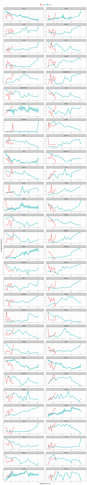
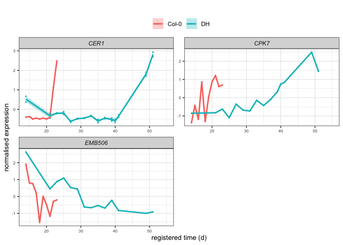

Running all of gene-registration functions for all genes in B. Oleracea
with revision in load\_mean\_df() function
================

-   [Load mean data frame](#load-mean-data-frame)
    -   [Analysing](#analysing)
    -   [Check the result of key floral
        genes](#check-the-result-of-key-floral-genes)

``` r
knitr::opts_chunk$set()
library(GREAT)
library(ggplot2)
library(data.table)
library(cowplot)
library(ggpubr)
```

    ## 
    ## Attaching package: 'ggpubr'

    ## The following object is masked from 'package:cowplot':
    ## 
    ##     get_legend

``` r
plot_registered_GoIs_for_comparible_timepoints <- function(all.stretched.df) {

  registered.plot.df <- all.stretched.df

  registered.plot.df$accession <- as.character(registered.plot.df$accession)
  registered.plot.df$accession[registered.plot.df$accession=='Col0'] <- 'Col-0'
  registered.plot.df$accession[registered.plot.df$accession=='Ro18'] <- 'DH'

  p.registered <- ggplot(registered.plot.df, aes(x=shifted_time, y=mean.cpm, color=accession, fill=accession))+
    stat_summary(fun=mean, geom='line', size=1)+
    stat_summary(fun.data=mean_se, fun.args=list(mult=1),geom='ribbon',
                 color=NA, alpha=0.3)+
    geom_point(size=0.4)+
    theme_bw()+
    xlab('registered time (d)')+
    ylab('normalised expression')+
    facet_wrap(~symbol, scales='free', ncol=2)+
    scale_x_continuous(breaks=scales::pretty_breaks(), limits = c(14, 55))+
    theme(legend.position = 'top',
          legend.title = element_blank(),
          axis.title = element_text(size=10),
          axis.text=element_text(size=6),
          strip.text=element_text(face='italic'),
          legend.margin=margin(21,0,0,0))

  return(p.registered)
}
```

## Load mean data frame

``` r
# Get all of the data path
table_id_path <- "/Users/kristiar/PhD/second-rotation-JIC/b_oleracea/data/ID_TAB.csv"
ara_path <- '/Users/kristiar/PhD/second-rotation-JIC/b_oleracea/data/klepikova.rds'
b_oleracea_path <- "/Users/kristiar/PhD/second-rotation-JIC/b_oleracea/data/dh_with_sample_id.rds"
```

``` r
id_table_all <- data.table::fread(table_id_path) %>% 
  dplyr::select(CDS.model, symbol, locus_name) %>% 
  dplyr::arrange(symbol) %>% 
  dplyr::mutate(CDS.model = toupper(CDS.model)) %>% 
  unique()

# Take all locus name from the table
list_all_ara_locus_name <- id_table_all %>% 
  dplyr::pull(locus_name)
```

``` r
id_table_all %>% 
  head(10) 
```

    ##       CDS.model symbol locus_name
    ##  1: BO00285S150         AT1G27170
    ##  2: BO00285S270         AT4G31740
    ##  3: BO00285S310         AT3G26510
    ##  4: BO00285S380         AT3G26670
    ##  5: BO00285S400         AT3G26700
    ##  6: BO00285S420         AT3G26730
    ##  7: BO00285S450         AT3G26760
    ##  8: BO00285S460         AT3G26770
    ##  9: BO00285S510         AT3G26780
    ## 10: BO00285S570         AT3G26820

``` r
# Get summary 
id_table_with_symbol <- id_table_all %>% 
  dplyr::filter(symbol != "") %>% 
  nrow()

id_table_without_symbol <- id_table_all %>% 
  dplyr::filter(symbol == "") %>% 
  nrow()

data.frame(with_symbol = id_table_with_symbol, 
           without_symbol = id_table_without_symbol)
```

``` r
b_oleracea_mean_df <- GREAT::load_mean_df(
  file_path_brassica = b_oleracea_path,
  file_path_arabidopsis = ara_path,
  file_path_id_table = table_id_path,
  tissue_wanted = "apex",
  curr_GoIs = list_all_ara_locus_name,
  sum_brassicas = F
)
```

    ## Warning in mean_df$locus_name == keep_bra_genes: longer object length is not a
    ## multiple of shorter object length

    ## [1] "20870 brassica genes considered in the comparison"
    ## [1] "1 all genes considered in the comparison"

``` r
# Change the accession since all the scripts are still hard-coded for "Ro18"
mean_df <- b_oleracea_mean_df[[1]] %>% 
  dplyr::mutate(accession = ifelse(accession == "DH", "Ro18", "Col0"))
all.data.df <- b_oleracea_mean_df[[2]] %>% 
  dplyr::mutate(accession = ifelse(accession == "DH", "Ro18", "Col0"))
```

``` r
outdir.string <- 'TESTING_B_Oleracea_all_genes'
do.initial.rescale <- 'TRUE' 
do.register.rescale <- 'rescale'

stretch = c(7, 6.5, 6, 5.5, 5, 4.5, 4, 3.5, 3, 2.5)
min_num_overlapping_points = 4
shift_extreme = 4
transformed.timecourse = 'Col0'
num.shuffled <- 1 
jobNum <- 1

if (do.initial.rescale=='rescale') {
  initial.rescale <- TRUE
} else {
  initial.rescale <- FALSE
}
if (do.register.rescale=='rescale') {
  should.rescale <- TRUE
} else {
  should.rescale <- FALSE
}
```

``` r
shifted_stretched_all <- prepare_scaled_and_registered_data(
  mean_df, 
  all.data.df,
  stretch, 
  initial.rescale = TRUE, 
  do_rescale = FALSE,
  min_num_overlapping_points,
  shift_extreme, 
  transformed.timecourse
)
```

``` r
# saveRDS(shifted_stretched_all, "others/shifted_stretched_all.rds")
# 
# shifted_stretched_all[[3]] %>% 
#   nrow()
```

### Analysing

``` r
shifted_stretched_all <- readRDS("others/shifted_stretched_all.rds")

mean_df <- shifted_stretched_all[["mean_df"]] 
mean_df.sc <- shifted_stretched_all[["mean_df.sc"]]
imputed.mean_df <- shifted_stretched_all[["imputed.mean_df"]] 
all_shifts <- shifted_stretched_all[["all_shifts"]] 
model.comparison <- shifted_stretched_all[["model.comparison"]]
```

``` r
model.comparison %>% 
  head(5)
```

    ##           gene seperate.AIC registered.AIC seperate.BIC registered.BIC stretch
    ## 1: BO00418S190     198.8443       211.9604     223.5696       228.4439       7
    ## 2: BO00434S130     187.6364       187.6931     212.3617       204.1766       7
    ## 3: BO00534S090     268.6059       272.3236     294.6986       289.7187       7
    ## 4: BO00578S040     203.1160       207.7300     228.2482       224.4848       7
    ## 5: BO00578S180     179.4130       179.2294     204.1384       195.7129       7
    ##        shift is.best BIC.registered.is.better AIC.registered.is.better
    ## 1:  2.666667    TRUE                    FALSE                    FALSE
    ## 2:  3.666667    TRUE                     TRUE                    FALSE
    ## 3:  1.000000    TRUE                     TRUE                    FALSE
    ## 4: -4.000000    TRUE                     TRUE                    FALSE
    ## 5:  3.333333    TRUE                     TRUE                     TRUE
    ##    ABIC.registered.is.better
    ## 1:                     FALSE
    ## 2:                     FALSE
    ## 3:                     FALSE
    ## 4:                     FALSE
    ## 5:                      TRUE

``` r
data.table(AIC_better = sum(model.comparison$AIC.registered.is.better), 
           BIC_better = sum(model.comparison$BIC.registered.is.better), 
           total_genes = nrow(model.comparison), 
           registered_genes = sum(model.comparison$BIC.registered.is.better), 
           unregistered_genes = nrow(model.comparison) - sum(model.comparison$BIC.registered.is.better))
```

    ##    AIC_better BIC_better total_genes registered_genes unregistered_genes
    ## 1:       6133      13719       20760            13719               7041

``` r
table_id_info_key_floral_genes <- data.table::fread(table_id_path) %>% 
  dplyr::filter(symbol %in% c("SOC1", "AP1", "AP3", "AGL24", "LFY")) %>% 
  dplyr::select(CDS.model, symbol, locus_name) %>% 
  dplyr::mutate(CDS.model = toupper(CDS.model)) %>% 
  unique() %>% 
  dplyr::arrange(symbol)

table_id_info_key_floral_genes
```

    ##      CDS.model symbol locus_name
    ##  1: BO1G039080  AGL24  AT4G24540
    ##  2: BO7G109590  AGL24  AT4G24540
    ##  3: BO2G062650    AP1  AT1G69120
    ##  4: BO6G095760    AP1  AT1G69120
    ##  5: BO6G108600    AP1  AT1G69120
    ##  6: BO4G120010    AP3  AT3G54340
    ##  7: BO8G083600    AP3  AT3G54340
    ##  8: BO2G161690    LFY  AT5G61850
    ##  9: BO3G109270    LFY  AT5G61850
    ## 10: BO3G038880   SOC1  AT2G45660
    ## 11: BO4G024850   SOC1  AT2G45660
    ## 12: BO4G195720   SOC1  AT2G45660

``` r
imputed.mean_df %>% 
  nrow()
```

    ## [1] 1806120

### Check the result of key floral genes

``` r
imputed.mean_df_floral_genes <- imputed.mean_df %>% 
  dplyr::left_join(table_id_info_key_floral_genes, by = c("locus_name" = "CDS.model")) %>% 
  dplyr::filter(!is.na(symbol))
  
imputed.mean_df_floral_genes %>% 
  dplyr::filter(is.registered == TRUE) %>% 
  dplyr::pull(symbol) %>% 
  unique()
```

    ## [1] "AGL24" "LFY"   "SOC1"  "AP1"

``` r
imputed.mean_df_floral_genes %>% 
  dplyr::filter(is.registered == FALSE) %>% 
  dplyr::pull(symbol) %>% 
  unique()
```

    ## [1] "AP3" "AP1"

``` r
imputed.mean_df_floral_genes %>% 
  head(5)
```

    ##    locus_name accession tissue timepoint   mean.cpm stretched.time.delta
    ## 1: BO1G039080      Ro18   apex        37  1.5648746                   23
    ## 2: BO1G039080      Ro18   apex        39  1.1181460                   25
    ## 3: BO1G039080      Ro18   apex        40  1.5326964                   26
    ## 4: BO1G039080      Ro18   apex        41  1.1866525                   27
    ## 5: BO1G039080      Ro18   apex        49 -0.1059272                   35
    ##    shifted_time is.registered symbol locus_name.y
    ## 1:           37          TRUE  AGL24    AT4G24540
    ## 2:           39          TRUE  AGL24    AT4G24540
    ## 3:           40          TRUE  AGL24    AT4G24540
    ## 4:           41          TRUE  AGL24    AT4G24540
    ## 5:           49          TRUE  AGL24    AT4G24540

``` r
test <- imputed.mean_df_floral_genes %>% 
  dplyr::select(-c(locus_name.y)) %>%
  dplyr::rename(locus_name = symbol, bra_gene = locus_name)
```

``` r
shifted_stretched_oleracea_floral_genes <- plot_registered_GoIs_for_comparible_timepoints(imputed.mean_df_floral_genes)

# ggsave("shifted_stretched_oleracea_floral_genes.pdf", shifted_stretched_oleracea_floral_genes, width = 6, height = 10)
```

``` r
imputed.mean_df_floral_genes %>% 
  dplyr::filter(symbol == "AP3") %>% 
  dplyr::pull(locus_name) %>% 
  unique()
```

    ## [1] "BO4G120010" "BO8G083600"

``` r
model.comparison %>% 
  dplyr::filter(gene %in% c("BO4G120010","BO8G083600"))
```

    ##          gene seperate.AIC registered.AIC seperate.BIC registered.BIC stretch
    ## 1: BO4G120010    -79.92564      -20.41745    -52.44013      -2.093772     4.0
    ## 2: BO8G083600    -64.05853      -24.77898    -36.73854      -6.565651     3.5
    ##         shift is.best BIC.registered.is.better AIC.registered.is.better
    ## 1: -0.6666667    TRUE                    FALSE                    FALSE
    ## 2:  3.3333333    TRUE                    FALSE                    FALSE
    ##    ABIC.registered.is.better
    ## 1:                     FALSE
    ## 2:                     FALSE

Try to see example with of non-register models

``` r
# Get the non-registered genes with known symbol 
imputed.mean_df_non_reg_with_symbol <- imputed.mean_df %>% 
  dplyr::left_join(id_table_all, by = c("locus_name" = "CDS.model")) %>%
  dplyr::filter(is.registered == FALSE, !is.na(symbol)) 

symbol_samples <- imputed.mean_df_non_reg_with_symbol %>% 
  dplyr::pull(symbol) %>% 
  unique() %>% 
  sample(size = 60)

test_symbol <- c("CER1", "CPK7", "EMB506")
```

``` r
test_using_sample_symbol <- imputed.mean_df_non_reg_with_symbol %>% 
  dplyr::filter(symbol %in% symbol_samples)

test_using_test_symbol <- imputed.mean_df_non_reg_with_symbol %>% 
  dplyr::filter(symbol %in% test_symbol)


test_using_sample_symbol %>% 
  head()
```

    ##     locus_name accession tissue timepoint   mean.cpm stretched.time.delta
    ## 1: BO00629S160      Ro18   apex        37 0.09992795                   23
    ## 2: BO00629S160      Ro18   apex        39 0.31501986                   25
    ## 3: BO00629S160      Ro18   apex        40 0.29796084                   26
    ## 4: BO00629S160      Ro18   apex        41 0.86574085                   27
    ## 5: BO00629S160      Ro18   apex        49 1.57340197                   35
    ## 6: BO00629S160      Ro18   apex        51 1.98460779                   37
    ##    shifted_time is.registered symbol locus_name.y
    ## 1:           37         FALSE   SPL7    AT5G18830
    ## 2:           39         FALSE   SPL7    AT5G18830
    ## 3:           40         FALSE   SPL7    AT5G18830
    ## 4:           41         FALSE   SPL7    AT5G18830
    ## 5:           49         FALSE   SPL7    AT5G18830
    ## 6:           51         FALSE   SPL7    AT5G18830

``` r
plot_registered_GoIs_for_comparible_timepoints(test_using_sample_symbol)
```

<!-- -->

``` r
plot_registered_GoIs_for_comparible_timepoints(test_using_test_symbol)
```

<!-- -->
