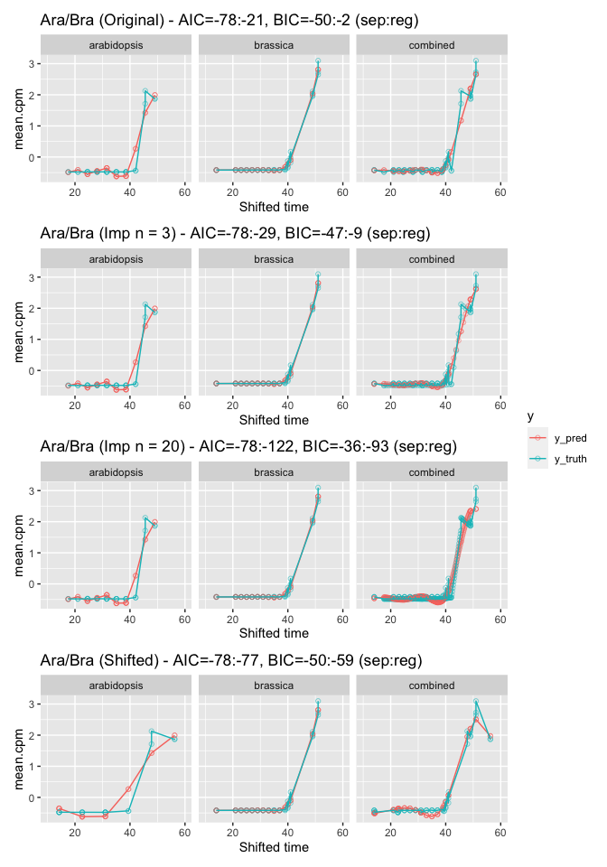
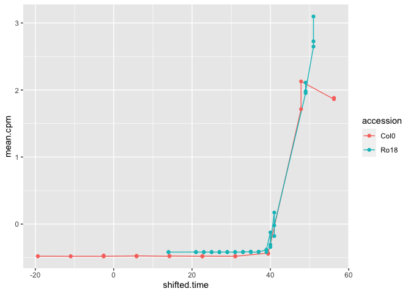

Comparing registered and non-registered models with more samples and
more stretches/shifts
================
Ruth Kristianingsih
2021-03-04

-   [Background](#background)
-   [Initial set-up](#initial-set-up)
    -   [Load data](#load-data)
    -   [Compare registered to
        unregistered](#compare-registered-to-unregistered)
    -   [Plots](#plots)
        -   [Compare different options](#compare-different-options)
        -   [Good shift](#good-shift)

# Background

Comparing registered and non-registered models with more sample points
between in *Arabidopsis* data by calculating BIC/AIC values. Also trying
to apply more shift and stretch on the data with best/optimal shift and
stretch value.

# Initial set-up

## Load data

``` r
shifted.all.data.df <- readRDS("others/shifted.all.data.df.RDS")
```

## Compare registered to unregistered

``` r
L_ara_ara <- compare_registered_to_unregistered_model_with_ks(
  curr.sym = "BO4G120010",
  shifted.all.data.df,
  accessions = rep("Col0", 2)
)
```

    ## Warning in stats::ks.test(ara.spline.data$mean_cpm, bra.spline.data$mean_cpm):
    ## cannot compute exact p-value with ties

``` r
L_bra_bra <- compare_registered_to_unregistered_model_with_ks(
  curr.sym = "BO4G120010",
  shifted.all.data.df,
  accessions = rep("Ro18", 2)
)
```

    ## Warning in stats::ks.test(ara.spline.data$mean_cpm, bra.spline.data$mean_cpm):
    ## cannot compute exact p-value with ties

``` r
L_ara_bra <- compare_registered_to_unregistered_model_with_ks(
  curr.sym = "BO4G120010",
  shifted.all.data.df
)
```

    ## Warning in stats::ks.test(ara.spline.data$mean_cpm, bra.spline.data$mean_cpm):
    ## cannot compute exact p-value with ties

``` r
L_ara_bra_imp_3<- compare_registered_to_unregistered_model_with_ks(
  curr.sym = "BO4G120010",
  shifted.all.data.df,
  n_input = 3
)
```

    ## Registered S3 method overwritten by 'quantmod':
    ##   method            from
    ##   as.zoo.data.frame zoo

    ## Warning in stats::ks.test(ara.spline.data$mean_cpm, bra.spline.data$mean_cpm):
    ## cannot compute exact p-value with ties

``` r
L_ara_bra_imp_20 <- compare_registered_to_unregistered_model_with_ks(
  curr.sym = "BO4G120010",
  shifted.all.data.df,
  n_input = 20
)
```

    ## Warning in stats::ks.test(ara.spline.data$mean_cpm, bra.spline.data$mean_cpm):
    ## cannot compute exact p-value with ties

``` r
L_ara_bra_shifted <- compare_registered_to_unregistered_model_with_ks(
  curr.sym = "BO4G120010",
  shifted.all.data.df,
  n_input = 0,
  new_shape = TRUE,
  shape = c(2.4, -61.5)
)
```

    ## Warning in stats::ks.test(ara.spline.data$mean_cpm, bra.spline.data$mean_cpm):
    ## cannot compute exact p-value with ties

## Plots

### Compare different options

``` r
list(
  # plot_fit(L_ara_ara, title = "Ara/Ara - ", facets = c("arabidopsis1", "arabidopsis2")),
  # plot_fit(L_bra_bra, title = "Bra/Bra - ", facets = c("brassica1", "brassica2")),
  plot_fit(L_ara_bra, title = "Ara/Bra (Original) - "),
  plot_fit(L_ara_bra_imp_3, title = "Ara/Bra (Imp n = 3) - "),
  plot_fit(L_ara_bra_imp_20, title = "Ara/Bra (Imp n = 20) - "),
  plot_fit(L_ara_bra_shifted, title = "Ara/Bra (Shifted) - ")
) %>%
  patchwork::wrap_plots(ncol = 1, guides = "collect")
```

    ## Warning: Removed 48 rows containing missing values (geom_point).

    ## Warning: Removed 24 row(s) containing missing values (geom_path).

<!-- -->

### Good shift

``` r
rbind(
  L_ara_bra_shifted$ara.spline.data,
  L_ara_bra_shifted$bra.spline.data
) %>%
  ggplot() +
  aes(x = shifted_time, y = mean_cpm, group = accession, color = accession) +
  geom_line() +
  geom_point()
```

<!-- -->
