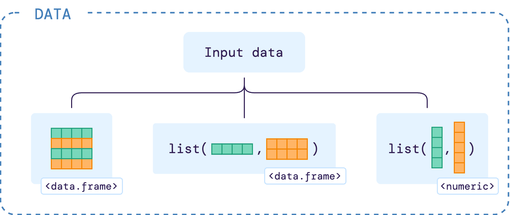

```{r, include = FALSE}
knitr::opts_chunk$set(
  collapse = TRUE,
  comment = "#>"
)
```

```{r fig-input-diagram, echo=FALSE, fig.align='center', out.width='75%'}

```

```{r fig-input-table, echo=FALSE, fig.align='center', out.width='75%'}
knitr::include_graphics("figures/input_table.png")
```

This data frame must contain **reference** and **query** expression data which users wish to compare, and the following five columns:

- `gene_id`: locus name or unique ID of each gene.
- `accession`: accession or name of the reference and query data to compare.
- `timepoint`: time points of the gene expression data.
- `expression_value`: desired expression values or measure of the abundance of gene or transcripts which users wish to compare. This value can be RPM, RPKM, FPKM, TPM, TMM, DESeq, SCnorm, GeTMM, ComBat-Seq, and raw reads counts.
- `replicate`: biological replicate ID for an expression value at a particular time point.

Below we can see a real example of how the `input` data should look like:

```{r brapa-data-kable, echo=FALSE}
# Load a data frame from the sample data
b_rapa_data <- system.file("extdata/brapa_arabidopsis_data.csv", package = "greatR") |>
  data.table::fread()

b_rapa_data[, .SD[1:2], by = accession][, .(gene_id, accession, timepoint, expression_value, replicate)] |>
  knitr::kable()
```

## A list of data frames as an input

```{r fig-input-list-tables, echo=FALSE, fig.align='center', out.width='85%'}
knitr::include_graphics("figures/input_list_tables.png")
```

## A list of vectors as an input

```{r fig-input-list-vectors, echo=FALSE, fig.align='center', out.width='38%'}
knitr::include_graphics("figures/input_list_vectors.png")
```
