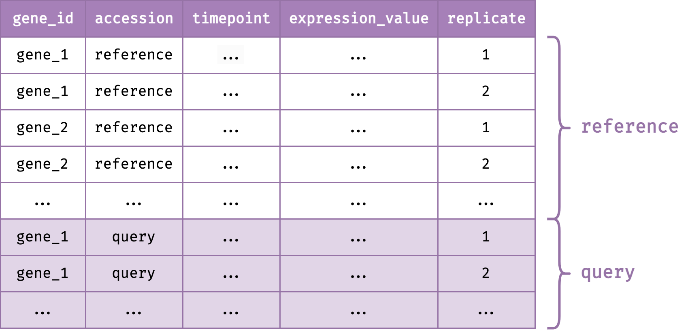

```{r, include = FALSE}
knitr::opts_chunk$set(
  collapse = TRUE,
  comment = "#>"
)
```


Input data required for `greatR` is a data frame that contains gene expression time-course data with all replicates. The illustrated diagram below shows the required `input`. 


```{r fig-all-data-illustration, echo=FALSE, fig.align='center', out.width='50%'}

```

<br>

This data frame must contain:

- reference and query expression data which users wish to compare, and
- six data columns: 

  - `gene_id`: accession or unique IDs of each gene. 
  - `accession`: accession or name of the reference and query data to compare.
  - `timepoint`: time points of the gene expression data.
  - `expression_value`: desired expression values or measure of the abundance of gene or transcripts which users wish to compare. This value can be RPM, RPKM, FPKM, TPM, TMM, DESeq, SCnorm, GeTMM, ComBat-Seq and raw reads counts.
  - `replicate`: biological replicate IDs for an expression value at a particular time point.

