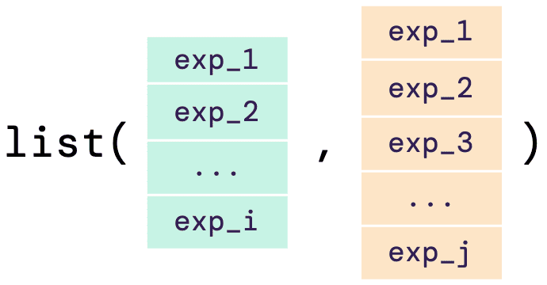

```{r, include = FALSE}
knitr::opts_chunk$set(
  collapse = TRUE,
  comment = "#>"
)

options(width = 10000)
```

The input data required for `greatR` can be either a data frame, a list of data frames, or a list of vectors, as shown below: 

```{r fig-input-diagram, echo=FALSE, fig.align='center', out.width='75%'}

```

## A single data frame input

The single data frame input or the data frame in the list must contain gene expression time-course data with all replicates. The illustrative diagram below shows the required structure of the `input`.

```{r fig-input-table, echo=FALSE, fig.align='center', out.width='75%'}
knitr::include_graphics("figures/input_table.png")
```

This data frame must contain **reference** and **query** expression data, and the following five columns:

- `gene_id`: locus name or unique ID of each gene.
- `accession`: accession or name of the reference and query data.
- `timepoint`: time points of the gene expression data.
- `expression_value`: desired expression values or measure of the abundance of gene or transcripts. This value can be RPM, RPKM, FPKM, TPM, TMM, or raw read counts.
- `replicate`: biological replicate ID for an expression value at a particular time point.

The example below shows how the `input` data should look like:

```{r brapa-data-kable, echo=FALSE}
# Load a data frame from the sample data
b_rapa_data <- system.file("extdata/brapa_arabidopsis_data.csv", package = "greatR") |>
  data.table::fread()

b_rapa_data[, .SD[1:2], by = accession][, .(gene_id, accession, timepoint, expression_value, replicate)] |>
  knitr::kable()
```

## A list of data frames as an input

If users do not have the data **reference** and **query** joined with the IDs mapped into one single data frame, there is an option of having the input data of a list of data frames. As shown in the illustrative diagram below, the list must contain both **reference** and **query** data frames with the columns as required in the single data frame input (see previous section). 

```{r fig-input-list-tables, echo=FALSE, fig.align='center', out.width='85%'}
knitr::include_graphics("figures/input_list_tables.png")
```

The example below shows how the `input` list of data frames should look like:

```{r brapa-data-list-df-read, include=FALSE}
# Load a data frame from the sample data
brapa_ref_data <- system.file("extdata/brapa_SOC1_data.csv", package = "greatR") |>
  data.table::fread()

ara_query_data <- system.file("extdata/arabidopsis_SOC1_data.csv", package = "greatR") |>
  data.table::fread()

list_df <- list(
  reference = brapa_ref_data,
  query = ara_query_data
)
```

```r 
# Load data frames from the sample data
brapa_ref_data <- system.file("extdata/brapa_SOC1_data.csv", package = "greatR") |>
  data.table::fread()

ara_query_data <- system.file("extdata/arabidopsis_SOC1_data.csv", package = "greatR") |>
  data.table::fread()

list_df <- list(
  reference = brapa_ref_data,
  query = ara_query_data
)

list_df
#> $reference
#>             gene_id accession timepoint expression_value                    replicate
#>              <char>    <char>     <int>            <num>                       <char>
#> 1: BRAA03G023790.3C      Ro18        11         1.984367  ERR_ro18_rna_seq_v3_R18A1_1
#> 2: BRAA03G023790.3C      Ro18        11         1.474974  ERR_ro18_rna_seq_v3_R18A1_2
#> 3: BRAA03G023790.3C      Ro18        11         2.194917  ERR_ro18_rna_seq_v3_R18A1_3
#> 4: BRAA03G023790.3C      Ro18        29       113.797721 ERR_ro18_rna_seq_v3_R18A10_1
#> 5: BRAA03G023790.3C      Ro18        29        94.650207 ERR_ro18_rna_seq_v3_R18A10_2
#> 6: BRAA03G023790.3C      Ro18        29       129.176178 ERR_ro18_rna_seq_v3_R18A10_3
#> 
#> $query
#>      gene_id accession timepoint expression_value                   replicate
#>       <char>    <char>     <int>            <num>                      <char>
#> 1: AT2G45660      Col0        15         76.95936 ERR_ds_klepikova_SRR1688425
#> 2: AT2G45660      Col0        14         81.96151 ERR_ds_klepikova_SRR1688328
#> 3: AT2G45660      Col0        16         59.24077 ERR_ds_klepikova_SRR1688427
#> 4: AT2G45660      Col0        15         68.85581 ERR_ds_klepikova_SRR1688426
#> 5: AT2G45660      Col0        12         64.21780 ERR_ds_klepikova_SRR2106520
#> 6: AT2G45660      Col0        10         72.98476 ERR_ds_klepikova_SRR1661475
```

Note here that the elements of the list must be named **reference** and **query**, the order of the element will not effect the registration process. 

## A list of vectors as an input

As an alternative of a list of data frame as input data, as shown above, users can also have a list of numerical vectors as their input. The illustrative diagram below shows how the input should look like:

```{r fig-input-list-vectors, echo=FALSE, fig.align='center', out.width='38%'}

```

The example below shows how the `input` list of vectors can be defined as an input: 

```{r brapa-data-list-num}
# Define expression value vectors
ref_expressions <- c(1.9, 3.1, 7.8, 31.6, 33.7, 31.5, 131.4, 107.5, 116.7, 112.5, 109.7, 57.4, 50.9)
query_expressions <- c(14, 12.1, 15.9, 47, 30.9, 50.5, 80.1, 67.4, 72.9, 61.7)

list_vector <- list(
  reference = ref_expressions,
  query = query_expressions
)

list_vector
```

Note that since there is no ID specified on the vectors, `greatR` will assign a unique ID for the reference and query pair data (see more in the [register data > Using other inputs ](https://ruthkr.github.io/greatR/articles/register-data.html#registration-results-1) article).
