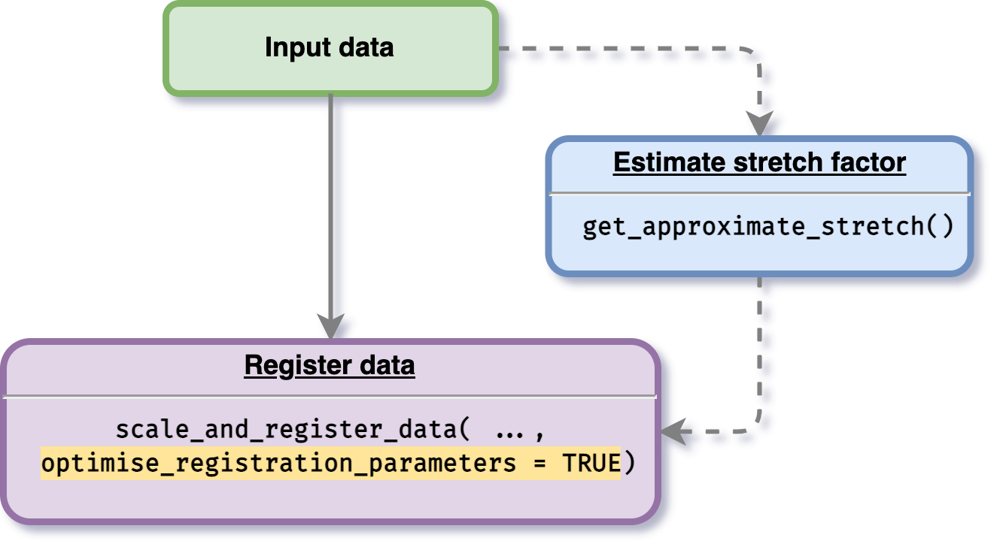
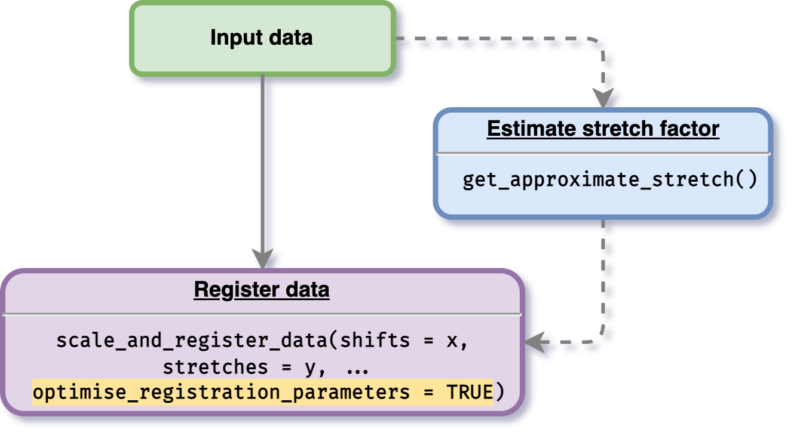
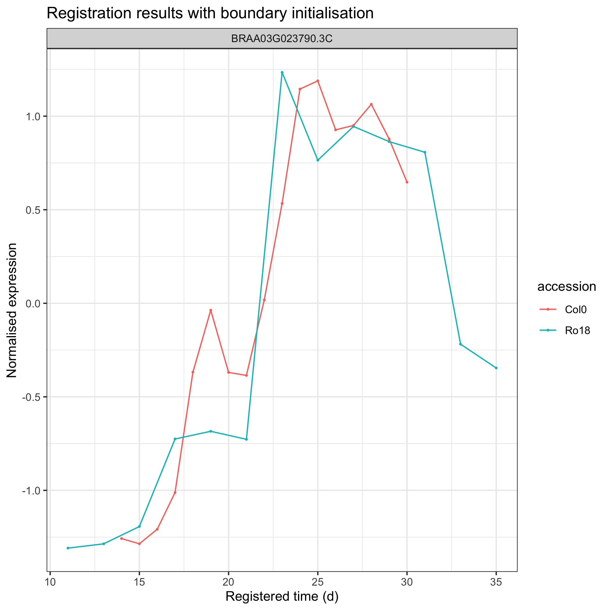

```{r, include = FALSE}
knitr::opts_chunk$set(
  collapse = TRUE,
  comment = "#>"
)
```

Another feature provided by this package is an option for users to optimise the registration parameter values. To do this procedure, a user is given an option to initialise stretches and shifts. If a user defines stretch and shift factors boundary, the optimisation process will be processed within the boundary values initialised. If a user does not give any initialisation value, then the optimisation boundary will be automatically calculated. 

## Without boundary initialisation 

The data used on [register data](https://ruthkr.github.io/greatR/articles/register-data.html) section will be used. To do this optimisation process, users just need to enable parameter `optimise_registration_parameters = TRUE` when using the main function `scale_and_register_data()` as shown in the figure below. 

```{r opt-data-with-initial, echo=FALSE, fig.align='center', out.width='50%'}

```

```{r example, message=FALSE, include=FALSE}
# Load the package
library(greatR)
library(dplyr)
```

```{r all-data, message=FALSE, warning=FALSE, include=FALSE}
# Gene expression data with replicates
all_data_df <- system.file("extdata/brapa_arabidopsis_all_replicates.csv", package = "greatR") %>%
  utils::read.csv()
```

As an example, we will use only one gene `BRAA03G023790.3C`, we can filter the data by doing as follows:


```{r}
gene_BRAA03G023790.3C_data <- all_data_df %>% 
  dplyr::filter(locus_name == "BRAA03G023790.3C")

gene_BRAA03G023790.3C_data %>% 
  head(5) %>% 
  knitr::kable()
```


```{r register-data-without-boundary, message=FALSE, warning=FALSE, eval=FALSE}
# Running the registration
registration_results_without_boundary <- scale_and_register_data(
  input_df = gene_BRAA03G023790.3C_data,
  min_num_overlapping_points = 4,
  initial_rescale = FALSE,
  do_rescale = TRUE,
  accession_data_to_transform = "Col0",
  accession_data_ref = "Ro18",
  start_timepoint = "reference", 
  maintain_min_num_overlapping_points = FALSE, 
  optimise_registration_parameters = TRUE
)

# ── Starting optimisation ────────────────────────────────────────────────────────────────────────────
# ℹ Using computed stretch boundary                    
# ℹ Using computed shift boundary                      
# ✓ Optimising registration parameters for genes (1/1) [11m 30s]
# ✓ Finished optimisation
# 
# ── Model comparison results ─────────────────────────────────────────────────────────────────────────
# ℹ BIC finds registration better than non-registration for: 1/1
# 
# ── Applying the best-shifts and stretches to gene expression ────────────────────────────────────────
# ✓ Normalising expression by mean and sd of compared values (1/1) [20ms]
# ✓ Applying best shift (1/1) [26ms]
# ℹ Max value of expression_value: 1.36
# ✓ Imputing transformed expression values (1/1) [29ms]
```

After running the registration, we can then visualise the results as follows:

```{r fig.height=3, fig.width=5, eval=FALSE}
registration_results_without_boundary$imputed_mean_df %>% 
  greatR::plot_registration_results() +
  ggplot2::labs(title = "Registration results without boundary initialisation") 
```

```{r plot-without-boundary, echo=FALSE, fig.align='center', out.width='50%'}
knitr::include_graphics("figures/reg_results_without_boundary_init.png")
```

## With boundary initialisation 

Users can also specify or initialise boundary where the optimisation will be performed by doing the same routine as the process done above, but with the stretch and shift initialisation (see figure below).  

```{r opt-data-without-initial, echo=FALSE, fig.align='center', out.width='50%'}

```

```{r register-data-with-boundary, message=FALSE, warning=FALSE, eval=FALSE}
# Running the registration
registration_results_with_boundary <- scale_and_register_data(
  input_df = gene_BRAA03G023790.3C_data,
  stretches = c(1.5, 2), 
  shifts = seq(1.5, 3, by = 0.5),
  min_num_overlapping_points = 4,
  initial_rescale = FALSE,
  do_rescale = TRUE,
  accession_data_to_transform = "Col0",
  accession_data_ref = "Ro18",
  start_timepoint = "reference", 
  maintain_min_num_overlapping_points = FALSE,
  optimise_registration_parameters = TRUE
)

# ── Starting optimisation ────────────────────────────────────────────────────────────────────────────
# ℹ Using user-defined stretches as stretch boundary
# ℹ Using user-defined shifts as shift boundary
# ✓ Optimising registration parameters for genes (1/1) [8m 3.9s]
# ✓ Finished optimisation
# 
# ── Model comparison results ─────────────────────────────────────────────────────────────────────────
# ℹ BIC finds registration better than non-registration for: 1/1
# 
# ── Applying the best-shifts and stretches to gene expression ────────────────────────────────────────
# ✓ Normalising expression by mean and sd of compared values (1/1) [13ms]
# ✓ Applying best shift (1/1) [23ms]
# ℹ Max value of expression_value: 1.36
# ✓ Imputing transformed expression values (1/1) [20ms]
```

After running the registration, we can then visualise the results as follows:

```{r fig.height=3, fig.width=5, eval=FALSE}
registration_results$imputed_mean_df %>% 
  greatR::plot_registration_results() +
  ggplot2::labs(title = "Registration results with boundary initialisation") 
```

```{r plot-with-boundary, echo=FALSE, fig.align='center', out.width='50%'}

```
