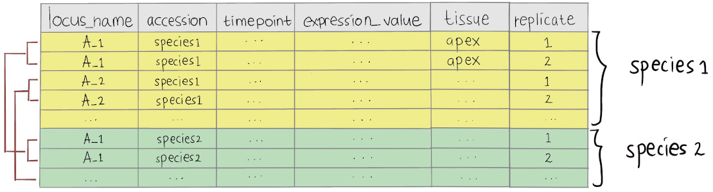
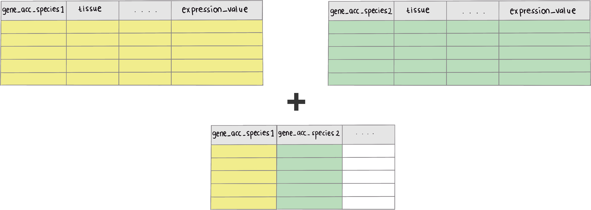

```{r, include = FALSE}
knitr::opts_chunk$set(
  collapse = TRUE,
  comment = "#>"
)
```

## Data requirements

Input data frame required for `greatR` to register your gene expression profiles is a data frame that contains gene expression time-course data with all replicates. The illustrated diagram below shows the required `input_df` data frame format of `greatR`. This data frame must contain:

- two different species which users wish to compare (for each gene, at least two replicates are required in all species), and
- six data columns: 

  - `locus_name`: accession or unique ID of each gene. 
  - `accession`: accession or name of the species to compare.
  - `timepoint`: time point of the gene expression data.
  - `expression_value`: desired RNA-seq expression value or measure of the abundance of gene or transcripts which one wishes to compare. This value can be RPM, RPKM, FPKM, TPM, TMM, DESeq, SCnorm, GeTMM, ComBat-Seq and raw reads counts.
  - `tissue`: tissue from which RNA-seq data were extracted. 
  - `group`: replicate ID for each expression value.

```{r all-data-illustration, echo=FALSE, fig.align='center', out.width='80%'}

```

<br>


## Using a helper function to prepare input data

`greatR` package provides a helper function `get_expression_of_interest()` to combine reference and query (data to register) data frames, if table ID which connect reference and query data frames provided (as illustrated in the figure below). 

```{r combine-data, echo=FALSE, fig.align='center', out.width='100%'}

```

<br>

This package also provides data frames as examples to use this function. Those data frames are expression data of *B. rapa* ([Calderwood et al., 2021](https://www.cambridge.org/core/journals/quantitative-plant-biology/article/comparative-transcriptomics-reveals-desynchronisation-of-gene-expression-during-the-floral-transition-between-arabidopsis-and-brassica-rapa-cultivars/811BFDFA14F4BCC9C7F0ECC7CE103BB6)), *Arabidopsis* ([Klepikova et al., 2015](https://bmcgenomics.biomedcentral.com/articles/10.1186/s12864-015-1688-9)), and join table or table ID which contains both accession of *B. rapa* and *Arabidopsis*. This table ID is important to combine both *B. rapa* and *Arabidopsis* data frames. 

### Load and view example data

```{r example, message=FALSE}
# Load the package
library(greatR)
library(dplyr)
```

To load example data frames provided within the package, users need to run the following procedure:

```{r load-data, message=FALSE, warning=FALSE}
# Load example data
id_table_rapa_subset <- system.file(
  "extdata/sample_data/id_table_5genes.rds", 
  package = "greatR") %>% 
  readRDS()
klepikova_subset <- system.file(
  "extdata/sample_data/arabidopsis_expression_5genes.rds", 
  package = "greatR") %>% 
  readRDS()
rapa_subset <- system.file(
  "extdata/sample_data/brassica_rapa_expression_5genes.rds", 
  package = "greatR") %>% 
  readRDS()
```

Let's take a look on each data frame we have loaded below:

```{r view-ref}
# View reference data
rapa_subset %>%
  utils::head(3) %>%
  knitr::kable()
```

```{r view-data-to-transform}
# View query data
klepikova_subset %>%
  utils::head(3) %>%
  knitr::kable()
```

As we can see, both data frames of expression profiles above contain a column of gene accession (`CDS.model`). These two columns from each data frame were mapped into a table ID as we can see below: `CDS.model` for *B. rapa* gene accessions and `locus_name` for *Arabidopsis* gene accessions.

```{r view-id-table}
# View table ID
id_table_rapa_subset %>%
  dplyr::select(CDS.model, locus_name, symbol, gene_id) %>% 
  utils::head(3) %>%
  knitr::kable()
```

Having all of these informations, we can then easily get the required input data. 

### Combine data

Users can use function `get_expression_of_interest()` to combine two different table data frames containing expression values that users wish to compare. 

```{r combine-dataframes, message=FALSE, warning=FALSE}
all_data <- get_expression_of_interest(
  data_ref = rapa_subset,
  data_to_transform = klepikova_subset,
  id_table = id_table_rapa_subset,
  lookup_col_ref_and_id_table = "CDS.model",
  lookup_col_ref_and_to_transform = "locus_name",
  colnames_wanted = NULL,
  tissue_wanted = "apex",
  gene_of_interest_acc = c("AT1G69120", "AT5G618"),
  sum_exp_data_ref = FALSE,
  accession_data_to_transform = "Col0"
)
```

Let's take a look on how the combined data:

```{r view-combined-data}
# View data
all_data %>%
  dplyr::group_by(accession) %>%
  dplyr::slice(1:3) %>%
  knitr::kable()
```


After combining reference data and data to transform, users need to adjust it to the required input data, this can be done as follows. 

```{r transform-to-final-data, message=FALSE, warning=FALSE}
all_data_final <- all_data %>% 
  dplyr::select(
    locus_name, 
    accession, 
    timepoint, 
    expression_value = norm.cpm, 
    tissue, 
    group
  )

all_data_final %>%
  dplyr::group_by(accession) %>%
  dplyr::slice(1:6) %>%
  knitr::kable()
```


