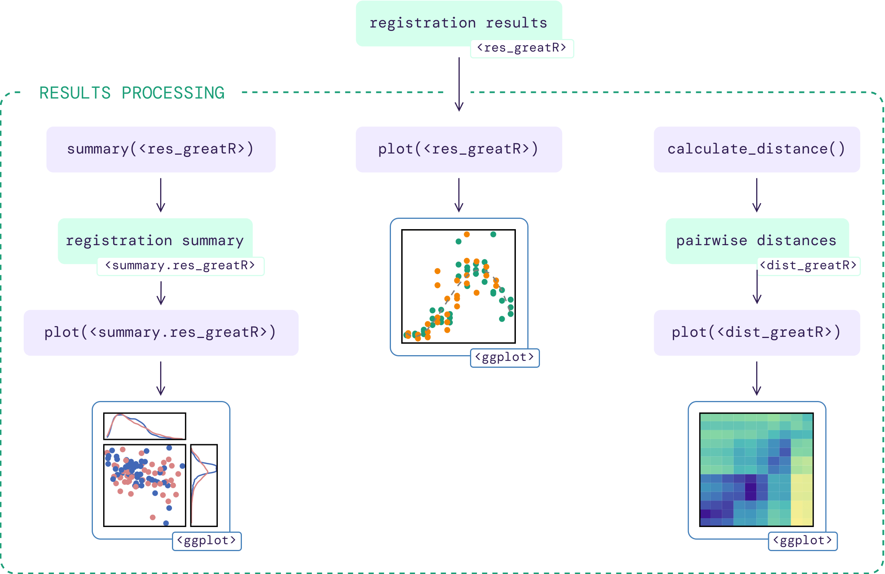

```{r, include = FALSE}
knitr::opts_chunk$set(
  collapse = TRUE,
  comment = "#>"
)
```

After running the registration function `register()` as shown in the [registering data](https://ruthkr.github.io/greatR/articles/register-data.html) article, users can summarise and visualise the results as illustrated in the figure below.

```{r vis-reg-data, echo=FALSE, fig.align='center', out.width='100%'}

```

## Summarising registration results

The total number of registered and non-registered genes can be obtained by running the function `summary()` with `registration_results` object as an input.

```{r load-greatR, message=FALSE, include=FALSE}
# Load the package
library(greatR)
library(data.table)
```

```{r brapa-data-results, message=FALSE, warning=FALSE, include=FALSE}
# Load a data frame from the sample data
registration_results <- system.file("extdata/brapa_arabidopsis_registration.rds", package = "greatR") |>
  readRDS()
```

The function `summary()` returns a list with S3 class `summary.res_greatR` containing four different objects:

- `summary` is a data frame containing the summary of the registration results (default S3 print).
- `registered_genes` is a vector of gene IDs which are successfully registered.
- `non_registered_genes` is a vector of non-registered gene IDs.
- `reg_params` is a data frame containing the distribution of registration parameters.

```{r get-summary-results, fig.align='center'}
# Get registration summary
reg_summary <- summary(registration_results)

reg_summary$summary |>
  knitr::kable()
```

The list of gene IDs which are registered or non-registered can be viewed by calling:

```{r print-accession-of-registered-genes}
reg_summary$registered_genes
```

```{r print-accession-of-non-registered-genes}
reg_summary$non_registered_genes
```

### Plot distribution of registration parameters

The function `plot()` allows users to plot the bivariate distribution of the registration parameters. Non-registered genes can be ignored by selecting `type = "registered"` instead of the default `type = "all"`. Similarly, the marginal distribution type can be changed from `type_dist = "histogram"` (default) to `type_dist = "density"`.

```r
plot(
  reg_summary,
  type = "registered"
)
```

```{r plot-summary-results, echo=FALSE, fig.align='center', fig.height=4, fig.width=4.5, warning=FALSE}
plot(
  reg_summary,
  type = "registered",
  scatterplot_size = c(4, 3.5)
)
```

## Plotting registration results

The function `plot()` allows users to plot the registration results of the genes of interest (by default only up to the first 25 genes are shown, for more control over this, use the `genes_list` argument).

```{r plot-results, fig.align='center', fig.height=8, fig.width=7, warning=FALSE}
# Plot registration result
plot(
  registration_results,
  ncol = 2
)
```

Notice that the plot includes a label indicating if the particular genes are registered or non-registered, as well as the registration parameters in case the registration is successful.

For more details on the other function arguments, go to `plot()`.

## Analysing similarity of expression profiles over time before and after registering

### Calculate sample distance

After registering the data, users can compare the overall similarity between datasets before and after registering using the function `calculate_distance()`. By default all genes are considered in this calculation, this can be changed by using the `genes_list` argument.

```{r get-sample-distance}
sample_distance <- calculate_distance(registration_results)
```

The function `calculate_distance()` returns a list with S3 class `dist_greatR` of two data frames:

- `result` is the distance between scaled reference and query expressions using time points after registration.
- `original` is the distance between scaled reference and query expressions using original time points before registration.

### Plot heatmap of sample distances

Each of these data frames above can be visualised using the `plot()` function, by selecting either `type = "result"` (default) or `type = "original"`.

```{r plot-dist-original, fig.align='center', fig.height=4, fig.width=3, warning=FALSE}
# Plot heatmap of mean expression profiles distance before registration process
plot(
  sample_distance,
  type = "original"
)
```

```{r plot-dist-registered, fig.align='center', fig.height=4, fig.width=4, warning=FALSE}
# Plot heatmap of mean expression profiles distance after registration process
plot(
  sample_distance,
  type = "result",
  match_timepoints = TRUE
)
```

Notice that we use `match_timepoints = TRUE` to match the registered query time points to the reference time points.
