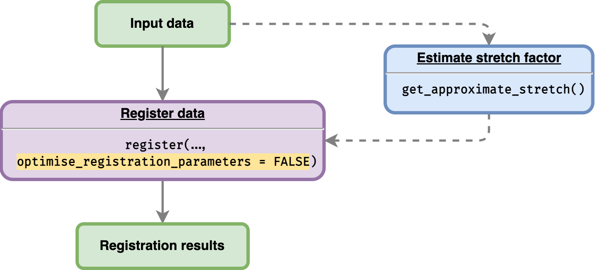

```{r, include = FALSE}
knitr::opts_chunk$set(
  collapse = TRUE,
  comment = "#>"
)
```

This article will show users on how to register data using some pre-defined shift and stretch parameters. This demo will use one of the gene from provided sample in the package. Users can check whether using shift and stretch values they provided, their sample data can be registered. 

## Load sample data

`greatR` package provides an example of data frame containing two different species *Arabidopsis* and *B. rapa* with two and three different replicates, respectively. This data frame can be read as follows:

```{r load-greatR, message=FALSE}
# Load the package
library(greatR)
library(data.table)
```

```{r brapa-data, message=FALSE, warning=FALSE}
# Load a data frame from the sample data
b_rapa_data <- system.file("extdata/brapa_arabidopsis_all_replicates.csv", package = "greatR") |>
  data.table::fread()
```

## Registering single gene

Here, we will only use a single gene *BRAA03G023790.3C* from sample data. 

```{r get-subset-data, message=FALSE, warning=FALSE}
gene_BRAA03G023790.3C_data <- b_rapa_data[gene_id == "BRAA03G023790.3C"]
```

Before registering, we can use the helper function `get_approximate_stretch` to approximate the stretch factor between our sample data as shown in figure below. 

```{r reg-data-manual, echo=FALSE, fig.align='center', out.width='60%'}

```


```{r get-approximate, message=FALSE, warning=FALSE}
get_approximate_stretch(gene_BRAA03G023790.3C_data,
  reference = "Ro18",
  query = "Col0"
)
```
We can now use the estimated stretch calculated above to the registration process as follows:

```{r register-subset-data, message=FALSE, warning=FALSE}
registration_results <-  register(
    gene_BRAA03G023790.3C_data,
    reference = "Ro18",
    query = "Col0",
    stretches = 2.6,
    shifts = 4, 
    optimise_registration_parameters = FALSE
)
#> ℹ Will process 1 gene.
#> 
#> ── Starting manual registration ────────────────────────────────────────────────
#> ✔ Applying registration for genes (1/1) [58ms]
```

To check whether the gene is registered or not, we can get the summary results by accessing `model_comparison` from the registration result. 


```{r get-model-summary-data, warning=FALSE}
registration_results$model_comparison |>
  knitr::kable()
```

Using given above stretch and shift parameter, one of the *B. rapa* gene *BRAA03G023790.3C*  can be registered. 

<br>

## Registering multiple gene with different pre-defined registration parameters


