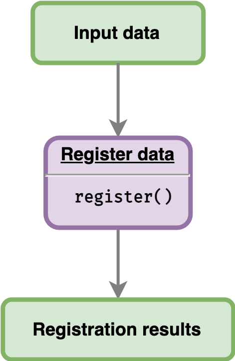

```{r, include = FALSE}
knitr::opts_chunk$set(
  collapse = TRUE,
  comment = "#>"
)
```

This article will show users how to register data using the sample data provided by the package. Given an input data, users can directly register the data as illustrated below.

<br>

```{r reg-data, echo=FALSE, fig.align='center', out.width='20%'}

```

## Loading sample data

`greatR` package provides an example of data frame containing two different species *A. thaliana* and *B. rapa* with two and three different replicates, respectively. This data frame can be read as follows:

```{r load-greatR, message=FALSE}
# Load the package
library(greatR)
library(data.table)
```

```{r brapa-data, message=FALSE, warning=FALSE}
# Load a data frame from the sample data
b_rapa_data <- system.file("extdata/brapa_arabidopsis_all_replicates.csv", package = "greatR") |>
  data.table::fread()
```

Note that the data has all of five columns required by the package:

```{r brapa-data-kable-clean, eval=FALSE}
b_rapa_data[, .SD[1:6], by = accession] |>
  knitr::kable()
```

```{r brapa-data-kable, echo=FALSE}
b_rapa_data[, .SD[1:6], by = accession][, .(gene_id, accession, timepoint, expression_value, replicate)] |>
  knitr::kable()
```

## Registering the data

To align gene expression time-course between *Arabidopsis* Col-0 and *B. rapa* Ro18, we can use function `register()`. By default, the best registration parameters are optimised via Nelder-Mead (`optimisation_method = "nm"`). When using the default `optimise_registration_parameters = TRUE`, the stretch and shift search space is automatically estimated. For more details on the other function paramaters, go to `register()`.

```{r register-data-raw, message=FALSE, warning=FALSE, eval=FALSE}
registration_results <- register(
  b_rapa_data,
  reference = "Ro18",
  query = "Col0"
)
#> ── Validating input data ────────────────────────────────────────────────────────
#> ℹ Will process 10 genes.
#>
#> ── Starting registration with optimisation ──────────────────────────────────────
#> ℹ Using Nelder-Mead method.
#> ℹ Using computed stretches and shifts search space limits.
#> ✔ Optimising registration parameters for genes (10/10) [2.3s]
```


## Registration results

The function `register()` returns a list of two frames:

- `data` is a data frame containing the scaled expression data and an additional `timepoint_reg` column which is a result of registered time points by applying the registration parameters to the query data.
- `model_comparison` is a data frame containing (a) the optimal stretch and shift for each `gene_id` and (b) the Bayesian Information Criterion (BIC) for the separate model (`BIC_separate`) and for the combined model (`BIC_combined`) after applying optimal registration parameters for each gene. If the value of `BIC_combined` < `BIC_separate`, then expression dynamics between reference and query data can be registered (`registered = TRUE`).

To check whether a gene is registered or not, we can get the summary results by accessing the `model_comparison` table from the registration result.

```{r register-data, message=FALSE, warning=FALSE, include=FALSE}
# Load a data frame from the sample data
registration_results <- system.file("extdata/brapa_arabidopsis_registration.rds", package = "greatR") |>
  readRDS()

registration_results$model_comparison <- registration_results$model_comparison[, .(gene_id, stretch, shift, BIC_separate, BIC_combined, registered)]
```

```{r get-model-summary-data, warning=FALSE}
registration_results$model_comparison |>
  knitr::kable()
```

From the sample data above, we can see that for all ten genes, `registered = TRUE`, meaning that reference and query data between those ten genes can be aligned or registered. These data frame outputs can further be summarised and visualised; see the documentation on the [visualising results](https://ruthkr.github.io/greatR/articles/visualise-results.html) article.
