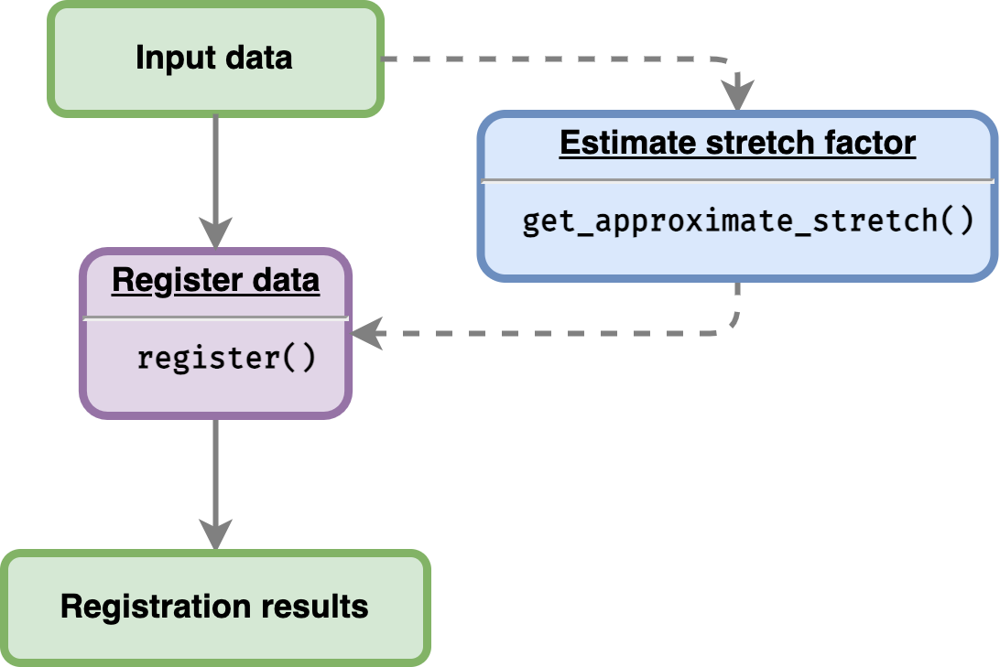

```{r, include = FALSE}
knitr::opts_chunk$set(
  collapse = TRUE,
  comment = "#>"
)
```

This article will show users on how to register data using the sample data provided within the package. Given an input data, users can directly register the data as illustrated below.

```{r reg-data, echo=FALSE, fig.align='center', out.width='50%'}

```

<br>


## Load sample data

`greatR` package provides an example of data frame containing two different species *Arabidopsis* and *B. rapa* with two and three different replicates, respectively. This data frame can be read as follow:

```{r example, message=FALSE}
# Load the package
library(greatR)
library(dplyr)
```

```{r all-data, message=FALSE, warning=FALSE}
# Gene expression data with replicates
all_data_df <- system.file("extdata/brapa_arabidopsis_all_replicates.csv", package = "greatR") %>%
  utils::read.csv()
```

Note that the data has all of six columns required by the package as documented on the [preparing data](https://ruthkr.github.io/greatR/articles/prepare-data.html) article.

```{r all-data-kable}
all_data_df %>%
  dplyr::group_by(accession) %>%
  dplyr::slice(1:6) %>%
  knitr::kable()
```


## Register the data

To align gene expression time-course between *Arabidopsis* Col-0 and *B. rapa* Ro18, we can use function `scale_and_register_data()`. Stretch factors as one of the parameters of function `scale_and_register_data()` can be estimated using function:

```{r estimate-stretch-factors, message=FALSE, warning=FALSE, eval=FALSE}
get_approximate_stretch(
  input_df = all_data_df,
  accession_data_to_transform = "Col0",
  accession_data_ref = "Ro18"
)
#> [1] 2.666667
```

As we can see above, the approximation of the stretch factor is around 2.7. Therefore, users can use some values around the estimation value. 

```{r register-data, message=FALSE, warning=FALSE}
# Running the registration
registration_results <- scale_and_register_data(
  input_df = all_data_df,
  stretches = c(3, 2.5, 2, 1.5, 1),
  shifts = seq(-4, 4, length.out = 33),
  min_num_overlapping_points = 4,
  initial_rescale = FALSE,
  do_rescale = TRUE,
  accession_data_to_transform = "Col0",
  accession_data_ref = "Ro18",
  start_timepoint = "reference"
)
#> 
#> ── Information before registration ─────────────────────────────────────────────
#> ℹ Max value of expression_value of all_data_df: 262.28
#> 
#> ── Analysing models for all stretch and shift factor ───────────────────────────
#> 
#> ── Analysing models for stretch factor = 3 ──
#> ✓ Calculating score for all shifts (10/10) [2.6s]
#> ✓ Normalising expression by mean and sd of compared values (10/10) [85ms]
#> ✓ Applying best shift (10/10) [91ms]
#> ✓ Calculating registration vs non-registration comparison BIC (10/10) [140ms]
#> ✓ Finished analysing models for stretch factor = 3
#> 
#> ── Analysing models for stretch factor = 2.5 ──
#> ✓ Calculating score for all shifts (10/10) [2.8s]
#> ✓ Normalising expression by mean and sd of compared values (10/10) [81ms]
#> ✓ Applying best shift (10/10) [103ms]
#> ✓ Calculating registration vs non-registration comparison BIC (10/10) [160ms]
#> ✓ Finished analysing models for stretch factor = 2.5
#> 
#> ── Analysing models for stretch factor = 2 ──
#> ✓ Calculating score for all shifts (10/10) [2.9s]
#> ✓ Normalising expression by mean and sd of compared values (10/10) [95ms]
#> ✓ Applying best shift (10/10) [82ms]
#> ✓ Calculating registration vs non-registration comparison BIC (10/10) [164ms]
#> ✓ Finished analysing models for stretch factor = 2
#> 
#> ── Analysing models for stretch factor = 1.5 ──
#> ✓ Calculating score for all shifts (10/10) [3s]
#> ✓ Normalising expression by mean and sd of compared values (10/10) [107ms]
#> ✓ Applying best shift (10/10) [84ms]
#> ✓ Calculating registration vs non-registration comparison BIC (10/10) [171ms]
#> ✓ Finished analysing models for stretch factor = 1.5
#> 
#> ── Analysing models for stretch factor = 1 ──
#> ✓ Calculating score for all shifts (10/10) [2.7s]
#> ✓ Normalising expression by mean and sd of compared values (10/10) [85ms]
#> ✓ Applying best shift (10/10) [90ms]
#> ✓ Calculating registration vs non-registration comparison BIC (10/10) [154ms]
#> ✓ Finished analysing models for stretch factor = 1
#> 
#> ── Model comparison results ────────────────────────────────────────────────────
#> ℹ BIC finds registration better than non-registration for: 10/10
#> 
#> ── Applying the best-shifts and stretches to gene expression ───────────────────
#> ✓ Normalising expression by mean and sd of compared values (10/10) [85ms]
#> ✓ Applying best shift (10/10) [98ms]
#> ℹ Max value of expression_value: 9.05
#> ✓ Imputing transformed expression values (10/10) [209ms]
#> 
```


Function `scale_and_register_data()` returns a list of seven data frames: 

- `mean_df` is a data frame containing mean expression value of each gene and accession for every time point.
- `mean_df_sc` is identical to `mean_df`, with additional column `sc.expression_value` which the scaled mean expression values.
- `to_shift_df` is a processed input data frame ready to be registered.
- `best_shifts` is a data frame containing best shift factor for each given stretch.
- `shifted_mean_df` is the registration result -- after stretching and shifting.
- `imputed_mean_df` is the imputed registration result.
- `all_shifts_df` is a table containing candidates of registration parameters and a score after applying each parameter (stretch and shift factor).
- `model_comparison_df` is a table comparing the optimal registration function for each gene (based on `all_shifts_df` scores) to the model with no registration applied.

These data frame outputs can further be summarised and visualised; see the documentation on the [visualising results](https://ruthkr.github.io/greatR/articles/visualise-results.html) article.
