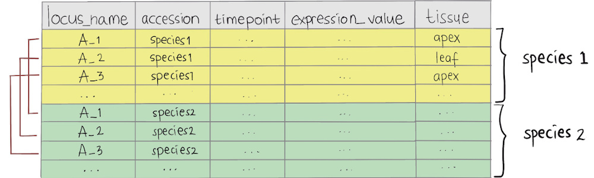

```{r, include = FALSE}
knitr::opts_chunk$set(
  collapse = TRUE,
  comment = "#>"
)
```


```{r example, message=FALSE}
# Load the package
library(GREAT)
library(dplyr)
```

## Input data requirements

There are two different input data frame required for `GREAT` to register your gene expression profiles, which are (a) `all_data_df`: a data frame contains gene expression time-course data with all replicates, and (b) `mean_df`: a data frame contains the average values of each gene's expression profiles. 

### Data of all expression profiles with replicates

Illustrated diagram below shows the required `all_data_df` data frame format of `GREAT`. This data frame must contain:

- two different species which users wish to compare (for each gene, at least two replicates are required in all species), and
- six data columns: 

  - `locus_name`: accession or unique ID of each gene. 
  - `accession`: accession or name of the species to compare.
  - `timepoint`: time point of the gene expression data.
  - `expression_value`: desired RNA-seq expression value or measure of the abundance of gene or transcripts which one wishes to compare. This value can be RPM, RPKM, FPKM, TPM, TMM, DESeq, SCnorm, GeTMM, ComBat-Seq and raw reads counts.
  - `tissue`: tissue from which RNA-seq data were extracted. 
  - `replicate`: replicate ID for each expression value.

```{r all-data-illustration, echo=FALSE, out.width='100%'}
knitr::include_graphics("figures/all_data_illustration.jpg")
```

`GREAT` package provides an example of data frame containing two different species *Arabidopsis* and *B. rapa* with two and three different replicates, respectively. This data frame can be read as follow:

```{r all-data, message=FALSE, warning=FALSE}
# Gene expression data with replicates
all_data_df <- system.file("extdata/brapa_arabidopsis_all_replicates.csv", package = "GREAT") %>%
  utils::read.csv()
```

```{r all-data-kable}
all_data_df %>% 
  dplyr::group_by(accession) %>% 
  dplyr::slice(1:6) %>% 
  knitr::kable()
```

### Data with average values of each genes's expression profiles 

Illustrated diagram below shows the required `mean_df` data frame format of `GREAT`. This data frame must contain:

- two different species which users wish to compare (for each gene, only the average value of a time point is required), and
- five data columns: 

  - `locus_name`: accession or unique ID of each gene. 
  - `accession`: accession or name of the species to compare.
  - `timepoint`: time point of the gene expression data.
  - `expression_value`: desired RNA-seq expression value or measure of the abundance of gene or transcripts which one wishes to compare. This value can be RPM, RPKM, FPKM, TPM, TMM, DESeq, SCnorm, GeTMM, ComBat-Seq and raw reads counts.
  - `tissue`: tissue from which RNA-seq data were extracted. 

`GREAT` package also provides an example of `mean_df` data frame containing two different species *Arabidopsis* and *B. rapa* which obtained from `all_data_df`. This data frame can be read as follow:

```{r mean-data-illustration, echo=FALSE, out.width='100%'}

```

```{r mean-data, message=FALSE, warning=FALSE}
# Mean gene expression 
mean_df <- system.file("extdata/brapa_arabidopsis_mean.csv", package = "GREAT") %>%
  utils::read.csv()
```

```{r mean-data-kable}
mean_df %>% 
  dplyr::group_by(accession) %>% 
  dplyr::slice(1:4) %>% 
  knitr::kable()
```

## Register the data

To align gene expression time-course between *Arabidopsis* Col-0 and *B. rapa* Ro18, we can use the function `scale_and_register_data()` as shown below:

```{r register-data, message=FALSE, warning=FALSE}
# Running the registration
registration_results <- scale_and_register_data(
    mean_df = mean_df,
    all_data_df = all_data_df,
    stretches = c(2, 1.5, 1),
    shift_extreme = 4,
    num_shifts = 27,
    min_num_overlapping_points = 4,
    initial_rescale = FALSE,
    do_rescale = TRUE,
    accession_data_to_transform = "Col0",
    accession_data_ref = "Ro18",
    data_to_transform_time_added = 11,
    data_ref_time_added = 11
  )
```

