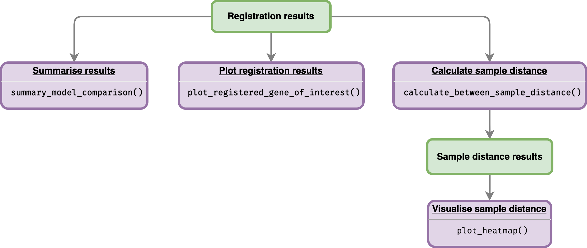

```{r, include = FALSE}
knitr::opts_chunk$set(
  collapse = TRUE,
  comment = "#>"
)
```

After running registration function `scale_and_register_data()` as shown in the [registering data](https://ruthkr.github.io/greatR/articles/register-data.html) article, users can summarise and visualise the results as illustrated in the figure below.

```{r vis-reg-data, echo=FALSE, fig.align='center', out.width='80%'}

```

<br>

## Get summary from registration results

The total number of registered and non-registered genes can be obtained by running function `summary_model_comparison()` with `registration_results$model_comparison_df` as an input. 

```{r example, message=FALSE, include=FALSE}
# Load the package
library(greatR)
library(dplyr)
```

```{r register-data, message=FALSE, warning=FALSE, include=FALSE}
all_data_df <- system.file("extdata/brapa_arabidopsis_all_replicates.csv", package = "greatR") %>%
  utils::read.csv()

# Running the registration
registration_results <- scale_and_register_data(
  input_df = all_data_df,
  stretches = c(3, 2.5, 2, 1.5, 1),
  shifts = seq(-4, 4, length.out = 33),
  min_num_overlapping_points = 4,
  initial_rescale = FALSE,
  do_rescale = TRUE,
  accession_data_to_transform = "Col0",
  accession_data_ref = "Ro18",
  start_timepoint = "reference"
)
```

Function `summary_model_comparison()` returns a list which contains three different objects: 

- `df_summary` contains result summaries of the registration results, 
- `registered_genes` is list of gene accessions which were successfully registered, and 
- `non_registered_genes` is a list of non-registered gene accessions. 

```{r get-summary-results}
# Get all of summary
all_summary <- summary_model_comparison(registration_results$model_comparison_df)

all_summary$df_summary %>%
  knitr::kable()
```

The list of gene accessions which were registered can be viewed by calling:

```{r print-accession-of-registred-genes}
all_summary$registered_genes
```

## Plot registration results

Function `plot_registration_results()` allows users to plot registration results of the genes of interest. 

```{r plot-results, fig.align='center', fig.height=10, fig.width=10, warning=FALSE}
# Plot registration result
plot_registration_results(
  registration_results$imputed_mean_df,
  ncol = 3
)
```
Users also have an option to include information or label on the plot whether particular genes are registered or not, as well as the registration parameters by include model comparison data frame as shown below. 

```{r plot-results-with-label, fig.align='center', fig.height=10, fig.width=10, warning=FALSE}
# Plot registration result
plot_registration_results(
  registration_results$imputed_mean_df,
  registration_results$model_comparison_df,
  ncol = 3,
  sync_timepoints = TRUE
)
```

Notice that to only include same time points between samples, users can set `sync_timepoints = TRUE`.

## Analyse similarity of expression profiles overtime before and after registering

### Calculate sample distance

After registering the sample data, users can compare the overall similarity before and after registering using the function `calculate_between_sample_distance()`. 

```{r get-sample-distance}
sample_distance <- calculate_between_sample_distance(
  registration_results,
  accession_data_ref = "Ro18"
)
```

Function `calculate_between_sample_distance()` returns a list of seven data frames: 

- `distance_mean_df` is distance of mean expression values.
- `distance_scaled_mean_df` is distance of scaled mean expression (all genes).
- `distance_scaled_mean_df_only_nonreg` is distance of scaled mean expression (only not-registered genes).
- `distance_scaled_mean_df_only_reg` is distance of scaled mean expression (only registered genes).
- `distance_registered_df` is distance of registered & scaled mean expression (all genes).
- `distance_registered_df_only_reg` is distance of registered & scaled mean expression (only registered genes).


### Plot heatmap of sample distances

Each of these data frames above can be visualised using function `plot_heatmap()`. 

```{r plot-dist-mean-df, fig.align='center', fig.height=5, fig.width=5, warning=FALSE}
# Plot heatmap of mean expression profiles distance before scaling
plot_heatmap(sample_distance$distance_mean_df)
```

```{r plot-dist-scaled-mean-df, fig.align='center', fig.height=5, fig.width=5, warning=FALSE}
# Plot heatmap of mean expression profiles distance after scaling
plot_heatmap(sample_distance$distance_scaled_mean_df)
```

```{r plot-dist-registered, fig.align='center', fig.height=5, fig.width=5, warning=FALSE}
# Plot heatmap of mean expression profiles distance after registration process
plot_heatmap(
  sample_distance$distance_registered_df_only_reg, 
  same_max_timepoint = TRUE, 
  same_min_timepoint = TRUE
)
```
